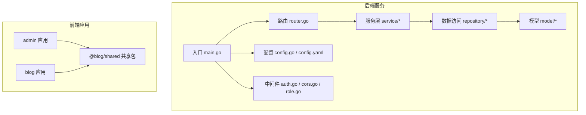
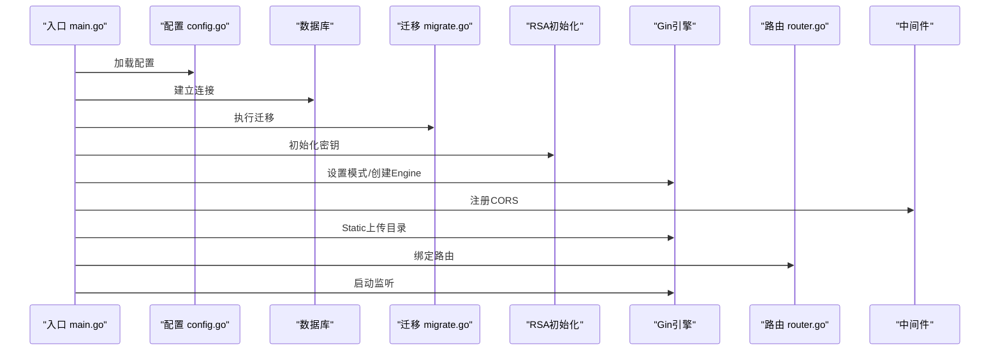
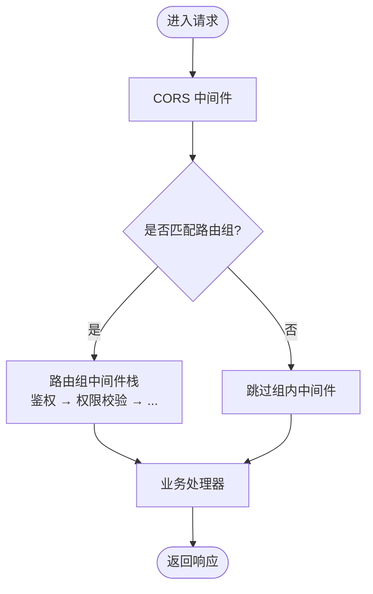
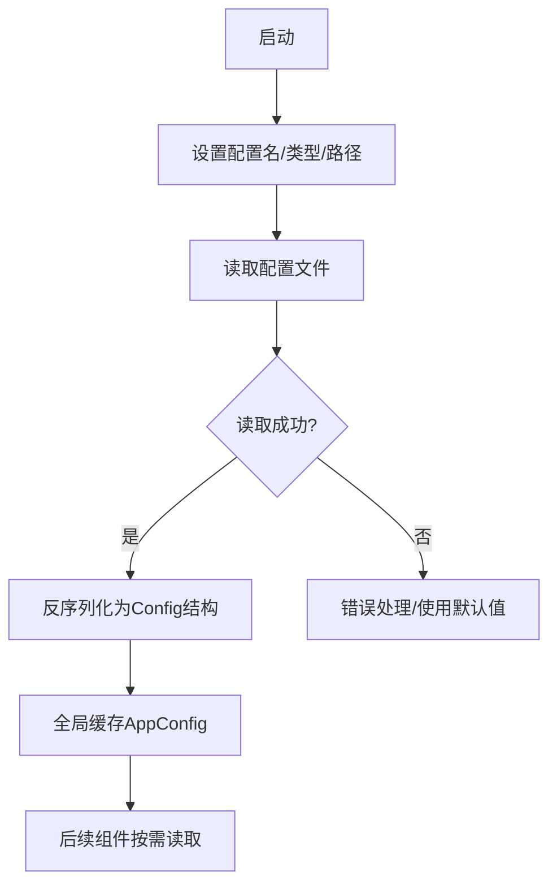
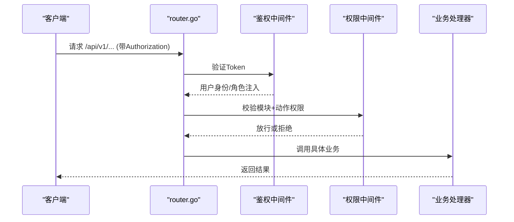
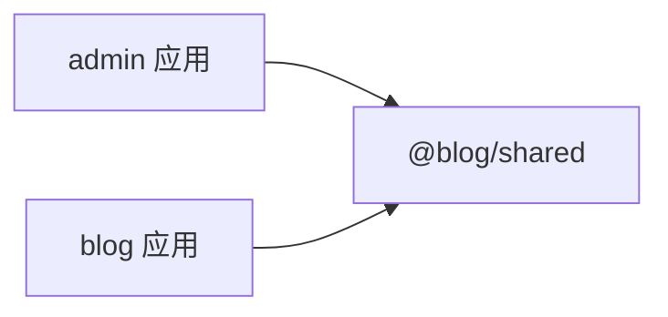
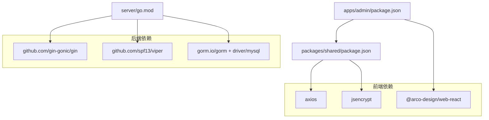

# 扩展性设计

<cite>
**本文引用的文件**
- [server/main.go](file://server/main.go)
- [server/router/router.go](file://server/router/router.go)
- [server/config/config.go](file://server/config/config.go)
- [server/config/config.yaml](file://server/config/config.yaml)
- [server/internal/middleware/auth.go](file://server/internal/middleware/auth.go)
- [server/internal/middleware/cors.go](file://server/internal/middleware/cors.go)
- [server/internal/middleware/role.go](file://server/internal/middleware/role.go)
- [server/go.mod](file://server/go.mod)
- [webSource/package.json](file://webSource/package.json)
- [webSource/apps/admin/src/App.tsx](file://webSource/apps/admin/src/App.tsx)
- [webSource/apps/blog/src/App.tsx](file://webSource/apps/blog/src/App.tsx)
- [webSource/packages/shared/src/index.ts](file://webSource/packages/shared/src/index.ts)
- [webSource/packages/shared/src/utils/request.ts](file://webSource/packages/shared/src/utils/request.ts)
- [webSource/apps/admin/package.json](file://webSource/apps/admin/package.json)
- [webSource/packages/shared/package.json](file://webSource/packages/shared/package.json)
</cite>

## 目录
1. [引言](#引言)
2. [项目结构](#项目结构)
3. [核心组件](#核心组件)
4. [架构总览](#架构总览)
5. [详细组件分析](#详细组件分析)
6. [依赖分析](#依赖分析)
7. [性能考虑](#性能考虑)
8. [故障排查指南](#故障排查指南)
9. [结论](#结论)
10. [附录：扩展开发指南与最佳实践](#附录扩展开发指南与最佳实践)

## 引言
本设计文档面向Xiangmuzs博客平台的扩展性需求，系统性阐述后端服务与前端应用在模块化、插件化、配置驱动方面的架构设计与落地方法；明确中间件系统的扩展点与执行顺序控制；说明配置系统的层次化与动态更新能力；给出API版本控制与向后兼容策略；并提供前端组件共享库、UI可定制性与主题系统的实现建议。目标是帮助开发者以最小成本、最高一致性地进行功能扩展与维护。

## 项目结构
后端采用Go语言与Gin框架，按领域模型分层组织（handler/service/repository/model），路由集中于router模块，配置通过Viper加载，上传资源静态托管。前端采用Vite + React多包工作区，包含admin后台与blog前端，以及一个共享包@blog/shared用于类型、工具与HTTP请求封装。

图表来源
- [server/main.go:19-76](file://server/main.go#L19-L76)
- [server/router/router.go:11-103](file://server/router/router.go#L11-L103)
- [server/config/config.go:47-64](file://server/config/config.go#L47-L64)
- [server/config/config.yaml:1-29](file://server/config/config.yaml#L1-L29)
- [server/internal/middleware/auth.go:10-37](file://server/internal/middleware/auth.go#L10-L37)
- [server/internal/middleware/cors.go:7-21](file://server/internal/middleware/cors.go#L7-L21)
- [server/internal/middleware/role.go:10-42](file://server/internal/middleware/role.go#L10-L42)
- [webSource/apps/admin/src/App.tsx:1-22](file://webSource/apps/admin/src/App.tsx#L1-L22)
- [webSource/apps/blog/src/App.tsx:1-7](file://webSource/apps/blog/src/App.tsx#L1-L7)
- [webSource/packages/shared/src/index.ts:1-6](file://webSource/packages/shared/src/index.ts#L1-L6)
- [webSource/packages/shared/src/utils/request.ts:1-38](file://webSource/packages/shared/src/utils/request.ts#L1-L38)

章节来源
- [server/main.go:19-76](file://server/main.go#L19-L76)
- [server/router/router.go:11-103](file://server/router/router.go#L11-L103)
- [server/config/config.go:47-64](file://server/config/config.go#L47-L64)
- [server/config/config.yaml:1-29](file://server/config/config.yaml#L1-L29)
- [webSource/package.json:4-16](file://webSource/package.json#L4-L16)

## 核心组件
- 配置系统：基于Viper的YAML配置加载，支持多路径查找与反序列化，提供运行时读取与全局缓存。
- 路由与中间件：Gin Engine集中注册路由组与中间件，统一处理跨域、鉴权、权限校验等横切关注点。
- 数据访问与领域模型：Repository层封装数据库操作，Model定义实体，Service层编排业务逻辑。
- 前端共享库：@blog/shared统一导出类型、工具与HTTP请求封装，减少重复代码与提升一致性。
- 构建与打包：根脚本统一管理前后端构建流程，确保产物正确部署。

章节来源
- [server/config/config.go:7-43](file://server/config/config.go#L7-L43)
- [server/config/config.yaml:1-29](file://server/config/config.yaml#L1-L29)
- [server/router/router.go:24-102](file://server/router/router.go#L24-L102)
- [server/internal/middleware/auth.go:10-37](file://server/internal/middleware/auth.go#L10-L37)
- [server/internal/middleware/role.go:10-42](file://server/internal/middleware/role.go#L10-L42)
- [webSource/packages/shared/src/index.ts:1-6](file://webSource/packages/shared/src/index.ts#L1-L6)
- [webSource/packages/shared/src/utils/request.ts:1-38](file://webSource/packages/shared/src/utils/request.ts#L1-L38)
- [webSource/package.json:4-16](file://webSource/package.json#L4-L16)

## 架构总览
后端启动流程：加载配置 → 连接数据库 → 执行迁移 → 初始化RSA密钥 → 设置Gin模式 → 注册CORS中间件 → 暴露上传目录 → 绑定路由 → 启动服务。路由按API版本分组，公开与受保护接口分离，权限通过中间件动态判定。

图表来源
- [server/main.go:21-76](file://server/main.go#L21-L76)
- [server/router/router.go:11-103](file://server/router/router.go#L11-L103)
- [server/config/config.go:47-64](file://server/config/config.go#L47-L64)

章节来源
- [server/main.go:19-76](file://server/main.go#L19-L76)
- [server/router/router.go:11-103](file://server/router/router.go#L11-L103)

## 详细组件分析

### 中间件系统扩展性设计
- 扩展点：所有中间件均以gin.HandlerFunc形式实现，可在路由组或全局注册，支持链式调用与顺序控制。
- 执行顺序：全局CORS在Engine层面注册；路由组内可叠加鉴权与权限校验中间件，形成“外层通用 → 内层业务”的执行栈。
- 自定义中间件开发步骤：
  1) 在middleware目录新增文件，实现gin.HandlerFunc。
  2) 在main.go中注册到Gin引擎或在router.go中挂载到特定路由组。
  3) 如需参数化配置，通过配置系统注入（见“配置系统扩展”）。
- 优先级与顺序控制：
  - 全局中间件先于路由组中间件执行。
  - 路由组内部按Use调用顺序依次执行，先声明者先执行。
  - 权限中间件应置于鉴权之后，确保用户身份已解析。

图表来源
- [server/internal/middleware/cors.go:7-21](file://server/internal/middleware/cors.go#L7-L21)
- [server/internal/middleware/auth.go:10-37](file://server/internal/middleware/auth.go#L10-L37)
- [server/internal/middleware/role.go:10-42](file://server/internal/middleware/role.go#L10-L42)
- [server/router/router.go:44-102](file://server/router/router.go#L44-L102)

章节来源
- [server/internal/middleware/cors.go:7-21](file://server/internal/middleware/cors.go#L7-L21)
- [server/internal/middleware/auth.go:10-37](file://server/internal/middleware/auth.go#L10-L37)
- [server/internal/middleware/role.go:10-42](file://server/internal/middleware/role.go#L10-L42)
- [server/router/router.go:44-102](file://server/router/router.go#L44-L102)

### 配置系统扩展能力
- 层次化管理：支持多配置路径（./config与项目根目录），便于本地与生产差异化放置。
- 环境变量覆盖：可通过Viper绑定环境变量，实现敏感配置与运行时参数的注入。
- 动态更新：当前实现为启动时一次性加载；如需热更新，可在现有Load基础上增加watcher与重载回调。
- 结构化扩展：新增配置项只需在Config结构体中添加字段，并在YAML中提供默认值，保持向后兼容。

图表来源
- [server/config/config.go:47-64](file://server/config/config.go#L47-L64)
- [server/config/config.yaml:1-29](file://server/config/config.yaml#L1-L29)

章节来源
- [server/config/config.go:7-43](file://server/config/config.go#L7-L43)
- [server/config/config.go:47-64](file://server/config/config.go#L47-L64)
- [server/config/config.yaml:1-29](file://server/config/config.yaml#L1-L29)

### API接口扩展策略
- 版本控制：当前路由以/api/v1命名空间隔离，未来新增/api/v2时保持旧版不变，逐步迁移。
- 向后兼容：新增字段采用可选策略，变更字段保留旧字段一段时间并标注废弃。
- 平滑集成：新增功能遵循现有路由分组与中间件挂载模式，复用鉴权与权限中间件，避免重复逻辑。

图表来源
- [server/router/router.go:24-102](file://server/router/router.go#L24-L102)
- [server/internal/middleware/auth.go:10-37](file://server/internal/middleware/auth.go#L10-L37)
- [server/internal/middleware/role.go:10-42](file://server/internal/middleware/role.go#L10-L42)

章节来源
- [server/router/router.go:24-102](file://server/router/router.go#L24-L102)
- [server/internal/middleware/auth.go:10-37](file://server/internal/middleware/auth.go#L10-L37)
- [server/internal/middleware/role.go:10-42](file://server/internal/middleware/role.go#L10-L42)

### 前端组件扩展机制
- 共享库设计：@blog/shared统一导出类型、工具与HTTP请求封装，降低重复代码，提升跨应用一致性。
- UI组件可定制性：Admin与Blog应用分别独立构建，共享库作为依赖，通过组件组合与样式覆盖实现定制。
- 主题系统：Admin应用通过ConfigProvider注入本地化与主题配置，可扩展为主题切换与CSS变量体系。

图表来源
- [webSource/packages/shared/src/index.ts:1-6](file://webSource/packages/shared/src/index.ts#L1-L6)
- [webSource/apps/admin/src/App.tsx:1-22](file://webSource/apps/admin/src/App.tsx#L1-L22)
- [webSource/apps/blog/src/App.tsx:1-7](file://webSource/apps/blog/src/App.tsx#L1-L7)

章节来源
- [webSource/packages/shared/src/index.ts:1-6](file://webSource/packages/shared/src/index.ts#L1-L6)
- [webSource/apps/admin/src/App.tsx:1-22](file://webSource/apps/admin/src/App.tsx#L1-L22)
- [webSource/apps/blog/src/App.tsx:1-7](file://webSource/apps/blog/src/App.tsx#L1-L7)

## 依赖分析
后端依赖Gin、Viper、GORM与MySQL驱动；前端通过PNPM Workspace管理多包依赖，admin依赖shared与Arco Design，shared依赖axios与加密工具。

图表来源
- [server/go.mod:5-13](file://server/go.mod#L5-L13)
- [webSource/apps/admin/package.json:12-27](file://webSource/apps/admin/package.json#L12-L27)
- [webSource/packages/shared/package.json:15-23](file://webSource/packages/shared/package.json#L15-L23)

章节来源
- [server/go.mod:5-13](file://server/go.mod#L5-L13)
- [webSource/apps/admin/package.json:12-27](file://webSource/apps/admin/package.json#L12-L27)
- [webSource/packages/shared/package.json:15-23](file://webSource/packages/shared/package.json#L15-L23)

## 性能考虑
- 中间件链路：尽量将轻量中间件前置，避免阻塞后续处理器；对鉴权与权限检查使用缓存与索引优化。
- 数据库访问：Repository层统一事务与查询，避免N+1问题；合理使用预加载与分页。
- 静态资源：上传目录静态托管，结合CDN与缓存头优化。
- 前端请求：共享HTTP客户端统一拦截器，减少重复逻辑；超时与重试策略在共享库中集中管理。

## 故障排查指南
- 配置加载失败：确认配置文件路径与YAML格式；检查必要字段是否存在；验证环境变量覆盖是否生效。
- 鉴权失败：核对Authorization头格式与Token有效性；检查JWT密钥与过期时间；确认用户角色与权限映射。
- 权限不足：检查角色-权限关联表与模块+动作映射；确认中间件RequirePermission是否正确挂载。
- 前端请求异常：查看拦截器错误分支；确认API_BASE_URL与路由前缀；检查401后的登录跳转逻辑。

章节来源
- [server/config/config.go:47-64](file://server/config/config.go#L47-L64)
- [server/internal/middleware/auth.go:10-37](file://server/internal/middleware/auth.go#L10-L37)
- [server/internal/middleware/role.go:10-42](file://server/internal/middleware/role.go#L10-L42)
- [webSource/packages/shared/src/utils/request.ts:18-35](file://webSource/packages/shared/src/utils/request.ts#L18-L35)

## 结论
该平台通过清晰的分层与模块化设计，提供了良好的扩展基础：配置驱动、中间件链式扩展、API版本化与前端共享库，均具备可演进的架构特性。建议在保持现有模式的前提下，逐步引入配置热更新、更细粒度的中间件优先级控制与主题系统，以支撑更大规模的功能迭代。

## 附录：扩展开发指南与最佳实践
- 新增后端中间件
  - 在middleware目录新增文件，实现gin.HandlerFunc。
  - 在main.go注册全局中间件，或在router.go按需挂载到路由组。
  - 若涉及配置，通过config.Load读取并注入。
- 新增API接口
  - 在router.go中新增路由，按模块分组并挂载鉴权与权限中间件。
  - 处理器中复用现有DTO与响应封装，保持一致的错误码与消息格式。
- 配置扩展
  - 在Config结构体中新增字段，提供默认值；在config.yaml中补充示例。
  - 对敏感配置使用环境变量覆盖，避免硬编码。
- 前端扩展
  - 在@blog/shared中新增类型或工具函数，保持导出一致性。
  - 在admin或blog应用中按需引入，避免重复造轮子。
- 版本化与兼容
  - 新功能优先在新版本API中实现，旧版本保持稳定。
  - 字段变更遵循可选策略，提供迁移指引与过渡期提示。

章节来源
- [server/router/router.go:24-102](file://server/router/router.go#L24-L102)
- [server/config/config.go:7-43](file://server/config/config.go#L7-L43)
- [server/config/config.yaml:1-29](file://server/config/config.yaml#L1-L29)
- [webSource/packages/shared/src/index.ts:1-6](file://webSource/packages/shared/src/index.ts#L1-L6)
- [webSource/apps/admin/src/App.tsx:1-22](file://webSource/apps/admin/src/App.tsx#L1-L22)
- [webSource/apps/blog/src/App.tsx:1-7](file://webSource/apps/blog/src/App.tsx#L1-L7)