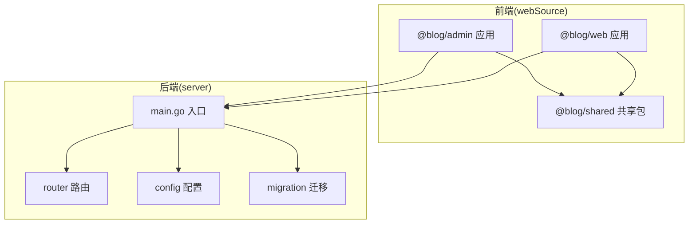
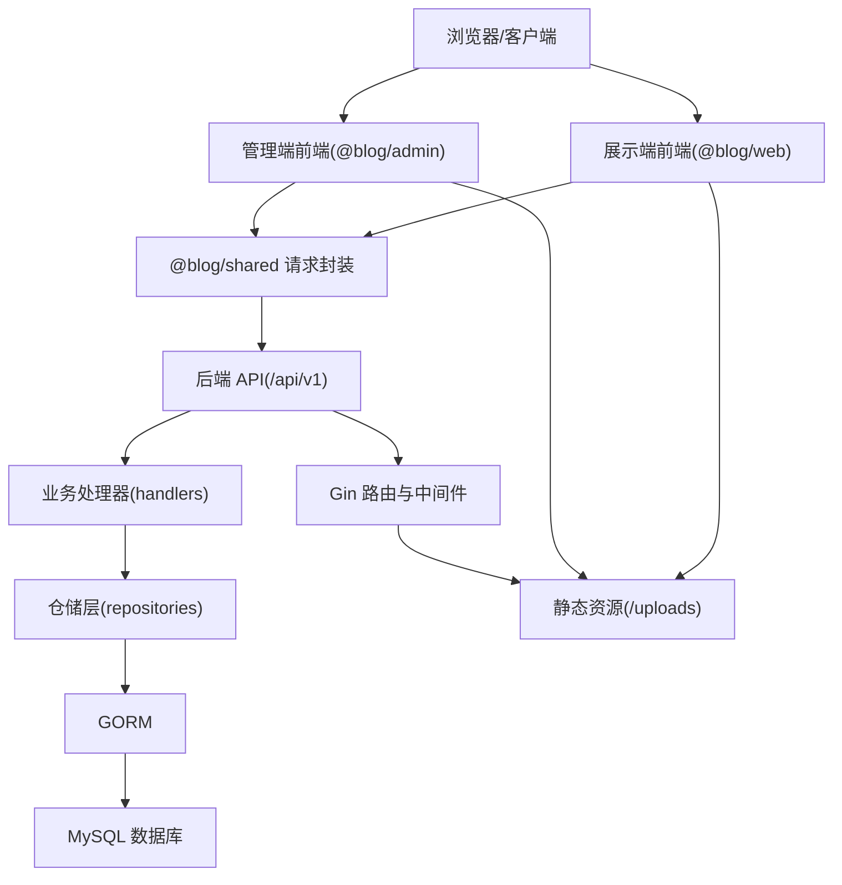
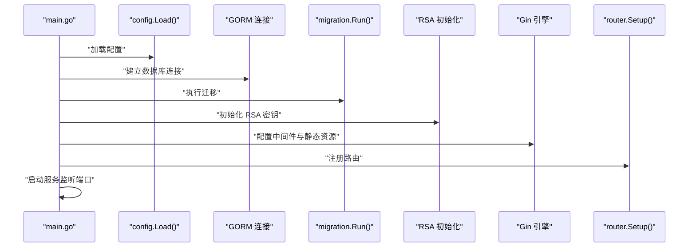
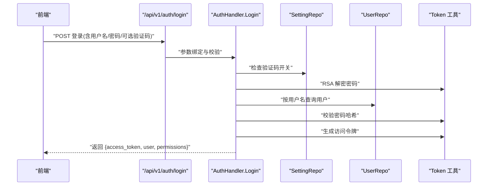
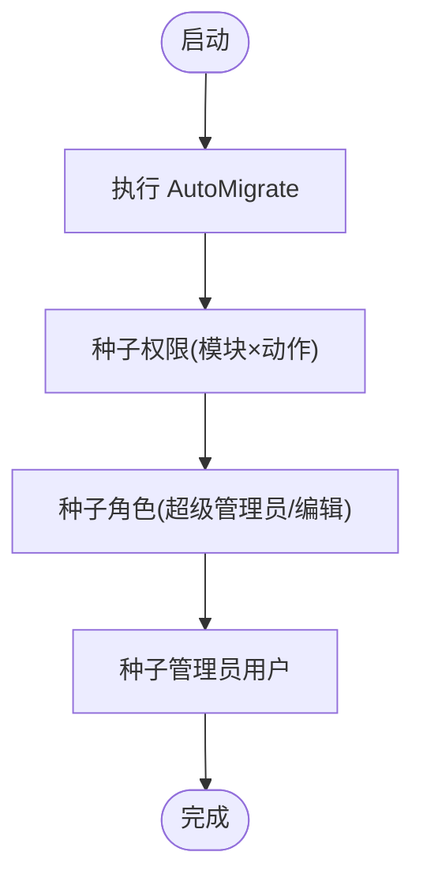
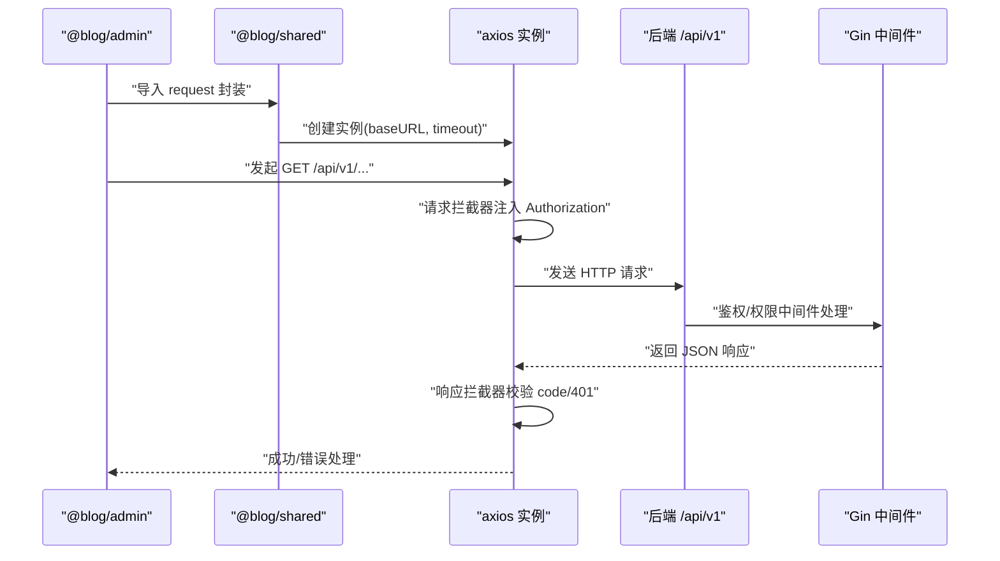
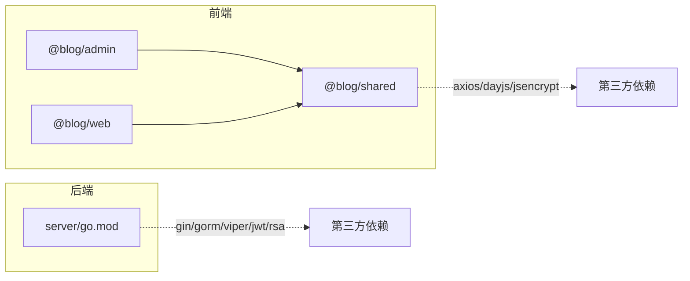

# 整体架构概览

<cite>
**本文档引用的文件**
- [server/main.go](file://server/main.go)
- [server/go.mod](file://server/go.mod)
- [server/config/config.go](file://server/config/config.go)
- [server/config/config.yaml](file://server/config/config.yaml)
- [server/router/router.go](file://server/router/router.go)
- [server/migration/migrate.go](file://server/migration/migrate.go)
- [server/internal/middleware/auth.go](file://server/internal/middleware/auth.go)
- [server/internal/handler/auth.go](file://server/internal/handler/auth.go)
- [webSource/package.json](file://webSource/package.json)
- [webSource/apps/admin/package.json](file://webSource/apps/admin/package.json)
- [webSource/apps/blog/package.json](file://webSource/apps/blog/package.json)
- [webSource/packages/shared/package.json](file://webSource/packages/shared/package.json)
- [webSource/apps/admin/src/App.tsx](file://webSource/apps/admin/src/App.tsx)
- [webSource/apps/blog/src/App.tsx](file://webSource/apps/blog/src/App.tsx)
- [webSource/packages/shared/src/utils/request.ts](file://webSource/packages/shared/src/utils/request.ts)
</cite>

## 目录
1. [引言](#引言)
2. [项目结构](#项目结构)
3. [核心组件](#核心组件)
4. [架构总览](#架构总览)
5. [详细组件分析](#详细组件分析)
6. [依赖分析](#依赖分析)
7. [性能考虑](#性能考虑)
8. [故障排除指南](#故障排除指南)
9. [结论](#结论)
10. [附录](#附录)

## 引言
本文件为 Xiangmuzs 博客平台的整体架构概览文档，面向开发者与技术负责人，帮助快速理解系统的宏观设计、分层职责、前后端交互方式与数据流路径。该系统采用“前后端分离的单体应用”架构：前端使用 React + Vite 的多包工作区（admin 管理端与 blog 展示端），后端基于 Go 语言的 Gin 框架，统一通过 RESTful 接口进行通信；数据层采用 MySQL，ORM 使用 GORM，配合自动迁移与初始化脚本完成数据库结构与默认数据准备。

## 项目结构
项目采用“根目录 monorepo + 子目录模块化”的组织方式：
- 后端服务位于 server/，包含配置、路由、中间件、处理器、仓储、服务、模型、迁移等层次化结构。
- 前端位于 webSource/，采用 pnpm workspace 多包模式，包含 admin 管理端、blog 展示端与 shared 共享包。
- 构建脚本通过根目录的 package.json 统一编排，先构建共享包与两个前端应用，再构建 Go 后端二进制，并复制配置文件到输出目录。

图表来源
- [webSource/package.json:1-22](file://webSource/package.json#L1-L22)
- [server/main.go:19-76](file://server/main.go#L19-L76)
- [server/router/router.go:11-103](file://server/router/router.go#L11-L103)
- [server/config/config.go:47-64](file://server/config/config.go#L47-L64)
- [server/migration/migrate.go:13-38](file://server/migration/migrate.go#L13-L38)

章节来源
- [webSource/package.json:1-22](file://webSource/package.json#L1-L22)
- [server/main.go:19-76](file://server/main.go#L19-L76)

## 核心组件
- 后端入口与启动流程
  - 加载配置、连接数据库、执行迁移、初始化 RSA 密钥、设置 Gin 模式与中间件、挂载静态资源、注册路由并启动服务。
- 路由与权限控制
  - 分组路由 /api/v1，公开接口无需认证，受保护接口通过鉴权中间件校验 Bearer Token，并结合细粒度权限中间件进行操作级授权。
- 数据访问与安全
  - GORM 自动迁移模型并填充默认权限、角色与管理员账户；登录时使用 RSA 解密、密码哈希校验、JWT 令牌签发；上传文件通过静态目录暴露。
- 前端应用与共享逻辑
  - admin 与 blog 两个独立应用，共享 @blog/shared 包，内部通过 axios 封装请求拦截器统一注入 Authorization 头、处理响应码与 401 重定向。

章节来源
- [server/main.go:19-76](file://server/main.go#L19-L76)
- [server/router/router.go:11-103](file://server/router/router.go#L11-L103)
- [server/migration/migrate.go:13-126](file://server/migration/migrate.go#L13-L126)
- [server/internal/middleware/auth.go:10-37](file://server/internal/middleware/auth.go#L10-L37)
- [server/internal/handler/auth.go:31-93](file://server/internal/handler/auth.go#L31-L93)
- [webSource/packages/shared/src/utils/request.ts:10-35](file://webSource/packages/shared/src/utils/request.ts#L10-L35)

## 架构总览
系统采用三层架构：
- 表现层（前端应用）：React/Vite 管理端与展示端，负责用户界面与交互。
- 业务层（Go 后端服务）：Gin 提供 HTTP 接口，GORM 管理数据库，中间件与处理器实现鉴权、权限、业务逻辑。
- 数据层（MySQL）：持久化用户、文章、分类、标签、媒体、设置、二维码等实体。

系统边界与数据流向如下：

图表来源
- [server/router/router.go:24-102](file://server/router/router.go#L24-L102)
- [server/main.go:64-68](file://server/main.go#L64-L68)
- [webSource/packages/shared/src/utils/request.ts:5-8](file://webSource/packages/shared/src/utils/request.ts#L5-L8)

## 详细组件分析

### 后端启动与配置加载
- 启动流程
  - 读取 YAML 配置文件，按环境变量覆盖；根据运行模式设置 Gin 日志级别；连接 MySQL 并执行自动迁移；初始化 RSA 密钥；注册 CORS 中间件；挂载 /uploads 静态目录；注册路由；启动 HTTP 服务。
- 配置项
  - server.port、server.mode、database.*、jwt.secret/expire、upload.*、blog.base_url 等。

图表来源
- [server/main.go:21-76](file://server/main.go#L21-L76)
- [server/config/config.go:47-64](file://server/config/config.go#L47-L64)
- [server/migration/migrate.go:13-38](file://server/migration/migrate.go#L13-L38)

章节来源
- [server/main.go:19-76](file://server/main.go#L19-L76)
- [server/config/config.yaml:1-29](file://server/config/config.yaml#L1-L29)

### 路由与权限控制
- 路由分组
  - /api/v1 下设公开接口（如登录、验证码、公开文章列表等）与受保护接口（需 Bearer Token）。
- 权限控制
  - 鉴权中间件解析 Token 并注入用户与角色信息；细粒度权限中间件按模块与动作（create/read/update/delete）校验用户角色是否具备相应权限。
- 典型接口
  - 登录：获取公钥 → RSA 解密密码 → 校验用户状态 → 生成 JWT → 返回权限列表。
  - 文章管理：支持 CRUD 与状态变更，均需对应权限。
  - 媒体上传：支持上传、列表与删除，需媒体创建/删除权限。

图表来源
- [server/router/router.go:27-30](file://server/router/router.go#L27-L30)
- [server/internal/handler/auth.go:31-93](file://server/internal/handler/auth.go#L31-L93)
- [server/internal/middleware/auth.go:10-37](file://server/internal/middleware/auth.go#L10-L37)

章节来源
- [server/router/router.go:11-103](file://server/router/router.go#L11-L103)
- [server/internal/handler/auth.go:31-93](file://server/internal/handler/auth.go#L31-L93)
- [server/internal/middleware/auth.go:10-37](file://server/internal/middleware/auth.go#L10-L37)

### 数据模型与初始化
- 模型迁移
  - 自动迁移用户、角色、权限、文章、分类、标签、媒体、二维码、设置等模型。
- 种子数据
  - 初始化所有模块的动作级权限；
  - 创建“超级管理员”与“编辑”角色并赋予相应权限；
  - 创建默认管理员用户并设置密码哈希。

图表来源
- [server/migration/migrate.go:13-126](file://server/migration/migrate.go#L13-L126)

章节来源
- [server/migration/migrate.go:13-126](file://server/migration/migrate.go#L13-L126)

### 前端应用与共享请求封装
- 应用结构
  - admin 与 blog 均以 React + Vite 构建，使用 react-router-dom 管理路由；admin 使用 Arco Design 组件库提升管理端体验。
- 共享包
  - @blog/shared 封装 axios 实例，统一设置 baseURL、超时时间与拦截器；请求拦截器自动注入 Bearer Token；响应拦截器校验业务 code，401 时清理本地 token 并跳转登录页。
- 构建与部署
  - 根目录脚本统一构建 shared、admin、blog 与 server，拷贝配置文件至输出目录，便于打包发布。

图表来源
- [webSource/apps/admin/src/App.tsx:1-22](file://webSource/apps/admin/src/App.tsx#L1-L22)
- [webSource/apps/blog/src/App.tsx:1-7](file://webSource/apps/blog/src/App.tsx#L1-L7)
- [webSource/packages/shared/src/utils/request.ts:5-35](file://webSource/packages/shared/src/utils/request.ts#L5-L35)
- [server/router/router.go:24-102](file://server/router/router.go#L24-L102)

章节来源
- [webSource/apps/admin/package.json:1-28](file://webSource/apps/admin/package.json#L1-L28)
- [webSource/apps/blog/package.json:1-30](file://webSource/apps/blog/package.json#L1-L30)
- [webSource/packages/shared/package.json:1-23](file://webSource/packages/shared/package.json#L1-L23)
- [webSource/packages/shared/src/utils/request.ts:10-35](file://webSource/packages/shared/src/utils/request.ts#L10-L35)
- [webSource/package.json:1-22](file://webSource/package.json#L1-L22)

## 依赖分析
- 技术栈与版本
  - 后端：Go 1.22、Gin、GORM、Viper、JWT、RSA、UUID 等。
  - 前端：React 18、Vite、TypeScript、Axios、Arco Design、Zustand 等。
- 依赖关系
  - 前端 admin 与 blog 均依赖 @blog/shared；@blog/shared 依赖 axios、dayjs、jsencrypt。
  - 后端依赖 Gin、GORM、Viper、JWT、RSA 等库。
- 工作区与构建
  - pnpm workspace 管理多包；根脚本统一构建与打包，确保前后端与后端二进制的一致性。

图表来源
- [webSource/apps/admin/package.json:12-27](file://webSource/apps/admin/package.json#L12-L27)
- [webSource/apps/blog/package.json:12-29](file://webSource/apps/blog/package.json#L12-L29)
- [webSource/packages/shared/package.json:15-22](file://webSource/packages/shared/package.json#L15-L22)
- [server/go.mod:5-12](file://server/go.mod#L5-L12)

章节来源
- [server/go.mod:1-60](file://server/go.mod#L1-L60)
- [webSource/package.json:1-22](file://webSource/package.json#L1-L22)

## 性能考虑
- 后端
  - Gin 在 Release 模式下运行，减少日志开销；GORM 在调试模式下开启详细日志，便于开发定位问题。
  - 静态资源通过 /uploads 直接暴露，避免额外代理层，降低延迟。
- 前端
  - Vite 开发模式热更新，生产构建启用压缩与 Tree-shaking；共享包拆分复用，减少重复打包体积。
- 数据库
  - GORM 自动迁移与索引策略需结合实际查询场景优化；建议对高频查询字段建立索引并定期分析慢查询。

## 故障排除指南
- 启动失败
  - 检查数据库连接参数与可达性；确认 config.yaml 配置正确；查看迁移日志是否报错。
- 认证失败
  - 确认前端已正确存储 access_token；检查后端 JWT 密钥与过期时间；验证 Bearer Token 格式与签名有效性。
- 权限不足
  - 确认用户角色是否具备所需模块与动作权限；检查中间件 RequirePermission 是否正确注入。
- 上传失败
  - 检查 /uploads 目录权限与磁盘配额；确认上传类型与大小限制；查看后端日志中文件写入错误。

章节来源
- [server/main.go:21-44](file://server/main.go#L21-L44)
- [server/internal/middleware/auth.go:10-37](file://server/internal/middleware/auth.go#L10-L37)
- [webSource/packages/shared/src/utils/request.ts:18-35](file://webSource/packages/shared/src/utils/request.ts#L18-L35)

## 结论
Xiangmuzs 博客平台采用“前后端分离的单体应用”架构，在中小型项目中兼顾了开发效率与运维简化。后端以 Gin + GORM 快速搭建 RESTful 服务，结合细粒度权限体系与 RSA+JWT 安全机制；前端通过 React/Vite 与共享包实现高复用与一致体验。该架构适合需求变化快、团队规模适中的产品迭代，若未来业务复杂度上升，可逐步引入微服务拆分与 API 网关治理。

## 附录
- 关键配置项说明
  - server.port：HTTP 服务监听端口
  - server.mode：debug 或 release
  - database.host/port/user/password/name/charset：MySQL 连接参数
  - jwt.secret/expire/refresh_expire：JWT 密钥与过期时间
  - upload.path/max_size/allowed_types：上传目录与限制
  - blog.base_url：前端基础 URL，用于资源拼接与分享链接
- 默认种子数据
  - 权限：模块 × 动作（create/read/update/delete）
  - 角色：超级管理员（全权限）、编辑（部分内容管理权限）
  - 管理员：用户名 admin，初始密码 admin123（上线前务必修改）

章节来源
- [server/config/config.yaml:1-29](file://server/config/config.yaml#L1-L29)
- [server/migration/migrate.go:40-126](file://server/migration/migrate.go#L40-L126)