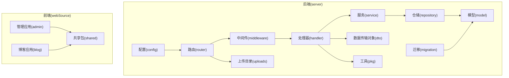
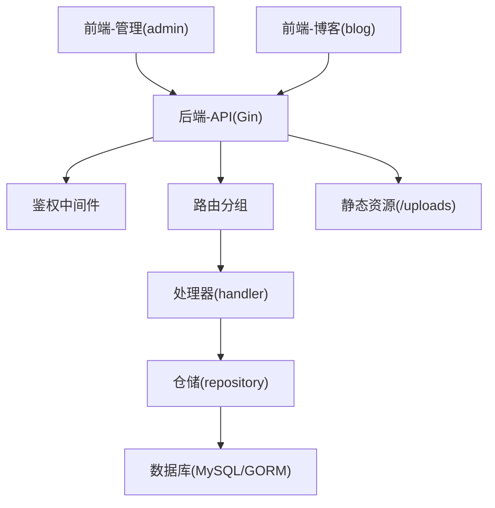
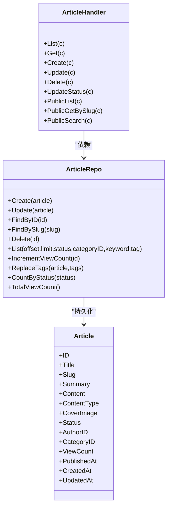
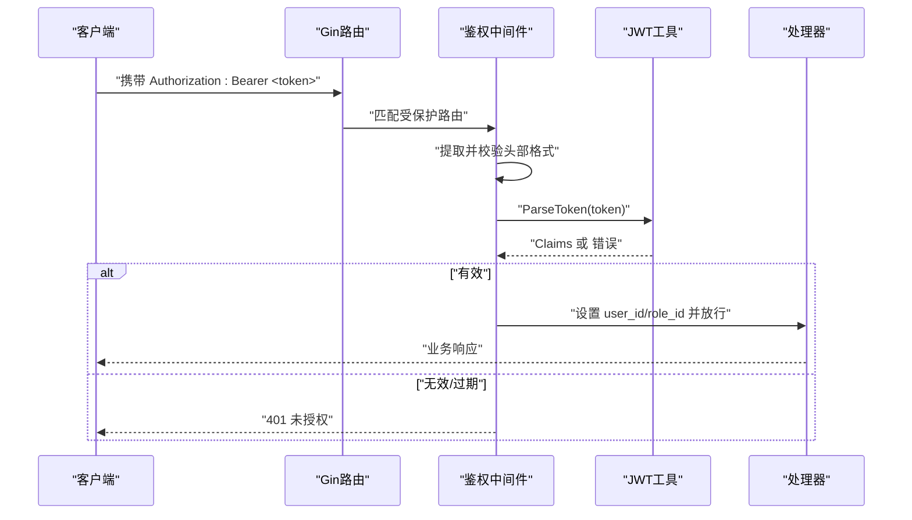
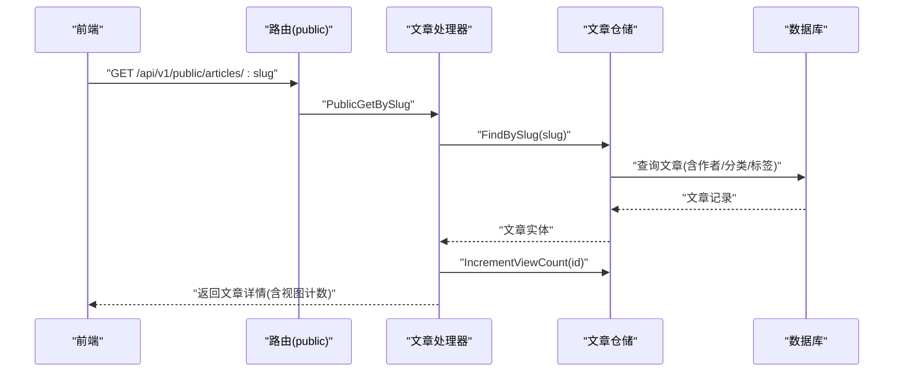
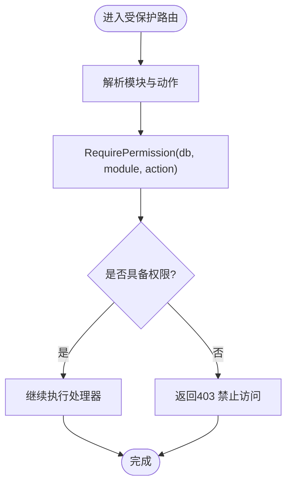
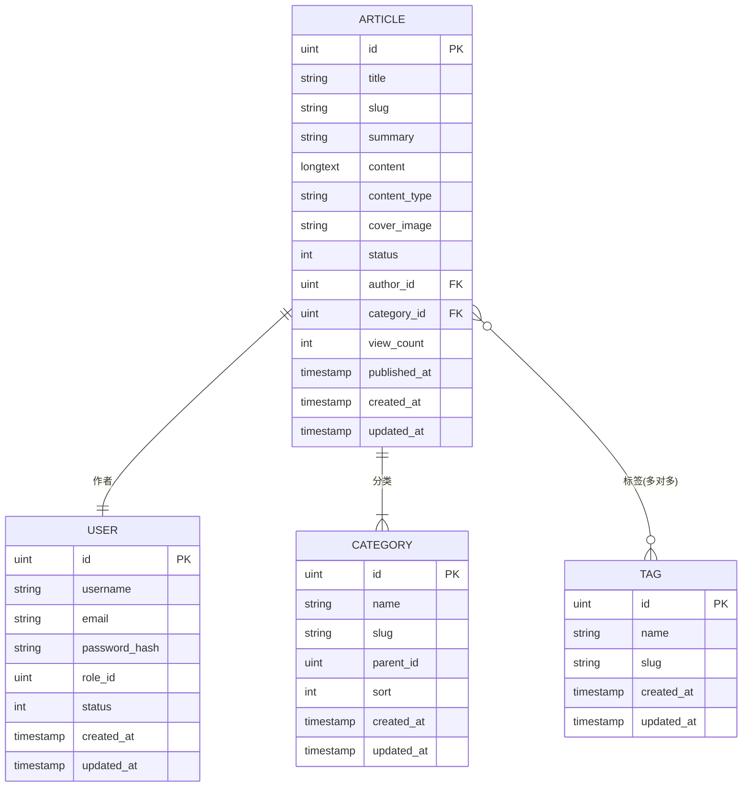
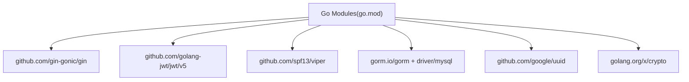

# 架构设计

<cite>
**本文引用的文件**
- [server/main.go](file://server/main.go)
- [server/go.mod](file://server/go.mod)
- [server/config/config.go](file://server/config/config.go)
- [server/router/router.go](file://server/router/router.go)
- [server/internal/middleware/auth.go](file://server/internal/middleware/auth.go)
- [server/internal/pkg/jwt.go](file://server/internal/pkg/jwt.go)
- [server/internal/model/article.go](file://server/internal/model/article.go)
- [server/internal/repository/article_repo.go](file://server/internal/repository/article_repo.go)
- [server/internal/dto/article_dto.go](file://server/internal/dto/article_dto.go)
- [server/internal/handler/article.go](file://server/internal/handler/article.go)
- [server/migration/migrate.go](file://server/migration/migrate.go)
- [webSource/packages/shared/src/utils/request.ts](file://webSource/packages/shared/src/utils/request.ts)
- [webSource/apps/admin/package.json](file://webSource/apps/admin/package.json)
- [webSource/apps/blog/src/App.tsx](file://webSource/apps/blog/src/App.tsx)
</cite>

## 目录
1. [引言](#引言)
2. [项目结构](#项目结构)
3. [核心组件](#核心组件)
4. [架构总览](#架构总览)
5. [详细组件分析](#详细组件分析)
6. [依赖分析](#依赖分析)
7. [性能考虑](#性能考虑)
8. [故障排查指南](#故障排查指南)
9. [结论](#结论)
10. [附录](#附录)

## 引言
本架构设计文档面向 Xiangmuzs 博客平台，系统采用前后端分离与单体应用相结合的架构：后端以 Go 语言构建的 Web 服务（Gin + GORM），提供统一 API；前端分为两个应用：后台管理系统（admin）与博客展示站（blog），通过共享包（packages/shared）进行通用能力复用。系统遵循分层架构与职责分离原则，结合 MVC 模式在 Go 中的落地实践、Repository 模式与 DTO 模式的使用场景，形成清晰的数据流与控制流。

## 项目结构
后端采用按“关注点”分层的目录组织方式：
- config：配置加载与结构定义
- router：路由注册与分组
- internal：核心业务层
  - handler：HTTP 请求入口，编排业务逻辑
  - service：业务服务（当前代码中未显式实现，但已预留接口）
  - repository：数据访问层，封装 GORM 操作
  - model：数据模型与表结构映射
  - dto：请求/响应数据传输对象
  - middleware：中间件（鉴权、跨域、权限）
  - pkg：工具模块（JWT、加密、响应封装、上传等）
- migration：数据库迁移与初始化数据
- uploads：静态资源目录（用于存放上传文件）

前端采用多包工作区（pnpm workspace）组织：
- apps/admin：后台管理应用
- apps/blog：博客前台应用
- packages/shared：共享工具与类型定义

**图表来源**
- [server/main.go:19-76](file://server/main.go#L19-L76)
- [server/router/router.go:11-103](file://server/router/router.go#L11-L103)
- [server/config/config.go:47-64](file://server/config/config.go#L47-L64)
- [server/migration/migrate.go:13-38](file://server/migration/migrate.go#L13-L38)

**章节来源**
- [server/main.go:19-76](file://server/main.go#L19-L76)
- [server/router/router.go:11-103](file://server/router/router.go#L11-L103)
- [server/config/config.go:47-64](file://server/config/config.go#L47-L64)
- [server/migration/migrate.go:13-38](file://server/migration/migrate.go#L13-L38)
- [webSource/apps/admin/package.json:1-28](file://webSource/apps/admin/package.json#L1-L28)

## 核心组件
- 配置中心：集中加载 YAML 配置，支持服务器端口/模式、数据库连接、JWT 密钥与过期时间、上传路径与限制、博客基础 URL 等。
- 路由系统：基于 Gin 的路由分组，区分公开接口与受保护接口，并在受保护接口上挂载鉴权中间件。
- 中间件体系：CORS、鉴权（Bearer Token）、权限校验（基于模块+动作的细粒度权限）。
- 处理器层：承载业务入口，负责参数绑定、调用仓储、组装响应。
- 仓储层：封装 GORM 查询与写入，提供领域内常用操作（分页、过滤、预加载、统计等）。
- 模型层：基于 GORM 的结构体映射，定义字段约束、索引与关联关系。
- DTO 层：定义请求/响应结构，配合 Gin 绑定与验证。
- 工具模块：JWT 生成与解析、密码哈希、响应封装、RSA 初始化、文件上传与验证码等。
- 迁移与种子：自动迁移与默认权限、角色、管理员用户的初始化。

**章节来源**
- [server/config/config.go:7-43](file://server/config/config.go#L7-L43)
- [server/router/router.go:11-103](file://server/router/router.go#L11-L103)
- [server/internal/middleware/auth.go:10-37](file://server/internal/middleware/auth.go#L10-L37)
- [server/internal/pkg/jwt.go:10-42](file://server/internal/pkg/jwt.go#L10-L42)
- [server/internal/repository/article_repo.go:8-91](file://server/internal/repository/article_repo.go#L8-L91)
- [server/internal/model/article.go:5-23](file://server/internal/model/article.go#L5-L23)
- [server/internal/dto/article_dto.go:3-43](file://server/internal/dto/article_dto.go#L3-L43)
- [server/migration/migrate.go:13-125](file://server/migration/migrate.go#L13-L125)

## 架构总览
系统采用“单体后端 + 前后端分离”的混合架构：
- 后端：单体应用，内部按层解耦，便于开发与测试；未来可平滑拆分为微服务（通过独立模块与接口契约）。
- 前端：两个 SPA 应用，共享公共包，分别服务于管理后台与博客前台。
- 数据流：前端通过 Axios 发起请求，携带 Bearer Token；后端经中间件鉴权与权限校验，进入处理器，调用仓储访问数据库，返回统一结构。

**图表来源**
- [server/main.go:54-69](file://server/main.go#L54-L69)
- [server/router/router.go:24-102](file://server/router/router.go#L24-L102)
- [server/internal/middleware/auth.go:10-37](file://server/internal/middleware/auth.go#L10-L37)
- [server/internal/handler/article.go:31-75](file://server/internal/handler/article.go#L31-L75)
- [server/internal/repository/article_repo.go:41-70](file://server/internal/repository/article_repo.go#L41-L70)

## 详细组件分析

### 处理器-仓储-模型类图（以文章为例）
该类图展示了文章相关处理链路中各组件的关系与职责边界。

**图表来源**
- [server/internal/handler/article.go:19-325](file://server/internal/handler/article.go#L19-L325)
- [server/internal/repository/article_repo.go:8-91](file://server/internal/repository/article_repo.go#L8-L91)
- [server/internal/model/article.go:5-23](file://server/internal/model/article.go#L5-L23)

**章节来源**
- [server/internal/handler/article.go:19-325](file://server/internal/handler/article.go#L19-L325)
- [server/internal/repository/article_repo.go:8-91](file://server/internal/repository/article_repo.go#L8-L91)
- [server/internal/model/article.go:5-23](file://server/internal/model/article.go#L5-L23)

### 鉴权流程（JWT）
从请求到达至鉴权放行的关键步骤如下：

**图表来源**
- [server/internal/middleware/auth.go:10-37](file://server/internal/middleware/auth.go#L10-L37)
- [server/internal/pkg/jwt.go:30-42](file://server/internal/pkg/jwt.go#L30-L42)

**章节来源**
- [server/internal/middleware/auth.go:10-37](file://server/internal/middleware/auth.go#L10-L37)
- [server/internal/pkg/jwt.go:10-42](file://server/internal/pkg/jwt.go#L10-L42)

### 文章公开详情浏览流程
该流程体现了“公开接口 + 视图计数 + 关联预加载”的典型链路。

**图表来源**
- [server/router/router.go:32-38](file://server/router/router.go#L32-L38)
- [server/internal/handler/article.go:259-291](file://server/internal/handler/article.go#L259-L291)
- [server/internal/repository/article_repo.go:30-38](file://server/internal/repository/article_repo.go#L30-L38)
- [server/internal/repository/article_repo.go:72-74](file://server/internal/repository/article_repo.go#L72-L74)

**章节来源**
- [server/router/router.go:32-38](file://server/router/router.go#L32-L38)
- [server/internal/handler/article.go:259-291](file://server/internal/handler/article.go#L259-L291)
- [server/internal/repository/article_repo.go:30-38](file://server/internal/repository/article_repo.go#L30-L38)
- [server/internal/repository/article_repo.go:72-74](file://server/internal/repository/article_repo.go#L72-L74)

### 权限控制流程（基于模块+动作）
系统通过中间件对每个路由进行细粒度权限校验，模块与动作组合构成权限项。

**图表来源**
- [server/router/router.go:58-91](file://server/router/router.go#L58-L91)
- [server/internal/middleware/auth.go:10-37](file://server/internal/middleware/auth.go#L10-L37)

**章节来源**
- [server/router/router.go:58-91](file://server/router/router.go#L58-L91)
- [server/internal/middleware/auth.go:10-37](file://server/internal/middleware/auth.go#L10-L37)

### 数据模型与关联（文章）
文章模型体现典型的博客内容结构，包含作者、分类、标签多对一/多对多关系。

**图表来源**
- [server/internal/model/article.go:5-23](file://server/internal/model/article.go#L5-L23)

**章节来源**
- [server/internal/model/article.go:5-23](file://server/internal/model/article.go#L5-L23)

## 依赖分析
后端依赖采用 Go Modules 管理，核心依赖包括：
- Web 框架：Gin（路由与中间件）
- ORM：GORM（MySQL 驱动）
- JWT：golang-jwt（令牌生成与解析）
- 配置：Viper（YAML 配置读取）
- 加密：x/crypto（密码哈希等）
- 其他：UUID、JSON 序列化等

**图表来源**
- [server/go.mod:5-13](file://server/go.mod#L5-L13)

**章节来源**
- [server/go.mod:5-13](file://server/go.mod#L5-L13)

## 性能考虑
- 日志与调试：根据运行模式切换 GORM 日志级别，避免生产环境过度日志开销。
- 预加载与 N+1：仓储层在查询时使用 Preload 预加载关联，减少 N+1 查询风险。
- 分页与过滤：仓储层提供分页与多条件过滤，建议在高频查询上建立合适索引（如状态、发布时间、分类等）。
- 缓存策略：可在处理器层引入缓存（如 Redis）缓存热门文章与分类/标签列表，降低数据库压力。
- 上传与静态资源：静态文件直接由 Web 服务器提供，建议配合 CDN 与压缩策略提升加载速度。
- 并发与超时：前端请求设置合理超时与重试策略，避免长时间阻塞。

**章节来源**
- [server/main.go:36-40](file://server/main.go#L36-L40)
- [server/internal/repository/article_repo.go:24-34](file://server/internal/repository/article_repo.go#L24-L34)
- [webSource/packages/shared/src/utils/request.ts:5-8](file://webSource/packages/shared/src/utils/request.ts#L5-L8)

## 故障排查指南
- 配置加载失败：检查配置文件路径与键名，确认 YAML 语法正确。
- 数据库连接失败：核对主机、端口、用户名、密码、字符集与数据库名。
- JWT 解析失败：确认密钥一致、签名算法匹配、过期时间设置合理。
- 权限不足：确认用户角色是否包含对应模块+动作权限，路由是否正确挂载 RequirePermission 中间件。
- 文件上传异常：检查上传目录权限、大小限制与类型白名单。
- 前端 401 自动跳转：确认本地存储 token 是否存在，拦截器是否正确注入 Authorization 头。

**章节来源**
- [server/config/config.go:47-64](file://server/config/config.go#L47-L64)
- [server/main.go:26-44](file://server/main.go#L26-L44)
- [server/internal/pkg/jwt.go:30-42](file://server/internal/pkg/jwt.go#L30-L42)
- [server/router/router.go:58-91](file://server/router/router.go#L58-L91)
- [webSource/packages/shared/src/utils/request.ts:10-35](file://webSource/packages/shared/src/utils/request.ts#L10-L35)

## 结论
本架构在保持单体应用开发效率的同时，通过清晰的分层与职责划分，实现了良好的可维护性与扩展性。后端采用 Gin + GORM 的成熟组合，前端以 React 生态与共享包实现高复用。JWT 认证与细粒度权限控制保障了安全性；迁移与种子机制降低了部署与初始化成本。未来可基于现有接口契约逐步演进为微服务架构，同时保留单体部署的简单性优势。

## 附录
- 技术选型权衡
  - Gin：生态成熟、性能优异、中间件丰富，适合快速构建 API。
  - GORM：功能完备、学习成本低、社区活跃，满足博客平台的复杂查询需求。
  - JWT：无状态鉴权，便于横向扩展与跨域访问；需配合安全存储与刷新策略。
  - 前后端分离：提升开发效率与用户体验，共享包降低重复代码。
- 扩展性设计要点
  - 模块化组织：按领域与层次划分目录，明确依赖方向。
  - 依赖注入：通过构造函数注入仓储与工具，便于单元测试与替换。
  - 中间件体系：统一处理跨域、鉴权、日志与错误，保证横切一致性。
- 安全设计原则
  - 严格参数绑定与校验，避免 SQL 注入与越权访问。
  - 使用 HTTPS、强密码策略与最小权限原则。
  - 对敏感信息（如密钥、令牌）进行安全存储与轮换。