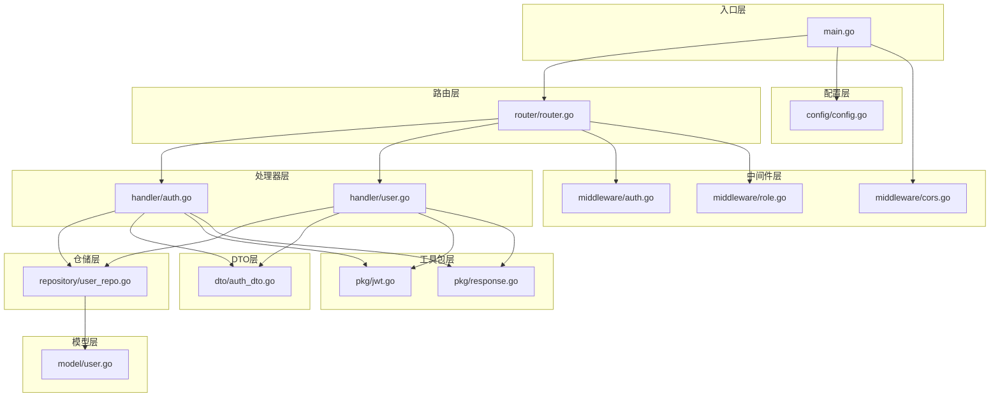
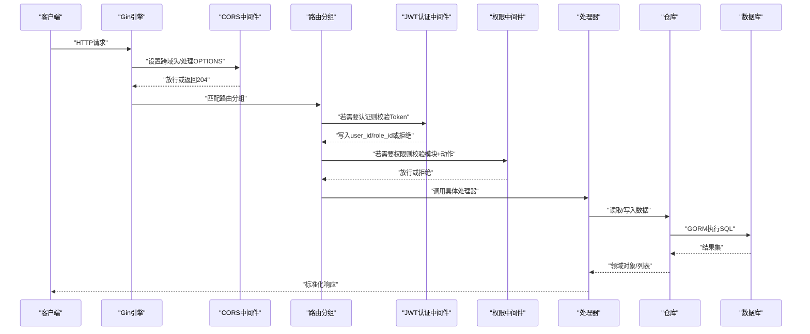
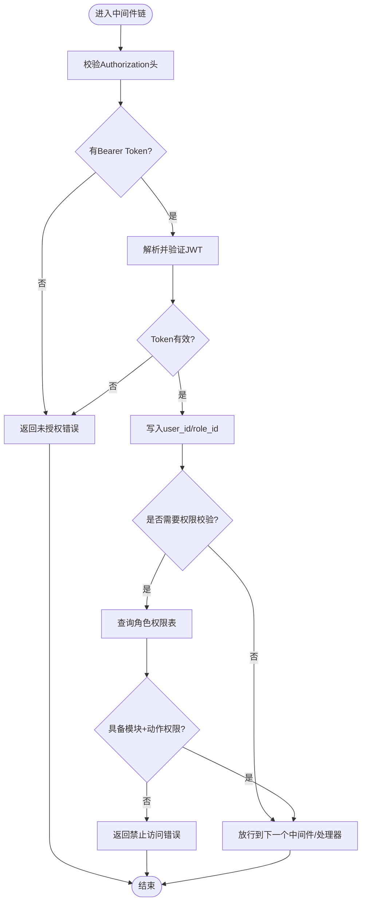
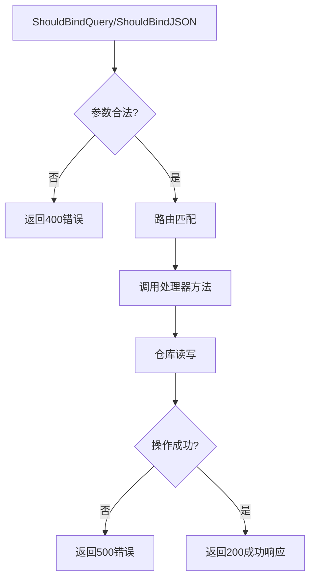
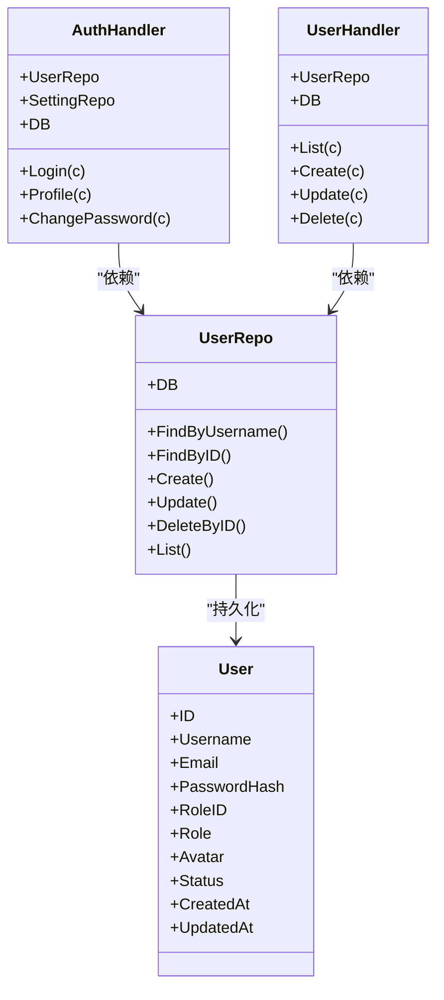
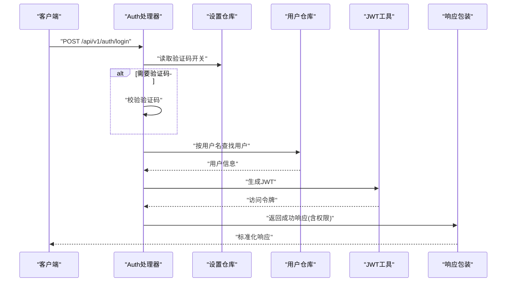
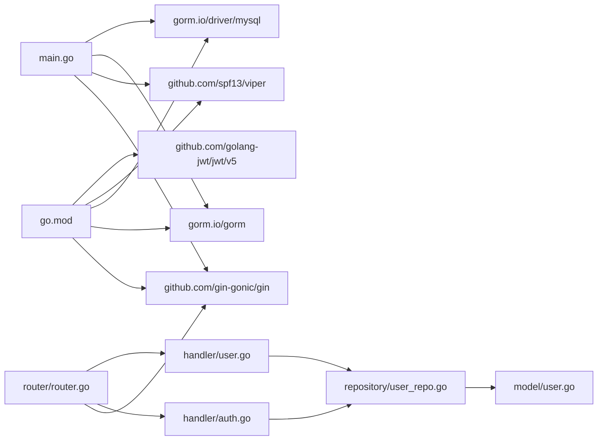

# 组件交互机制

<cite>
**本文引用的文件**
- [main.go](file://server/main.go)
- [router.go](file://server/router/router.go)
- [cors.go](file://server/internal/middleware/cors.go)
- [auth.go](file://server/internal/middleware/auth.go)
- [role.go](file://server/internal/middleware/role.go)
- [jwt.go](file://server/internal/pkg/jwt.go)
- [response.go](file://server/internal/pkg/response.go)
- [config.go](file://server/config/config.go)
- [auth_handler.go](file://server/internal/handler/auth.go)
- [user_handler.go](file://server/internal/handler/user.go)
- [user_repo.go](file://server/internal/repository/user_repo.go)
- [user_model.go](file://server/internal/model/user.go)
- [auth_dto.go](file://server/internal/dto/auth_dto.go)
- [go.mod](file://server/go.mod)
</cite>

## 目录
1. [简介](#简介)
2. [项目结构](#项目结构)
3. [核心组件](#核心组件)
4. [架构总览](#架构总览)
5. [详细组件分析](#详细组件分析)
6. [依赖分析](#依赖分析)
7. [性能考虑](#性能考虑)
8. [故障排查指南](#故障排查指南)
9. [结论](#结论)
10. [附录](#附录)

## 简介
本文件面向Xiangmuzs博客平台后端，系统性梳理组件交互机制与数据流，覆盖从HTTP请求进入系统到响应返回的完整链路；深入解释中间件（CORS跨域、JWT认证、权限校验）的执行顺序与职责；说明路由组织方式（RESTful API设计、路由匹配、参数解析与验证）；阐述组件间依赖关系与通信模式（依赖注入、接口设计、错误传播）；并提供请求处理流程图与时序图，帮助开发者快速理解复杂业务逻辑。

## 项目结构
后端采用分层与职责分离的组织方式：
- 入口层：main.go负责配置加载、数据库连接、迁移、RSA初始化、Gin引擎初始化、中间件注册与路由挂载。
- 路由层：router/router.go定义API分组与路由规则，按公开、认证、管理等维度组织。
- 中间件层：CORS、JWT认证、权限校验，按需在全局或分组上启用。
- 处理器层：各模块处理器（如AuthHandler、UserHandler）封装业务入口，调用仓库与工具。
- 仓储层：Repository封装数据访问，统一使用GORM。
- 模型层：Model定义数据结构及GORM标签。
- DTO层：DTO定义请求/响应结构与校验规则。
- 工具包层：jwt、response、RSA、上传、验证码等通用能力。
- 配置层：Viper读取YAML配置，暴露运行时配置。

图表来源
- [main.go:19-76](file://server/main.go#L19-L76)
- [router.go:11-103](file://server/router/router.go#L11-L103)
- [cors.go:7-21](file://server/internal/middleware/cors.go#L7-L21)
- [auth.go:10-37](file://server/internal/middleware/auth.go#L10-L37)
- [role.go:10-34](file://server/internal/middleware/role.go#L10-L34)
- [jwt.go:10-42](file://server/internal/pkg/jwt.go#L10-L42)
- [response.go:9-69](file://server/internal/pkg/response.go#L9-L69)
- [config.go:47-64](file://server/config/config.go#L47-L64)
- [auth_handler.go:13-25](file://server/internal/handler/auth.go#L13-L25)
- [user_handler.go:13-23](file://server/internal/handler/user.go#L13-L23)
- [user_repo.go:8-22](file://server/internal/repository/user_repo.go#L8-L22)
- [user_model.go:5-16](file://server/internal/model/user.go#L5-L16)
- [auth_dto.go:3-38](file://server/internal/dto/auth_dto.go#L3-L38)

章节来源
- [main.go:19-76](file://server/main.go#L19-L76)
- [router.go:11-103](file://server/router/router.go#L11-L103)

## 核心组件
- Gin引擎与中间件
  - 全局CORS中间件在路由前注册，统一处理跨域头与预检请求。
  - 认证中间件在“/api/v1”下按需启用，用于校验Authorization头中的Bearer Token，并将用户身份写入上下文。
  - 权限中间件基于角色与模块动作进行细粒度授权校验。
- 路由系统
  - 使用Gin分组组织RESTful API，公开接口无需认证，认证接口通过中间件保护，管理接口进一步结合RequirePermission进行权限控制。
  - 参数解析与验证：查询参数使用ShouldBindQuery，JSON请求体使用ShouldBindJSON，配合DTO结构体的binding标签完成自动校验。
- 处理器与依赖注入
  - 各处理器在构造函数中接收db并创建对应仓库实例，形成显式的依赖注入。
  - 处理器内部仅依赖仓库与工具包，不直接依赖其他处理器，保持高内聚低耦合。
- 错误传播与响应格式
  - 统一使用响应包装结构，错误码、消息与数据体标准化输出，便于前端统一处理。
  - 不同HTTP状态码对应不同错误类型（如未授权、禁止、未找到、服务器错误），便于调试与监控。

章节来源
- [cors.go:7-21](file://server/internal/middleware/cors.go#L7-L21)
- [auth.go:10-37](file://server/internal/middleware/auth.go#L10-L37)
- [role.go:10-34](file://server/internal/middleware/role.go#L10-L34)
- [router.go:11-103](file://server/router/router.go#L11-L103)
- [auth_handler.go:13-25](file://server/internal/handler/auth.go#L13-L25)
- [user_handler.go:13-23](file://server/internal/handler/user.go#L13-L23)
- [response.go:22-69](file://server/internal/pkg/response.go#L22-L69)

## 架构总览
下图展示一次典型请求从进入系统到返回响应的全链路交互：

图表来源
- [main.go:59-68](file://server/main.go#L59-L68)
- [router.go:11-103](file://server/router/router.go#L11-L103)
- [cors.go:7-21](file://server/internal/middleware/cors.go#L7-L21)
- [auth.go:10-37](file://server/internal/middleware/auth.go#L10-L37)
- [role.go:10-34](file://server/internal/middleware/role.go#L10-L34)
- [auth_handler.go:31-93](file://server/internal/handler/auth.go#L31-L93)
- [user_handler.go:25-75](file://server/internal/handler/user.go#L25-L75)

## 详细组件分析

### 中间件机制
- CORS跨域处理
  - 设置允许源、方法、头部与缓存时间；对OPTIONS预检请求直接返回204。
- JWT认证中间件
  - 解析Authorization头，校验格式与签名有效性；成功则将用户ID与角色ID写入上下文供后续中间件与处理器使用。
- 权限检查中间件
  - 基于角色与模块动作进行授权判断，通过JOIN查询角色权限表决定是否放行。

图表来源
- [auth.go:10-37](file://server/internal/middleware/auth.go#L10-L37)
- [role.go:10-34](file://server/internal/middleware/role.go#L10-L34)
- [response.go:51-61](file://server/internal/pkg/response.go#L51-L61)

章节来源
- [cors.go:7-21](file://server/internal/middleware/cors.go#L7-L21)
- [auth.go:10-37](file://server/internal/middleware/auth.go#L10-L37)
- [role.go:10-34](file://server/internal/middleware/role.go#L10-L34)
- [response.go:51-61](file://server/internal/pkg/response.go#L51-L61)

### 路由系统与RESTful设计
- 分组策略
  - 公开接口：无需认证，如登录、公钥、验证码、公开文章列表/搜索/详情、分类与标签列表。
  - 认证接口：通过Auth中间件保护，如个人资料、修改密码、仪表盘统计。
  - 管理接口：在认证基础上结合RequirePermission，按模块（article/category/tag/media/qrcode/role/user/settings）与动作（create/update/delete/read）进行授权。
- 路由匹配与参数解析
  - 查询参数使用ShouldBindQuery，JSON请求体使用ShouldBindJSON，配合DTO结构体的binding标签自动校验。
  - 路径参数通过c.Param读取并转换为整数类型，同时进行错误处理。
- 参数验证与错误传播
  - 请求体绑定失败返回400错误；路径参数非法返回400错误；资源不存在返回404错误；权限不足返回403错误；服务异常返回500错误。

图表来源
- [router.go:24-102](file://server/router/router.go#L24-L102)
- [auth_handler.go:31-93](file://server/internal/handler/auth.go#L31-L93)
- [user_handler.go:25-145](file://server/internal/handler/user.go#L25-L145)
- [auth_dto.go:3-38](file://server/internal/dto/auth_dto.go#L3-L38)

章节来源
- [router.go:24-102](file://server/router/router.go#L24-L102)
- [auth_handler.go:31-93](file://server/internal/handler/auth.go#L31-L93)
- [user_handler.go:25-145](file://server/internal/handler/user.go#L25-L145)
- [auth_dto.go:3-38](file://server/internal/dto/auth_dto.go#L3-L38)

### 处理器与依赖注入
- 依赖注入
  - 处理器在构造函数中接收*gorm.DB，创建对应的仓库实例，避免在方法体内重复创建，提升可测试性与一致性。
- 接口设计原则
  - 处理器方法只接受*gin.Context与DTO，返回标准响应；不直接操作数据库，通过仓库抽象。
- 错误传播机制
  - 统一使用pkg/response中的错误函数，确保错误码与消息一致；处理器内部根据业务场景选择合适的HTTP状态码。

图表来源
- [auth_handler.go:13-25](file://server/internal/handler/auth.go#L13-L25)
- [user_handler.go:13-23](file://server/internal/handler/user.go#L13-L23)
- [user_repo.go:8-22](file://server/internal/repository/user_repo.go#L8-L22)
- [user_model.go:5-16](file://server/internal/model/user.go#L5-L16)

章节来源
- [auth_handler.go:13-25](file://server/internal/handler/auth.go#L13-L25)
- [user_handler.go:13-23](file://server/internal/handler/user.go#L13-L23)
- [user_repo.go:8-22](file://server/internal/repository/user_repo.go#L8-L22)
- [user_model.go:5-16](file://server/internal/model/user.go#L5-L16)

### JWT与认证流程
- 登录流程
  - 可选验证码校验（根据设置开关）。
  - RSA解密密码，比对哈希，生成JWT并返回给客户端。
  - 同步加载当前角色的所有权限，随登录响应下发，前端据此控制UI与功能按钮。
- 认证流程
  - 每个受保护路由在进入处理器前，先通过JWT中间件校验Token有效性，失败则直接返回未授权。
- 权限流程
  - 在认证之后，针对管理类接口，进一步校验角色是否具备模块+动作权限，否则返回禁止访问。

图表来源
- [auth_handler.go:31-93](file://server/internal/handler/auth.go#L31-L93)
- [jwt.go:16-28](file://server/internal/pkg/jwt.go#L16-L28)
- [response.go:22-28](file://server/internal/pkg/response.go#L22-L28)

章节来源
- [auth_handler.go:31-93](file://server/internal/handler/auth.go#L31-L93)
- [jwt.go:16-28](file://server/internal/pkg/jwt.go#L16-L28)
- [response.go:22-28](file://server/internal/pkg/response.go#L22-L28)

## 依赖分析
- 运行时依赖
  - Gin作为Web框架，GORM作为ORM，MySQL驱动，Viper用于配置，JWT库用于签发与解析。
- 内部依赖
  - 处理器依赖仓库，仓库依赖GORM模型；处理器与仓库均不直接依赖外部框架，便于单元测试。
  - 中间件依赖处理器与工具包，但不反向依赖处理器，避免循环依赖。
- 外部集成点
  - 数据库连接字符串由配置文件提供；上传目录静态映射；RSA密钥初始化。

图表来源
- [go.mod:5-13](file://server/go.mod#L5-L13)
- [main.go:3-17](file://server/main.go#L3-L17)
- [router.go:3-9](file://server/router/router.go#L3-L9)

章节来源
- [go.mod:5-13](file://server/go.mod#L5-L13)
- [main.go:3-17](file://server/main.go#L3-L17)
- [router.go:3-9](file://server/router/router.go#L3-L9)

## 性能考虑
- 中间件顺序优化
  - 将CORS置于最前，减少不必要的后续处理开销；认证与权限中间件尽量早发现无效请求，避免昂贵的数据库查询。
- 数据库访问
  - 列表查询使用Preload加载关联角色，避免N+1问题；权限查询使用JOIN一次性判断，减少往返次数。
- 缓存与静态资源
  - 上传文件目录静态映射，减少应用层处理；可结合Redis缓存热点设置与权限清单以进一步降低延迟。
- 日志与调试
  - 在开发模式开启GORM日志，有助于定位慢查询与异常SQL。

## 故障排查指南
- 401 未授权
  - 检查请求头Authorization是否存在且格式为Bearer Token；确认Token未过期；核对JWT密钥与过期时间配置。
- 403 禁止访问
  - 检查当前用户角色是否具备模块+动作权限；确认权限表数据正确；核对RequirePermission中间件是否生效。
- 400 参数错误
  - 检查请求体JSON结构与字段类型；确认DTO绑定规则；核对查询参数命名与范围。
- 500 服务器错误
  - 查看数据库连接与迁移是否成功；检查仓库层SQL执行是否报错；关注RSA解密与哈希加密环节。
- CORS问题
  - 检查CORS中间件是否注册；确认浏览器预检请求OPTIONS是否被正确处理；核对允许的方法与头部。

章节来源
- [auth.go:13-31](file://server/internal/middleware/auth.go#L13-L31)
- [role.go:13-31](file://server/internal/middleware/role.go#L13-L31)
- [response.go:51-69](file://server/internal/pkg/response.go#L51-L69)
- [cors.go:7-21](file://server/internal/middleware/cors.go#L7-L21)

## 结论
该系统通过清晰的分层与中间件链实现了从HTTP请求到响应返回的稳定流转：CORS统一跨域处理，JWT认证保障安全，权限中间件细化授权，路由层遵循RESTful设计并结合参数绑定与验证。处理器通过依赖注入与仓库抽象实现高内聚低耦合，配合统一响应与错误传播机制，使整体架构易于维护与扩展。

## 附录
- 关键配置项
  - 服务器端口与运行模式、数据库连接参数、JWT密钥与过期时间、上传路径与大小限制、博客基础URL等。
- 建议
  - 引入统一鉴权上下文与错误码常量；为高频接口增加缓存；完善接口文档与示例；增强日志埋点与指标采集。