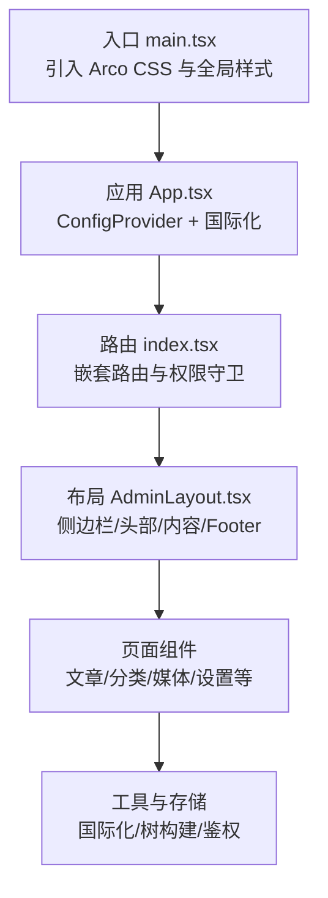
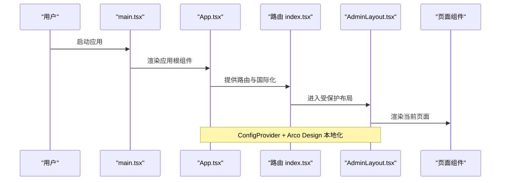
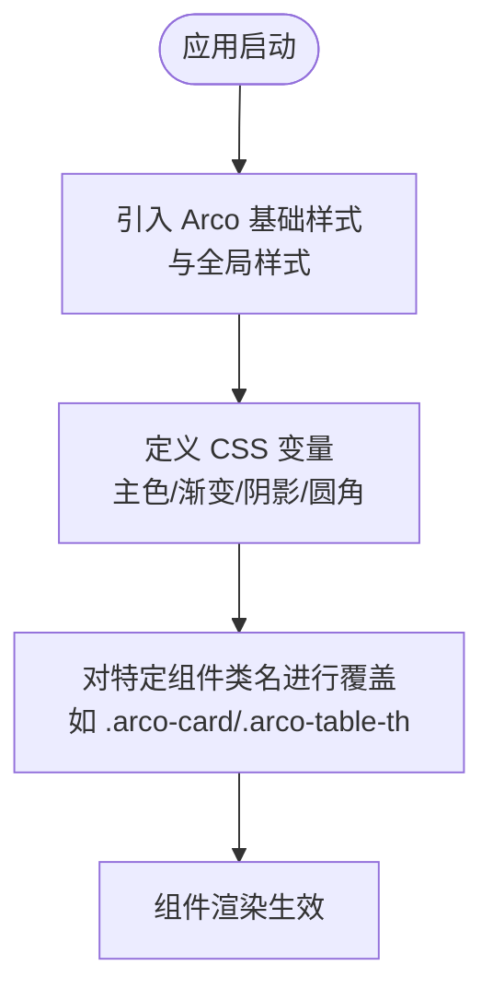
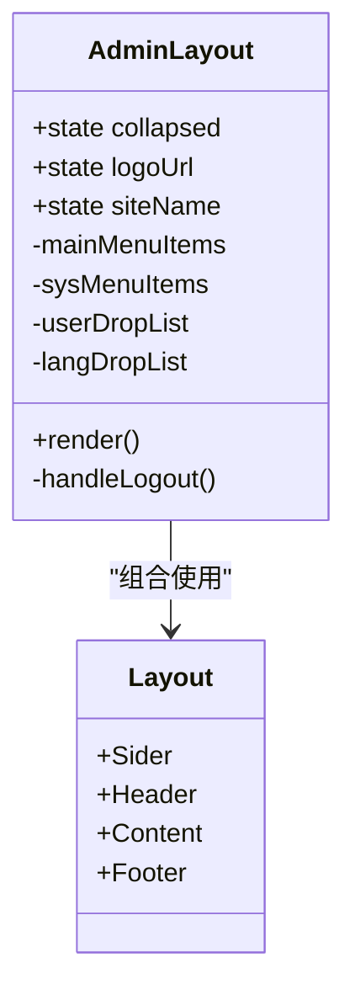
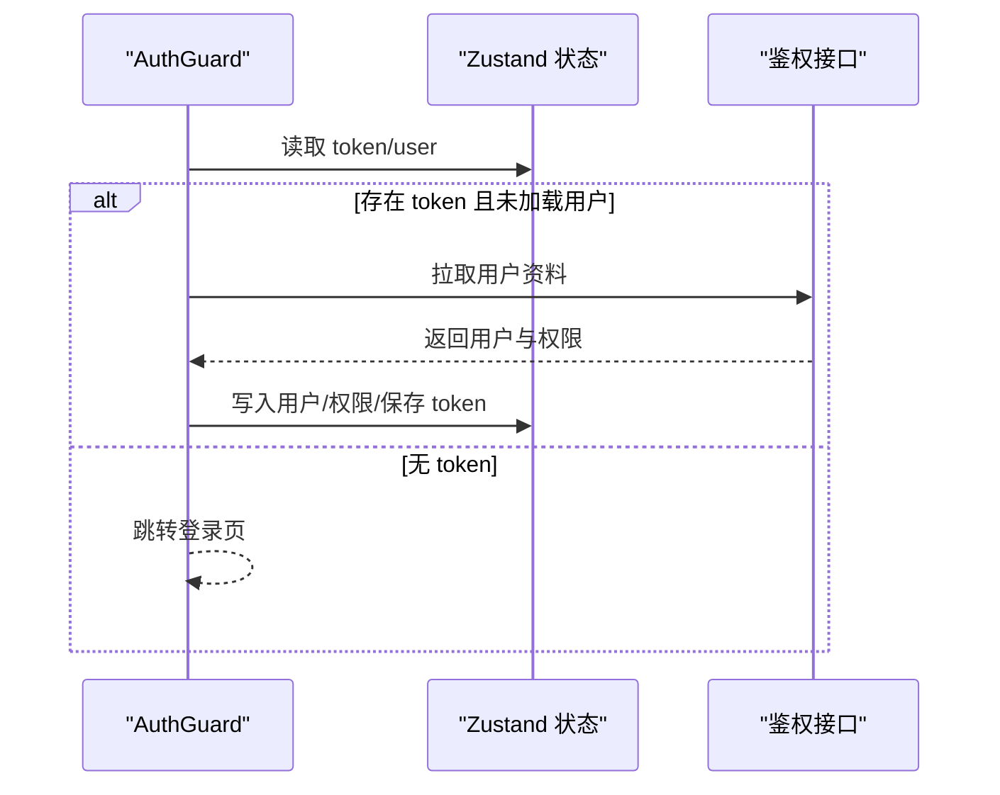
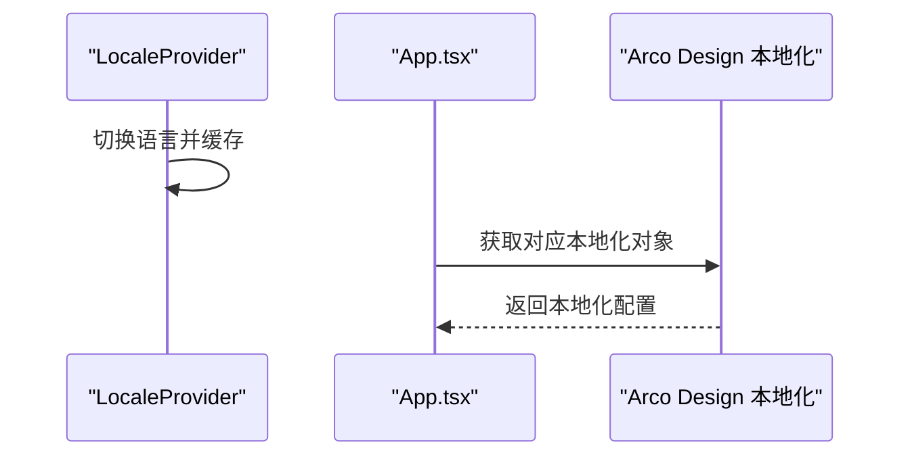
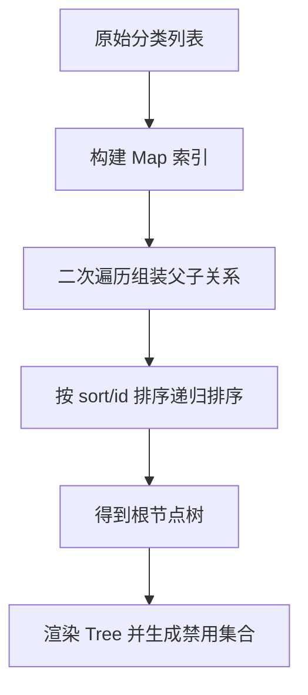
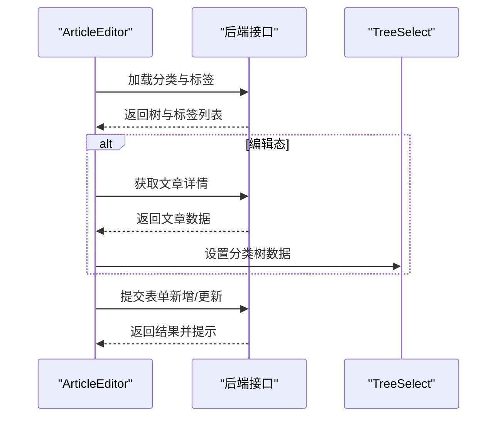
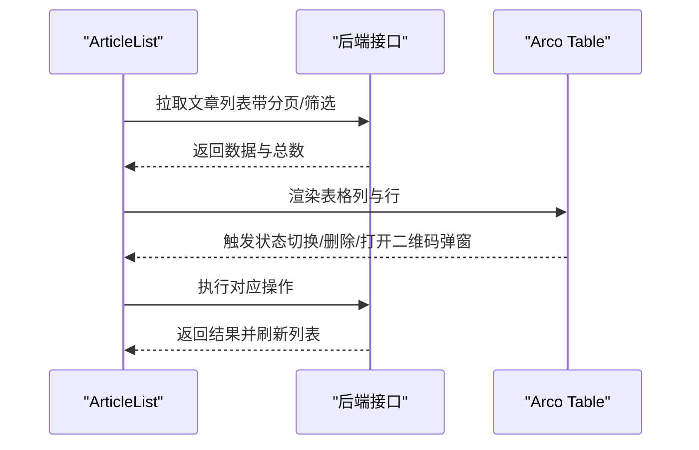
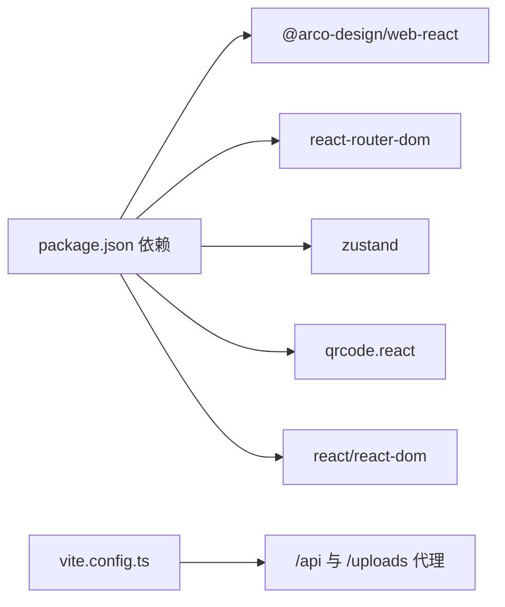

# UI组件与样式

<cite>
**本文引用的文件**
- [global.css](file://webSource/apps/admin/src/styles/global.css)
- [package.json](file://webSource/apps/admin/package.json)
- [vite.config.ts](file://webSource/apps/admin/vite.config.ts)
- [main.tsx](file://webSource/apps/admin/src/main.tsx)
- [App.tsx](file://webSource/apps/admin/src/App.tsx)
- [AdminLayout.tsx](file://webSource/apps/admin/src/layouts/AdminLayout.tsx)
- [AuthGuard.tsx](file://webSource/apps/admin/src/components/AuthGuard.tsx)
- [index.tsx](file://webSource/apps/admin/src/router/index.tsx)
- [categoryTree.ts](file://webSource/apps/admin/src/utils/categoryTree.ts)
- [Editor.tsx](file://webSource/apps/admin/src/pages/articles/Editor.tsx)
- [List.tsx（文章列表）](file://webSource/apps/admin/src/pages/articles/List.tsx)
- [List.tsx（分类列表）](file://webSource/apps/admin/src/pages/categories/List.tsx)
- [authStore.ts](file://webSource/apps/admin/src/store/authStore.ts)
- [index.tsx（国际化）](file://webSource/apps/admin/src/locales/index.tsx)
</cite>

## 目录
1. [简介](#简介)
2. [项目结构](#项目结构)
3. [核心组件](#核心组件)
4. [架构总览](#架构总览)
5. [详细组件分析](#详细组件分析)
6. [依赖分析](#依赖分析)
7. [性能考虑](#性能考虑)
8. [故障排查指南](#故障排查指南)
9. [结论](#结论)
10. [附录](#附录)

## 简介
本文件面向Xiangmuzs博客平台管理后台的UI组件与样式系统，聚焦于Arco Design组件库的集成与定制、主题变量与全局样式管理、自定义组件（树形控件、富文本编辑器、数据表格）实现、样式模块化策略、图标系统集成、组件复用模式、样式调试与移动端适配等主题。文档以实际源码为依据，提供可操作的架构图、流程图与最佳实践建议。

## 项目结构
管理后台采用Vite + React + TypeScript构建，Arco Design作为UI基础库，通过全局CSS变量与局部样式覆盖实现品牌化定制；路由层通过React Router v6组织页面与权限守卫；状态管理采用Zustand；国际化通过自研上下文与Arco Design本地化切换结合。

图表来源
- [main.tsx:1-13](file://webSource/apps/admin/src/main.tsx#L1-L13)
- [App.tsx:1-22](file://webSource/apps/admin/src/App.tsx#L1-L22)
- [index.tsx:1-47](file://webSource/apps/admin/src/router/index.tsx#L1-L47)
- [AdminLayout.tsx:1-159](file://webSource/apps/admin/src/layouts/AdminLayout.tsx#L1-L159)

章节来源
- [main.tsx:1-13](file://webSource/apps/admin/src/main.tsx#L1-L13)
- [package.json:1-28](file://webSource/apps/admin/package.json#L1-L28)
- [vite.config.ts:1-24](file://webSource/apps/admin/vite.config.ts#L1-L24)

## 核心组件
- 布局与导航：AdminLayout负责侧边栏菜单、顶部用户信息与语言切换、内容区Outlet。
- 权限守卫：AuthGuard在登录态缺失或未拉取用户资料时进行拦截与加载提示。
- 国际化：LocaleProvider提供语言切换与Arco Design本地化映射。
- 树形数据工具：categoryTree提供分类树构建、键收集与禁用集合计算。
- 页面组件：文章编辑器、文章列表、分类列表等，均基于Arco Design组件组合实现。

章节来源
- [AdminLayout.tsx:1-159](file://webSource/apps/admin/src/layouts/AdminLayout.tsx#L1-L159)
- [AuthGuard.tsx:1-38](file://webSource/apps/admin/src/components/AuthGuard.tsx#L1-L38)
- [index.tsx（国际化）:1-53](file://webSource/apps/admin/src/locales/index.tsx#L1-L53)
- [categoryTree.ts:1-52](file://webSource/apps/admin/src/utils/categoryTree.ts#L1-L52)

## 架构总览
下图展示从入口到页面渲染的关键调用链，以及Arco Design与自定义样式的协同关系。

图表来源
- [main.tsx:1-13](file://webSource/apps/admin/src/main.tsx#L1-L13)
- [App.tsx:1-22](file://webSource/apps/admin/src/App.tsx#L1-L22)
- [index.tsx:1-47](file://webSource/apps/admin/src/router/index.tsx#L1-L47)
- [AdminLayout.tsx:1-159](file://webSource/apps/admin/src/layouts/AdminLayout.tsx#L1-L159)

## 详细组件分析

### Arco Design集成与主题定制
- 全局样式引入：在入口中引入Arco Design基础CSS与项目全局样式，确保组件基线一致。
- 主题变量：通过CSS变量集中定义主色、渐变、阴影、圆角与过渡，便于统一风格与快速切换。
- 组件样式覆盖：针对卡片、表格表头、登录背景等进行选择器级覆盖，保持Arco组件语义不变的同时实现品牌化。

图表来源
- [main.tsx:1-13](file://webSource/apps/admin/src/main.tsx#L1-L13)
- [global.css:1-136](file://webSource/apps/admin/src/styles/global.css#L1-L136)

章节来源
- [main.tsx:1-13](file://webSource/apps/admin/src/main.tsx#L1-L13)
- [global.css:1-136](file://webSource/apps/admin/src/styles/global.css#L1-L136)

### 布局与导航组件（AdminLayout）
- 功能要点
  - 侧边栏：响应式折叠、主题深色、主菜单与系统菜单分组。
  - 头部：语言切换、用户下拉菜单、登出。
  - 内容区：Outlet承载子路由页面。
  - 设置项：运行时读取站点设置，动态更新Logo与站点名。
- 样式要点
  - 使用CSS变量控制阴影、背景与文字颜色，保证与主题一致。
  - 侧边栏Logo区域支持图片与文字，折叠时回退显示首字母。

图表来源
- [AdminLayout.tsx:1-159](file://webSource/apps/admin/src/layouts/AdminLayout.tsx#L1-L159)

章节来源
- [AdminLayout.tsx:1-159](file://webSource/apps/admin/src/layouts/AdminLayout.tsx#L1-L159)

### 权限守卫（AuthGuard）
- 逻辑要点
  - 若存在token但未加载用户资料，则发起资料拉取；成功后写入状态，失败则登出。
  - 在加载期间显示旋转指示器；无token时重定向至登录页。
- 与鉴权状态
  - 结合Zustand状态管理，持久化token并提供权限判断能力。

图表来源
- [AuthGuard.tsx:1-38](file://webSource/apps/admin/src/components/AuthGuard.tsx#L1-L38)
- [authStore.ts:1-56](file://webSource/apps/admin/src/store/authStore.ts#L1-L56)

章节来源
- [AuthGuard.tsx:1-38](file://webSource/apps/admin/src/components/AuthGuard.tsx#L1-L38)
- [authStore.ts:1-56](file://webSource/apps/admin/src/store/authStore.ts#L1-L56)

### 国际化与Arco Design本地化
- 自研国际化：LocaleProvider提供语言切换、本地存储与翻译函数。
- Arco Design本地化：根据当前语言返回对应Arco Design本地化对象。
- 应用范围：顶层ConfigProvider包裹路由，确保所有Arco组件使用正确语言。

图表来源
- [index.tsx（国际化）:1-53](file://webSource/apps/admin/src/locales/index.tsx#L1-L53)
- [App.tsx:1-22](file://webSource/apps/admin/src/App.tsx#L1-L22)

章节来源
- [index.tsx（国际化）:1-53](file://webSource/apps/admin/src/locales/index.tsx#L1-L53)
- [App.tsx:1-22](file://webSource/apps/admin/src/App.tsx#L1-L22)

### 树形控件与分类管理（CategoryList + categoryTree）
- 数据结构
  - CategoryTreeNode：去除children外字段，保留children数组，便于Arco Tree渲染。
- 构建算法
  - buildCategoryTree：基于Map建立节点索引，再按父子关系组装根节点并排序。
  - collectAllIds/getAllKeys：用于禁用选择与展开键集合计算。
- UI交互
  - Tree渲染额外操作按钮，支持增删改与批量展开/折叠。
  - Modal表单配合TreeSelect，禁用环路父级选择。

图表来源
- [categoryTree.ts:1-52](file://webSource/apps/admin/src/utils/categoryTree.ts#L1-L52)
- [List.tsx（分类列表）:1-215](file://webSource/apps/admin/src/pages/categories/List.tsx#L1-L215)

章节来源
- [categoryTree.ts:1-52](file://webSource/apps/admin/src/utils/categoryTree.ts#L1-L52)
- [List.tsx（分类列表）:1-215](file://webSource/apps/admin/src/pages/categories/List.tsx#L1-L215)

### 富文本编辑器与文章编辑（ArticleEditor）
- 组件组合
  - 使用Arco Form/输入组件、Grid栅格、Radio切换内容类型、TreeSelect选择分类。
- 数据流
  - 编辑态加载文章详情并回填表单；提交时根据是否编辑决定PUT/POST。
- 样式细节
  - 根据内容类型切换字体族，提升Markdown可读性。

图表来源
- [Editor.tsx:1-149](file://webSource/apps/admin/src/pages/articles/Editor.tsx#L1-L149)
- [categoryTree.ts:1-52](file://webSource/apps/admin/src/utils/categoryTree.ts#L1-L52)

章节来源
- [Editor.tsx:1-149](file://webSource/apps/admin/src/pages/articles/Editor.tsx#L1-L149)

### 数据表格与二维码可视化（ArticleList）
- 表格列定义
  - 包含状态标签、分类、浏览数、二维码图标与状态标签、发布时间、操作按钮。
- 交互细节
  - Tooltip内嵌二维码预览；Modal弹窗展示完整二维码与链接；状态切换与删除确认。
- 性能注意
  - 使用useCallback稳定回调，避免不必要的重渲染。

图表来源
- [List.tsx（文章列表）:1-246](file://webSource/apps/admin/src/pages/articles/List.tsx#L1-L246)

章节来源
- [List.tsx（文章列表）:1-246](file://webSource/apps/admin/src/pages/articles/List.tsx#L1-L246)

### 图标系统集成
- Arco Design图标：通过@arco-design/web-react/icon导入常用图标，统一风格与尺寸。
- 动态二维码：使用qrcode.react在表格中内嵌二维码预览与弹窗展示。
- 使用建议
  - 优先使用Arco Design内置图标，减少外部依赖。
  - 对于特殊需求（如SVG图标），可通过Arco的icon属性或自定义组件封装。

章节来源
- [AdminLayout.tsx:1-159](file://webSource/apps/admin/src/layouts/AdminLayout.tsx#L1-L159)
- [List.tsx（文章列表）:1-246](file://webSource/apps/admin/src/pages/articles/List.tsx#L1-L246)

### 样式模块化与最佳实践
- CSS-in-JS：在组件内部通过内联样式或Arco组件提供的style属性快速覆盖，适合局部微调。
- styled-components：当前代码未使用，若需复杂主题切换或跨组件共享样式，可考虑引入以获得更好的作用域隔离与主题能力。
- 传统CSS：通过全局CSS变量与选择器覆盖实现品牌化，适合整体风格统一与Arco组件的轻量级定制。
- 建议
  - 局部微调用内联样式；全局品牌化用CSS变量；复杂主题用styled-components或同等方案。

章节来源
- [global.css:1-136](file://webSource/apps/admin/src/styles/global.css#L1-L136)
- [AdminLayout.tsx:120-149](file://webSource/apps/admin/src/layouts/AdminLayout.tsx#L120-L149)

### 组件复用策略
- 高阶组件（HOC）：AuthGuard体现权限控制的横切关注点，可扩展为更多业务守卫。
- Render Props：Arco组件的render/children属性已广泛使用，如Tree的renderExtra。
- Hooks：useLocale/useAuthStore等自定义Hook封装状态与逻辑，便于复用与测试。
- 建议
  - 将通用行为抽象为Hooks，UI结构尽量保持组件化，避免过度HOC导致层级过深。

章节来源
- [AuthGuard.tsx:1-38](file://webSource/apps/admin/src/components/AuthGuard.tsx#L1-L38)
- [List.tsx（分类列表）:136-173](file://webSource/apps/admin/src/pages/categories/List.tsx#L136-L173)
- [authStore.ts:1-56](file://webSource/apps/admin/src/store/authStore.ts#L1-L56)
- [index.tsx（国际化）:1-53](file://webSource/apps/admin/src/locales/index.tsx#L1-L53)

### 样式调试与问题排查
- 浏览器开发者工具
  - Elements面板检查Arco组件类名与自定义类名叠加效果。
  - Computed/Styles面板查看最终计算样式与CSS变量值。
- 常见问题
  - 样式被覆盖：检查选择器优先级与!important使用；优先使用Arco提供的style属性或CSS变量。
  - 响应式异常：确认Arco组件的响应式断点参数与容器宽度。
  - 暗色主题：确保使用Arco Design的theme="dark"与CSS变量(--color-bg-*等)。

章节来源
- [global.css:1-136](file://webSource/apps/admin/src/styles/global.css#L1-L136)
- [AdminLayout.tsx:87-99](file://webSource/apps/admin/src/layouts/AdminLayout.tsx#L87-L99)

### 移动端适配与触摸优化
- 响应式断点
  - Arco Design组件提供breakpoint参数（如lg），结合Sider的collapsible实现侧边栏折叠。
- 触摸交互
  - 使用Arco组件的size/mini等尺寸属性提升移动端点击面积。
  - 表格列采用紧凑宽度与省略展示，必要时启用横向滚动。
- 建议
  - 在关键页面增加移动端测试，关注点击热区、滚动流畅度与字体大小可读性。

章节来源
- [AdminLayout.tsx:87-88](file://webSource/apps/admin/src/layouts/AdminLayout.tsx#L87-L88)
- [List.tsx（文章列表）:204-216](file://webSource/apps/admin/src/pages/articles/List.tsx#L204-L216)

## 依赖分析
- Arco Design：提供完整的UI组件生态，涵盖布局、表单、表格、树形、弹窗等。
- React Router：组织页面路由与嵌套布局。
- Zustand：轻量状态管理，用于用户会话与权限。
- qrcode.react：内嵌二维码生成与预览。
- Vite：开发与构建工具，代理配置便于前后端联调。

图表来源
- [package.json:1-28](file://webSource/apps/admin/package.json#L1-L28)
- [vite.config.ts:1-24](file://webSource/apps/admin/vite.config.ts#L1-L24)

章节来源
- [package.json:1-28](file://webSource/apps/admin/package.json#L1-L28)
- [vite.config.ts:1-24](file://webSource/apps/admin/vite.config.ts#L1-L24)

## 性能考虑
- 组件渲染优化
  - 使用useCallback稳定回调，减少Table等重型组件的重渲染。
  - 表格分页与筛选参数化，避免一次性加载过多数据。
- 资源加载
  - Arco Design基础CSS按需引入，避免重复加载。
  - 图标与二维码按需渲染，避免不必要的计算。
- 状态管理
  - 将token与用户信息持久化在Zustand中，减少重复请求。

章节来源
- [List.tsx（文章列表）:39-53](file://webSource/apps/admin/src/pages/articles/List.tsx#L39-L53)
- [authStore.ts:15-34](file://webSource/apps/admin/src/store/authStore.ts#L15-L34)

## 故障排查指南
- 登录后白屏或跳转异常
  - 检查token是否存在与localStorage写入；确认AuthGuard加载流程与路由守卫。
- 语言切换无效
  - 检查LocaleProvider的setLocale与Arco Design本地化映射。
- 表格列错位或溢出
  - 调整列宽与最小宽度，必要时启用横向滚动。
- 二维码无法显示
  - 确认URL拼接与Modal可见性；检查网络代理配置。

章节来源
- [AuthGuard.tsx:1-38](file://webSource/apps/admin/src/components/AuthGuard.tsx#L1-L38)
- [index.tsx（国际化）:23-31](file://webSource/apps/admin/src/locales/index.tsx#L23-L31)
- [List.tsx（文章列表）:119-135](file://webSource/apps/admin/src/pages/articles/List.tsx#L119-L135)

## 结论
本项目以Arco Design为核心，结合CSS变量与选择器覆盖实现品牌化定制；通过Zustand与自研国际化上下文支撑权限与多语言；页面组件围绕表单、树形与表格展开，具备良好的可维护性与扩展性。建议后续在复杂主题与跨组件共享样式场景引入styled-components，并持续完善移动端体验与性能优化。

## 附录
- 关键路径参考
  - 入口与样式：[main.tsx:1-13](file://webSource/apps/admin/src/main.tsx#L1-L13)，[global.css:1-136](file://webSource/apps/admin/src/styles/global.css#L1-L136)
  - 应用与国际化：[App.tsx:1-22](file://webSource/apps/admin/src/App.tsx#L1-L22)，[index.tsx（国际化）:1-53](file://webSource/apps/admin/src/locales/index.tsx#L1-L53)
  - 布局与路由：[AdminLayout.tsx:1-159](file://webSource/apps/admin/src/layouts/AdminLayout.tsx#L1-L159)，[index.tsx:1-47](file://webSource/apps/admin/src/router/index.tsx#L1-L47)
  - 权限与状态：[AuthGuard.tsx:1-38](file://webSource/apps/admin/src/components/AuthGuard.tsx#L1-L38)，[authStore.ts:1-56](file://webSource/apps/admin/src/store/authStore.ts#L1-L56)
  - 自定义树与页面：[categoryTree.ts:1-52](file://webSource/apps/admin/src/utils/categoryTree.ts#L1-L52)，[List.tsx（分类列表）:1-215](file://webSource/apps/admin/src/pages/categories/List.tsx#L1-L215)，[Editor.tsx:1-149](file://webSource/apps/admin/src/pages/articles/Editor.tsx#L1-L149)，[List.tsx（文章列表）:1-246](file://webSource/apps/admin/src/pages/articles/List.tsx#L1-L246)