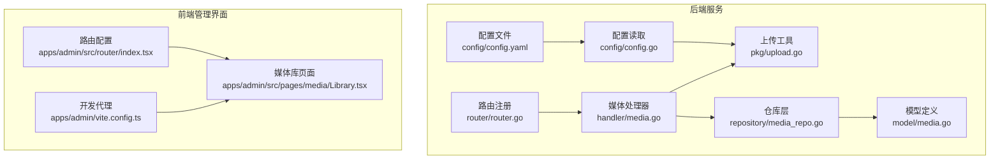
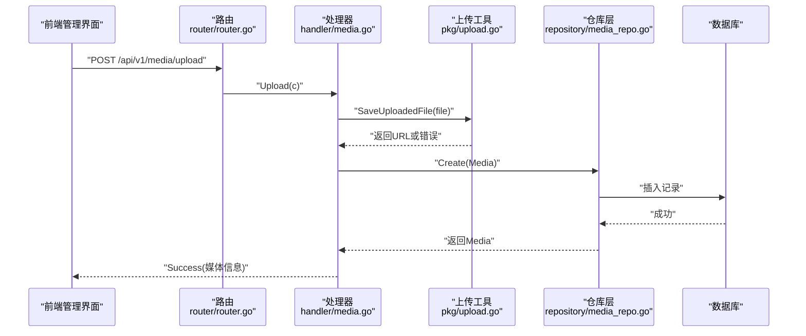
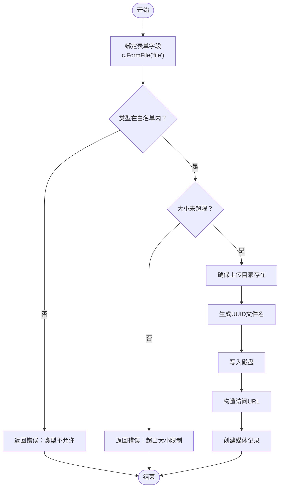
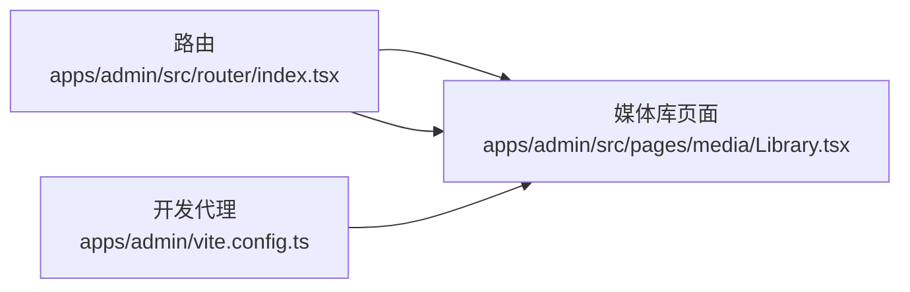
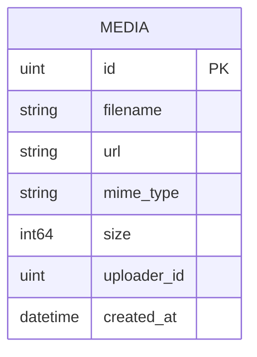
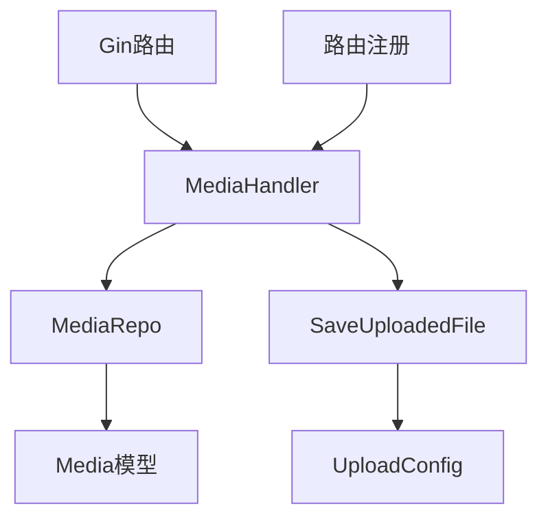

# 媒体文件管理

<cite>
**本文档引用的文件**
- [server/internal/handler/media.go](file://server/internal/handler/media.go)
- [server/internal/model/media.go](file://server/internal/model/media.go)
- [server/internal/repository/media_repo.go](file://server/internal/repository/media_repo.go)
- [server/internal/pkg/upload.go](file://server/internal/pkg/upload.go)
- [server/config/config.go](file://server/config/config.go)
- [server/config/config.yaml](file://server/config/config.yaml)
- [server/router/router.go](file://server/router/router.go)
- [webSource/apps/admin/src/pages/media/Library.tsx](file://webSource/apps/admin/src/pages/media/Library.tsx)
- [webSource/apps/admin/src/router/index.tsx](file://webSource/apps/admin/src/router/index.tsx)
- [webSource/apps/admin/vite.config.ts](file://webSource/apps/admin/vite.config.ts)
</cite>

## 目录
1. [简介](#简介)
2. [项目结构](#项目结构)
3. [核心组件](#核心组件)
4. [架构总览](#架构总览)
5. [详细组件分析](#详细组件分析)
6. [依赖分析](#依赖分析)
7. [性能考虑](#性能考虑)
8. [故障排除指南](#故障排除指南)
9. [结论](#结论)
10. [附录](#附录)

## 简介
本文件面向Xiangmuzs博客平台管理后台的媒体文件管理模块，系统性梳理媒体库的设计与实现，覆盖文件上传、存储管理、展示策略、安全控制与性能优化等方面。当前后端已具备基础的媒体上传、列表查询与删除能力；前端媒体库页面已接入路由，但尚未实现完整的上传与展示交互。本文将基于现有代码进行架构解读与扩展建议，帮助开发者快速理解与迭代媒体功能。

## 项目结构
媒体管理涉及后端服务与前端管理界面两部分：
- 后端：Gin路由注册媒体接口，MediaHandler负责业务逻辑，MediaRepo负责数据持久化，upload包负责文件落地与校验，配置文件定义上传参数。
- 前端：管理后台路由中挂载媒体库页面组件，Vite开发服务器通过代理转发上传资源路径。

图表来源
- [server/router/router.go:11-103](file://server/router/router.go#L11-L103)
- [server/internal/handler/media.go:24-52](file://server/internal/handler/media.go#L24-L52)
- [server/internal/pkg/upload.go:15-63](file://server/internal/pkg/upload.go#L15-L63)
- [server/internal/model/media.go:5-13](file://server/internal/model/media.go#L5-L13)
- [server/internal/repository/media_repo.go:16-36](file://server/internal/repository/media_repo.go#L16-L36)
- [server/config/config.go:47-64](file://server/config/config.go#L47-L64)
- [server/config/config.yaml:18-26](file://server/config/config.yaml#L18-L26)
- [webSource/apps/admin/src/router/index.tsx:17-46](file://webSource/apps/admin/src/router/index.tsx#L17-L46)
- [webSource/apps/admin/src/pages/media/Library.tsx:6-15](file://webSource/apps/admin/src/pages/media/Library.tsx#L6-L15)
- [webSource/apps/admin/vite.config.ts:10-22](file://webSource/apps/admin/vite.config.ts#L10-L22)

章节来源
- [server/router/router.go:11-103](file://server/router/router.go#L11-L103)
- [webSource/apps/admin/src/router/index.tsx:17-46](file://webSource/apps/admin/src/router/index.tsx#L17-L46)

## 核心组件
- 媒体处理器（MediaHandler）：封装上传、列表、删除接口，负责参数绑定、鉴权上下文提取与响应封装。
- 上传工具（SaveUploadedFile）：执行文件类型与大小校验、生成唯一文件名、写入磁盘并返回访问路径。
- 数据模型（Media）：定义媒体记录字段，包含文件名、URL、MIME类型、大小、上传者ID与创建时间。
- 仓库层（MediaRepo）：提供创建、删除、按分页查询与总数统计等数据库操作。
- 配置系统（UploadConfig）：集中管理上传目录、最大文件大小与允许的MIME类型。
- 路由注册：在认证组下暴露媒体接口，配合权限中间件控制访问。

章节来源
- [server/internal/handler/media.go:16-22](file://server/internal/handler/media.go#L16-L22)
- [server/internal/pkg/upload.go:15-63](file://server/internal/pkg/upload.go#L15-L63)
- [server/internal/model/media.go:5-13](file://server/internal/model/media.go#L5-L13)
- [server/internal/repository/media_repo.go:8-14](file://server/internal/repository/media_repo.go#L8-L14)
- [server/config/config.go:35-39](file://server/config/config.go#L35-L39)
- [server/router/router.go:73-76](file://server/router/router.go#L73-L76)

## 架构总览
媒体管理采用经典的三层架构：表现层（前端）、应用层（后端处理器）、基础设施层（存储与配置）。请求流从路由进入，经处理器调用上传工具完成落盘与校验，随后通过仓库层持久化到数据库，最终返回统一格式的响应。

图表来源
- [server/router/router.go:73-76](file://server/router/router.go#L73-L76)
- [server/internal/handler/media.go:24-52](file://server/internal/handler/media.go#L24-L52)
- [server/internal/pkg/upload.go:15-63](file://server/internal/pkg/upload.go#L15-L63)
- [server/internal/repository/media_repo.go:16-18](file://server/internal/repository/media_repo.go#L16-L18)

## 详细组件分析

### 文件上传组件
- 接口设计：后端提供单文件上传接口，接收名为“file”的表单字段，处理器从上下文中提取当前登录用户ID，构建媒体记录并持久化。
- 安全校验：上传工具对Content-Type进行白名单匹配，对文件大小进行阈值限制，拒绝不合规文件。
- 存储策略：使用UUID生成唯一文件名，避免冲突与重名覆盖；文件写入配置指定的上传目录；对外返回相对路径，便于后续CDN映射。
- 响应格式：统一使用成功/失败包装器，列表接口支持分页参数标准化。

图表来源
- [server/internal/handler/media.go:24-52](file://server/internal/handler/media.go#L24-L52)
- [server/internal/pkg/upload.go:15-63](file://server/internal/pkg/upload.go#L15-L63)
- [server/config/config.yaml:18-26](file://server/config/config.yaml#L18-L26)

章节来源
- [server/internal/handler/media.go:24-52](file://server/internal/handler/media.go#L24-L52)
- [server/internal/pkg/upload.go:15-63](file://server/internal/pkg/upload.go#L15-L63)
- [server/config/config.yaml:18-26](file://server/config/config.yaml#L18-L26)

### 媒体库展示与前端集成
- 路由接入：媒体库页面已在管理后台路由中注册，通过守卫组件保护，确保登录态与权限。
- 开发代理：Vite开发服务器将/uploads前缀代理至后端，便于本地联调时直接访问上传文件。
- 页面现状：媒体库页面目前仅包含占位卡片与文案，后续可在此基础上接入上传组件、文件列表、分页与筛选功能。

图表来源
- [webSource/apps/admin/src/router/index.tsx:17-46](file://webSource/apps/admin/src/router/index.tsx#L17-L46)
- [webSource/apps/admin/src/pages/media/Library.tsx:6-15](file://webSource/apps/admin/src/pages/media/Library.tsx#L6-L15)
- [webSource/apps/admin/vite.config.ts:10-22](file://webSource/apps/admin/vite.config.ts#L10-L22)

章节来源
- [webSource/apps/admin/src/router/index.tsx:17-46](file://webSource/apps/admin/src/router/index.tsx#L17-L46)
- [webSource/apps/admin/src/pages/media/Library.tsx:6-15](file://webSource/apps/admin/src/pages/media/Library.tsx#L6-L15)
- [webSource/apps/admin/vite.config.ts:10-22](file://webSource/apps/admin/vite.config.ts#L10-L22)

### 数据模型与存储管理
- 模型字段：包含主键ID、原始文件名、存储URL、MIME类型、文件大小、上传者ID与创建时间。
- 查询策略：仓库层提供按创建时间倒序的分页查询与总数统计，满足媒体库列表展示需求。
- 扩展建议：可增加索引以优化分页查询性能；未来可引入分类字段或标签关联以支持多类型文件分类管理。

图表来源
- [server/internal/model/media.go:5-13](file://server/internal/model/media.go#L5-L13)
- [server/internal/repository/media_repo.go:30-36](file://server/internal/repository/media_repo.go#L30-L36)

章节来源
- [server/internal/model/media.go:5-13](file://server/internal/model/media.go#L5-L13)
- [server/internal/repository/media_repo.go:30-36](file://server/internal/repository/media_repo.go#L30-L36)

### 权限与路由控制
- 认证与权限：媒体接口位于认证组内，并通过权限中间件限定“media:create”与“media:delete”，保证只有具备相应权限的管理员才能操作媒体。
- 公开接口：与媒体无关的公开接口（如文章列表）独立于认证组，避免泄露敏感操作。

章节来源
- [server/router/router.go:44-77](file://server/router/router.go#L44-L77)

## 依赖分析
- 组件耦合：处理器依赖仓库层，仓库层依赖GORM模型；上传工具依赖配置模块；路由依赖处理器实例。
- 外部依赖：Gin用于HTTP路由与中间件，GORM用于数据库访问，Viper用于配置解析。
- 可能的改进点：当前上传工具未区分图片/视频/文档等类型，也未生成缩略图或在线预览；可在上传后异步处理生成多种尺寸或格式。

图表来源
- [server/router/router.go:11-103](file://server/router/router.go#L11-L103)
- [server/internal/handler/media.go:16-22](file://server/internal/handler/media.go#L16-L22)
- [server/internal/repository/media_repo.go:8-14](file://server/internal/repository/media_repo.go#L8-L14)
- [server/internal/pkg/upload.go:15-63](file://server/internal/pkg/upload.go#L15-L63)
- [server/config/config.go:35-39](file://server/config/config.go#L35-L39)

## 性能考虑
- 图片压缩：建议在上传完成后异步生成多尺寸版本（如缩略图、适配不同设备的图片），减少首屏渲染压力。
- 懒加载：媒体库列表与文章编辑器中的图片建议采用懒加载策略，提升页面初始加载速度。
- CDN集成：将上传目录映射到CDN域名，结合缓存策略与回源配置，显著降低带宽与延迟。
- 分页与索引：仓库层已提供分页查询，建议为创建时间与文件名建立合适索引，进一步优化大数据量下的查询性能。

## 故障排除指南
- 上传失败（类型不被允许）
  - 现象：返回类型错误提示。
  - 排查：确认前端选择的文件MIME类型是否在后端配置白名单中。
  - 参考
    - [server/internal/pkg/upload.go:18-29](file://server/internal/pkg/upload.go#L18-L29)
    - [server/config/config.yaml:21-26](file://server/config/config.yaml#L21-L26)
- 上传失败（超过大小限制）
  - 现象：返回大小超限错误。
  - 排查：检查后端配置的最大文件大小与前端选择文件的实际大小。
  - 参考
    - [server/internal/pkg/upload.go:31-34](file://server/internal/pkg/upload.go#L31-L34)
    - [server/config/config.yaml:20](file://server/config/config.yaml#L20)
- 删除失败
  - 现象：删除接口返回内部错误。
  - 排查：确认ID合法性与数据库连接状态；检查是否存在外键约束导致删除失败。
  - 参考
    - [server/internal/handler/media.go:67-78](file://server/internal/handler/media.go#L67-L78)
    - [server/internal/repository/media_repo.go:20-22](file://server/internal/repository/media_repo.go#L20-L22)
- 前端无法访问上传文件
  - 现象：浏览器返回404或跨域问题。
  - 排查：确认Vite代理是否正确转发/uploads；后端上传目录是否可被Web服务器访问。
  - 参考
    - [webSource/apps/admin/vite.config.ts:17-20](file://webSource/apps/admin/vite.config.ts#L17-L20)
    - [server/config/config.yaml:19](file://server/config/config.yaml#L19)

章节来源
- [server/internal/pkg/upload.go:18-34](file://server/internal/pkg/upload.go#L18-L34)
- [server/config/config.yaml:19-26](file://server/config/config.yaml#L19-L26)
- [server/internal/handler/media.go:67-78](file://server/internal/handler/media.go#L67-L78)
- [server/internal/repository/media_repo.go:20-22](file://server/internal/repository/media_repo.go#L20-L22)
- [webSource/apps/admin/vite.config.ts:17-20](file://webSource/apps/admin/vite.config.ts#L17-L20)

## 结论
当前媒体模块已完成基础的上传、存储与列表删除能力，具备良好的扩展空间。建议下一步完善前端交互（拖拽上传、进度条、批量上传）、增强后端处理（类型识别、缩略图生成、在线预览）、强化安全（恶意文件检测、二次校验）以及性能优化（CDN、懒加载、缓存）。通过这些改进，可为管理后台提供稳定、高效且易用的媒体文件管理体验。

## 附录
- 配置项说明
  - 上传路径：用于存放上传文件的本地目录。
  - 最大文件大小：单位字节，超过该值的文件将被拒绝。
  - 允许的MIME类型：白名单，仅允许列表内的类型上传。
- 接口清单
  - 上传：POST /api/v1/media/upload（需要权限：media:create）
  - 列表：GET /api/v1/media（支持分页）
  - 删除：DELETE /api/v1/media/:id（需要权限：media:delete）

章节来源
- [server/config/config.yaml:18-26](file://server/config/config.yaml#L18-L26)
- [server/router/router.go:73-76](file://server/router/router.go#L73-L76)