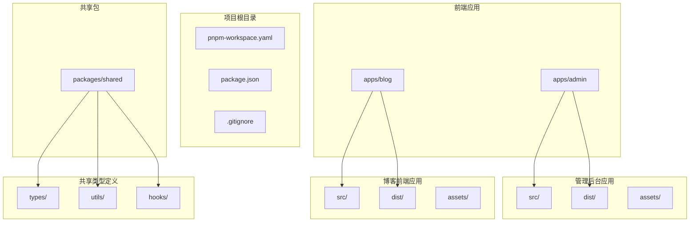
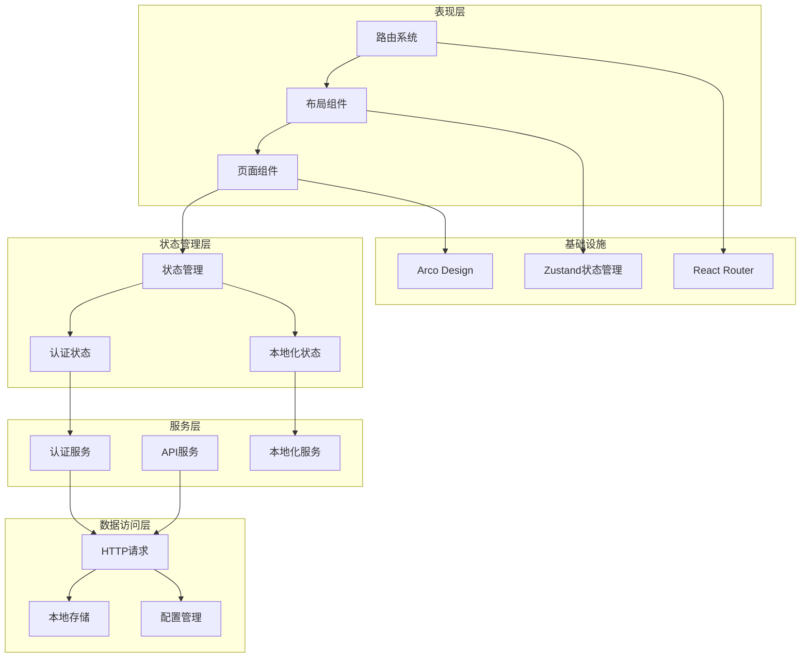
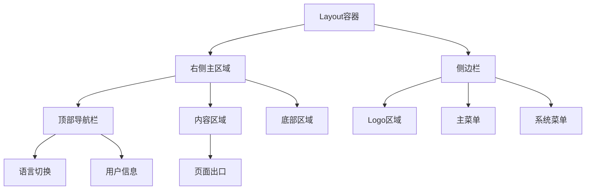
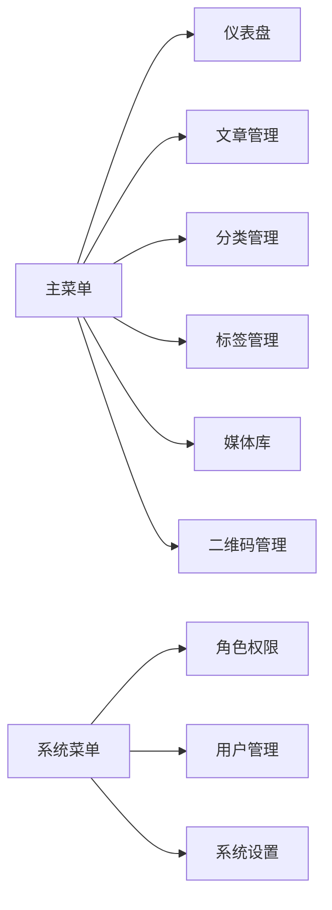
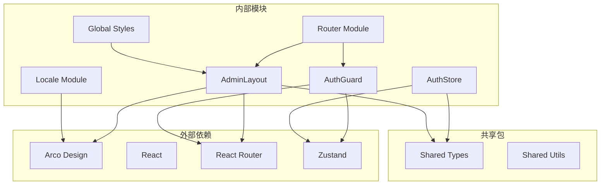

# 布局组件设计

<cite>
**本文档引用的文件**
- [AdminLayout.tsx](file://webSource/apps/admin/src/layouts/AdminLayout.tsx)
- [AuthGuard.tsx](file://webSource/apps/admin/src/components/AuthGuard.tsx)
- [index.tsx](file://webSource/apps/admin/src/router/index.tsx)
- [authStore.ts](file://webSource/apps/admin/src/store/authStore.ts)
- [App.tsx](file://webSource/apps/admin/src/App.tsx)
- [index.tsx](file://webSource/apps/admin/src/locales/index.tsx)
- [global.css](file://webSource/apps/admin/src/styles/global.css)
- [zh-CN.ts](file://webSource/apps/admin/src/locales/zh-CN.ts)
- [en-US.ts](file://webSource/apps/admin/src/locales/en-US.ts)
- [Dashboard.tsx](file://webSource/apps/admin/src/pages/Dashboard.tsx)
- [Login.tsx](file://webSource/apps/admin/src/pages/Login.tsx)
- [categoryTree.ts](file://webSource/apps/admin/src/utils/categoryTree.ts)
- [user.ts](file://webSource/packages/shared/src/types/user.ts)
</cite>

## 目录
1. [简介](#简介)
2. [项目结构](#项目结构)
3. [核心组件](#核心组件)
4. [架构概览](#架构概览)
5. [详细组件分析](#详细组件分析)
6. [依赖分析](#依赖分析)
7. [性能考虑](#性能考虑)
8. [故障排除指南](#故障排除指南)
9. [结论](#结论)
10. [附录](#附录)

## 简介

Xiangmuzs博客平台管理后台采用现代化的React + TypeScript技术栈构建，基于Arco Design组件库实现企业级后台管理系统。本项目专注于提供一个功能完整、用户体验优秀的博客管理平台，支持多语言、权限控制、响应式设计等核心特性。

管理后台采用模块化架构设计，主要分为三个核心应用：管理后台(admin)、博客前端(blog)和共享包(shared)。每个应用都有独立的功能边界和职责分工，通过清晰的接口进行通信协作。

## 项目结构

项目采用多包工作空间结构，通过pnpm进行包管理，实现了代码复用和模块隔离：

**图表来源**
- [package.json](file://webSource/package.json)
- [pnpm-workspace.yaml](file://webSource/pnpm-workspace.yaml)

**章节来源**
- [package.json](file://webSource/package.json)
- [pnpm-workspace.yaml](file://webSource/pnpm-workspace.yaml)

## 核心组件

### AdminLayout布局组件

AdminLayout是整个管理后台的核心布局组件，采用Ant Design的Layout容器模式，提供了完整的页面骨架结构。该组件实现了响应式设计，支持不同屏幕尺寸下的自适应布局。

布局组件的核心特性包括：

- **响应式侧边栏**：支持在大屏幕显示完整菜单，在小屏幕自动折叠
- **国际化支持**：内置中英文双语切换功能
- **权限控制**：通过AuthGuard组件实现路由级别的访问控制
- **主题定制**：基于CSS变量的主题系统，支持颜色和样式的灵活配置

### AuthGuard认证守卫

AuthGuard组件实现了客户端的路由保护机制，确保只有经过身份验证的用户才能访问受保护的页面。该组件具有智能的令牌管理和用户信息获取能力。

**章节来源**
- [AdminLayout.tsx:26-159](file://webSource/apps/admin/src/layouts/AdminLayout.tsx#L26-L159)
- [AuthGuard.tsx:6-38](file://webSource/apps/admin/src/components/AuthGuard.tsx#L6-L38)

## 架构概览

系统采用分层架构设计，从底层到上层依次为：数据访问层、业务逻辑层、服务层、UI组件层和路由管理层。

**图表来源**
- [App.tsx:6-21](file://webSource/apps/admin/src/App.tsx#L6-L21)
- [index.tsx:17-47](file://webSource/apps/admin/src/router/index.tsx#L17-L47)
- [authStore.ts:15-34](file://webSource/apps/admin/src/store/authStore.ts#L15-L34)

## 详细组件分析

### AdminLayout组件深度解析

AdminLayout组件是整个管理后台的骨架，采用了现代化的响应式布局设计。组件结构清晰，职责明确，体现了良好的软件工程实践。

#### 布局结构设计

组件采用四层布局结构，每层都有明确的职责分工：

**图表来源**
- [AdminLayout.tsx:82-157](file://webSource/apps/admin/src/layouts/AdminLayout.tsx#L82-L157)

#### 响应式设计实现

AdminLayout组件实现了完整的响应式设计，支持多种屏幕尺寸：

- **桌面端**：完整显示侧边栏和所有菜单项
- **平板端**：侧边栏可折叠，菜单项显示图标
- **移动端**：侧边栏完全隐藏，通过汉堡菜单访问

响应式断点配置使用了Arco Design的breakpoint属性，实现了优雅的降级体验。

#### 菜单项配置与路由管理

侧边栏菜单采用声明式配置方式，菜单项数组包含了所有可用的导航选项：

**图表来源**
- [AdminLayout.tsx:49-62](file://webSource/apps/admin/src/layouts/AdminLayout.tsx#L49-L62)

#### 激活状态管理机制

菜单的激活状态通过selectedKeys属性实现，自动根据当前路由路径高亮对应菜单项。这种设计确保了用户始终清楚自己的位置。

**章节来源**
- [AdminLayout.tsx:26-159](file://webSource/apps/admin/src/layouts/AdminLayout.tsx#L26-L159)

### 顶部导航栏设计

顶部导航栏提供了用户信息展示、语言切换和系统设置入口等功能。设计简洁现代，符合现代后台管理系统的交互规范。

#### 用户信息展示

导航栏左侧展示了当前登录用户的头像和用户名信息。头像采用首字母缩写的方式，支持自定义颜色主题。

#### 语言切换功能

内置了中英文双语切换功能，通过Dropdown组件实现下拉选择。语言切换不仅改变了界面文字，还同步更新了Arco Design组件库的语言包。

#### 退出登录流程

退出登录功能通过Dropdown菜单实现，点击后会清除本地存储的认证信息并重定向到登录页面。

**章节来源**
- [AdminLayout.tsx:121-148](file://webSource/apps/admin/src/layouts/AdminLayout.tsx#L121-L148)

### 内容区域渲染策略

内容区域采用React Router的Outlet组件实现，支持页面间的平滑过渡和状态保持。

#### 页面切换动画

虽然当前版本没有实现复杂的页面切换动画，但框架已经为未来的动画扩展预留了接口。Outlet组件天然支持React Router的路由切换能力。

#### 滚动状态保持

内容区域设置了overflow: 'auto'样式，确保在长页面滚动时不会影响整体布局。同时，每个页面组件都可以独立管理自己的滚动状态。

**章节来源**
- [AdminLayout.tsx:149-155](file://webSource/apps/admin/src/layouts/AdminLayout.tsx#L149-L155)

### 权限控制系统

系统实现了基于角色的权限控制(RBAC)机制，通过AuthStore管理用户权限信息。

#### 认证状态管理

AuthStore使用Zustand实现轻量级状态管理，包含了用户信息、权限列表和认证令牌的完整生命周期管理。

#### 权限检查机制

系统提供了hasPermission方法用于检查用户是否具有特定模块的操作权限，支持细粒度的权限控制。

**章节来源**
- [authStore.ts:15-34](file://webSource/apps/admin/src/store/authStore.ts#L15-L34)

### 国际化系统

系统实现了完整的国际化(i18n)支持，包括中英文双语切换和Arco Design组件库的本地化。

#### 本地化配置

国际化系统基于Context模式实现，支持运行时语言切换和持久化存储。字典文件分别维护了中英文的翻译键值对。

#### Arco Design集成

系统集成了Arco Design的多语言组件库，确保界面组件的语言一致性。

**章节来源**
- [index.tsx:22-52](file://webSource/apps/admin/src/locales/index.tsx#L22-L52)

## 依赖分析

系统依赖关系清晰，各模块之间耦合度低，便于维护和扩展。

**图表来源**
- [package.json](file://webSource/apps/admin/package.json)
- [authStore.ts:1-56](file://webSource/apps/admin/src/store/authStore.ts#L1-L56)

### 组件耦合度分析

系统采用了松耦合的设计原则，主要体现在：

- **布局与内容分离**：AdminLayout只负责布局，具体页面逻辑由子组件实现
- **状态管理独立**：AuthStore提供独立的状态管理，不依赖具体UI组件
- **路由保护机制**：AuthGuard可以应用于任何需要保护的路由
- **国际化解耦**：LocaleProvider可以独立于具体页面组件使用

**章节来源**
- [index.tsx:17-47](file://webSource/apps/admin/src/router/index.tsx#L17-L47)
- [authStore.ts:15-34](file://webSource/apps/admin/src/store/authStore.ts#L15-L34)

## 性能考虑

系统在设计时充分考虑了性能优化，采用了多种策略提升用户体验：

### 状态管理优化

- 使用Zustand替代Redux，减少不必要的状态更新
- 实现了按需加载的权限数据获取机制
- 本地存储令牌，避免重复认证过程

### 资源加载优化

- CSS变量预定义，减少样式计算开销
- 图片资源懒加载，提升首屏加载速度
- 组件按需导入，减少bundle体积

### 渲染性能优化

- 使用React.memo优化重复渲染
- 合理的key值设置，提升列表渲染效率
- 防抖处理用户输入事件

## 故障排除指南

### 常见问题及解决方案

#### 认证失败问题

当用户遇到认证失败时，系统会自动清除本地存储的令牌并重定向到登录页面。建议检查：

1. 网络连接是否正常
2. 服务器是否正常运行
3. 用户名密码是否正确
4. 令牌是否过期

#### 菜单显示异常

如果侧边栏菜单显示异常，可能的原因包括：

1. 路由配置错误
2. 权限数据获取失败
3. CSS样式冲突
4. 浏览器缓存问题

#### 国际化切换失效

语言切换功能失效时，检查以下几点：

1. 本地存储中的语言设置
2. 字典文件是否正确加载
3. Arco Design语言包是否正确配置
4. 浏览器语言偏好设置

**章节来源**
- [AuthGuard.tsx:11-22](file://webSource/apps/admin/src/components/AuthGuard.tsx#L11-L22)
- [authStore.ts:25-28](file://webSource/apps/admin/src/store/authStore.ts#L25-L28)

## 结论

Xiangmuzs博客平台管理后台的布局组件设计体现了现代前端开发的最佳实践。通过合理的架构设计、清晰的组件职责划分和完善的权限控制机制，构建了一个功能完整、易于维护的后台管理系统。

系统的主要优势包括：

- **模块化设计**：清晰的模块边界和职责分工
- **响应式布局**：适配多种设备和屏幕尺寸
- **国际化支持**：完整的多语言解决方案
- **权限控制**：细粒度的RBAC权限管理
- **性能优化**：合理的性能考虑和优化策略

未来可以进一步增强的功能包括：页面切换动画效果、更丰富的主题定制选项、移动端手势支持等。

## 附录

### 主题定制方案

系统提供了完整的主题定制能力，通过CSS变量实现灵活的颜色和样式配置：

#### 主题变量定义

系统预定义了完整的CSS变量体系，包括主色调、渐变色、阴影效果、圆角半径等：

- `--admin-primary`: 主色调变量
- `--admin-gradient-*`: 渐变色变量
- `--admin-shadow-*`: 阴影效果变量
- `--admin-radius`: 圆角半径变量

#### 布局模式调整

系统支持多种布局模式的切换，包括：

- **侧边栏布局**：默认的三栏布局
- **顶部导航布局**：适合移动端的顶部导航
- **混合布局**：结合两种布局的优势

### 移动端适配

系统实现了完整的移动端适配方案：

#### 响应式断点

- **lg**: 1024px及以上，完整侧边栏
- **md**: 768px-1023px，折叠侧边栏
- **sm**: 480px-767px，移动端优化
- **xs**: 480px以下，完全移动化

#### 移动端交互优化

- 触摸友好的按钮尺寸
- 放大镜手势支持
- 下拉菜单的手势操作
- 自适应字体大小

**章节来源**
- [global.css:1-15](file://webSource/apps/admin/src/styles/global.css#L1-L15)
- [AdminLayout.tsx:87-88](file://webSource/apps/admin/src/layouts/AdminLayout.tsx#L87-L88)