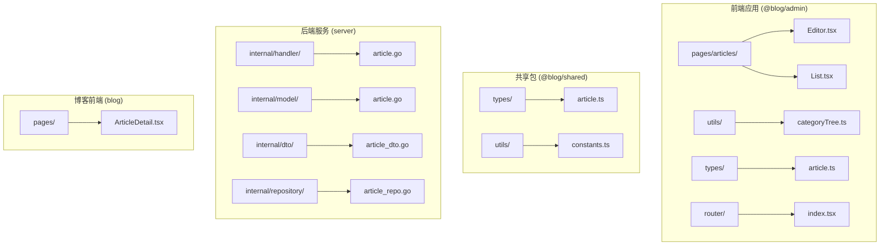
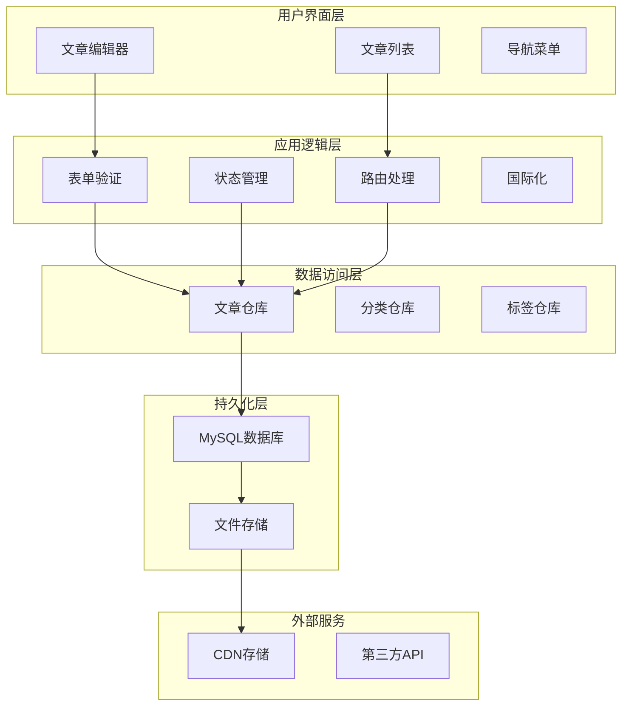
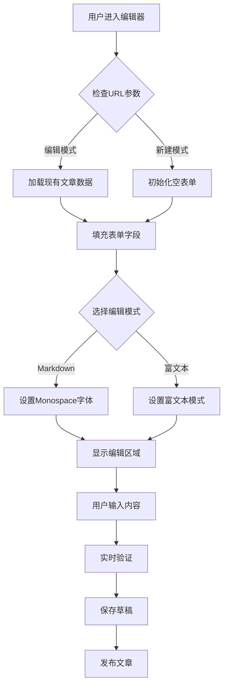
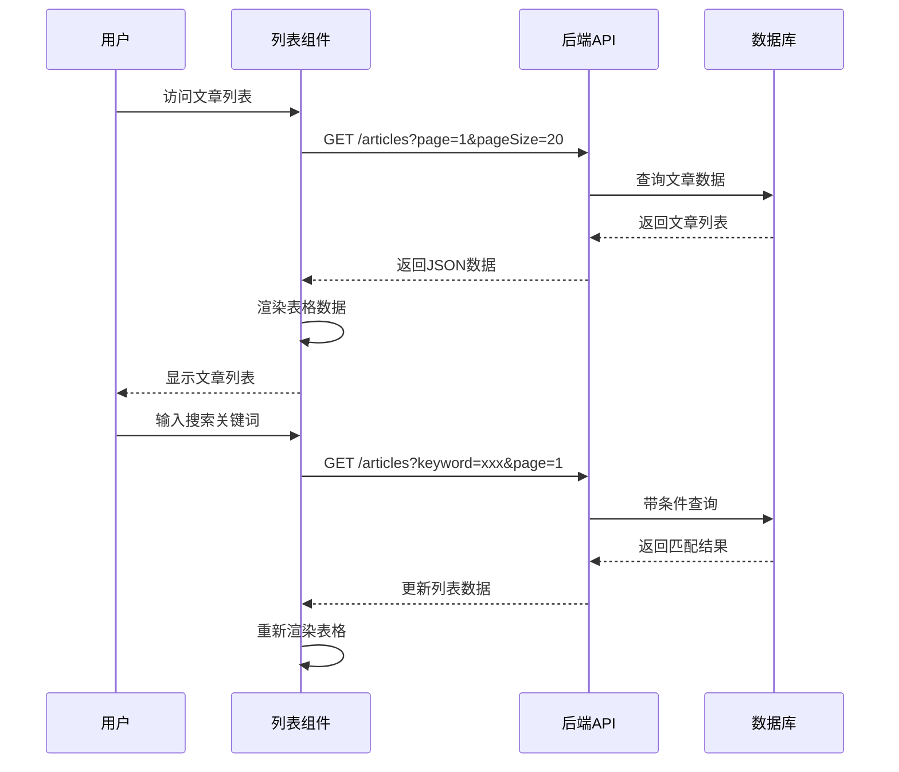
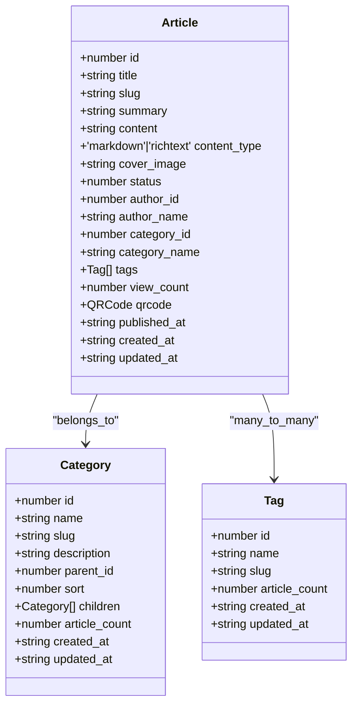
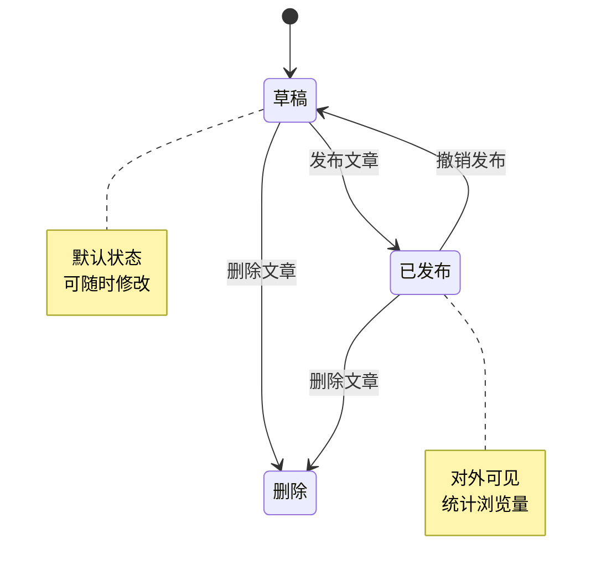
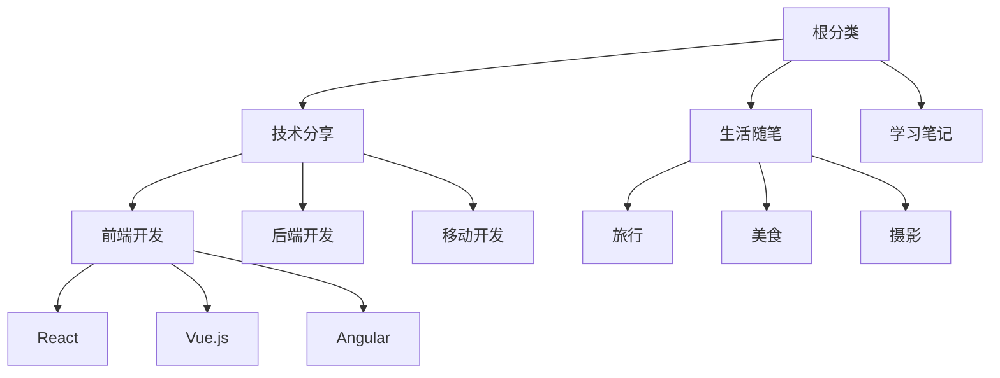
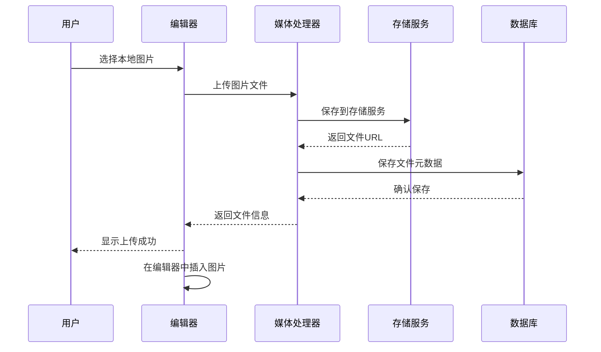
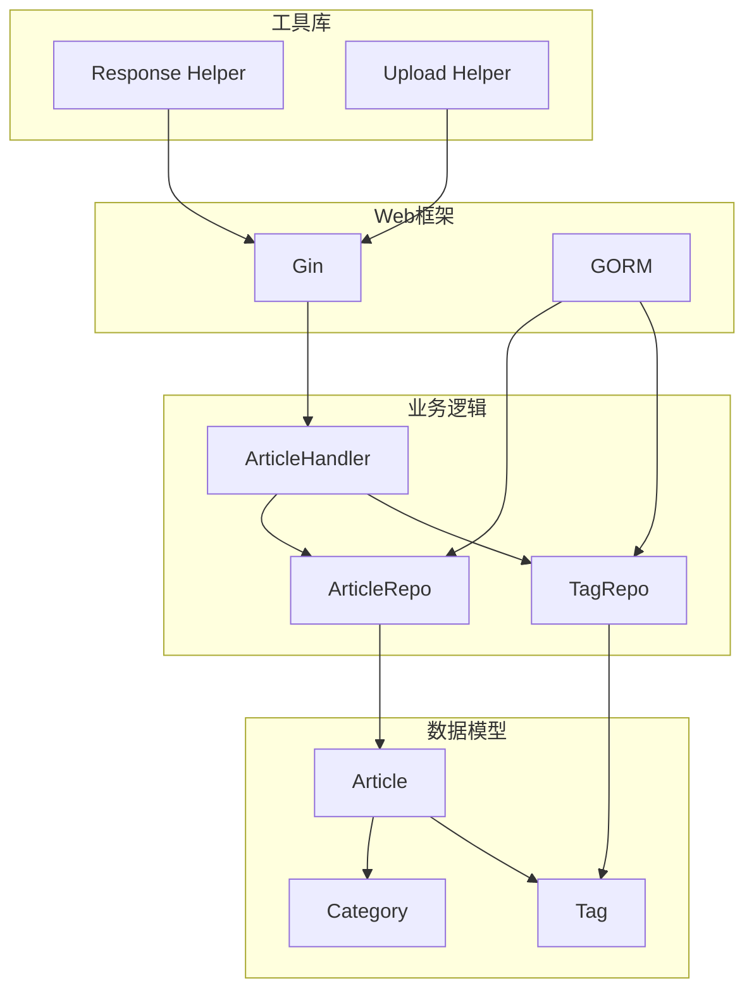
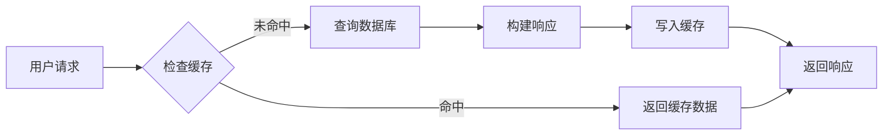

# 文章管理模块

<cite>
**本文档引用的文件**
- [Editor.tsx](file://webSource/apps/admin/src/pages/articles/Editor.tsx)
- [List.tsx](file://webSource/apps/admin/src/pages/articles/List.tsx)
- [article.go](file://server/internal/model/article.go)
- [article_dto.go](file://server/internal/dto/article_dto.go)
- [article.go](file://server/internal/handler/article.go)
- [article_repo.go](file://server/internal/repository/article_repo.go)
- [article.ts](file://webSource/packages/shared/src/types/article.ts)
- [constants.ts](file://webSource/packages/shared/src/utils/constants.ts)
- [categoryTree.ts](file://webSource/apps/admin/src/utils/categoryTree.ts)
- [media.go](file://server/internal/handler/media.go)
- [index.tsx](file://webSource/apps/admin/src/router/index.tsx)
- [package.json](file://webSource/apps/admin/package.json)
</cite>

## 目录
1. [简介](#简介)
2. [项目结构](#项目结构)
3. [核心组件](#核心组件)
4. [架构概览](#架构概览)
5. [详细组件分析](#详细组件分析)
6. [依赖关系分析](#依赖关系分析)
7. [性能考虑](#性能考虑)
8. [故障排除指南](#故障排除指南)
9. [结论](#结论)

## 简介

Xiangmuzs博客平台管理后台的文章管理模块是一个完整的博客内容管理系统，提供了从文章创建、编辑到发布的全生命周期管理功能。该模块采用前后端分离架构，前端使用React + TypeScript构建，后端使用Go语言开发，通过RESTful API进行通信。

模块主要功能包括：
- 富文本编辑器支持（Markdown和富文本两种模式）
- 实时预览功能
- 图片上传和媒体管理
- 文章列表展示和搜索过滤
- 分类和标签管理
- 文章状态管理和审核流程
- 性能优化的表格渲染

## 项目结构

文章管理模块在项目中的组织结构如下：



**图表来源**
- [Editor.tsx:1-149](file://webSource/apps/admin/src/pages/articles/Editor.tsx#L1-L149)
- [List.tsx:1-246](file://webSource/apps/admin/src/pages/articles/List.tsx#L1-L246)
- [article.go:1-24](file://server/internal/model/article.go#L1-L24)

**章节来源**
- [Editor.tsx:1-149](file://webSource/apps/admin/src/pages/articles/Editor.tsx#L1-L149)
- [List.tsx:1-246](file://webSource/apps/admin/src/pages/articles/List.tsx#L1-L246)
- [article.go:1-24](file://server/internal/model/article.go#L1-L24)

## 核心组件

### 前端核心组件

1. **文章编辑器组件** (`Editor.tsx`)
   - 支持Markdown和富文本两种编辑模式
   - 实时表单验证和状态管理
   - 分类树形选择和标签多选
   - 动态内容类型切换

2. **文章列表组件** (`List.tsx`)
   - 分页表格展示
   - 搜索和筛选功能
   - 批量操作支持
   - 实时状态更新

3. **路由配置** (`index.tsx`)
   - 定义文章管理相关路由
   - 路由守卫和权限控制

### 后端核心组件

1. **文章模型** (`article.go`)
   - 定义数据库表结构
   - 关系映射和索引设计

2. **文章处理器** (`article.go`)
   - 提供RESTful API接口
   - 业务逻辑处理和数据验证

3. **文章仓库** (`article_repo.go`)
   - 数据访问层实现
   - 复杂查询和关联数据处理

**章节来源**
- [Editor.tsx:14-149](file://webSource/apps/admin/src/pages/articles/Editor.tsx#L14-L149)
- [List.tsx:26-246](file://webSource/apps/admin/src/pages/articles/List.tsx#L26-L246)
- [article.go:5-24](file://server/internal/model/article.go#L5-L24)

## 架构概览

文章管理模块采用经典的MVC架构模式，结合现代前端框架的最佳实践：



**图表来源**
- [Editor.tsx:1-149](file://webSource/apps/admin/src/pages/articles/Editor.tsx#L1-L149)
- [List.tsx:1-246](file://webSource/apps/admin/src/pages/articles/List.tsx#L1-L246)
- [article.go:1-325](file://server/internal/handler/article.go#L1-L325)

## 详细组件分析

### 文章编辑器组件

文章编辑器是整个模块的核心组件，提供了完整的文章创作体验。

#### 编辑器功能特性



**图表来源**
- [Editor.tsx:25-70](file://webSource/apps/admin/src/pages/articles/Editor.tsx#L25-L70)

#### 表单字段设计

编辑器包含以下关键字段：

| 字段名 | 类型 | 必填 | 描述 |
|--------|------|------|------|
| title | String | 是 | 文章标题，最大200字符 |
| slug | String | 否 | SEO友好的URL标识符 |
| summary | String | 否 | 文章摘要，最大500字符 |
| content | String | 是 | 文章内容，支持Markdown或富文本 |
| category_id | Number | 否 | 所属分类ID |
| tag_ids | Array | 否 | 标签ID数组 |
| cover_image | String | 否 | 封面图片URL |

#### 内容类型支持

编辑器支持两种内容类型：

1. **Markdown模式**
   - 使用等宽字体显示
   - 适合技术性内容创作
   - 支持代码高亮和表格

2. **富文本模式**
   - WYSIWYG编辑器
   - 直观的可视化编辑体验
   - 支持图片插入和格式化

**章节来源**
- [Editor.tsx:72-149](file://webSource/apps/admin/src/pages/articles/Editor.tsx#L72-L149)

### 文章列表组件

文章列表提供了高效的内容管理界面。

#### 列表功能特性



**图表来源**
- [List.tsx:39-55](file://webSource/apps/admin/src/pages/articles/List.tsx#L39-L55)

#### 表格列设计

| 列名 | 宽度 | 功能描述 |
|------|------|----------|
| ID | 60px | 文章唯一标识符 |
| 标题 | 250px | 文章标题显示 |
| 状态 | 80px | 草稿/已发布状态标签 |
| 分类 | 100px | 所属分类名称 |
| 浏览量 | 80px | 文章浏览统计 |
| 二维码 | 120px | 二维码生成和状态显示 |
| 发布时间 | 160px | 文章发布时间 |
| 操作 | 220px | 编辑、发布/撤销、删除等操作 |

#### 搜索和筛选功能

- **关键词搜索**：支持按标题和摘要模糊搜索
- **状态筛选**：可筛选草稿和已发布文章
- **实时更新**：输入即搜索，无需手动提交

**章节来源**
- [List.tsx:97-170](file://webSource/apps/admin/src/pages/articles/List.tsx#L97-L170)

### 数据模型设计

#### 后端数据模型

```mermaid
erDiagram
ARTICLES {
uint id PK
string title
string slug UK
string summary
longtext content
string content_type
string cover_image
int status
uint author_id
uint category_id
int view_count
datetime published_at
datetime created_at
datetime updated_at
}
USERS {
uint id PK
string username UK
string email UK
string password
int status
datetime created_at
datetime updated_at
}
CATEGORIES {
uint id PK
string name
string slug
uint parent_id
int sort
datetime created_at
datetime updated_at
}
TAGS {
uint id PK
string name
string slug
datetime created_at
datetime updated_at
}
ARTICLES }o--|| USERS : "belongs_to"
ARTICLES }o--|| CATEGORIES : "belongs_to"
ARTICLES }o{--o{ TAGS : "has_many"
```

**图表来源**
- [article.go:5-24](file://server/internal/model/article.go#L5-L24)

#### 前端数据类型

前端使用TypeScript接口定义数据结构：



**图表来源**
- [article.ts:1-74](file://webSource/packages/shared/src/types/article.ts#L1-L74)

**章节来源**
- [article.go:5-24](file://server/internal/model/article.go#L5-L24)
- [article.ts:1-74](file://webSource/packages/shared/src/types/article.ts#L1-L74)

### API接口设计

#### 后端API端点

| 方法 | 路径 | 功能 | 请求体 | 响应 |
|------|------|------|--------|------|
| GET | `/articles` | 获取文章列表 | 查询参数 | 分页结果 |
| GET | `/articles/:id` | 获取文章详情 | - | 文章对象 |
| POST | `/articles` | 创建文章 | ArticleRequest | 新建文章 |
| PUT | `/articles/:id` | 更新文章 | ArticleRequest | 更新后的文章 |
| DELETE | `/articles/:id` | 删除文章 | - | 空 |
| PUT | `/articles/:id/status` | 更新文章状态 | ArticleStatusRequest | 状态更新后的文章 |

#### 请求和响应数据结构

**文章请求对象** (`ArticleRequest`):
- `title`: string (必填)
- `slug`: string (可选)
- `summary`: string (可选)
- `content`: string (必填)
- `content_type`: string (可选，默认'markdown')
- `cover_image`: string (可选)
- `category_id`: number (可选)
- `tag_ids`: number[] (可选)

**文章状态请求对象** (`ArticleStatusRequest`):
- `status`: number (0=草稿, 1=已发布)

**章节来源**
- [article_dto.go:3-16](file://server/internal/dto/article_dto.go#L3-L16)
- [article.go:31-75](file://server/internal/handler/article.go#L31-L75)

### 状态管理

#### 文章状态流转



#### 状态常量定义

状态管理使用统一的常量定义：

| 常量名 | 数值 | 描述 |
|--------|------|------|
| `ARTICLE_STATUS.DRAFT` | 0 | 草稿状态 |
| `ARTICLE_STATUS.PUBLISHED` | 1 | 已发布状态 |

**章节来源**
- [constants.ts:3-6](file://webSource/packages/shared/src/utils/constants.ts#L3-L6)
- [article.go:179-202](file://server/internal/handler/article.go#L179-L202)

### 分类和标签管理

#### 分类树形结构

系统支持多级分类结构，使用树形数据结构进行管理：



**图表来源**
- [categoryTree.ts:7-31](file://webSource/apps/admin/src/utils/categoryTree.ts#L7-L31)

#### 标签管理

标签采用多对多关系，支持灵活的内容分类：

- **标签选择**：支持多选框选择多个标签
- **自动完成**：输入时提供标签建议
- **实时更新**：选择变化时立即更新文章标签

**章节来源**
- [categoryTree.ts:1-52](file://webSource/apps/admin/src/utils/categoryTree.ts#L1-L52)
- [article.go:18-18](file://server/internal/model/article.go#L18-L18)

### 图片上传功能

#### 上传流程



**图表来源**
- [media.go:24-52](file://server/internal/handler/media.go#L24-L52)

#### 上传限制

- **文件大小**：根据服务器配置限制
- **文件类型**：仅允许图片格式
- **存储位置**：服务器本地存储或CDN
- **元数据**：保存文件名、大小、MIME类型

**章节来源**
- [media.go:24-52](file://server/internal/handler/media.go#L24-L52)

## 依赖关系分析

### 前端依赖关系

```mermaid
graph TB
subgraph "UI组件库"
A[@arco-design/web-react]
B[React Router DOM]
C[QRCode React]
end
subgraph "状态管理"
D[Zustand]
end
subgraph "共享模块"
E[@blog/shared]
F[article.ts]
G[constants.ts]
end
subgraph "工具函数"
H[categoryTree.ts]
end
A --> E
B --> E
C --> E
D --> E
E --> F
E --> G
H --> E
```

**图表来源**
- [package.json:12-20](file://webSource/apps/admin/package.json#L12-L20)
- [Editor.tsx:1-10](file://webSource/apps/admin/src/pages/articles/Editor.tsx#L1-L10)

### 后端依赖关系



**图表来源**
- [article.go:3-29](file://server/internal/handler/article.go#L3-L29)
- [article_repo.go:8-14](file://server/internal/repository/article_repo.go#L8-L14)

**章节来源**
- [package.json:12-20](file://webSource/apps/admin/package.json#L12-L20)
- [article.go:3-29](file://server/internal/handler/article.go#L3-L29)

## 性能考虑

### 前端性能优化

#### 表格渲染优化

1. **虚拟滚动**：对于大量数据的场景，可以考虑实现虚拟滚动以提升渲染性能
2. **列宽固定**：使用固定列宽避免重排计算
3. **懒加载**：图片和复杂组件采用懒加载策略

#### 状态管理优化

1. **局部状态**：只在需要的地方维护状态
2. **状态缓存**：对分类和标签数据进行缓存
3. **防抖处理**：搜索和筛选操作添加防抖机制

### 后端性能优化

#### 数据库优化

1. **索引设计**：为常用查询字段建立索引
   - `status` 和 `published_at` 的复合索引
   - `slug` 唯一索引
   - `category_id` 索引

2. **查询优化**：使用预加载避免N+1查询问题

#### API性能优化

1. **分页查询**：默认每页20条记录，支持大数量数据处理
2. **条件查询**：支持多条件组合查询
3. **缓存策略**：热门文章数据可以考虑缓存

### 缓存策略



## 故障排除指南

### 常见问题及解决方案

#### 编辑器问题

**问题**：编辑器无法切换内容类型
- **原因**：状态管理问题或依赖注入错误
- **解决方案**：检查`contentType`状态和`setContentType`函数绑定

**问题**：表单验证不生效
- **原因**：表单规则配置错误或国际化资源缺失
- **解决方案**：检查`Form.Item`的`rules`属性和翻译文件

#### 列表问题

**问题**：搜索功能不工作
- **原因**：API参数传递错误或后端查询逻辑问题
- **解决方案**：检查`fetchArticles`函数的参数构建和后端查询条件

**问题**：分页显示异常
- **原因**：分页参数传递或后端分页逻辑错误
- **解决方案**：验证`page`和`pageSize`参数以及后端分页查询

#### 数据模型问题

**问题**：关联数据加载失败
- **原因**：GORM预加载配置错误或数据库关系定义问题
- **解决方案**：检查`Preload`调用和模型关系注解

**章节来源**
- [Editor.tsx:51-70](file://webSource/apps/admin/src/pages/articles/Editor.tsx#L51-L70)
- [List.tsx:39-55](file://webSource/apps/admin/src/pages/articles/List.tsx#L39-L55)
- [article_repo.go:24-35](file://server/internal/repository/article_repo.go#L24-L35)

### 错误处理机制

系统实现了完善的错误处理机制：

1. **前端错误处理**：使用Message组件显示错误信息
2. **后端错误处理**：统一的错误响应格式
3. **网络错误处理**：API调用失败时的降级处理
4. **表单验证错误**：实时显示验证错误信息

## 结论

Xiangmuzs博客平台管理后台的文章管理模块是一个功能完整、架构清晰的内容管理系统。模块采用了现代化的技术栈和最佳实践，提供了良好的用户体验和高效的管理功能。

### 主要优势

1. **功能完整性**：涵盖了文章管理的所有核心功能
2. **用户体验**：直观的界面设计和流畅的操作体验
3. **技术先进性**：使用React + TypeScript + Go等现代技术栈
4. **可扩展性**：模块化设计便于功能扩展和维护

### 改进建议

1. **富文本编辑器增强**：集成专业的富文本编辑器如Quill或Draft.js
2. **实时协作**：添加多人协作编辑功能
3. **版本管理**：实现文章版本控制和历史回滚
4. **性能监控**：添加性能指标监控和分析
5. **SEO优化**：增强搜索引擎优化功能

该模块为博客平台提供了坚实的内容管理基础，能够满足大多数博客运营的需求，并为未来的功能扩展奠定了良好的技术基础。