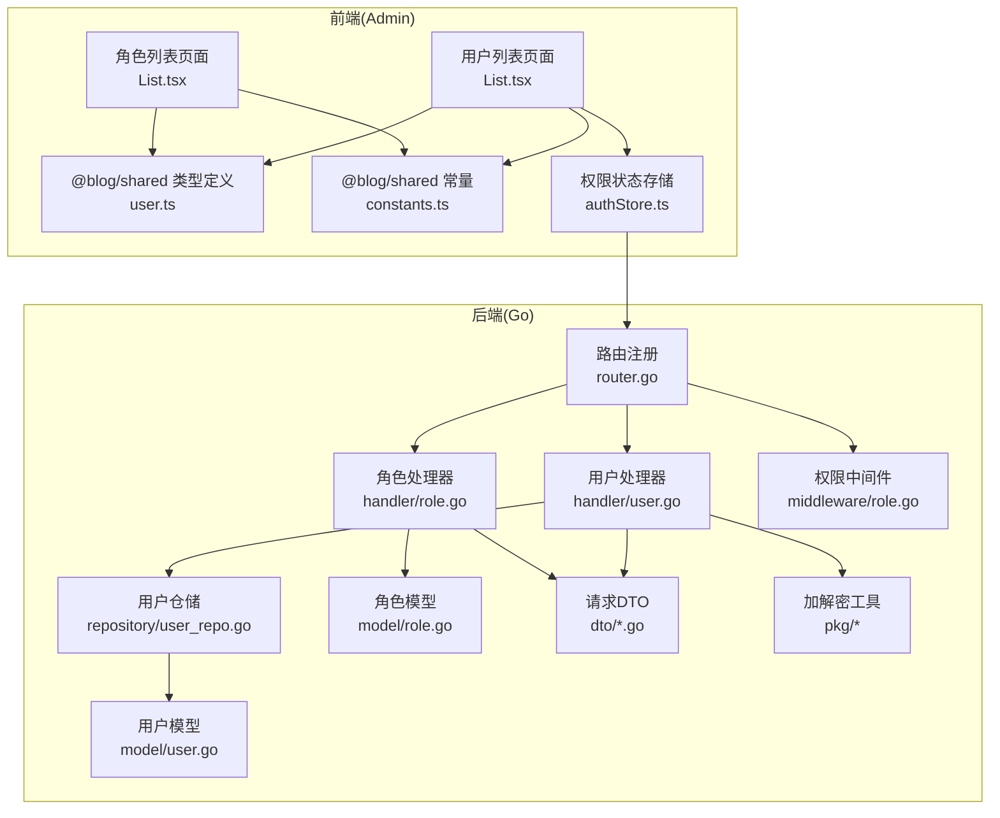
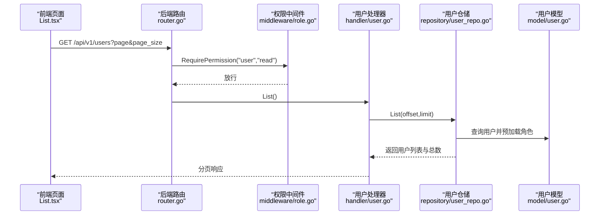
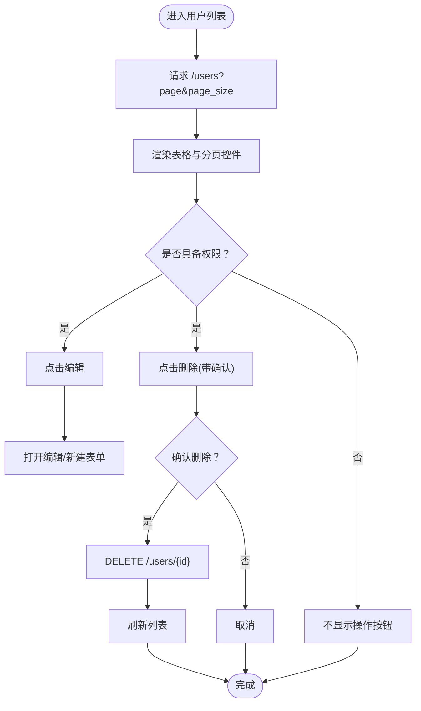
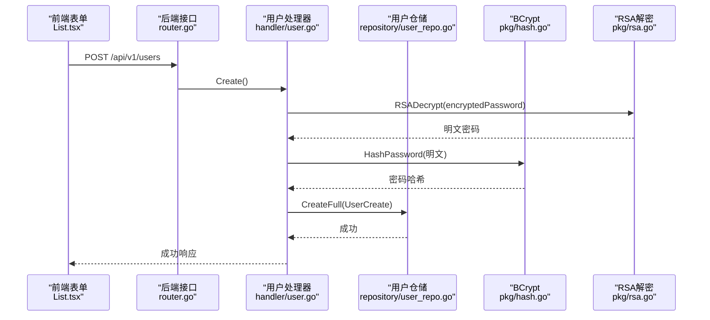
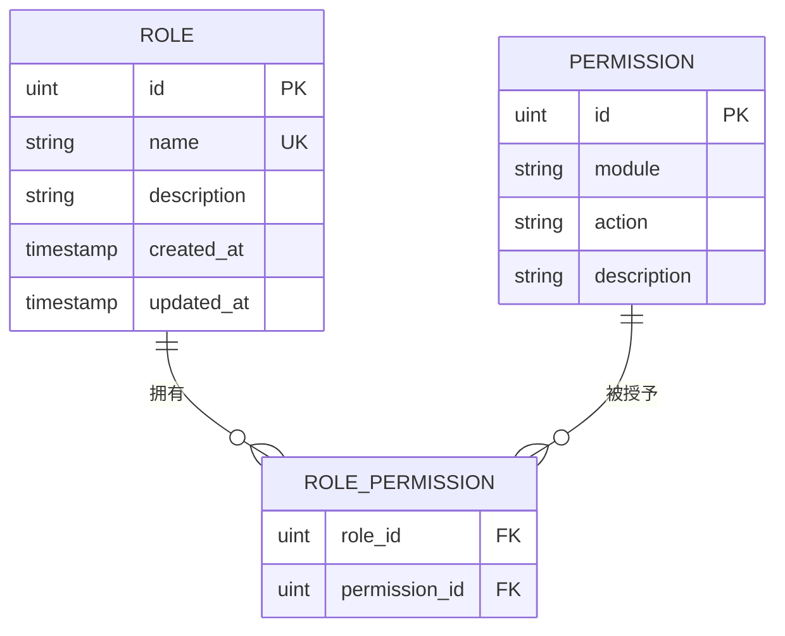
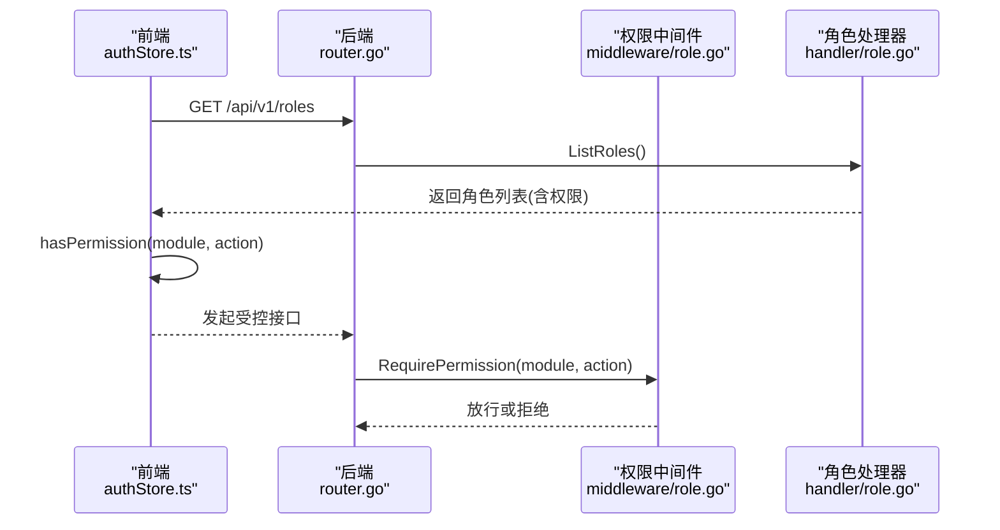
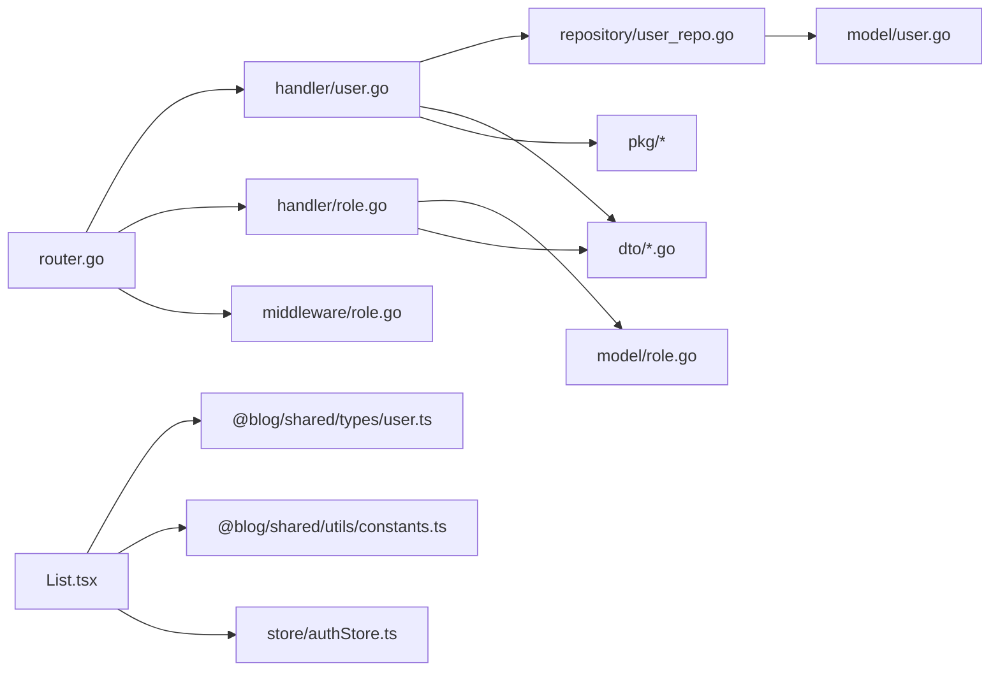

# 用户与角色管理

<cite>
**本文引用的文件**
- [server/internal/handler/user.go](file://server/internal/handler/user.go)
- [server/internal/handler/role.go](file://server/internal/handler/role.go)
- [server/internal/model/user.go](file://server/internal/model/user.go)
- [server/internal/model/role.go](file://server/internal/model/role.go)
- [server/internal/repository/user_repo.go](file://server/internal/repository/user_repo.go)
- [server/internal/middleware/role.go](file://server/internal/middleware/role.go)
- [server/router/router.go](file://server/router/router.go)
- [server/internal/dto/common.go](file://server/internal/dto/common.go)
- [server/internal/dto/auth_dto.go](file://server/internal/dto/auth_dto.go)
- [server/internal/pkg/hash.go](file://server/internal/pkg/hash.go)
- [server/internal/pkg/rsa.go](file://server/internal/pkg/rsa.go)
- [webSource/apps/admin/src/pages/users/List.tsx](file://webSource/apps/admin/src/pages/users/List.tsx)
- [webSource/apps/admin/src/pages/roles/List.tsx](file://webSource/apps/admin/src/pages/roles/List.tsx)
- [webSource/packages/shared/src/types/user.ts](file://webSource/packages/shared/src/types/user.ts)
- [webSource/packages/shared/src/utils/constants.ts](file://webSource/packages/shared/src/utils/constants.ts)
- [webSource/apps/admin/src/store/authStore.ts](file://webSource/apps/admin/src/store/authStore.ts)
</cite>

## 目录
1. [简介](#简介)
2. [项目结构](#项目结构)
3. [核心组件](#核心组件)
4. [架构总览](#架构总览)
5. [详细组件分析](#详细组件分析)
6. [依赖分析](#依赖分析)
7. [性能考虑](#性能考虑)
8. [故障排查指南](#故障排查指南)
9. [结论](#结论)
10. [附录](#附录)

## 简介
本文件面向Xiangmuzs博客平台管理后台的“用户与角色管理”模块，系统性梳理后端接口与前端页面的实现，覆盖以下主题：
- 用户列表页面：信息展示、状态管理、操作按钮与分页加载
- 用户创建/编辑表单：字段校验、密码加密传输、角色与状态选择
- 角色管理：角色定义、权限分配、权限矩阵与删除约束
- 权限体系：基于模块+动作的权限控制与中间件拦截
- 用户状态控制：启用/禁用、重置密码（通过认证模块）、账户锁定策略建议
- 导入导出与批量操作：当前仓库未实现，提供可扩展设计建议
- 行为监控：登录日志、操作记录与异常检测的实现思路

## 项目结构
后端采用Gin + GORM分层架构，前端使用React + Arco Design，权限通过中间件在路由层统一拦截。

图表来源
- [server/router/router.go:11-104](file://server/router/router.go#L11-L104)
- [server/internal/handler/user.go:13-146](file://server/internal/handler/user.go#L13-L146)
- [server/internal/handler/role.go:14-111](file://server/internal/handler/role.go#L14-L111)
- [server/internal/repository/user_repo.go:8-66](file://server/internal/repository/user_repo.go#L8-L66)
- [server/internal/model/user.go:5-16](file://server/internal/model/user.go#L5-L16)
- [server/internal/model/role.go:5-19](file://server/internal/model/role.go#L5-L19)
- [server/internal/middleware/role.go:10-43](file://server/internal/middleware/role.go#L10-L43)
- [server/internal/dto/auth_dto.go:26-39](file://server/internal/dto/auth_dto.go#L26-L39)
- [server/internal/pkg/rsa.go:18-54](file://server/internal/pkg/rsa.go#L18-L54)
- [webSource/apps/admin/src/pages/users/List.tsx:39-247](file://webSource/apps/admin/src/pages/users/List.tsx#L39-L247)
- [webSource/apps/admin/src/pages/roles/List.tsx:23-179](file://webSource/apps/admin/src/pages/roles/List.tsx#L23-L179)
- [webSource/packages/shared/src/types/user.ts:1-43](file://webSource/packages/shared/src/types/user.ts#L1-L43)
- [webSource/packages/shared/src/utils/constants.ts:20-37](file://webSource/packages/shared/src/utils/constants.ts#L20-L37)
- [webSource/apps/admin/src/store/authStore.ts:15-56](file://webSource/apps/admin/src/store/authStore.ts#L15-L56)

章节来源
- [server/router/router.go:11-104](file://server/router/router.go#L11-L104)
- [webSource/apps/admin/src/pages/users/List.tsx:39-247](file://webSource/apps/admin/src/pages/users/List.tsx#L39-L247)
- [webSource/apps/admin/src/pages/roles/List.tsx:23-179](file://webSource/apps/admin/src/pages/roles/List.tsx#L23-L179)

## 核心组件
- 用户处理器：负责用户列表、创建、更新、删除等HTTP接口
- 角色处理器：负责角色列表、创建、更新、删除与权限查询
- 用户仓储：封装数据库访问，提供分页查询、创建、更新、删除
- 模型层：用户与角色的数据结构及多对多权限关联
- 权限中间件：按模块+动作进行权限拦截
- 路由层：统一注册REST接口并挂载权限中间件
- 前端页面：用户列表与角色列表的CRUD交互
- 加密工具：RSA公钥下发与私钥解密、BCrypt密码哈希

章节来源
- [server/internal/handler/user.go:13-146](file://server/internal/handler/user.go#L13-L146)
- [server/internal/handler/role.go:14-111](file://server/internal/handler/role.go#L14-L111)
- [server/internal/repository/user_repo.go:8-66](file://server/internal/repository/user_repo.go#L8-L66)
- [server/internal/model/user.go:5-16](file://server/internal/model/user.go#L5-L16)
- [server/internal/model/role.go:5-19](file://server/internal/model/role.go#L5-L19)
- [server/internal/middleware/role.go:10-43](file://server/internal/middleware/role.go#L10-L43)
- [server/router/router.go:11-104](file://server/router/router.go#L11-L104)
- [server/internal/pkg/hash.go:5-13](file://server/internal/pkg/hash.go#L5-L13)
- [server/internal/pkg/rsa.go:18-54](file://server/internal/pkg/rsa.go#L18-L54)

## 架构总览
后端通过路由层将REST接口与权限中间件绑定，用户与角色的CRUD均受“模块+动作”权限控制；前端通过请求库调用接口，使用Zustand状态管理维护用户与权限，UI根据权限动态渲染操作按钮。

图表来源
- [server/router/router.go:94-97](file://server/router/router.go#L94-L97)
- [server/internal/middleware/role.go:11-35](file://server/internal/middleware/role.go#L11-L35)
- [server/internal/handler/user.go:25-39](file://server/internal/handler/user.go#L25-L39)
- [server/internal/repository/user_repo.go:59-65](file://server/internal/repository/user_repo.go#L59-L65)
- [server/internal/model/user.go:5-16](file://server/internal/model/user.go#L5-L16)

## 详细组件分析

### 用户列表页面实现
- 数据加载：前端分页请求后端，后端返回用户列表与总数，前端渲染表格
- 字段展示：ID、用户名、邮箱、角色名称、状态标签、创建时间
- 状态管理：状态以数字表示，前端映射为绿色“启用”或红色“禁用”标签
- 操作按钮：根据权限动态显示“编辑”“删除”，删除前确认
- 批量管理：当前仓库未提供批量勾选与批量操作接口，仅支持单条删除

图表来源
- [webSource/apps/admin/src/pages/users/List.tsx:51-100](file://webSource/apps/admin/src/pages/users/List.tsx#L51-L100)
- [webSource/apps/admin/src/pages/users/List.tsx:133-168](file://webSource/apps/admin/src/pages/users/List.tsx#L133-L168)
- [server/router/router.go:94-97](file://server/router/router.go#L94-L97)

章节来源
- [webSource/apps/admin/src/pages/users/List.tsx:39-247](file://webSource/apps/admin/src/pages/users/List.tsx#L39-L247)
- [server/internal/handler/user.go:25-39](file://server/internal/handler/user.go#L25-L39)
- [server/internal/repository/user_repo.go:59-65](file://server/internal/repository/user_repo.go#L59-L65)

### 用户创建与编辑表单
- 字段与校验：
  - 新建时必填用户名、邮箱、密码、角色
  - 编辑时可修改邮箱、角色、状态；若填写密码则进行重置
- 密码安全：
  - 前端使用RSA公钥加密密码，后端使用RSA私钥解密，再用BCrypt哈希存储
  - 登录流程同样使用RSA加密密码
- 提交流程：
  - 新建：POST /users，携带用户名、邮箱、加密密码、角色ID
  - 更新：PUT /users/{id}，可选携带新密码、邮箱、角色ID、状态

图表来源
- [webSource/apps/admin/src/pages/users/List.tsx:102-131](file://webSource/apps/admin/src/pages/users/List.tsx#L102-L131)
- [server/router/router.go:95-96](file://server/router/router.go#L95-L96)
- [server/internal/handler/user.go:41-75](file://server/internal/handler/user.go#L41-L75)
- [server/internal/pkg/hash.go:5-13](file://server/internal/pkg/hash.go#L5-L13)
- [server/internal/pkg/rsa.go:43-53](file://server/internal/pkg/rsa.go#L43-L53)

章节来源
- [webSource/apps/admin/src/pages/users/List.tsx:205-242](file://webSource/apps/admin/src/pages/users/List.tsx#L205-L242)
- [server/internal/dto/auth_dto.go:26-39](file://server/internal/dto/auth_dto.go#L26-L39)
- [server/internal/handler/user.go:41-125](file://server/internal/handler/user.go#L41-L125)
- [server/internal/pkg/hash.go:5-13](file://server/internal/pkg/hash.go#L5-L13)
- [server/internal/pkg/rsa.go:18-54](file://server/internal/pkg/rsa.go#L18-L54)

### 角色管理与权限矩阵
- 角色定义：名称唯一，描述可选
- 权限矩阵：权限以(module, action)二元组标识，角色与权限为多对多关联
- 权限分配：创建/更新角色时传入权限ID数组，后端替换关联
- 删除约束：若角色下仍有用户，则禁止删除
- 权限枚举：前端常量定义了模块与动作集合，用于生成权限矩阵UI

图表来源
- [server/internal/model/role.go:5-19](file://server/internal/model/role.go#L5-L19)

章节来源
- [server/internal/handler/role.go:22-111](file://server/internal/handler/role.go#L22-L111)
- [webSource/apps/admin/src/pages/roles/List.tsx:149-175](file://webSource/apps/admin/src/pages/roles/List.tsx#L149-L175)
- [webSource/packages/shared/src/utils/constants.ts:20-37](file://webSource/packages/shared/src/utils/constants.ts#L20-L37)

### 权限拦截与前端权限控制
- 后端：RequirePermission中间件根据角色与权限表联查，匹配module+action
- 前端：useAuthStore.hasPermission基于已加载的权限列表判断，决定UI按钮显隐
- 登录流程：前端获取RSA公钥，加密密码后提交；后端返回权限列表，前端存入状态

图表来源
- [webSource/apps/admin/src/store/authStore.ts:30-33](file://webSource/apps/admin/src/store/authStore.ts#L30-L33)
- [server/router/router.go:86-91](file://server/router/router.go#L86-L91)
- [server/internal/middleware/role.go:11-35](file://server/internal/middleware/role.go#L11-L35)
- [server/internal/handler/role.go:22-26](file://server/internal/handler/role.go#L22-L26)

章节来源
- [server/internal/middleware/role.go:10-43](file://server/internal/middleware/role.go#L10-L43)
- [webSource/apps/admin/src/store/authStore.ts:15-56](file://webSource/apps/admin/src/store/authStore.ts#L15-L56)

### 用户状态控制
- 状态字段：用户模型中status字段默认启用，前端以标签展示
- 可执行操作：编辑表单支持设置状态；删除接口禁止删除当前登录用户
- 建议扩展：可增加“重置密码”接口（当前仓库通过认证模块ChangePassword实现）与“账户锁定”策略（如连续登录失败次数阈值）

章节来源
- [server/internal/model/user.go:13](file://server/internal/model/user.go#L13)
- [webSource/apps/admin/src/pages/users/List.tsx:234-241](file://webSource/apps/admin/src/pages/users/List.tsx#L234-L241)
- [server/internal/handler/user.go:127-145](file://server/internal/handler/user.go#L127-L145)

### 导入导出与批量操作
- 当前实现：未提供CSV导入/导出与批量操作接口
- 设计建议：
  - 导出：后端提供GET /users/export，按分页拉取并生成CSV
  - 导入：后端提供POST /users/import，接收CSV文件，逐条校验并事务批量写入
  - 批量：前端提供全选/反选，后端提供批量删除/状态变更接口
  - 安全：导入需鉴权与权限校验，失败项单独输出错误报告

[本节为概念性建议，不直接对应具体源码文件]

### 用户行为监控
- 登录日志：后端记录登录IP、UA、时间、结果；前端登录成功后持久化token与权限
- 操作记录：可在中间件或业务层埋点，记录关键操作（新增/修改/删除）与操作人
- 异常检测：结合登录失败次数、异地登录、高频操作等指标触发告警

章节来源
- [webSource/apps/admin/src/store/authStore.ts:20-28](file://webSource/apps/admin/src/store/authStore.ts#L20-L28)
- [server/internal/handler/user.go:41-75](file://server/internal/handler/user.go#L41-L75)

## 依赖分析
- 组件耦合：
  - 路由层依赖处理器；处理器依赖仓储与DTO；仓储依赖模型
  - 权限中间件依赖数据库查询权限矩阵
  - 前端依赖共享类型与常量，权限状态依赖后端返回的权限列表
- 外部依赖：
  - Gin路由框架、GORM ORM、bcrypt密码哈希、RSA加解密

图表来源
- [server/router/router.go:11-104](file://server/router/router.go#L11-L104)
- [server/internal/handler/user.go:13-146](file://server/internal/handler/user.go#L13-L146)
- [server/internal/handler/role.go:14-111](file://server/internal/handler/role.go#L14-L111)
- [server/internal/repository/user_repo.go:8-66](file://server/internal/repository/user_repo.go#L8-L66)
- [server/internal/model/user.go:5-16](file://server/internal/model/user.go#L5-L16)
- [server/internal/model/role.go:5-19](file://server/internal/model/role.go#L5-L19)
- [server/internal/middleware/role.go:10-43](file://server/internal/middleware/role.go#L10-L43)
- [webSource/apps/admin/src/pages/users/List.tsx:39-247](file://webSource/apps/admin/src/pages/users/List.tsx#L39-L247)
- [webSource/packages/shared/src/types/user.ts:1-43](file://webSource/packages/shared/src/types/user.ts#L1-L43)
- [webSource/packages/shared/src/utils/constants.ts:20-37](file://webSource/packages/shared/src/utils/constants.ts#L20-L37)
- [webSource/apps/admin/src/store/authStore.ts:15-56](file://webSource/apps/admin/src/store/authStore.ts#L15-L56)

章节来源
- [server/internal/dto/common.go:3-21](file://server/internal/dto/common.go#L3-L21)
- [server/internal/dto/auth_dto.go:26-39](file://server/internal/dto/auth_dto.go#L26-L39)

## 性能考虑
- 分页查询：后端使用Offset/Limit，建议对常用查询字段建立索引（如用户名、邮箱）
- 预加载关联：用户列表预加载角色，避免N+1查询
- 权限查询：中间件按角色+权限表联查，建议在role_id/module/action上建立复合索引
- 密码处理：BCrypt成本因子默认即可，避免过度提升导致CPU压力

[本节为通用指导，不直接对应具体源码文件]

## 故障排查指南
- 参数错误：请求DTO校验失败会返回错误，检查必填字段与格式
- 密码解密失败：前端RSA公钥不匹配或传输异常，确认公钥获取与加密流程
- 密码加密失败：BCrypt内部错误，检查服务可用性
- 用户不存在/删除自己：更新/删除接口对异常场景有明确提示
- 角色删除失败：角色下存在用户，需先迁移或删除用户后再尝试

章节来源
- [server/internal/handler/user.go:27-35](file://server/internal/handler/user.go#L27-L35)
- [server/internal/handler/user.go:49-59](file://server/internal/handler/user.go#L49-L59)
- [server/internal/handler/user.go:90-94](file://server/internal/handler/user.go#L90-L94)
- [server/internal/handler/user.go:134-137](file://server/internal/handler/user.go#L134-L137)
- [server/internal/handler/role.go:90-95](file://server/internal/handler/role.go#L90-L95)

## 结论
本模块以清晰的分层架构实现了用户与角色的完整CRUD，配合基于模块+动作的权限中间件，满足管理后台的权限控制需求。前端通过权限状态与UI联动，提供了良好的可操作性。后续可在导入导出、批量操作与行为监控方面进一步增强。

## 附录
- 关键接口清单
  - GET /api/v1/users（分页列表）
  - POST /api/v1/users（创建）
  - PUT /api/v1/users/:id（更新）
  - DELETE /api/v1/users/:id（删除）
  - GET /api/v1/roles（角色列表）
  - POST /api/v1/roles（创建角色）
  - PUT /api/v1/roles/:id（更新角色）
  - DELETE /api/v1/roles/:id（删除角色）
  - GET /api/v1/permissions（权限列表）

章节来源
- [server/router/router.go:94-97](file://server/router/router.go#L94-L97)
- [server/router/router.go:86-91](file://server/router/router.go#L86-L91)