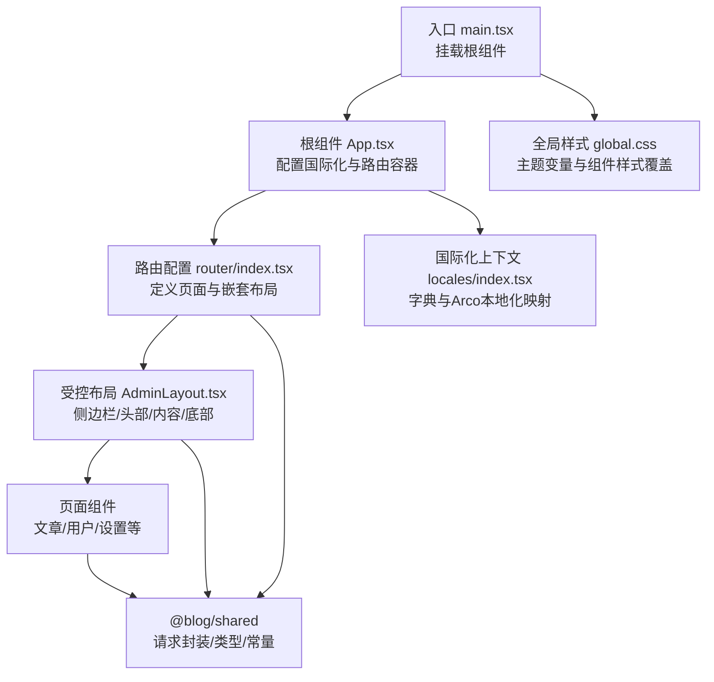
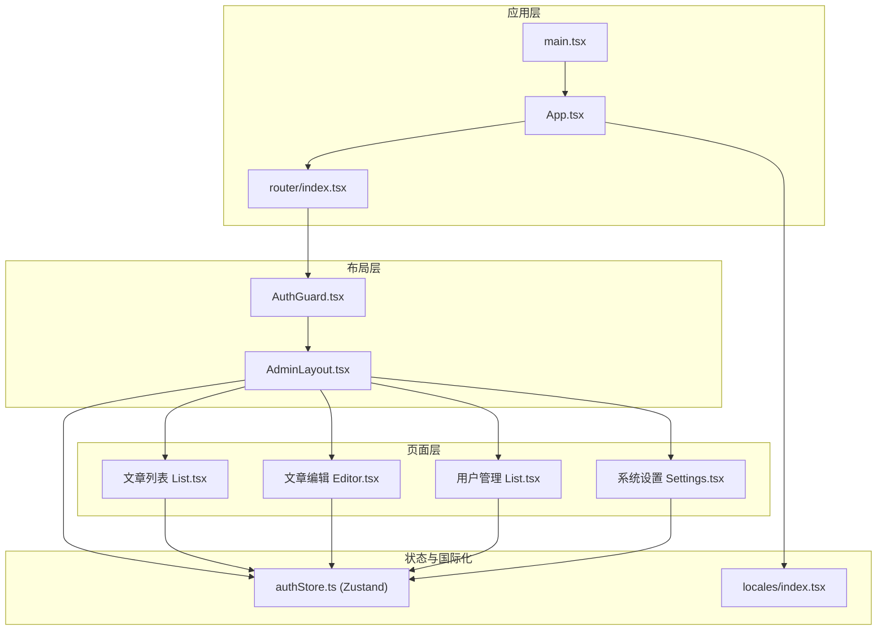
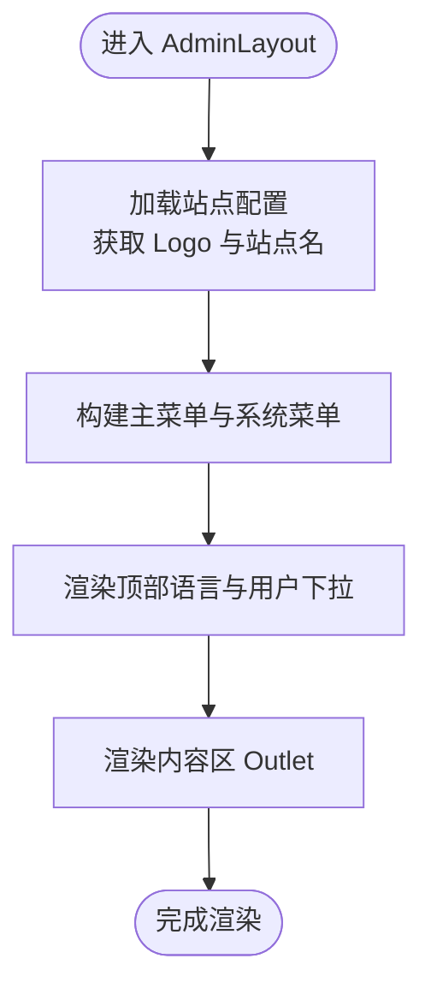
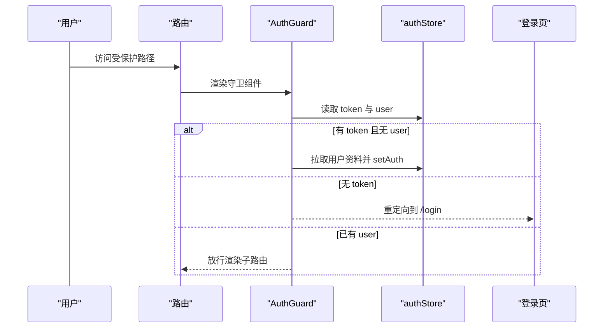
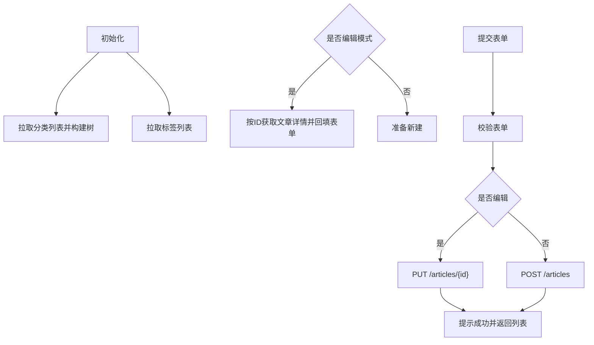
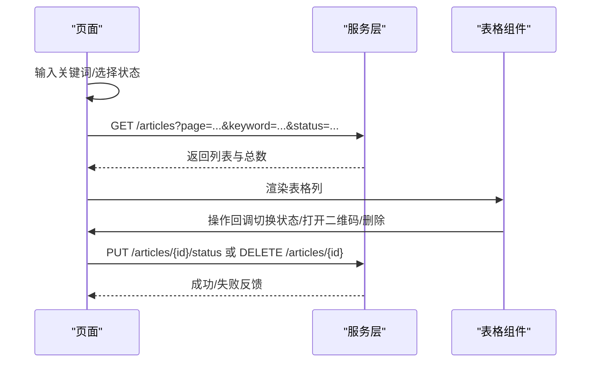
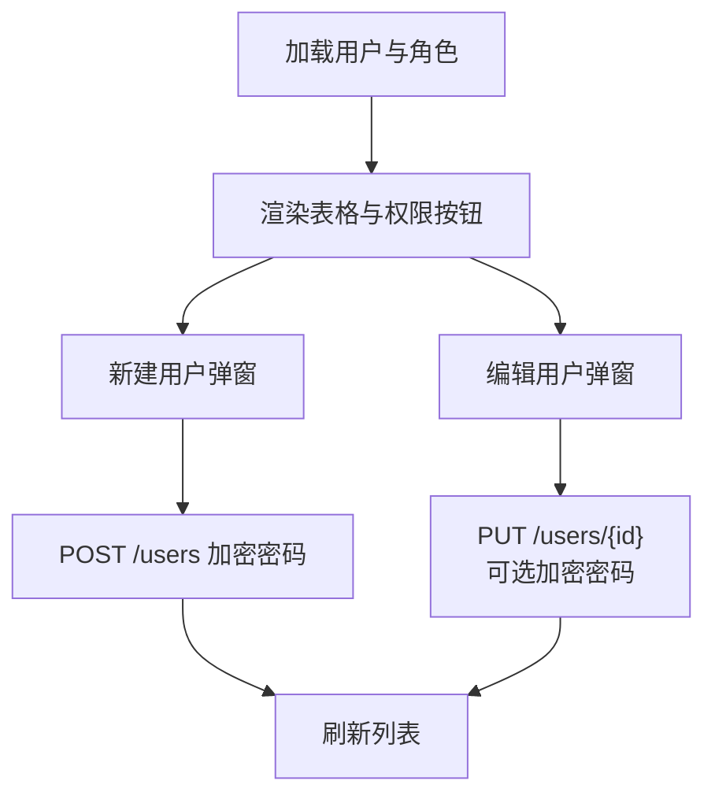
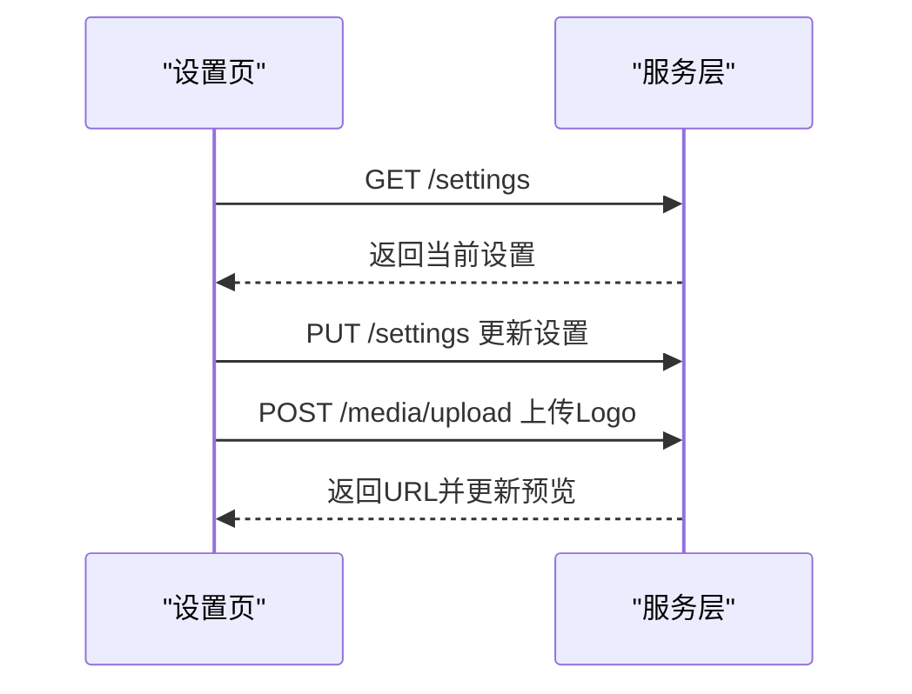
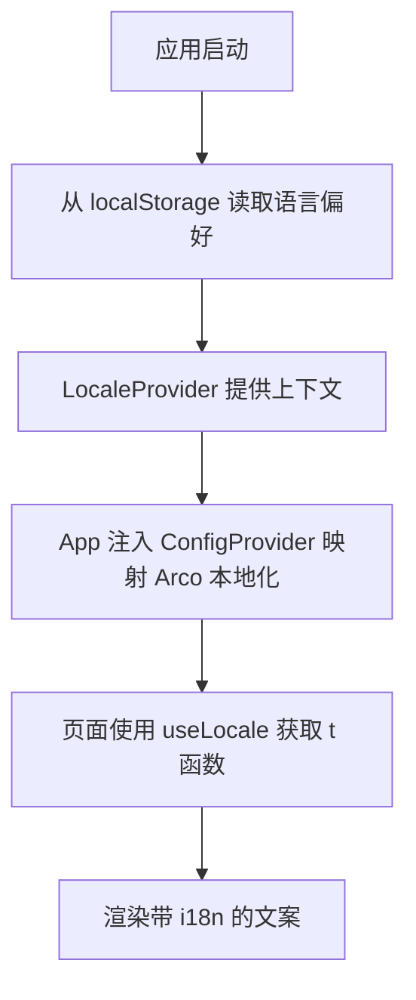
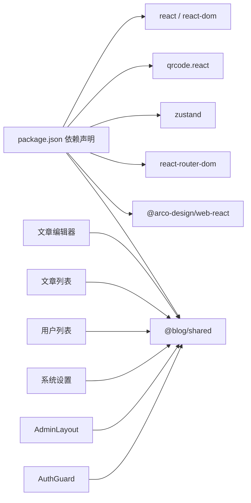

# 管理后台前端

<cite>
**本文引用的文件**
- [webSource/apps/admin/src/App.tsx](file://webSource/apps/admin/src/App.tsx)
- [webSource/apps/admin/src/main.tsx](file://webSource/apps/admin/src/main.tsx)
- [webSource/apps/admin/src/layouts/AdminLayout.tsx](file://webSource/apps/admin/src/layouts/AdminLayout.tsx)
- [webSource/apps/admin/src/router/index.tsx](file://webSource/apps/admin/src/router/index.tsx)
- [webSource/apps/admin/src/store/authStore.ts](file://webSource/apps/admin/src/store/authStore.ts)
- [webSource/apps/admin/src/components/AuthGuard.tsx](file://webSource/apps/admin/src/components/AuthGuard.tsx)
- [webSource/apps/admin/src/pages/articles/Editor.tsx](file://webSource/apps/admin/src/pages/articles/Editor.tsx)
- [webSource/apps/admin/src/pages/articles/List.tsx](file://webSource/apps/admin/src/pages/articles/List.tsx)
- [webSource/apps/admin/src/pages/users/List.tsx](file://webSource/apps/admin/src/pages/users/List.tsx)
- [webSource/apps/admin/src/pages/settings/Settings.tsx](file://webSource/apps/admin/src/pages/settings/Settings.tsx)
- [webSource/apps/admin/src/locales/index.tsx](file://webSource/apps/admin/src/locales/index.tsx)
- [webSource/apps/admin/src/locales/en-US.ts](file://webSource/apps/admin/src/locales/en-US.ts)
- [webSource/apps/admin/src/locales/zh-CN.ts](file://webSource/apps/admin/src/locales/zh-CN.ts)
- [webSource/apps/admin/src/styles/global.css](file://webSource/apps/admin/src/styles/global.css)
- [webSource/apps/admin/package.json](file://webSource/apps/admin/package.json)
</cite>

## 目录
1. [简介](#简介)
2. [项目结构](#项目结构)
3. [核心组件](#核心组件)
4. [架构总览](#架构总览)
5. [组件详解](#组件详解)
6. [依赖关系分析](#依赖关系分析)
7. [性能考量](#性能考量)
8. [故障排查指南](#故障排查指南)
9. [结论](#结论)
10. [附录](#附录)

## 简介
本文件面向Xiangmuzs博客平台管理后台的前端架构，围绕React应用组织结构、组件层次、状态管理、国际化、UI组件库集成与样式定制、以及开发调试与性能优化等方面进行系统性说明。重点包括：
- AdminLayout布局组件的设计思路与实现要点（侧边栏、头部、内容区、底部）
- 各功能页面（文章编辑器、文章列表、用户管理、系统设置等）的组件设计与交互流程
- 状态管理策略（全局认证状态、表单状态、路由状态）
- 国际化（中英双语）的实现方案与切换机制
- Arco Design组件库的集成与样式覆盖实践
- 组件复用与模块化开发最佳实践
- 开发调试与性能优化建议

## 项目结构
管理后台采用Vite + React 18 + TypeScript构建，使用Zustand进行轻量状态管理，Arco Design作为UI基础库，并通过共享包@blog/shared统一类型与工具。

图表来源
- [webSource/apps/admin/src/main.tsx:1-13](file://webSource/apps/admin/src/main.tsx#L1-L13)
- [webSource/apps/admin/src/App.tsx:1-22](file://webSource/apps/admin/src/App.tsx#L1-L22)
- [webSource/apps/admin/src/router/index.tsx:1-47](file://webSource/apps/admin/src/router/index.tsx#L1-L47)
- [webSource/apps/admin/src/layouts/AdminLayout.tsx:1-159](file://webSource/apps/admin/src/layouts/AdminLayout.tsx#L1-L159)
- [webSource/apps/admin/src/locales/index.tsx:1-53](file://webSource/apps/admin/src/locales/index.tsx#L1-L53)
- [webSource/apps/admin/src/styles/global.css:1-136](file://webSource/apps/admin/src/styles/global.css#L1-L136)

章节来源
- [webSource/apps/admin/src/main.tsx:1-13](file://webSource/apps/admin/src/main.tsx#L1-L13)
- [webSource/apps/admin/src/App.tsx:1-22](file://webSource/apps/admin/src/App.tsx#L1-L22)
- [webSource/apps/admin/src/router/index.tsx:1-47](file://webSource/apps/admin/src/router/index.tsx#L1-L47)
- [webSource/apps/admin/src/locales/index.tsx:1-53](file://webSource/apps/admin/src/locales/index.tsx#L1-L53)
- [webSource/apps/admin/src/styles/global.css:1-136](file://webSource/apps/admin/src/styles/global.css#L1-L136)

## 核心组件
- 应用根组件与国际化配置：在根组件中注入ConfigProvider以启用Arco Design的本地化，并通过LocaleProvider提供多语言能力。
- 路由与守卫：使用react-router-dom的BrowserRouter与嵌套路由，结合AuthGuard对受保护页面进行鉴权与自动拉取用户资料。
- 布局组件：AdminLayout负责侧边栏导航、顶部用户与语言切换、内容区Outlet渲染与页脚信息。
- 状态管理：使用Zustand的authStore集中管理用户、令牌与权限；页面内使用React状态与Arco Form状态配合完成表单与查询参数的状态管理。
- 国际化：locales目录维护中英字典，LocaleProvider负责切换与持久化，getArcoLocale将当前语言映射到Arco Design本地化对象。

章节来源
- [webSource/apps/admin/src/App.tsx:1-22](file://webSource/apps/admin/src/App.tsx#L1-L22)
- [webSource/apps/admin/src/router/index.tsx:1-47](file://webSource/apps/admin/src/router/index.tsx#L1-L47)
- [webSource/apps/admin/src/components/AuthGuard.tsx:1-38](file://webSource/apps/admin/src/components/AuthGuard.tsx#L1-L38)
- [webSource/apps/admin/src/layouts/AdminLayout.tsx:1-159](file://webSource/apps/admin/src/layouts/AdminLayout.tsx#L1-L159)
- [webSource/apps/admin/src/store/authStore.ts:1-56](file://webSource/apps/admin/src/store/authStore.ts#L1-L56)
- [webSource/apps/admin/src/locales/index.tsx:1-53](file://webSource/apps/admin/src/locales/index.tsx#L1-L53)

## 架构总览
管理后台采用“布局-页面-组件”分层架构，路由驱动页面切换，布局承载全局UI与导航，页面内再细分为业务组件与表单逻辑。

图表来源
- [webSource/apps/admin/src/main.tsx:1-13](file://webSource/apps/admin/src/main.tsx#L1-L13)
- [webSource/apps/admin/src/App.tsx:1-22](file://webSource/apps/admin/src/App.tsx#L1-L22)
- [webSource/apps/admin/src/router/index.tsx:1-47](file://webSource/apps/admin/src/router/index.tsx#L1-L47)
- [webSource/apps/admin/src/components/AuthGuard.tsx:1-38](file://webSource/apps/admin/src/components/AuthGuard.tsx#L1-L38)
- [webSource/apps/admin/src/layouts/AdminLayout.tsx:1-159](file://webSource/apps/admin/src/layouts/AdminLayout.tsx#L1-L159)
- [webSource/apps/admin/src/store/authStore.ts:1-56](file://webSource/apps/admin/src/store/authStore.ts#L1-L56)
- [webSource/apps/admin/src/locales/index.tsx:1-53](file://webSource/apps/admin/src/locales/index.tsx#L1-L53)

## 组件详解

### AdminLayout 布局组件
- 设计目标：提供统一的侧边导航、顶部用户与语言切换、内容区Outlet与页脚，保证管理后台一致的视觉与交互体验。
- 关键实现点：
  - 侧边栏：折叠控制、响应式断点、主菜单与系统菜单分组、选中态与跳转。
  - 顶部：语言切换下拉、用户头像与下拉菜单（个人资料、退出登录）。
  - 内容区：Outlet占位，统一的滚动与背景。
  - 动态站点信息：启动时从后端获取站点名称与Logo用于侧边栏展示。
  - 国际化：通过useLocale读取当前语言并传递给Arco ConfigProvider。
  - 认证：通过useAuthStore获取用户信息，退出时提示并跳转登录。

图表来源
- [webSource/apps/admin/src/layouts/AdminLayout.tsx:35-41](file://webSource/apps/admin/src/layouts/AdminLayout.tsx#L35-L41)
- [webSource/apps/admin/src/layouts/AdminLayout.tsx:49-62](file://webSource/apps/admin/src/layouts/AdminLayout.tsx#L49-L62)
- [webSource/apps/admin/src/layouts/AdminLayout.tsx:120-155](file://webSource/apps/admin/src/layouts/AdminLayout.tsx#L120-L155)

章节来源
- [webSource/apps/admin/src/layouts/AdminLayout.tsx:1-159](file://webSource/apps/admin/src/layouts/AdminLayout.tsx#L1-L159)

### 路由与守卫
- 路由配置：使用createBrowserRouter定义登录页与受保护的嵌套路由，首页重定向至仪表盘。
- 守卫逻辑：AuthGuard在有token但无用户信息时自动拉取用户资料并写入状态；无token时跳转登录页；加载期间显示Spin。

图表来源
- [webSource/apps/admin/src/router/index.tsx:17-44](file://webSource/apps/admin/src/router/index.tsx#L17-L44)
- [webSource/apps/admin/src/components/AuthGuard.tsx:6-37](file://webSource/apps/admin/src/components/AuthGuard.tsx#L6-L37)
- [webSource/apps/admin/src/store/authStore.ts:15-34](file://webSource/apps/admin/src/store/authStore.ts#L15-L34)

章节来源
- [webSource/apps/admin/src/router/index.tsx:1-47](file://webSource/apps/admin/src/router/index.tsx#L1-L47)
- [webSource/apps/admin/src/components/AuthGuard.tsx:1-38](file://webSource/apps/admin/src/components/AuthGuard.tsx#L1-L38)
- [webSource/apps/admin/src/store/authStore.ts:1-56](file://webSource/apps/admin/src/store/authStore.ts#L1-L56)

### 文章编辑器（Editor）
- 功能要点：支持新建与编辑、Markdown/富文本两种编辑模式、分类树选择、标签多选、封面图URL、表单校验与提交。
- 数据流：初始化时并行拉取分类树与标签列表；编辑模式下回填表单；提交时根据是否编辑调用不同接口。
- 国际化：所有文案通过t(key)获取，确保中英一致。

图表来源
- [webSource/apps/admin/src/pages/articles/Editor.tsx:25-49](file://webSource/apps/admin/src/pages/articles/Editor.tsx#L25-L49)
- [webSource/apps/admin/src/pages/articles/Editor.tsx:51-70](file://webSource/apps/admin/src/pages/articles/Editor.tsx#L51-L70)

章节来源
- [webSource/apps/admin/src/pages/articles/Editor.tsx:1-149](file://webSource/apps/admin/src/pages/articles/Editor.tsx#L1-L149)

### 文章列表（List）
- 功能要点：关键词与状态过滤、分页、发布/下架切换、二维码预览与弹窗、删除确认。
- 性能与交互：使用useCallback缓存请求函数，避免重复渲染导致的重复请求；表格列渲染中使用Arco Tag与Tooltip增强可读性。
- 国际化：所有文案与提示均来自字典。

图表来源
- [webSource/apps/admin/src/pages/articles/List.tsx:39-53](file://webSource/apps/admin/src/pages/articles/List.tsx#L39-L53)
- [webSource/apps/admin/src/pages/articles/List.tsx:67-77](file://webSource/apps/admin/src/pages/articles/List.tsx#L67-L77)
- [webSource/apps/admin/src/pages/articles/List.tsx:79-83](file://webSource/apps/admin/src/pages/articles/List.tsx#L79-L83)

章节来源
- [webSource/apps/admin/src/pages/articles/List.tsx:1-246](file://webSource/apps/admin/src/pages/articles/List.tsx#L1-L246)

### 用户管理（List）
- 功能要点：用户列表、角色下拉、创建/编辑弹窗、密码加密提交、状态切换、权限控制（hasPermission）。
- 安全：编辑时若填写密码则进行RSA加密；创建时必填密码。
- 权限：基于authStore中的权限集合动态控制按钮可见性。

图表来源
- [webSource/apps/admin/src/pages/users/List.tsx:51-74](file://webSource/apps/admin/src/pages/users/List.tsx#L51-L74)
- [webSource/apps/admin/src/pages/users/List.tsx:102-131](file://webSource/apps/admin/src/pages/users/List.tsx#L102-L131)
- [webSource/apps/admin/src/store/authStore.ts:30-33](file://webSource/apps/admin/src/store/authStore.ts#L30-L33)

章节来源
- [webSource/apps/admin/src/pages/users/List.tsx:1-247](file://webSource/apps/admin/src/pages/users/List.tsx#L1-L247)
- [webSource/apps/admin/src/store/authStore.ts:1-56](file://webSource/apps/admin/src/store/authStore.ts#L1-L56)

### 系统设置（Settings）
- 功能要点：站点名称、验证码开关、Logo URL与上传预览、保存设置。
- 上传：使用FormData上传图片至/media/upload，成功后回填URL并预览。

图表来源
- [webSource/apps/admin/src/pages/settings/Settings.tsx:26-43](file://webSource/apps/admin/src/pages/settings/Settings.tsx#L26-L43)
- [webSource/apps/admin/src/pages/settings/Settings.tsx:45-60](file://webSource/apps/admin/src/pages/settings/Settings.tsx#L45-L60)
- [webSource/apps/admin/src/pages/settings/Settings.tsx:62-77](file://webSource/apps/admin/src/pages/settings/Settings.tsx#L62-L77)

章节来源
- [webSource/apps/admin/src/pages/settings/Settings.tsx:1-144](file://webSource/apps/admin/src/pages/settings/Settings.tsx#L1-L144)

### 国际化（i18n）
- 字典：locales目录维护中英两套字典，key统一规范，便于扩展。
- 上下文：LocaleProvider提供locale、setLocale与t函数；getArcoLocale将当前语言映射到Arco Design本地化对象。
- 持久化：语言偏好存储于localStorage，应用启动时恢复。
- 使用：各页面通过useLocale获取t函数，统一文案输出。

图表来源
- [webSource/apps/admin/src/locales/index.tsx:22-42](file://webSource/apps/admin/src/locales/index.tsx#L22-L42)
- [webSource/apps/admin/src/locales/index.tsx:50-52](file://webSource/apps/admin/src/locales/index.tsx#L50-L52)
- [webSource/apps/admin/src/App.tsx:6-13](file://webSource/apps/admin/src/App.tsx#L6-L13)

章节来源
- [webSource/apps/admin/src/locales/index.tsx:1-53](file://webSource/apps/admin/src/locales/index.tsx#L1-L53)
- [webSource/apps/admin/src/locales/en-US.ts:1-259](file://webSource/apps/admin/src/locales/en-US.ts#L1-L259)
- [webSource/apps/admin/src/locales/zh-CN.ts:1-258](file://webSource/apps/admin/src/locales/zh-CN.ts#L1-L258)
- [webSource/apps/admin/src/App.tsx:1-22](file://webSource/apps/admin/src/App.tsx#L1-L22)

### UI组件与样式定制（Arco Design + 自定义CSS）
- 组件库：大量使用Arco Design的Layout、Menu、Form、Table、Modal、Upload等组件，提升开发效率与一致性。
- 主题变量：通过CSS变量定义主色、阴影、圆角、渐变等，统一卡片、表格、侧边栏等组件风格。
- 样式覆盖：针对Arco组件的hover、卡片阴影、表格表头背景、侧边栏Logo区域、登录页背景等进行定制。

章节来源
- [webSource/apps/admin/src/styles/global.css:1-136](file://webSource/apps/admin/src/styles/global.css#L1-L136)
- [webSource/apps/admin/src/layouts/AdminLayout.tsx:82-155](file://webSource/apps/admin/src/layouts/AdminLayout.tsx#L82-L155)
- [webSource/apps/admin/src/pages/articles/List.tsx:204-216](file://webSource/apps/admin/src/pages/articles/List.tsx#L204-L216)

## 依赖关系分析
- 运行时依赖：@arco-design/web-react、react、react-router-dom、zustand、qrcode.react、@blog/shared。
- 构建与类型：Vite、TypeScript、@vitejs/plugin-react。
- 依赖耦合：页面组件依赖shared包的请求封装与类型；布局与页面共享国际化上下文；守卫与页面共享authStore。

图表来源
- [webSource/apps/admin/package.json:12-27](file://webSource/apps/admin/package.json#L12-L27)

章节来源
- [webSource/apps/admin/package.json:1-28](file://webSource/apps/admin/package.json#L1-L28)

## 性能考量
- 请求去抖与缓存：对高频查询（如文章列表）使用useCallback缓存请求函数，避免因重渲染导致重复请求。
- 懒加载与按需：Arco Design组件按需引入，减少打包体积。
- 表单与列表：使用Arco Form与Table的受控模式，避免不必要的重渲染。
- 图片与二维码：二维码预览使用SVG，避免额外资源请求；Logo上传后即时预览，减少二次请求。
- 样式：通过CSS变量与覆盖减少运行时样式计算开销。

## 故障排查指南
- 登录与鉴权
  - 现象：访问受保护页面白屏或反复跳转登录。
  - 排查：检查localStorage中access_token是否存在；确认AuthGuard是否成功拉取用户资料；查看网络面板的鉴权相关接口。
- 文章编辑
  - 现象：编辑失败或新建失败。
  - 排查：确认表单校验通过；检查content_type与字段映射；查看接口返回错误信息。
- 用户管理
  - 现象：创建/编辑用户失败或密码未更新。
  - 排查：确认密码是否加密；编辑时若未填写密码应忽略该字段；检查权限hasPermission是否正确。
- 系统设置
  - 现象：Logo上传失败或URL未回填。
  - 排查：确认上传接口返回；检查FormData构造与Content-Type；查看网络面板的上传请求。
- 国际化
  - 现象：切换语言无效或文案缺失。
  - 排查：确认字典key存在；检查LocaleProvider上下文是否包裹；查看localStorage中的语言偏好。

章节来源
- [webSource/apps/admin/src/components/AuthGuard.tsx:11-22](file://webSource/apps/admin/src/components/AuthGuard.tsx#L11-L22)
- [webSource/apps/admin/src/pages/articles/Editor.tsx:51-70](file://webSource/apps/admin/src/pages/articles/Editor.tsx#L51-L70)
- [webSource/apps/admin/src/pages/users/List.tsx:102-131](file://webSource/apps/admin/src/pages/users/List.tsx#L102-L131)
- [webSource/apps/admin/src/pages/settings/Settings.tsx:62-77](file://webSource/apps/admin/src/pages/settings/Settings.tsx#L62-L77)
- [webSource/apps/admin/src/locales/index.tsx:22-42](file://webSource/apps/admin/src/locales/index.tsx#L22-L42)

## 结论
本管理后台前端以清晰的分层架构、稳定的路由与守卫机制、完善的国际化与UI定制为基础，结合Zustand实现轻量状态管理，满足文章、用户、系统设置等核心业务场景。通过组件复用与模块化开发，提升了可维护性与扩展性；配合Arco Design与自定义样式，实现了统一的视觉与交互体验。后续可在权限细化、国际化扩展、性能监控与埋点方面进一步完善。

## 附录
- 最佳实践清单
  - 页面级状态尽量局部化，跨页面共享状态使用Zustand，避免深层props传递。
  - 表单与查询参数使用受控组件与状态管理，配合useCallback优化渲染。
  - 国际化key命名规范统一，避免硬编码字符串。
  - 样式覆盖遵循CSS变量优先原则，保持主题一致性。
  - 上传与大图使用懒加载与预览，提升交互流畅度。
- 开发调试建议
  - 使用React DevTools与Redux DevTools（Zustand可配合插件）观察状态变化。
  - 利用浏览器Network面板定位接口异常与超时问题。
  - 对高频交互（如搜索、分页）增加防抖与节流处理。
  - 在本地环境模拟不同权限与语言，验证UI与交互。