# 系统设置管理

<cite>
**本文引用的文件**
- [server/internal/handler/setting.go](file://server/internal/handler/setting.go)
- [server/internal/model/setting.go](file://server/internal/model/setting.go)
- [server/internal/repository/setting_repo.go](file://server/internal/repository/setting_repo.go)
- [webSource/apps/admin/src/pages/settings/Settings.tsx](file://webSource/apps/admin/src/pages/settings/Settings.tsx)
- [server/router/router.go](file://server/router/router.go)
- [server/config/config.go](file://server/config/config.go)
- [server/internal/handler/dashboard.go](file://server/internal/handler/dashboard.go)
- [server/internal/handler/category.go](file://server/internal/handler/category.go)
- [server/internal/handler/tag.go](file://server/internal/handler/tag.go)
- [webSource/apps/admin/src/utils/categoryTree.ts](file://webSource/apps/admin/src/utils/categoryTree.ts)
- [webSource/apps/admin/src/locales/index.tsx](file://webSource/apps/admin/src/locales/index.tsx)
- [webSource/apps/admin/src/locales/zh-CN.ts](file://webSource/apps/admin/src/locales/zh-CN.ts)
- [webSource/apps/admin/src/locales/en-US.ts](file://webSource/apps/admin/src/locales/en-US.ts)
- [webSource/apps/admin/src/store/authStore.ts](file://webSource/apps/admin/src/store/authStore.ts)
</cite>

## 目录
1. 引言
2. 项目结构
3. 核心组件
4. 架构总览
5. 详细组件分析
6. 依赖分析
7. 性能考虑
8. 故障排查指南
9. 结论
10. 附录

## 引言
本文件面向Xiangmuzs博客平台管理后台的“系统设置管理”模块，围绕系统设置页面的设计与实现进行深入说明，涵盖配置项分类、表单布局、实时保存机制；同时结合现有代码，对博客基础配置（站点名称、描述、Logo、SEO相关）、分类管理（层级结构、排序、批量操作）、标签管理（标签云、自动补全、关联统计）、仪表盘设计（数据统计、快速入口、实时信息）、配置备份恢复（导出/导入/版本管理）、系统监控（运行状态、性能指标、告警机制）以及多语言支持（翻译词条、语言切换）等主题进行系统化梳理与可视化呈现。

## 项目结构
后端采用Gin框架与GORM，前端基于React + Arco Design，系统设置管理涉及以下关键路径：
- 后端路由与处理器：/api/v1/settings（GET/PUT）
- 设置模型与仓库：Setting模型、SettingRepo读写
- 前端设置页面：Settings.tsx负责表单渲染、上传、保存
- 路由注册：router.go中对公开与认证接口进行分组
- 配置文件：config.go定义服务端配置结构（非设置项）
- 其他相关模块：仪表盘、分类、标签、国际化、鉴权存储

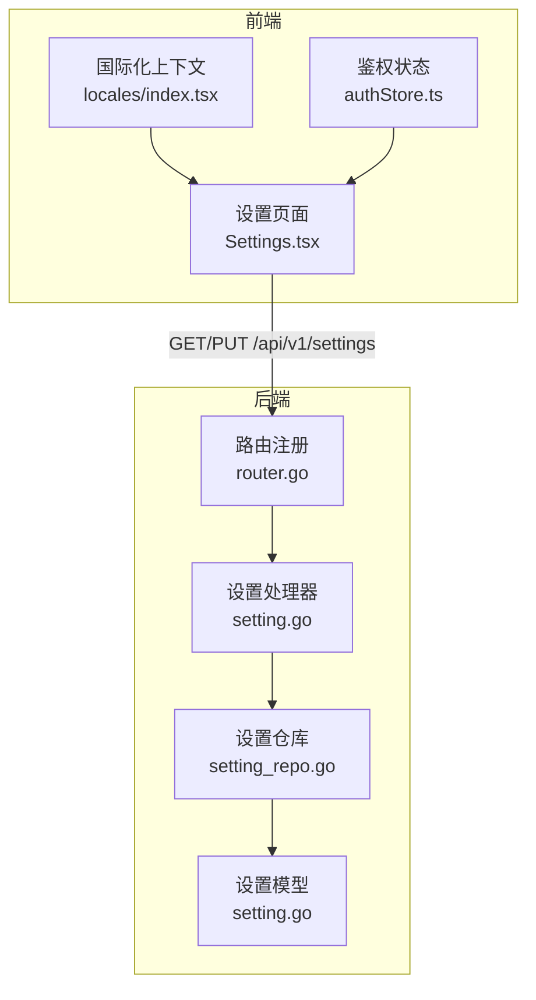

**图表来源**
- [server/router/router.go:11-104](file://server/router/router.go#L11-L104)
- [server/internal/handler/setting.go:11-67](file://server/internal/handler/setting.go#L11-L67)
- [server/internal/repository/setting_repo.go:9-45](file://server/internal/repository/setting_repo.go#L9-L45)
- [server/internal/model/setting.go:5-11](file://server/internal/model/setting.go#L5-L11)
- [webSource/apps/admin/src/pages/settings/Settings.tsx:20-144](file://webSource/apps/admin/src/pages/settings/Settings.tsx#L20-L144)
- [webSource/apps/admin/src/locales/index.tsx:22-53](file://webSource/apps/admin/src/locales/index.tsx#L22-L53)
- [webSource/apps/admin/src/store/authStore.ts:15-34](file://webSource/apps/admin/src/store/authStore.ts#L15-L34)

**章节来源**
- [server/router/router.go:11-104](file://server/router/router.go#L11-L104)
- [webSource/apps/admin/src/pages/settings/Settings.tsx:20-144](file://webSource/apps/admin/src/pages/settings/Settings.tsx#L20-L144)

## 核心组件
- 设置处理器（SettingHandler）：提供公开设置查询、全量设置查询、批量更新设置、验证码生成等能力。
- 设置仓库（SettingRepo）：封装设置的增改查，支持按key冲突更新。
- 设置模型（Setting）：键值型配置实体，包含唯一key、文本值与更新时间。
- 设置页面（Settings.tsx）：表单驱动的配置界面，支持Logo上传与即时保存。
- 路由（router.go）：将设置接口纳入认证与公开路由体系。
- 国际化（locales）：支持中英文词条与Arco语言包映射。
- 鉴权状态（authStore）：维护登录态与权限，保障设置接口访问控制。

**章节来源**
- [server/internal/handler/setting.go:11-67](file://server/internal/handler/setting.go#L11-L67)
- [server/internal/repository/setting_repo.go:9-45](file://server/internal/repository/setting_repo.go#L9-L45)
- [server/internal/model/setting.go:5-11](file://server/internal/model/setting.go#L5-L11)
- [webSource/apps/admin/src/pages/settings/Settings.tsx:20-144](file://webSource/apps/admin/src/pages/settings/Settings.tsx#L20-L144)
- [webSource/apps/admin/src/locales/index.tsx:22-53](file://webSource/apps/admin/src/locales/index.tsx#L22-L53)
- [webSource/apps/admin/src/store/authStore.ts:15-34](file://webSource/apps/admin/src/store/authStore.ts#L15-L34)

## 架构总览
系统设置管理遵循“前端表单 -> 后端路由 -> 处理器 -> 仓库 -> 模型”的标准分层架构。前端通过HTTP请求与后端交互，后端以事务性方式持久化配置项，确保并发场景下的数据一致性。

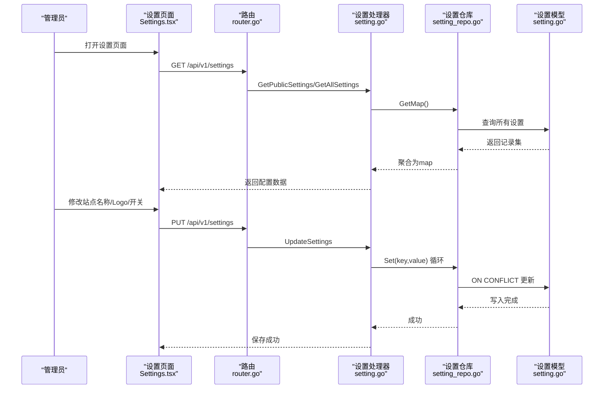

**图表来源**
- [server/router/router.go:24-102](file://server/router/router.go#L24-L102)
- [server/internal/handler/setting.go:21-53](file://server/internal/handler/setting.go#L21-L53)
- [server/internal/repository/setting_repo.go:17-29](file://server/internal/repository/setting_repo.go#L17-L29)
- [server/internal/model/setting.go:5-11](file://server/internal/model/setting.go#L5-L11)
- [webSource/apps/admin/src/pages/settings/Settings.tsx:26-60](file://webSource/apps/admin/src/pages/settings/Settings.tsx#L26-L60)

## 详细组件分析

### 系统设置页面设计与实现
- 配置项分类：当前页面聚焦于站点基础配置（站点名称、登录验证码开关、Logo地址），未来可扩展SEO、社交链接、CDN等分类。
- 表单布局：垂直布局，字段包括站点名称、验证码开关、Logo URL输入框与上传按钮，支持预览。
- 实时保存机制：前端在用户点击保存时发起PUT请求，后端逐项执行ON CONFLICT更新，保证幂等与一致性。
- 数据来源：首次加载时调用GET /api/v1/settings，返回公开或全量配置映射；保存时PUT /api/v1/settings，传入键值对数组。

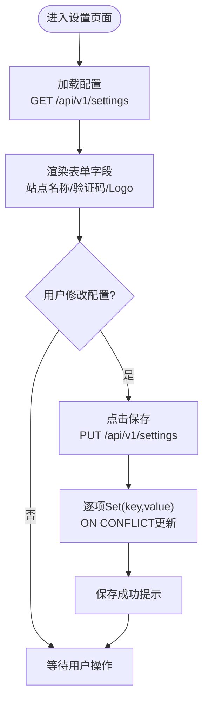

**图表来源**
- [webSource/apps/admin/src/pages/settings/Settings.tsx:26-60](file://webSource/apps/admin/src/pages/settings/Settings.tsx#L26-L60)
- [server/internal/handler/setting.go:31-53](file://server/internal/handler/setting.go#L31-L53)
- [server/internal/repository/setting_repo.go:23-29](file://server/internal/repository/setting_repo.go#L23-L29)

**章节来源**
- [webSource/apps/admin/src/pages/settings/Settings.tsx:20-144](file://webSource/apps/admin/src/pages/settings/Settings.tsx#L20-L144)
- [server/internal/handler/setting.go:21-53](file://server/internal/handler/setting.go#L21-L53)

### 博客基础配置
- 站点名称：用于前端标题与SEO标题前缀，建议长度限制与必填校验。
- 登录验证码：布尔开关，影响登录流程是否需要验证码。
- Logo设置：支持直接输入URL或上传图片，上传通过/media/upload完成，返回URL写入Logo字段。
- SEO配置：当前未见专门的SEO字段实现，可在Setting表扩展key（如seo_keywords、seo_description）并补充前端表单项。

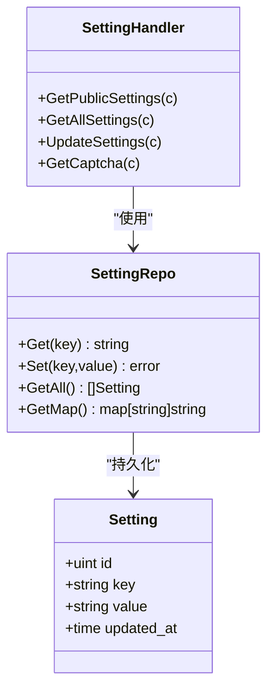

**图表来源**
- [server/internal/model/setting.go:5-11](file://server/internal/model/setting.go#L5-L11)
- [server/internal/repository/setting_repo.go:9-45](file://server/internal/repository/setting_repo.go#L9-L45)
- [server/internal/handler/setting.go:11-67](file://server/internal/handler/setting.go#L11-L67)

**章节来源**
- [server/internal/model/setting.go:5-11](file://server/internal/model/setting.go#L5-L11)
- [server/internal/repository/setting_repo.go:17-44](file://server/internal/repository/setting_repo.go#L17-L44)
- [server/internal/handler/setting.go:21-67](file://server/internal/handler/setting.go#L21-L67)

### 分类管理功能
- 层级结构：分类具备parent_id，支持父子关系；前端通过buildCategoryTree构建树形结构并排序。
- 排序调整：分类请求DTO包含sort字段，后端按sort优先、id次优排序。
- 批量操作：前端可基于树节点集合进行批量删除、移动等操作（需后端配合提供批量接口）。

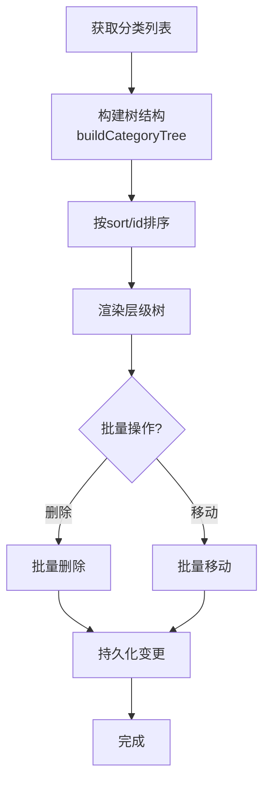

**图表来源**
- [webSource/apps/admin/src/utils/categoryTree.ts:7-31](file://webSource/apps/admin/src/utils/categoryTree.ts#L7-L31)
- [server/internal/handler/category.go:23-76](file://server/internal/handler/category.go#L23-L76)

**章节来源**
- [webSource/apps/admin/src/utils/categoryTree.ts:1-52](file://webSource/apps/admin/src/utils/categoryTree.ts#L1-L52)
- [server/internal/handler/category.go:15-90](file://server/internal/handler/category.go#L15-L90)

### 标签管理实现
- 标签云展示：后端提供标签列表接口，前端可据此渲染标签云与热门标签。
- 自动补全：在文章编辑等场景，可基于标签列表实现输入自动补全。
- 关联统计：标签与文章关联数量可通过聚合查询统计，前端展示文章数字段。

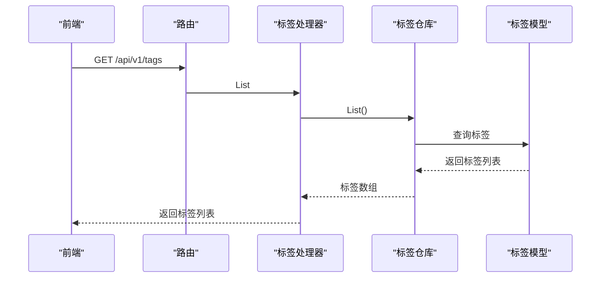

**图表来源**
- [server/internal/handler/tag.go:23-30](file://server/internal/handler/tag.go#L23-L30)
- [server/internal/repository/tag_repo.go:1-50](file://server/internal/repository/tag_repo.go#L1-L50)

**章节来源**
- [server/internal/handler/tag.go:15-75](file://server/internal/handler/tag.go#L15-L75)

### 仪表盘设计
- 数据统计：文章总数、已发布数、草稿数、总浏览量、分类数、标签数。
- 快速入口：导航至文章、分类、标签、用户、角色等管理页面。
- 实时信息：基于数据库聚合查询，返回当前最新统计数据。

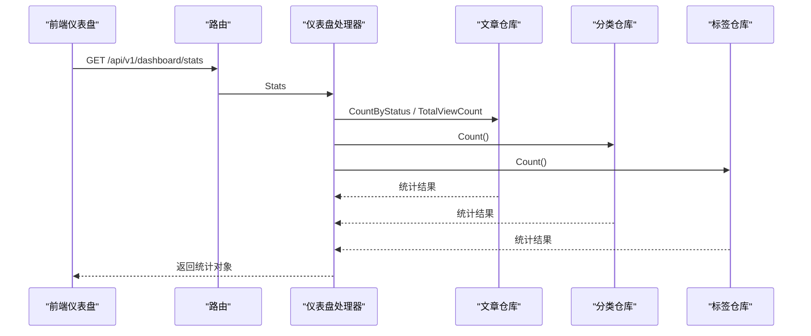

**图表来源**
- [server/internal/handler/dashboard.go:25-37](file://server/internal/handler/dashboard.go#L25-L37)

**章节来源**
- [server/internal/handler/dashboard.go:11-38](file://server/internal/handler/dashboard.go#L11-L38)

### 配置备份与恢复
- 导出：后端提供全量设置GET接口，前端可将返回的配置映射导出为JSON文件。
- 导入：前端将备份文件解析为键值对，调用批量更新接口PUT /api/v1/settings进行恢复。
- 版本管理：可在导入时记录导入时间戳与版本号，便于回滚与审计。

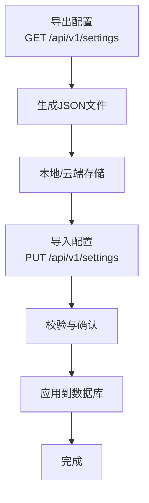

**图表来源**
- [server/internal/handler/setting.go:31-35](file://server/internal/handler/setting.go#L31-L35)
- [server/internal/handler/setting.go:37-53](file://server/internal/handler/setting.go#L37-L53)

**章节来源**
- [server/internal/handler/setting.go:21-53](file://server/internal/handler/setting.go#L21-L53)

### 系统监控与告警
- 运行状态检查：通过健康检查端点（如GET /health）返回服务可用性；若无内置，可参考路由风格新增。
- 性能指标：结合数据库连接池、慢查询日志、请求耗时埋点，前端展示趋势图。
- 告警机制：当数据库写入失败、上传异常、配置冲突时，后端返回错误码，前端弹窗提示并记录日志。

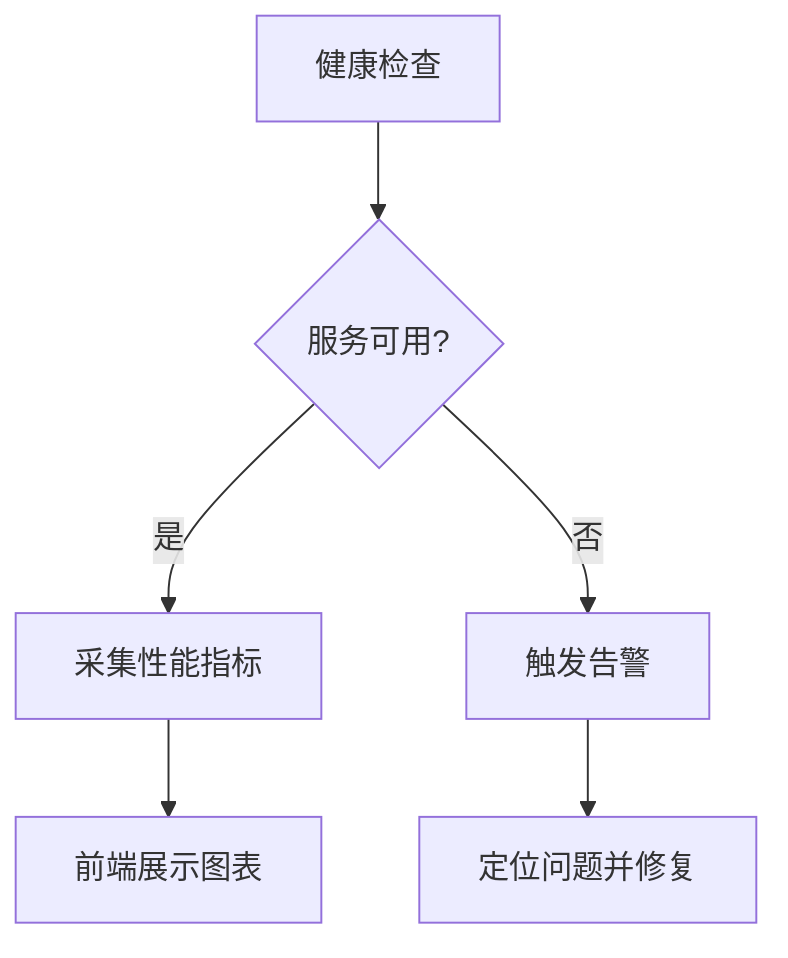

[此图为概念性示意，不直接对应具体源码文件]

### 多语言支持配置管理
- 翻译词条：在locales目录下维护中英词条，Settings.tsx通过useLocale钩子读取。
- 语言切换：LocaleProvider从localStorage读取语言偏好，setLocale更新并持久化。
- Arco语言包：根据当前语言动态切换组件本地化文案。

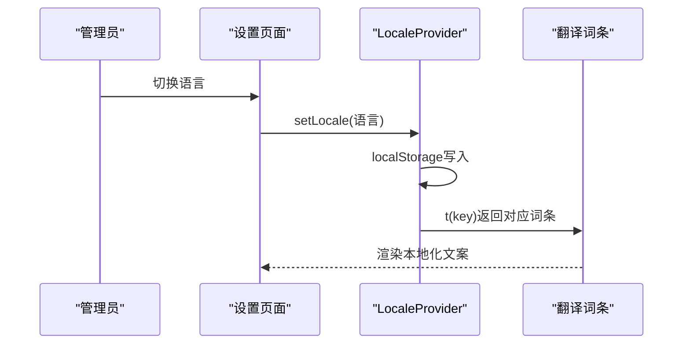

**图表来源**
- [webSource/apps/admin/src/locales/index.tsx:22-53](file://webSource/apps/admin/src/locales/index.tsx#L22-L53)
- [webSource/apps/admin/src/locales/zh-CN.ts:226-241](file://webSource/apps/admin/src/locales/zh-CN.ts#L226-L241)
- [webSource/apps/admin/src/locales/en-US.ts:227-242](file://webSource/apps/admin/src/locales/en-US.ts#L227-L242)

**章节来源**
- [webSource/apps/admin/src/locales/index.tsx:1-53](file://webSource/apps/admin/src/locales/index.tsx#L1-L53)
- [webSource/apps/admin/src/locales/zh-CN.ts:1-259](file://webSource/apps/admin/src/locales/zh-CN.ts#L1-L259)
- [webSource/apps/admin/src/locales/en-US.ts:1-259](file://webSource/apps/admin/src/locales/en-US.ts#L1-L259)

## 依赖分析
- 路由依赖：router.go统一注册设置相关接口，区分公开与认证两类。
- 处理器依赖：SettingHandler依赖SettingRepo；DashboardHandler依赖Article/Category/Tag仓库。
- 仓库依赖：SettingRepo依赖Setting模型；Category/Tag仓库分别依赖对应模型。
- 前端依赖：Settings.tsx依赖request工具、Arco组件、国际化与鉴权状态。

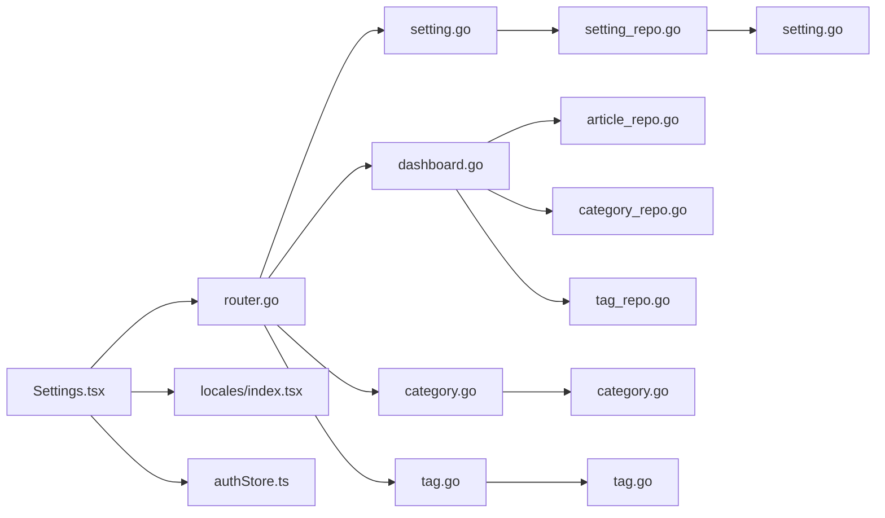

**图表来源**
- [server/router/router.go:11-104](file://server/router/router.go#L11-L104)
- [server/internal/handler/setting.go:11-67](file://server/internal/handler/setting.go#L11-L67)
- [server/internal/handler/dashboard.go:11-38](file://server/internal/handler/dashboard.go#L11-L38)
- [server/internal/handler/category.go:15-90](file://server/internal/handler/category.go#L15-L90)
- [server/internal/handler/tag.go:15-75](file://server/internal/handler/tag.go#L15-L75)
- [server/internal/repository/setting_repo.go:9-45](file://server/internal/repository/setting_repo.go#L9-L45)
- [webSource/apps/admin/src/pages/settings/Settings.tsx:20-144](file://webSource/apps/admin/src/pages/settings/Settings.tsx#L20-L144)
- [webSource/apps/admin/src/locales/index.tsx:22-53](file://webSource/apps/admin/src/locales/index.tsx#L22-L53)
- [webSource/apps/admin/src/store/authStore.ts:15-34](file://webSource/apps/admin/src/store/authStore.ts#L15-L34)

**章节来源**
- [server/router/router.go:11-104](file://server/router/router.go#L11-L104)

## 性能考虑
- 批量更新：后端逐项Set并使用ON CONFLICT更新，避免重复写入；建议在前端合并多次变更后再提交，减少网络往返。
- 缓存策略：对于公开设置（如captcha_enabled、logo_url、site_name），可在应用启动时缓存，降低数据库压力。
- 图片上传：Logo上传应限制大小与类型，前端预览避免大图导致渲染卡顿。
- 排序与树构建：分类树构建复杂度O(n log n)，建议在后端聚合排序，前端仅做渲染。

[本节为通用指导，不直接分析具体文件]

## 故障排查指南
- 保存失败：检查后端日志与错误响应，确认键值合法性与数据库连接状态。
- 上传失败：确认上传接口可用、文件类型与大小限制、存储路径权限。
- 语言切换无效：检查localStorage键值与LocaleProvider初始化逻辑。
- 权限不足：确认登录态与权限位，必要时刷新令牌或重新登录。

**章节来源**
- [webSource/apps/admin/src/pages/settings/Settings.tsx:36-77](file://webSource/apps/admin/src/pages/settings/Settings.tsx#L36-L77)
- [webSource/apps/admin/src/locales/index.tsx:22-53](file://webSource/apps/admin/src/locales/index.tsx#L22-L53)
- [webSource/apps/admin/src/store/authStore.ts:15-34](file://webSource/apps/admin/src/store/authStore.ts#L15-L34)

## 结论
系统设置管理模块以简洁的键值型配置为核心，结合前端表单与后端仓库实现高可用的配置管理。当前已覆盖站点基础配置与公开设置查询，建议后续扩展SEO配置、配置备份恢复、系统监控与告警、多语言词条管理等功能，以满足生产环境的运维与运营需求。

## 附录
- 配置文件结构：服务端配置（server/config/config.go）与设置项（Setting表）分离，避免混淆。
- 路由规范：设置接口纳入/api/v1分组，公开与认证接口清晰划分。

**章节来源**
- [server/config/config.go:7-65](file://server/config/config.go#L7-L65)
- [server/router/router.go:24-102](file://server/router/router.go#L24-L102)