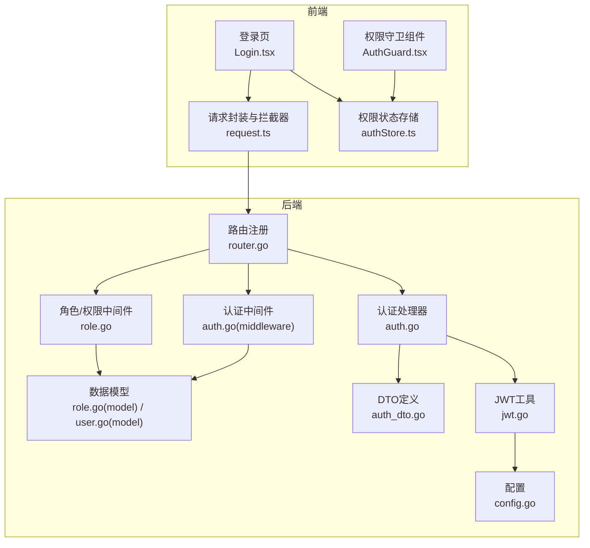
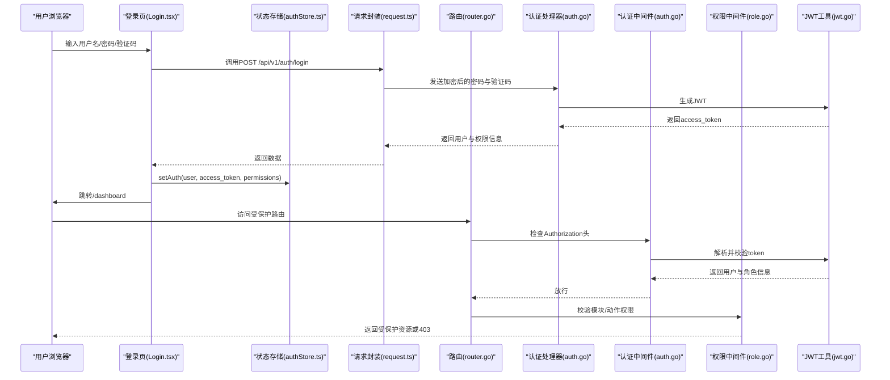
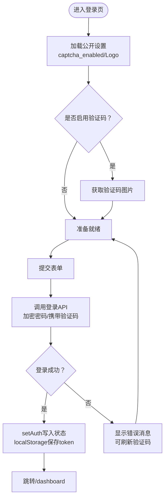
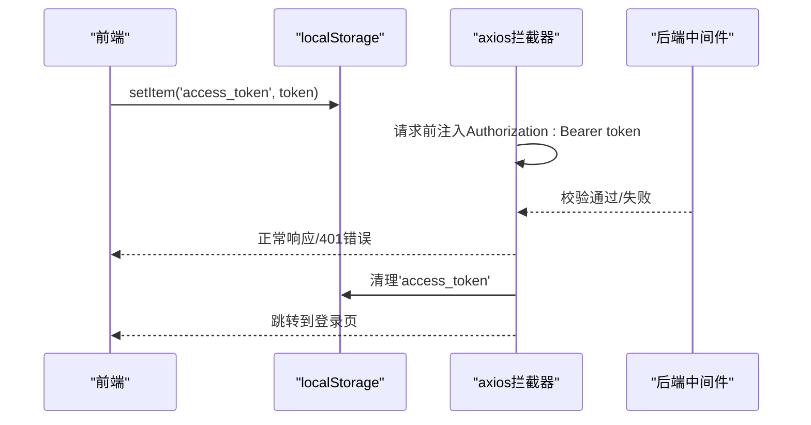
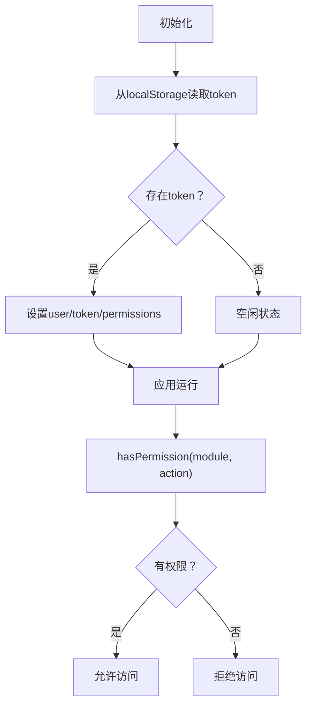
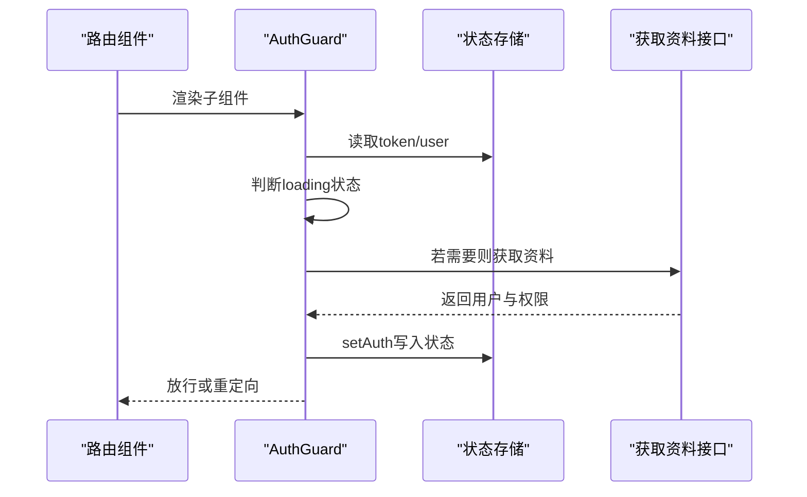
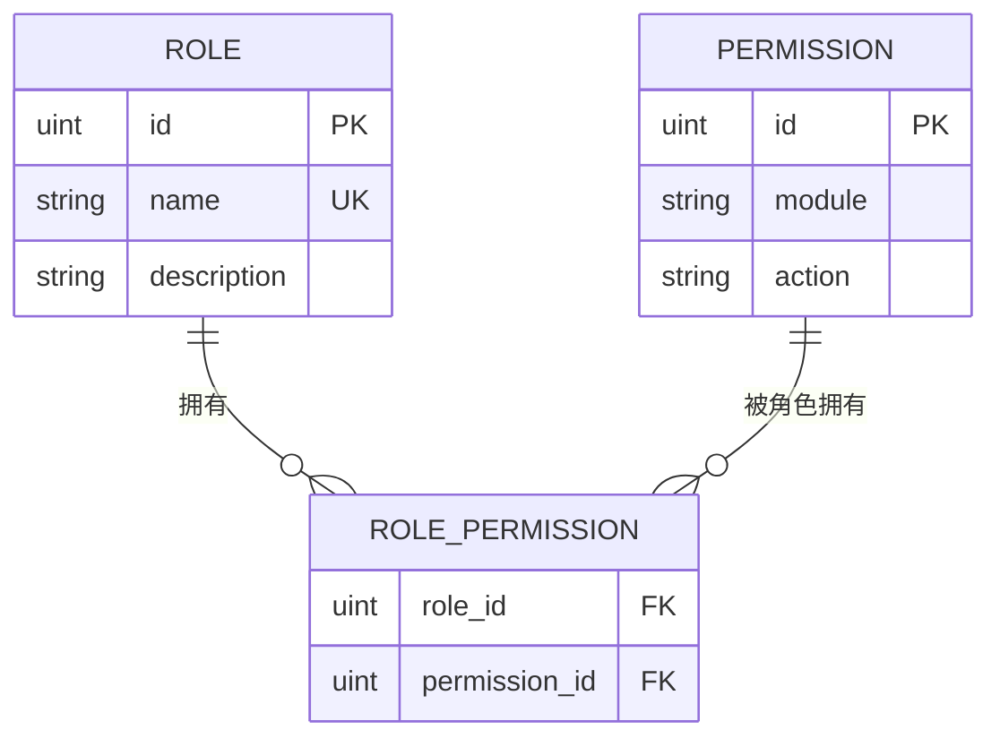
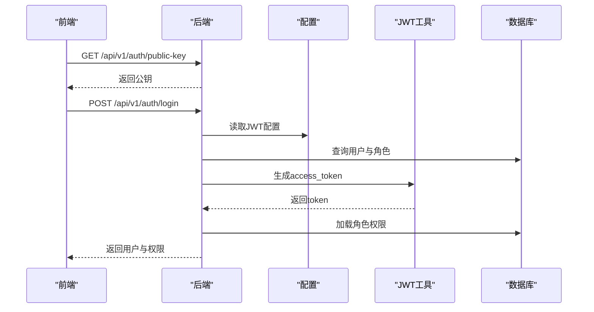
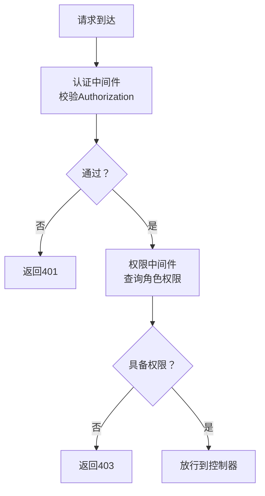
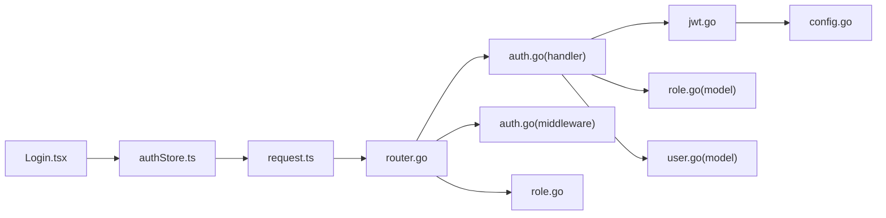

# 认证与权限管理

<cite>
**本文引用的文件**
- [webSource/apps/admin/src/pages/Login.tsx](file://webSource/apps/admin/src/pages/Login.tsx)
- [webSource/apps/admin/src/store/authStore.ts](file://webSource/apps/admin/src/store/authStore.ts)
- [webSource/apps/admin/src/components/AuthGuard.tsx](file://webSource/apps/admin/src/components/AuthGuard.tsx)
- [webSource/packages/shared/src/utils/request.ts](file://webSource/packages/shared/src/utils/request.ts)
- [webSource/packages/shared/src/types/user.ts](file://webSource/packages/shared/src/types/user.ts)
- [server/internal/handler/auth.go](file://server/internal/handler/auth.go)
- [server/internal/middleware/auth.go](file://server/internal/middleware/auth.go)
- [server/internal/middleware/role.go](file://server/internal/middleware/role.go)
- [server/internal/pkg/jwt.go](file://server/internal/pkg/jwt.go)
- [server/internal/dto/auth_dto.go](file://server/internal/dto/auth_dto.go)
- [server/internal/model/role.go](file://server/internal/model/role.go)
- [server/internal/model/user.go](file://server/internal/model/user.go)
- [server/router/router.go](file://server/router/router.go)
- [server/config/config.go](file://server/config/config.go)
</cite>

## 目录
1. [引言](#引言)
2. [项目结构](#项目结构)
3. [核心组件](#核心组件)
4. [架构总览](#架构总览)
5. [详细组件分析](#详细组件分析)
6. [依赖分析](#依赖分析)
7. [性能考虑](#性能考虑)
8. [故障排查指南](#故障排查指南)
9. [结论](#结论)
10. [附录](#附录)

## 引言
本文件面向Xiangmuzs博客平台管理后台的认证与权限系统，围绕登录页面实现、JWT令牌存储与管理、权限状态管理、权限守卫组件、多角色权限体系以及安全最佳实践展开。文档同时提供扩展方案，帮助在不破坏现有架构的前提下新增权限类型与角色。

## 项目结构
管理后台采用前后端分离架构：
- 前端（React + Zustand）：负责登录表单、权限状态管理、请求拦截与守卫组件。
- 后端（Gin + GORM）：提供认证接口、权限中间件、JWT签发与解析、路由级权限控制。

图表来源
- [server/router/router.go:11-104](file://server/router/router.go#L11-L104)
- [server/internal/handler/auth.go:13-163](file://server/internal/handler/auth.go#L13-L163)
- [server/internal/middleware/auth.go:10-38](file://server/internal/middleware/auth.go#L10-L38)
- [server/internal/middleware/role.go:10-43](file://server/internal/middleware/role.go#L10-L43)
- [server/internal/pkg/jwt.go:10-43](file://server/internal/pkg/jwt.go#L10-L43)
- [server/internal/dto/auth_dto.go:3-39](file://server/internal/dto/auth_dto.go#L3-L39)
- [server/internal/model/role.go:5-20](file://server/internal/model/role.go#L5-L20)
- [server/internal/model/user.go:5-17](file://server/internal/model/user.go#L5-L17)
- [webSource/apps/admin/src/pages/Login.tsx:10-118](file://webSource/apps/admin/src/pages/Login.tsx#L10-L118)
- [webSource/apps/admin/src/store/authStore.ts:15-56](file://webSource/apps/admin/src/store/authStore.ts#L15-L56)
- [webSource/packages/shared/src/utils/request.ts:10-38](file://webSource/packages/shared/src/utils/request.ts#L10-L38)
- [webSource/apps/admin/src/components/AuthGuard.tsx:6-38](file://webSource/apps/admin/src/components/AuthGuard.tsx#L6-L38)

章节来源
- [server/router/router.go:11-104](file://server/router/router.go#L11-L104)
- [webSource/apps/admin/src/pages/Login.tsx:10-118](file://webSource/apps/admin/src/pages/Login.tsx#L10-L118)

## 核心组件
- 登录页面：负责表单校验、验证码加载与刷新、调用登录API、设置权限状态并跳转。
- 权限状态存储：Zustand状态管理，持久化JWT到localStorage，提供权限判断方法。
- 请求拦截器：自动注入Authorization头，统一处理401并重定向至登录页。
- 权限守卫组件：在路由层进行认证检查，必要时拉取用户资料并注入权限。
- 后端认证与权限：JWT签发与校验、基于角色的模块/动作权限中间件、路由级权限绑定。

章节来源
- [webSource/apps/admin/src/pages/Login.tsx:43-58](file://webSource/apps/admin/src/pages/Login.tsx#L43-L58)
- [webSource/apps/admin/src/store/authStore.ts:15-56](file://webSource/apps/admin/src/store/authStore.ts#L15-L56)
- [webSource/packages/shared/src/utils/request.ts:10-38](file://webSource/packages/shared/src/utils/request.ts#L10-L38)
- [webSource/apps/admin/src/components/AuthGuard.tsx:6-38](file://webSource/apps/admin/src/components/AuthGuard.tsx#L6-L38)
- [server/internal/handler/auth.go:31-93](file://server/internal/handler/auth.go#L31-L93)
- [server/internal/middleware/auth.go:10-38](file://server/internal/middleware/auth.go#L10-L38)
- [server/internal/middleware/role.go:10-43](file://server/internal/middleware/role.go#L10-L43)

## 架构总览
下图展示从登录到受保护资源访问的完整流程，包括前端状态与后端中间件的协作。

图表来源
- [webSource/apps/admin/src/pages/Login.tsx:43-58](file://webSource/apps/admin/src/pages/Login.tsx#L43-L58)
- [webSource/apps/admin/src/store/authStore.ts:20-23](file://webSource/apps/admin/src/store/authStore.ts#L20-L23)
- [webSource/packages/shared/src/utils/request.ts:10-16](file://webSource/packages/shared/src/utils/request.ts#L10-L16)
- [server/router/router.go:44-102](file://server/router/router.go#L44-L102)
- [server/internal/handler/auth.go:31-93](file://server/internal/handler/auth.go#L31-L93)
- [server/internal/middleware/auth.go:10-38](file://server/internal/middleware/auth.go#L10-L38)
- [server/internal/middleware/role.go:10-43](file://server/internal/middleware/role.go#L10-L43)
- [server/internal/pkg/jwt.go:16-28](file://server/internal/pkg/jwt.go#L16-L28)

## 详细组件分析

### 登录页面实现
- 表单验证：用户名、密码必填；可选验证码输入。
- 错误处理：捕获异常并提示；若启用验证码则重新加载验证码图片。
- 用户体验：加载态、验证码点击刷新、成功后跳转仪表盘。
- 数据流：调用登录API，接收用户与权限信息，写入状态存储。

图表来源
- [webSource/apps/admin/src/pages/Login.tsx:20-58](file://webSource/apps/admin/src/pages/Login.tsx#L20-L58)
- [webSource/apps/admin/src/store/authStore.ts:36-50](file://webSource/apps/admin/src/store/authStore.ts#L36-L50)

章节来源
- [webSource/apps/admin/src/pages/Login.tsx:10-118](file://webSource/apps/admin/src/pages/Login.tsx#L10-L118)
- [webSource/apps/admin/src/store/authStore.ts:36-50](file://webSource/apps/admin/src/store/authStore.ts#L36-L50)

### JWT令牌的存储与管理
- 存储位置：localStorage中以“access_token”键保存JWT。
- 请求拦截：自动在Authorization头中附加Bearer Token。
- 响应拦截：当收到401时清理本地token并重定向到登录页（仅管理后台路径）。
- 过期处理：后端中间件解析失败时返回401，触发前端清理与跳转。

图表来源
- [webSource/apps/admin/src/store/authStore.ts:18-23](file://webSource/apps/admin/src/store/authStore.ts#L18-L23)
- [webSource/packages/shared/src/utils/request.ts:10-35](file://webSource/packages/shared/src/utils/request.ts#L10-L35)
- [server/internal/middleware/auth.go:10-38](file://server/internal/middleware/auth.go#L10-L38)

章节来源
- [webSource/apps/admin/src/store/authStore.ts:15-34](file://webSource/apps/admin/src/store/authStore.ts#L15-L34)
- [webSource/packages/shared/src/utils/request.ts:10-38](file://webSource/packages/shared/src/utils/request.ts#L10-L38)
- [server/internal/middleware/auth.go:10-38](file://server/internal/middleware/auth.go#L10-L38)

### 权限状态管理
- 状态结构：用户信息、权限列表、token。
- 权限判断：hasPermission(module, action)遍历权限匹配。
- 生命周期：应用启动时从localStorage恢复token；登录成功后写入；退出登录时清理。

图表来源
- [webSource/apps/admin/src/store/authStore.ts:15-34](file://webSource/apps/admin/src/store/authStore.ts#L15-L34)

章节来源
- [webSource/apps/admin/src/store/authStore.ts:15-56](file://webSource/apps/admin/src/store/authStore.ts#L15-L56)

### 权限守卫组件
- 作用：在路由层确保用户已认证且具备访问权限。
- 流程：若存在token但无用户信息，则调用获取资料接口并写入状态；若无token则重定向至登录页；处于加载态时显示旋转指示器。

图表来源
- [webSource/apps/admin/src/components/AuthGuard.tsx:6-38](file://webSource/apps/admin/src/components/AuthGuard.tsx#L6-L38)
- [webSource/apps/admin/src/store/authStore.ts:20-23](file://webSource/apps/admin/src/store/authStore.ts#L20-L23)

章节来源
- [webSource/apps/admin/src/components/AuthGuard.tsx:6-38](file://webSource/apps/admin/src/components/AuthGuard.tsx#L6-L38)

### 多角色权限体系
- 角色与权限：角色拥有多个权限，权限由模块与动作组成（如“文章-创建”）。
- 路由级权限：通过RequirePermission中间件按模块/动作校验当前角色是否具备相应权限。
- 用户权限：登录时一次性加载角色的所有权限，前端据此进行UI与功能控制。

图表来源
- [server/internal/model/role.go:5-20](file://server/internal/model/role.go#L5-L20)

章节来源
- [server/internal/model/role.go:5-20](file://server/internal/model/role.go#L5-L20)
- [server/internal/middleware/role.go:10-43](file://server/internal/middleware/role.go#L10-L43)
- [server/router/router.go:58-97](file://server/router/router.go#L58-L97)

### 登录与认证流程（后端）
- 公钥获取：前端通过GET /api/v1/auth/public-key获取RSA公钥用于密码加密。
- 登录校验：若启用验证码需校验；RSA解密密码；校验用户状态与密码；签发JWT；加载角色权限并返回。
- 个人资料：根据token中的用户ID与角色ID加载权限并返回。

图表来源
- [server/internal/handler/auth.go:27-93](file://server/internal/handler/auth.go#L27-L93)
- [server/internal/pkg/jwt.go:16-28](file://server/internal/pkg/jwt.go#L16-L28)
- [server/config/config.go:29-33](file://server/config/config.go#L29-L33)

章节来源
- [server/internal/handler/auth.go:27-118](file://server/internal/handler/auth.go#L27-L118)
- [server/internal/pkg/jwt.go:16-42](file://server/internal/pkg/jwt.go#L16-L42)
- [server/config/config.go:29-33](file://server/config/config.go#L29-L33)

### 权限守卫与路由级控制（后端）
- 认证中间件：从Authorization头解析Bearer Token，校验失败返回401。
- 权限中间件：通过角色-权限关联表查询当前角色是否具备指定模块/动作权限。
- 路由绑定：在路由上直接挂载RequirePermission(db, module, action)实现细粒度控制。

图表来源
- [server/internal/middleware/auth.go:10-38](file://server/internal/middleware/auth.go#L10-L38)
- [server/internal/middleware/role.go:10-43](file://server/internal/middleware/role.go#L10-L43)
- [server/router/router.go:58-97](file://server/router/router.go#L58-L97)

章节来源
- [server/internal/middleware/auth.go:10-38](file://server/internal/middleware/auth.go#L10-L38)
- [server/internal/middleware/role.go:10-43](file://server/internal/middleware/role.go#L10-L43)
- [server/router/router.go:44-102](file://server/router/router.go#L44-L102)

## 依赖分析
- 前端依赖链：Login.tsx → authStore.ts（setAuth、loginApi）→ request.ts（拦截器注入Authorization）→ 后端路由。
- 后端依赖链：router.go → auth.go（处理器）→ jwt.go（签发/解析）→ role.go（权限中间件）→ model/role.go、model/user.go（数据模型）。
- 配置依赖：JWT密钥与过期时间来自配置文件，影响前端拦截器行为与后端签发逻辑。

图表来源
- [webSource/apps/admin/src/pages/Login.tsx:3-8](file://webSource/apps/admin/src/pages/Login.tsx#L3-L8)
- [webSource/apps/admin/src/store/authStore.ts:1-4](file://webSource/apps/admin/src/store/authStore.ts#L1-L4)
- [webSource/packages/shared/src/utils/request.ts:1-8](file://webSource/packages/shared/src/utils/request.ts#L1-L8)
- [server/router/router.go:11-104](file://server/router/router.go#L11-L104)
- [server/internal/handler/auth.go:13-25](file://server/internal/handler/auth.go#L13-L25)
- [server/internal/pkg/jwt.go:10-43](file://server/internal/pkg/jwt.go#L10-L43)
- [server/internal/middleware/auth.go:10-38](file://server/internal/middleware/auth.go#L10-L38)
- [server/internal/middleware/role.go:10-43](file://server/internal/middleware/role.go#L10-L43)
- [server/internal/model/role.go:5-20](file://server/internal/model/role.go#L5-L20)
- [server/internal/model/user.go:5-17](file://server/internal/model/user.go#L5-L17)
- [server/config/config.go:29-33](file://server/config/config.go#L29-L33)

章节来源
- [server/router/router.go:11-104](file://server/router/router.go#L11-L104)
- [server/internal/handler/auth.go:13-25](file://server/internal/handler/auth.go#L13-L25)
- [server/internal/pkg/jwt.go:10-43](file://server/internal/pkg/jwt.go#L10-L43)
- [server/internal/middleware/auth.go:10-38](file://server/internal/middleware/auth.go#L10-L38)
- [server/internal/middleware/role.go:10-43](file://server/internal/middleware/role.go#L10-L43)
- [server/internal/model/role.go:5-20](file://server/internal/model/role.go#L5-L20)
- [server/internal/model/user.go:5-17](file://server/internal/model/user.go#L5-L17)
- [webSource/apps/admin/src/store/authStore.ts:15-56](file://webSource/apps/admin/src/store/authStore.ts#L15-L56)
- [webSource/packages/shared/src/utils/request.ts:10-38](file://webSource/packages/shared/src/utils/request.ts#L10-L38)

## 性能考虑
- 前端：避免频繁读取localStorage；在登录成功后一次性写入用户与权限；守卫组件仅在必要时发起资料请求。
- 后端：权限查询通过预加载角色权限减少N+1查询；JWT签名算法为HS256，计算开销低；路由中间件按需挂载，避免全局拦截带来的额外成本。
- 缓存建议：可在前端对常用权限进行内存缓存，减少重复判断；后端可对热点角色权限做短期缓存（需配合权限变更通知）。

## 故障排查指南
- 登录失败
  - 检查验证码开关与输入是否正确。
  - 确认前端已使用公钥加密密码并正确传递。
  - 查看后端日志确认用户是否存在、状态是否正常、密码是否匹配。
- 401未授权
  - 检查请求头Authorization是否包含Bearer token。
  - 确认JWT未过期且密钥配置一致。
  - 前端拦截器会在401时清理localStorage并跳转登录页。
- 403禁止访问
  - 检查当前角色是否具备目标模块/动作权限。
  - 确认权限中间件已正确挂载到对应路由。
- 守卫组件白屏
  - 检查token存在但用户信息缺失时是否成功拉取资料。
  - 确认网络请求与跨域配置正确。

章节来源
- [webSource/packages/shared/src/utils/request.ts:27-34](file://webSource/packages/shared/src/utils/request.ts#L27-L34)
- [server/internal/middleware/auth.go:12-31](file://server/internal/middleware/auth.go#L12-L31)
- [server/internal/middleware/role.go:12-31](file://server/internal/middleware/role.go#L12-L31)
- [webSource/apps/admin/src/components/AuthGuard.tsx:11-22](file://webSource/apps/admin/src/components/AuthGuard.tsx#L11-L22)

## 结论
该认证与权限系统通过前端状态管理与后端中间件协同，实现了从登录到路由级权限控制的完整闭环。JWT令牌以localStorage持久化，配合请求拦截器与守卫组件保障了用户体验与安全性。多角色权限模型清晰，便于扩展新角色与权限类型。

## 附录

### 安全最佳实践
- CSRF防护：后端通过CORS中间件限制来源，结合SameSite Cookie策略（如使用HTTPOnly + Secure + SameSite）进一步降低风险。
- XSS防护：前端对用户输入进行严格校验与转义；后端对输出内容进行HTML转义；使用Content-Security-Policy限制脚本执行。
- 会话劫持防护：缩短JWT过期时间；启用刷新令牌机制；对敏感操作二次校验（如二次密码确认）；记录登录IP与UA以便审计。
- 密码安全：前端使用RSA公钥加密传输；后端使用强哈希算法存储密码；定期轮换JWT密钥。

### 扩展方案
- 新增权限类型
  - 在后端model/role.go中扩展权限字段或引入更细粒度的权限维度。
  - 在router.go中为相关路由挂载RequirePermission中间件。
  - 在前端authStore.ts中更新权限判断逻辑。
- 新增角色
  - 在数据库中创建角色并分配权限（role_permissions表）。
  - 在前端types/user.ts中补充角色与权限类型定义。
  - 在登录与资料接口中确保返回新角色的权限集合。

章节来源
- [server/internal/model/role.go:14-19](file://server/internal/model/role.go#L14-L19)
- [server/router/router.go:58-97](file://server/router/router.go#L58-L97)
- [webSource/apps/admin/src/store/authStore.ts:30-33](file://webSource/apps/admin/src/store/authStore.ts#L30-L33)
- [webSource/packages/shared/src/types/user.ts:32-42](file://webSource/packages/shared/src/types/user.ts#L32-L42)