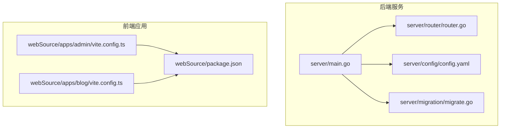
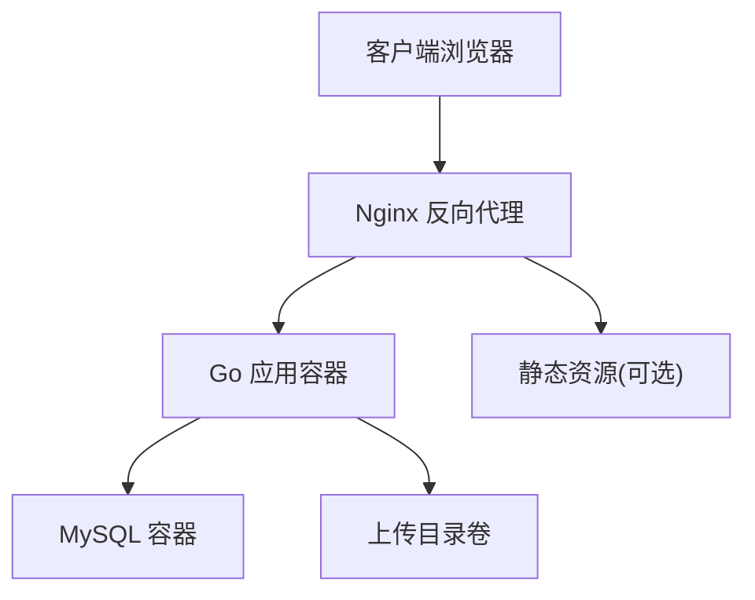
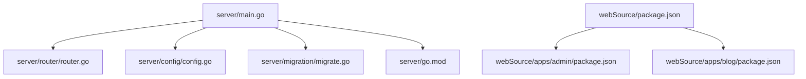

# Docker容器化部署

<cite>
**本文引用的文件**
- [server/main.go](file://server/main.go)
- [server/go.mod](file://server/go.mod)
- [server/config/config.go](file://server/config/config.go)
- [server/config/config.yaml](file://server/config/config.yaml)
- [server/router/router.go](file://server/router/router.go)
- [server/migration/migrate.go](file://server/migration/migrate.go)
- [webSource/package.json](file://webSource/package.json)
- [webSource/apps/admin/vite.config.ts](file://webSource/apps/admin/vite.config.ts)
- [webSource/apps/blog/vite.config.ts](file://webSource/apps/blog/vite.config.ts)
- [webSource/apps/admin/package.json](file://webSource/apps/admin/package.json)
- [webSource/apps/blog/package.json](file://webSource/apps/blog/package.json)
- [.gitignore](file://.gitignore)
</cite>

## 目录
1. [简介](#简介)
2. [项目结构](#项目结构)
3. [核心组件](#核心组件)
4. [架构总览](#架构总览)
5. [详细组件分析](#详细组件分析)
6. [依赖关系分析](#依赖关系分析)
7. [性能考虑](#性能考虑)
8. [故障排查指南](#故障排查指南)
9. [结论](#结论)
10. [附录](#附录)

## 简介
本指南面向Xiangmuzs博客平台的Docker容器化部署，覆盖Docker Engine与Docker Compose安装、Dockerfile编写规范（多阶段构建、镜像优化、安全最佳实践）、docker-compose.yml配置详解（服务定义、网络与卷）、数据库容器配置与数据持久化、应用容器环境变量与健康检查、Nginx反向代理、容器间通信与网络隔离、日志与监控、滚动更新与回滚、资源限制与性能调优、安全加固与漏洞扫描，以及完整的部署命令与验证步骤。

## 项目结构
Xiangmuzs采用前后端分离架构：
- 后端：Go语言实现的Web服务，使用Gin框架与GORM进行MySQL数据库访问，路由集中在router模块，配置通过Viper加载YAML文件。
- 前端：基于React的双应用（管理端与博客前端），使用Vite构建，分别在本地开发时通过代理指向后端服务。
- 构建流程：通过根目录脚本统一构建共享包、两个前端应用、后端Go二进制，并复制配置文件到最终输出目录。

**图表来源**
- [server/main.go:1-77](file://server/main.go#L1-L77)
- [server/router/router.go:1-104](file://server/router/router.go#L1-L104)
- [server/config/config.yaml:1-29](file://server/config/config.yaml#L1-L29)
- [server/migration/migrate.go:1-126](file://server/migration/migrate.go#L1-L126)
- [webSource/apps/admin/vite.config.ts:1-24](file://webSource/apps/admin/vite.config.ts#L1-L24)
- [webSource/apps/blog/vite.config.ts:1-24](file://webSource/apps/blog/vite.config.ts#L1-L24)
- [webSource/package.json:1-22](file://webSource/package.json#L1-L22)

**章节来源**
- [server/main.go:19-76](file://server/main.go#L19-L76)
- [server/config/config.go:47-64](file://server/config/config.go#L47-L64)
- [server/config/config.yaml:1-29](file://server/config/config.yaml#L1-L29)
- [webSource/package.json:11-12](file://webSource/package.json#L11-L12)
- [webSource/apps/admin/vite.config.ts:10-22](file://webSource/apps/admin/vite.config.ts#L10-L22)
- [webSource/apps/blog/vite.config.ts:10-22](file://webSource/apps/blog/vite.config.ts#L10-L22)

## 核心组件
- 应用服务器：基于Gin的HTTP服务，监听配置中的端口，默认8080；支持调试模式切换；静态文件映射上传目录。
- 路由系统：按公开接口、公开文章查询、认证接口、管理接口等分组组织，权限控制通过中间件实现。
- 配置系统：通过Viper从YAML加载配置，包含服务端口、数据库连接、JWT密钥与过期时间、上传路径与大小限制、博客基础URL。
- 数据迁移与初始化：启动时自动迁移模型并填充默认权限、角色与管理员账户。
- 前端构建：通过根脚本统一构建共享包、管理端、博客前端与后端二进制，并复制配置文件至输出目录。

**章节来源**
- [server/main.go:19-76](file://server/main.go#L19-L76)
- [server/router/router.go:11-103](file://server/router/router.go#L11-L103)
- [server/config/config.go:7-43](file://server/config/config.go#L7-L43)
- [server/config/config.yaml:1-29](file://server/config/config.yaml#L1-L29)
- [server/migration/migrate.go:13-38](file://server/migration/migrate.go#L13-L38)
- [webSource/package.json:11-12](file://webSource/package.json#L11-L12)

## 架构总览
下图展示容器化后的典型拓扑：Nginx作为反向代理，将请求转发至后端应用容器；后端应用连接独立的MySQL容器；前端静态资源由Nginx提供或由后端静态目录暴露。

[此图为概念性架构示意，不直接映射具体源码文件，故无图表来源]

## 详细组件分析

### Dockerfile编写规范
- 多阶段构建
  - 第一阶段：使用完整工具链编译Go二进制，确保构建产物最小化。
  - 第二阶段：仅拷贝运行所需的二进制与配置文件，避免携带编译工具链。
- 镜像优化
  - 使用最小基础镜像（如distroless或alpine）。
  - 清理包缓存与临时文件，减少层数与镜像体积。
  - 合理合并RUN指令，降低层数。
- 安全最佳实践
  - 非root用户运行应用进程。
  - 移除不必要的文件与敏感信息（如.git目录、IDE配置）。
  - 使用只读根文件系统与最小权限挂载。
  - 在CI中集成镜像漏洞扫描。

[本节为通用指导，未直接分析具体文件，故无章节来源]

### docker-compose.yml配置详解
- 服务定义
  - app：运行后端Go应用，暴露端口，挂载上传目录卷，依赖网络。
  - mysql：持久化数据卷，设置时区与字符集，初始化数据库。
  - nginx：反向代理，映射80/443端口，挂载静态资源或后端上传目录。
- 网络配置
  - 自定义桥接网络，便于容器间通过服务名通信。
  - 将app与mysql置于同一网络，nginx通过服务名访问app。
- 卷挂载
  - MySQL数据卷：/var/lib/mysql，确保重启不丢失数据。
  - 上传目录卷：/app/uploads，持久化媒体文件。
  - 静态资源卷：可选，用于Nginx直接提供前端构建产物。

[本节为通用指导，未直接分析具体文件，故无章节来源]

### 数据库容器配置与数据持久化
- 连接参数
  - 主机：mysql服务名（compose网络内解析）
  - 端口：3306
  - 用户/密码/库名/字符集：来自后端配置文件
- 持久化策略
  - 使用命名卷或绑定挂载保存MySQL数据目录。
  - 初始化脚本或启动时迁移自动完成表结构与种子数据。
- 健康检查
  - 使用mysqladmin或自定义探针检测数据库可用性。

**章节来源**
- [server/config/config.yaml:5-11](file://server/config/config.yaml#L5-L11)
- [server/migration/migrate.go:13-38](file://server/migration/migrate.go#L13-L38)

### 应用容器环境变量与健康检查
- 环境变量
  - 通过环境变量覆盖配置文件项：服务端口、数据库主机/端口/用户名/密码/库名/字符集、JWT密钥、上传路径、博客基础URL。
  - 示例键名：SERVER_PORT、DATABASE_HOST、DATABASE_PORT、DATABASE_USER、DATABASE_PASSWORD、DATABASE_NAME、DATABASE_CHARSET、JWT_SECRET、UPLOAD_PATH、BLOG_BASE_URL。
- 健康检查
  - HTTP健康检查：对应用根路径或特定健康端点发起GET请求。
  - TCP健康检查：探测端口连通性。
  - 执行命令：检查进程状态或curl返回码。

**章节来源**
- [server/config/config.go:7-43](file://server/config/config.go#L7-L43)
- [server/config/config.yaml:1-29](file://server/config/config.yaml#L1-L29)

### Nginx反向代理配置
- 代理规则
  - 将/api前缀代理至后端应用地址。
  - 将/uploads前缀代理至后端应用地址，实现媒体直传。
- 静态资源
  - 提供前端构建产物目录（如web/blog与web/admin）。
- SSL/TLS
  - 可结合Let’s Encrypt或外部证书管理方案。
- 缓存与压缩
  - 对静态资源启用缓存与gzip压缩提升性能。

[本节为通用指导，未直接分析具体文件，故无章节来源]

### 容器间通信与网络隔离
- 网络隔离
  - 使用自定义bridge网络，仅开放必要端口。
  - app与mysql在同一网络，nginx通过服务名访问app。
- 服务发现
  - 通过服务名进行内部DNS解析，避免硬编码IP。
- 防火墙与入站规则
  - 仅暴露Nginx端口，内部服务不对外暴露。

[本节为通用指导，未直接分析具体文件，故无章节来源]

### 日志管理与监控
- 日志
  - 应用容器标准输出重定向至JSON驱动的日志驱动，便于集中收集。
  - Nginx访问/错误日志按需挂载至宿主机或专用卷。
- 监控
  - Prometheus指标导出（如应用内置metrics端点）。
  - Grafana可视化面板。
  - 健康检查失败告警。

[本节为通用指导，未直接分析具体文件，故无章节来源]

### 滚动更新与回滚策略
- 更新策略
  - 使用Compose的rolling update配置，设置最大并发更新数与暂停时间。
  - 分批重启，确保服务可用性。
- 回滚策略
  - 使用版本化的镜像标签，失败时回退至上一个稳定版本。
  - 结合Compose的rollback功能或手动回滚。

[本节为通用指导，未直接分析具体文件，故无章节来源]

### 资源限制与性能调优
- 资源限制
  - CPU/内存配额，防止资源争用。
  - 设置启动顺序与延迟，确保数据库就绪后再启动应用。
- 性能调优
  - 连接池参数优化（最大连接数、空闲连接、超时）。
  - Gzip压缩与静态资源缓存。
  - CDN加速静态资源。

[本节为通用指导，未直接分析具体文件，故无章节来源]

### 安全加固与漏洞扫描
- 安全加固
  - 非root运行、只读根文件系统、最小权限卷。
  - 禁用不必要的系统调用与capabilities。
  - 网络策略限制入站流量。
- 漏洞扫描
  - CI中集成镜像扫描（如Trivy、Clair）。
  - 定期更新基础镜像与依赖。

[本节为通用指导，未直接分析具体文件，故无章节来源]

## 依赖关系分析
后端应用的依赖主要集中在Go模块与数据库驱动，前端通过Vite与React生态构建。

**图表来源**
- [server/main.go:3-16](file://server/main.go#L3-L16)
- [server/go.mod:5-12](file://server/go.mod#L5-L12)
- [webSource/package.json:1-22](file://webSource/package.json#L1-L22)

**章节来源**
- [server/go.mod:1-60](file://server/go.mod#L1-L60)
- [server/main.go:3-16](file://server/main.go#L3-L16)
- [webSource/package.json:1-22](file://webSource/package.json#L1-L22)

## 性能考虑
- 启动顺序与健康检查：先启动数据库，再启动应用，避免冷启动失败。
- 连接池：合理设置最大连接数与空闲连接，避免连接风暴。
- 静态资源：Nginx提供静态资源，减轻应用压力。
- 缓存：Redis或应用层缓存热点数据（如配置项）。
- 监控：Prometheus+Grafana观测CPU、内存、QPS、响应时间。

[本节为通用指导，未直接分析具体文件，故无章节来源]

## 故障排查指南
- 应用无法启动
  - 检查配置文件是否正确挂载与加载。
  - 查看数据库连接参数与网络连通性。
- 数据库迁移失败
  - 确认数据库已初始化且具备相应权限。
  - 检查迁移脚本执行日志。
- 上传文件异常
  - 检查上传目录卷权限与磁盘空间。
  - 确认Nginx或应用对/uploads路径的代理配置。
- 健康检查失败
  - 检查端口占用与防火墙规则。
  - 查看应用日志定位错误。

**章节来源**
- [server/config/config.yaml:1-29](file://server/config/config.yaml#L1-L29)
- [server/migration/migrate.go:13-38](file://server/migration/migrate.go#L13-L38)
- [.gitignore:7-14](file://.gitignore#L7-L14)

## 结论
通过Docker容器化，Xiangmuzs博客平台可以实现快速部署、弹性扩缩容与安全隔离。建议在生产环境中配合Nginx反向代理、数据库持久化卷、完善的健康检查与监控体系，并持续进行镜像安全扫描与更新。

## 附录

### 完整部署命令与验证步骤
- 安装Docker与Docker Compose
  - 安装Docker Engine与Docker Compose（参考官方文档）。
- 构建前端与后端
  - 在根目录执行构建脚本，生成web目录与后端二进制。
  - 参考脚本路径：[webSource/package.json:11-12](file://webSource/package.json#L11-L12)
- 准备配置文件
  - 将后端配置文件复制到构建输出目录，确保容器内可读。
  - 参考配置项：[server/config/config.yaml:1-29](file://server/config/config.yaml#L1-29)
- 启动容器
  - 使用docker compose up -d启动所有服务。
- 验证
  - 访问Nginx入口，确认前端页面加载正常。
  - 访问/api/v1/public/articles等公开接口，确认后端响应。
  - 登录管理后台，确认鉴权与媒体上传功能。
  - 查看容器日志与健康检查状态。

[本节为通用指导，未直接分析具体文件，故无章节来源]