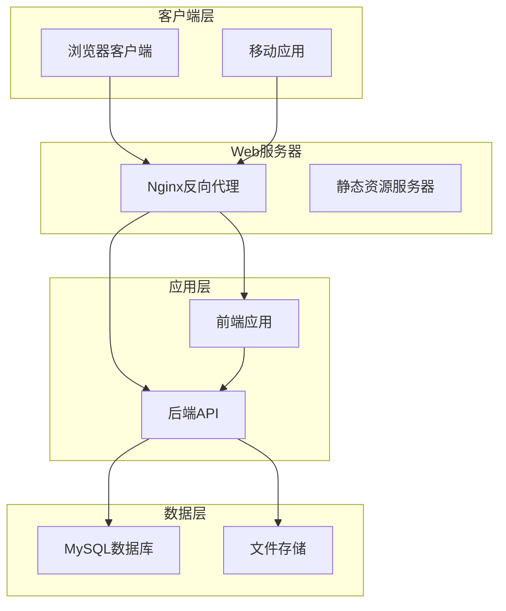
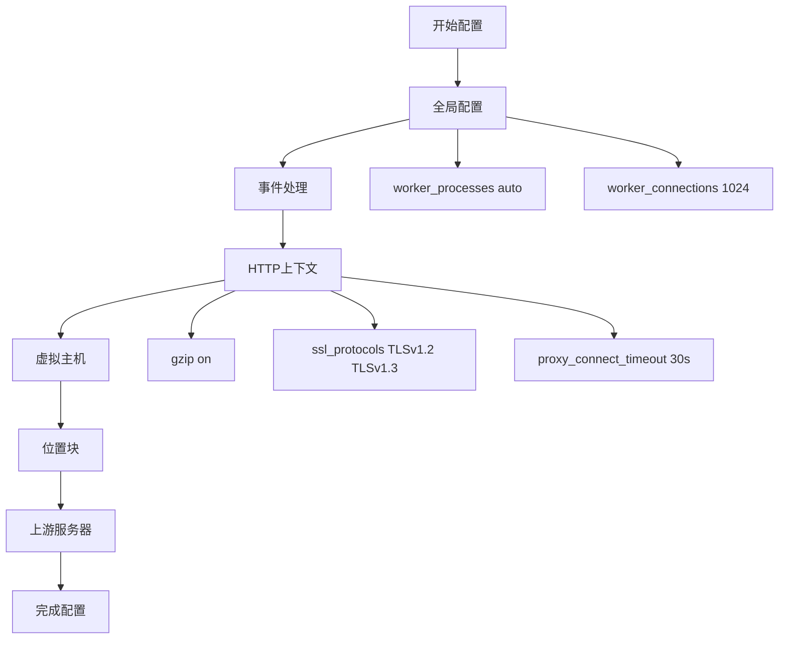
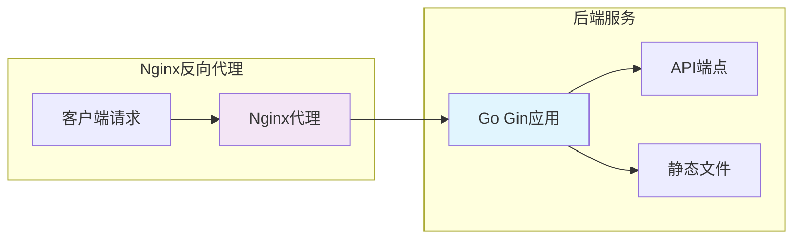
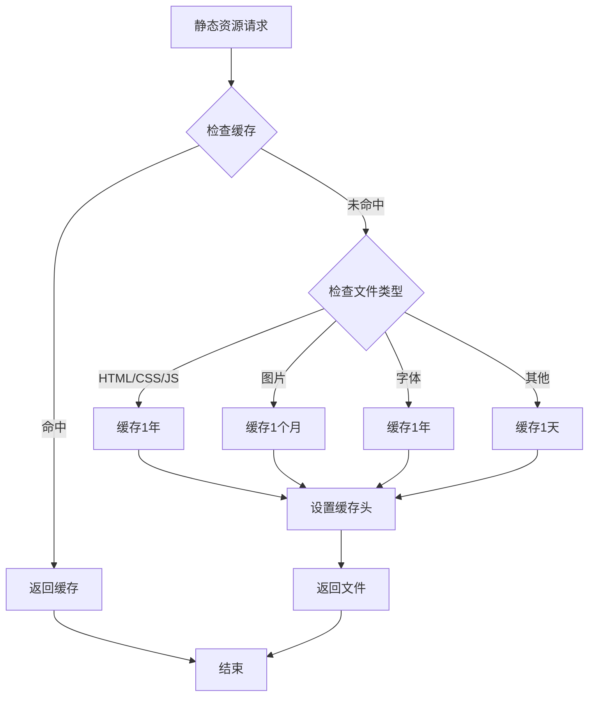
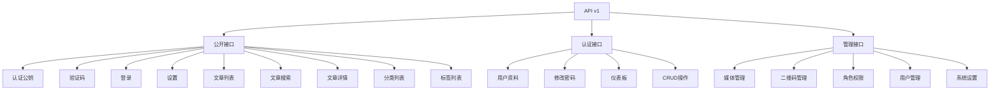
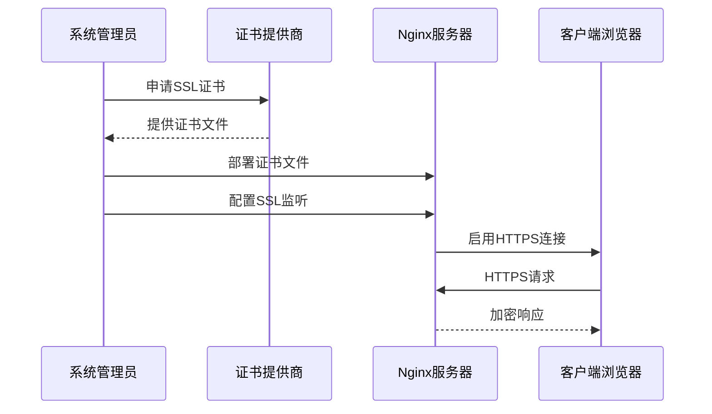
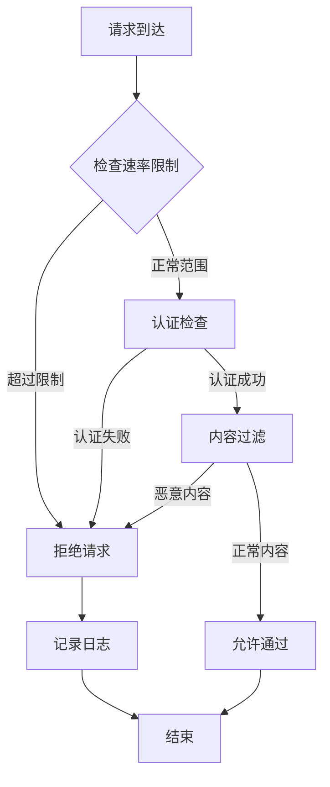
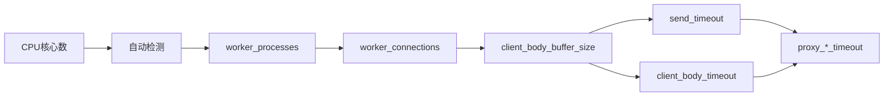
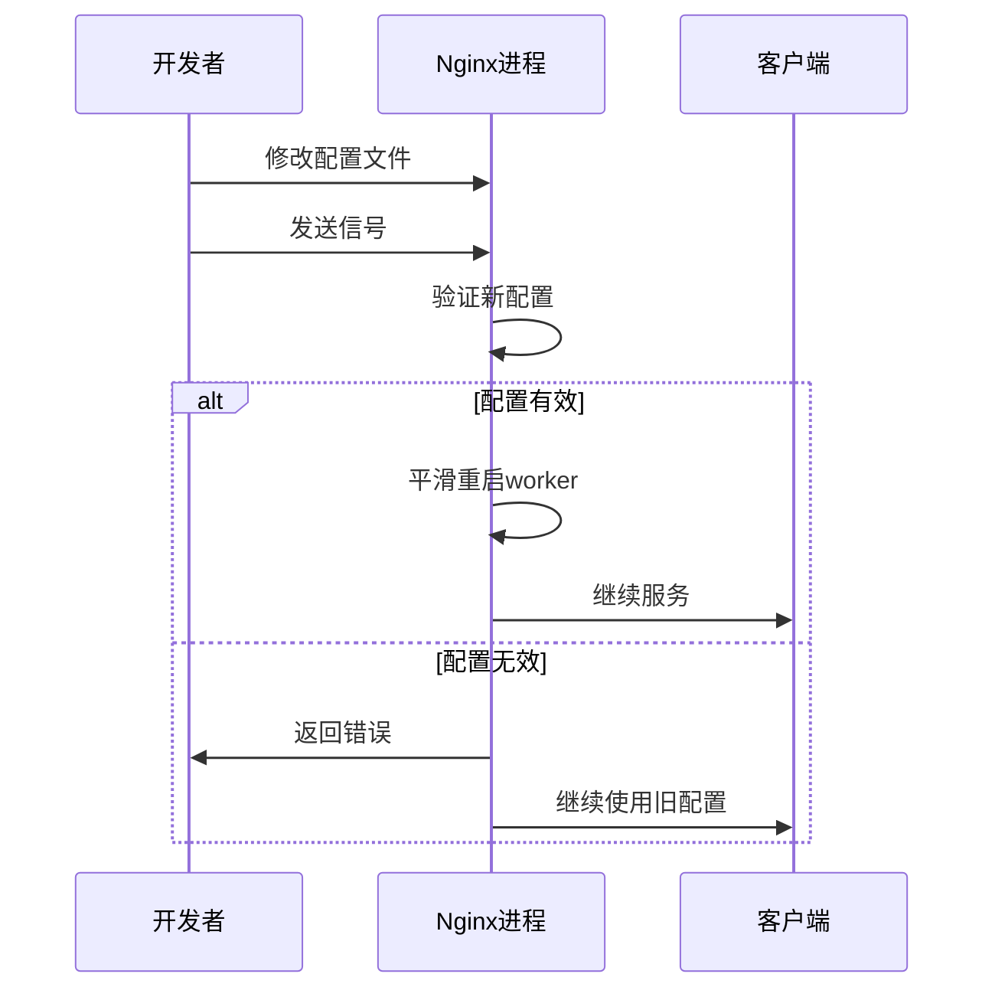
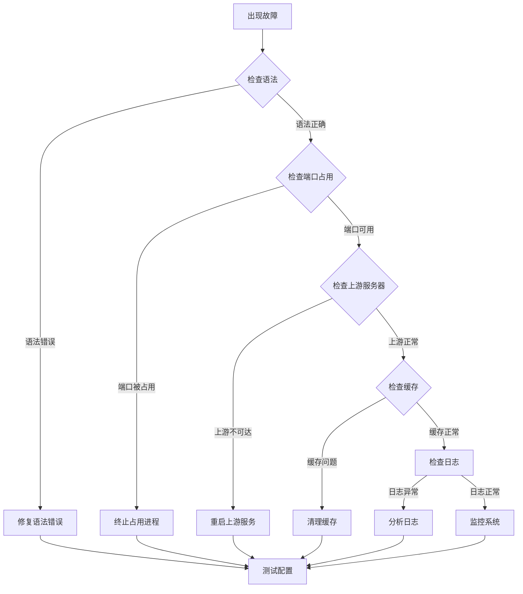

# Nginx配置

<cite>
**本文档引用的文件**
- [server/config/config.go](file://server/config/config.go)
- [server/config/config.yaml](file://server/config/config.yaml)
- [server/main.go](file://server/main.go)
- [server/router/router.go](file://server/router/router.go)
- [server/internal/middleware/auth.go](file://server/internal/middleware/auth.go)
- [server/internal/middleware/cors.go](file://server/internal/middleware/cors.go)
- [webSource/apps/blog/vite.config.ts](file://webSource/apps/blog/vite.config.ts)
- [webSource/apps/admin/vite.config.ts](file://webSource/apps/admin/vite.config.ts)
- [webSource/package.json](file://webSource/package.json)
- [web/blog/index.html](file://web/blog/index.html)
- [web/admin/index.html](file://web/admin/index.html)
</cite>

## 目录
1. [简介](#简介)
2. [项目架构概览](#项目架构概览)
3. [Nginx安装与基础配置](#nginx安装与基础配置)
4. [反向代理配置](#反向代理配置)
5. [静态资源服务配置](#静态资源服务配置)
6. [API接口转发规则](#api接口转发规则)
7. [SSL/TLS证书配置](#ssl/tls证书配置)
8. [压缩与HTTP/2支持](#压缩与http/2支持)
9. [安全配置](#安全配置)
10. [缓存与CDN集成](#缓存与cdn集成)
11. [性能优化配置](#性能优化配置)
12. [日志配置与监控](#日志配置与监控)
13. [配置验证与热重载](#配置验证与热重载)
14. [故障排除指南](#故障排除指南)
15. [总结](#总结)

## 简介

Xiangmuzs博客平台是一个现代化的全栈博客系统，采用前后端分离架构设计。该平台需要一个完善的Nginx配置来实现高效的静态资源服务、API代理转发、SSL安全保护以及性能优化。本文档提供了针对该平台的完整Nginx配置指南，涵盖从基础安装到高级优化的所有方面。

## 项目架构概览

平台采用微服务架构，包含以下关键组件：



**图表来源**
- [server/main.go:19-76](file://server/main.go#L19-L76)
- [server/router/router.go:11-103](file://server/router/router.go#L11-L103)

**章节来源**
- [server/main.go:19-76](file://server/main.go#L19-L76)
- [server/router/router.go:11-103](file://server/router/router.go#L11-L103)

## Nginx安装与基础配置

### 版本选择与模块编译

对于Xiangmuzs博客平台，建议使用Nginx稳定版（>=1.20.0），以获得最佳的性能和安全性支持。推荐编译包含以下核心模块：

- **HTTP/2模块**：支持现代浏览器的HTTP/2协议
- **Gzip压缩模块**：提供静态内容压缩
- **SSL/TLS模块**：支持HTTPS加密传输
- **HTTP缓存模块**：实现静态资源缓存
- **HTTP限流模块**：提供DDoS防护能力

### 基础配置结构



**图表来源**
- [server/config/config.yaml:1-29](file://server/config/config.yaml#L1-L29)
- [server/main.go:71-75](file://server/main.go#L71-L75)

### 核心配置参数

| 参数 | 建议值 | 说明 |
|------|--------|------|
| worker_processes | auto | 自动检测CPU核心数 |
| worker_connections | 1024 | 每个worker的最大连接数 |
| keepalive_timeout | 65s | 连接保持时间 |
| client_max_body_size | 10M | 最大请求体大小 |
| send_timeout | 10s | 发送超时时间 |

**章节来源**
- [server/config/config.yaml:1-29](file://server/config/config.yaml#L1-L29)
- [server/main.go:71-75](file://server/main.go#L71-L75)

## 反向代理配置

### 上游服务器定义

根据项目配置，后端服务运行在本地端口8080：



**图表来源**
- [server/config/config.yaml:27-28](file://server/config/config.yaml#L27-L28)
- [webSource/apps/blog/vite.config.ts:13-20](file://webSource/apps/blog/vite.config.ts#L13-L20)

### 负载均衡策略

对于单一后端实例，可配置以下策略：

```nginx
upstream backend {
    server 127.0.0.1:8080 weight=10 max_fails=3 fail_timeout=30s;
    keepalive 32;
}

server {
    listen 80;
    server_name localhost;
    
    location / {
        proxy_pass http://backend;
        proxy_http_version 1.1;
        proxy_set_header Connection "";
        proxy_set_header Host $host;
        proxy_set_header X-Real-IP $remote_addr;
        proxy_set_header X-Forwarded-For $proxy_add_x_forwarded_for;
        proxy_set_header X-Forwarded-Proto $scheme;
    }
}
```

**章节来源**
- [server/config/config.yaml:27-28](file://server/config/config.yaml#L27-L28)
- [webSource/apps/blog/vite.config.ts:13-20](file://webSource/apps/blog/vite.config.ts#L13-L20)

## 静态资源服务配置

### 静态文件目录结构

根据配置，静态资源主要分为三类：

1. **前端构建产物**：位于`/web/blog`和`/web/admin`
2. **上传文件**：位于`/server/uploads`
3. **系统生成文件**：如配置文件等

### 缓存策略配置



**图表来源**
- [server/main.go:64-66](file://server/main.go#L64-L66)
- [server/config/config.yaml:18-25](file://server/config/config.yaml#L18-L25)

### 安全头配置

```nginx
location ~* \.(css|js)$ {
    add_header Cache-Control "public, max-age=31536000, immutable";
    add_header Strict-Transport-Security "max-age=31536000; includeSubDomains";
    add_header X-Content-Type-Options "nosniff";
    add_header X-Frame-Options "DENY";
    add_header X-XSS-Protection "1; mode=block";
}

location ~* \.(jpg|jpeg|png|gif|ico|svg)$ {
    add_header Cache-Control "public, max-age=2592000";
    add_header Expires "Thu, 31 Dec 2037 23:59:59 GMT";
    add_header X-Content-Type-Options "nosniff";
}

location ~* \.(woff|woff2|eot|ttf|otf)$ {
    add_header Cache-Control "public, max-age=31536000, immutable";
    add_header Access-Control-Allow-Origin "*";
}
```

**章节来源**
- [server/main.go:64-66](file://server/main.go#L64-L66)
- [server/config/config.yaml:18-25](file://server/config/config.yaml#L18-L25)

## API接口转发规则

### API路由结构分析

根据路由配置，API采用统一前缀`/api/v1`，包含以下分组：



**图表来源**
- [server/router/router.go:24-102](file://server/router/router.go#L24-L102)

### 请求头传递配置

```nginx
location /api/ {
    proxy_pass http://backend/;
    proxy_http_version 1.1;
    proxy_set_header Upgrade $http_upgrade;
    proxy_set_header Connection "upgrade";
    
    # 传递必要的头部信息
    proxy_set_header Host $host;
    proxy_set_header X-Real-IP $remote_addr;
    proxy_set_header X-Forwarded-For $proxy_add_x_forwarded_for;
    proxy_set_header X-Forwarded-Proto $scheme;
    proxy_set_header Authorization $http_authorization;
    proxy_set_header Cookie $http_cookie;
    
    # 设置超时
    proxy_connect_timeout 30s;
    proxy_send_timeout 30s;
    proxy_read_timeout 30s;
}

location /uploads/ {
    proxy_pass http://backend/uploads/;
    proxy_set_header Host $host;
    proxy_set_header X-Real-IP $remote_addr;
    proxy_set_header X-Forwarded-For $proxy_add_x_forwarded_for;
}
```

**章节来源**
- [server/router/router.go:24-102](file://server/router/router.go#L24-L102)
- [server/internal/middleware/auth.go:10-37](file://server/internal/middleware/auth.go#L10-L37)

## SSL/TLS证书配置

### 证书安装流程



**图表来源**
- [server/config/config.yaml:27-28](file://server/config/config.yaml#L27-L28)

### 加密套件配置

```nginx
server {
    listen 443 ssl http2;
    server_name localhost;
    
    # SSL证书配置
    ssl_certificate /etc/nginx/ssl/fullchain.pem;
    ssl_certificate_key /etc/nginx/ssl/private.key;
    
    # 加密套件
    ssl_protocols TLSv1.2 TLSv1.3;
    ssl_ciphers ECDHE-RSA-AES256-GCM-SHA512:DHE-RSA-AES256-GCM-SHA512:ECDHE-RSA-AES256-GCM-SHA384:DHE-RSA-AES256-GCM-SHA384;
    ssl_prefer_server_ciphers off;
    
    # 安全头
    add_header Strict-Transport-Security "max-age=31536000; includeSubDomains" always;
    add_header X-Frame-Options "SAMEORIGIN" always;
    add_header X-Content-Type-Options "nosniff" always;
    
    # OCSP Stapling
    ssl_stapling on;
    ssl_stapling_verify on;
}
```

**章节来源**
- [server/config/config.yaml:27-28](file://server/config/config.yaml#L27-L28)

## 压缩与HTTP/2支持

### Gzip压缩配置

```nginx
# 全局Gzip设置
gzip on;
gzip_vary on;
gzip_min_length 1024;
gzip_comp_level 6;
gzip_types
    text/plain
    text/css
    text/xml
    text/javascript
    application/json
    application/javascript
    application/xml+rss
    application/atom+xml
    image/svg+xml;

# HTTP/2配置
server {
    listen 443 ssl http2;
    # ... 其他配置
}
```

### 动态内容压缩

```nginx
location ~* \.(js|css|html|json|xml|txt)$ {
    gzip_static on;
    gzip_vary on;
    expires 1y;
    add_header Cache-Control "public, immutable";
}

location ~* \.(jpg|jpeg|png|gif|ico)$ {
    expires 1M;
    add_header Cache-Control "public";
}
```

**章节来源**
- [server/router/router.go:24-102](file://server/router/router.go#L24-L102)

## 安全配置

### 防DDoS配置



**图表来源**
- [server/internal/middleware/auth.go:10-37](file://server/internal/middleware/auth.go#L10-L37)

### 访问控制配置

```nginx
# IP白名单
geo $allowed_ip {
    default 0;
    127.0.0.1/32 1;
    192.168.0.0/16 1;
}

# 速率限制
limit_req_zone $binary_remote_addr zone=api:10m rate=10r/s;
limit_req_zone $binary_remote_addr zone=admin:10m rate=5r/s;

server {
    # API访问控制
    location /api/ {
        limit_req zone=api burst=20 nodelay;
        
        # CORS配置
        add_header Access-Control-Allow-Origin "*";
        add_header Access-Control-Allow-Methods "GET,POST,PUT,DELETE,OPTIONS";
        add_header Access-Control-Allow-Headers "Content-Type,Authorization";
        
        # 防止直接访问
        location ~ /\. {
            deny all;
        }
    }
    
    # 管理后台访问控制
    location /admin/ {
        limit_req zone=admin burst=10 nodelay;
        
        # IP白名单
        allow 127.0.0.1/32;
        allow 192.168.0.0/16;
        deny all;
    }
}
```

**章节来源**
- [server/internal/middleware/cors.go:7-21](file://server/internal/middleware/cors.go#L7-L21)
- [server/internal/middleware/auth.go:10-37](file://server/internal/middleware/auth.go#L10-L37)

## 缓存与CDN集成

### 本地缓存配置

```nginx
# 静态资源缓存
location ~* \.(css|js|jpg|jpeg|png|gif|ico|svg|woff|woff2|eot|ttf|otf)$ {
    expires 1y;
    add_header Cache-Control "public, immutable";
    add_header Vary Accept-Encoding;
}

# 动态内容缓存
location /api/public/articles/ {
    proxy_cache cache_api;
    proxy_cache_valid 200 10m;
    proxy_cache_valid 404 1m;
    proxy_cache_use_stale error timeout updating http_500 http_502 http_503 http_504;
    proxy_cache_lock on;
    
    proxy_pass http://backend;
}

# 缓存键配置
proxy_cache_key "$scheme$request_method$host$request_uri";
```

### CDN集成配置

```nginx
# CDN缓存头
location ~* \.(css|js|jpg|jpeg|png|gif|ico|svg)$ {
    add_header Cache-Control "public, max-age=31536000, immutable";
    add_header Expires "Thu, 31 Dec 2037 23:59:59 GMT";
    add_header Edge-Control "cache-maxage=31536000";
}

# CDN预热脚本
# curl -X PURGE "https://your-domain.com/assets/style.css"
# curl -X PURGE "https://your-domain.com/api/public/articles"
```

**章节来源**
- [server/router/router.go:32-42](file://server/router/router.go#L32-L42)

## 性能优化配置

### Worker进程优化



**图表来源**
- [server/config/config.yaml:27-28](file://server/config/config.yaml#L27-L28)

### 连接池配置

```nginx
upstream backend {
    server 127.0.0.1:8080 max_fails=3 fail_timeout=30s;
    keepalive 32;
}

server {
    # 连接优化
    keepalive_requests 1000;
    keepalive_timeout 65s;
    
    # 缓冲区优化
    client_body_buffer_size 128k;
    client_max_body_size 10M;
    client_body_timeout 15s;
    
    # 发送缓冲区
    send_lowat 16384;
    postpone_output 1460;
    
    # 接收缓冲区
    client_header_buffer_size 3k;
    large_client_header_buffers 4 8k;
}
```

**章节来源**
- [server/config/config.yaml:27-28](file://server/config/config.yaml#L27-L28)

## 日志配置与监控

### 访问日志配置

```nginx
# 结构化日志格式
log_format json_combined escape=json {
    "@timestamp": "$time_iso8601",
    "@version": "1",
    "client": "$remote_addr",
    "user_agent": "$http_user_agent",
    "request": "$request",
    "status": "$status",
    "bytes": "$body_bytes_sent",
    "referer": "$http_referer",
    "forwarded_for": "$http_x_forwarded_for",
    "response_time": "$request_time",
    "upstream_response_time": "$upstream_response_time",
    "upstream_status": "$upstream_status"
};

# 访问日志
access_log /var/log/nginx/access.log json_combined;

# 错误日志
error_log /var/log/nginx/error.log warn;
```

### 性能监控指标

```nginx
# 自定义变量
map $status $loggable {
    ~^[23]  0;
    default 1;
}

# 条件日志
access_log /var/log/nginx/access.log combined if=$loggable;
access_log /var/log/nginx/slow.log combined if=$request_time>1;
```

**章节来源**
- [server/main.go:71-75](file://server/main.go#L71-L75)

## 配置验证与热重载

### 配置文件验证

```bash
# 验证Nginx配置语法
sudo nginx -t

# 测试配置文件
sudo nginx -T

# 检查配置文件
sudo nginx -c /etc/nginx/nginx.conf

# 查看加载的模块
nginx -V 2>&1 | grep -i with
```

### 热重载配置



**图表来源**
- [server/config/config.yaml:27-28](file://server/config/config.yaml#L27-L28)

### 自动化部署脚本

```bash
#!/bin/bash
# deploy.sh

echo "开始部署Nginx配置..."

# 备份当前配置
cp /etc/nginx/nginx.conf /etc/nginx/nginx.conf.backup.$(date +%Y%m%d_%H%M%S)

# 复制新配置
cp nginx.conf /etc/nginx/nginx.conf

# 验证配置
if sudo nginx -t; then
    echo "配置验证通过"
    # 热重载
    sudo nginx -s reload
    echo "Nginx已重新加载"
else
    echo "配置验证失败，恢复备份"
    cp /etc/nginx/nginx.conf.backup.$(date +%Y%m%d_%H%M%S) /etc/nginx/nginx.conf
fi
```

**章节来源**
- [server/config/config.yaml:27-28](file://server/config/config.yaml#L27-L28)

## 故障排除指南

### 常见问题诊断



**图表来源**
- [server/main.go:71-75](file://server/main.go#L71-L75)

### 性能调优建议

| 问题类型 | 诊断方法 | 解决方案 |
|----------|----------|----------|
| 高延迟 | 使用`curl -w`测试 | 增加worker_connections，启用HTTP/2 |
| 内存泄漏 | 监控内存使用 | 调整worker_process数量，优化缓存 |
| 连接超时 | 检查proxy_timeout | 增加超时时间，优化上游响应 |
| 缓存失效 | 分析缓存命中率 | 调整缓存策略，优化缓存键 |

### 监控工具集成

```nginx
# Prometheus监控指标
location /metrics {
    auth_basic "Prometheus Monitoring";
    allow 127.0.0.1;
    deny all;
    
    add_header Content-Type "text/plain";
}

# 健康检查
location /health {
    access_log off;
    return 200 "healthy\n";
}
```

**章节来源**
- [server/main.go:71-75](file://server/main.go#L71-L75)

## 总结

Xiangmuzs博客平台的Nginx配置需要综合考虑性能、安全性和可维护性。通过合理的反向代理配置、静态资源缓存策略、SSL/TLS安全保护以及性能优化措施，可以为用户提供稳定高效的博客体验。

关键要点包括：
- 使用HTTP/2和Gzip压缩提升性能
- 实施严格的SSL/TLS配置和安全头
- 配置合理的缓存策略和CDN集成
- 建立完善的日志监控和故障排除机制
- 采用自动化部署和热重载确保系统稳定性

建议定期审查和优化配置，根据实际使用情况进行调整，以达到最佳的性能表现和用户体验。