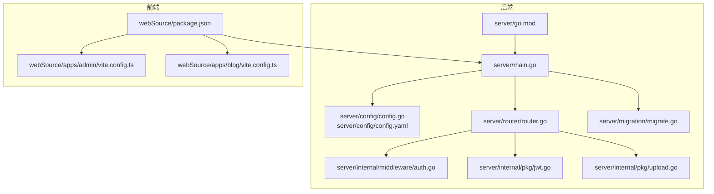
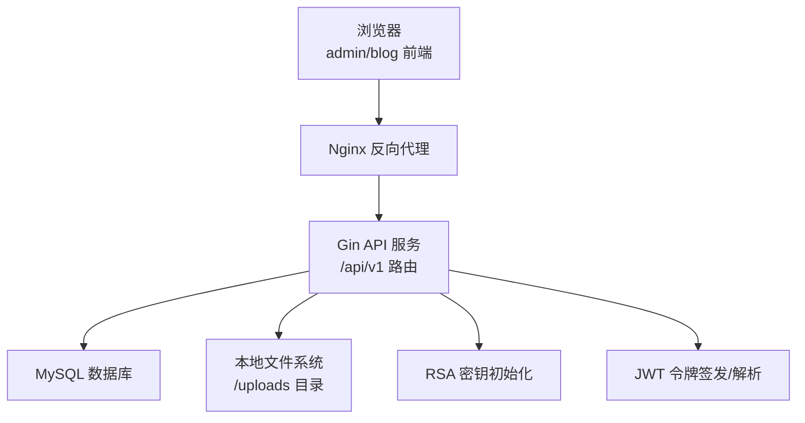
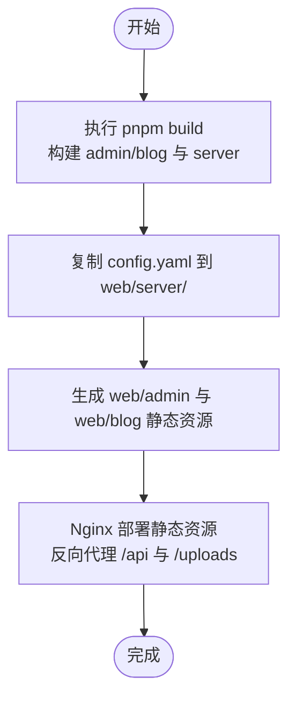
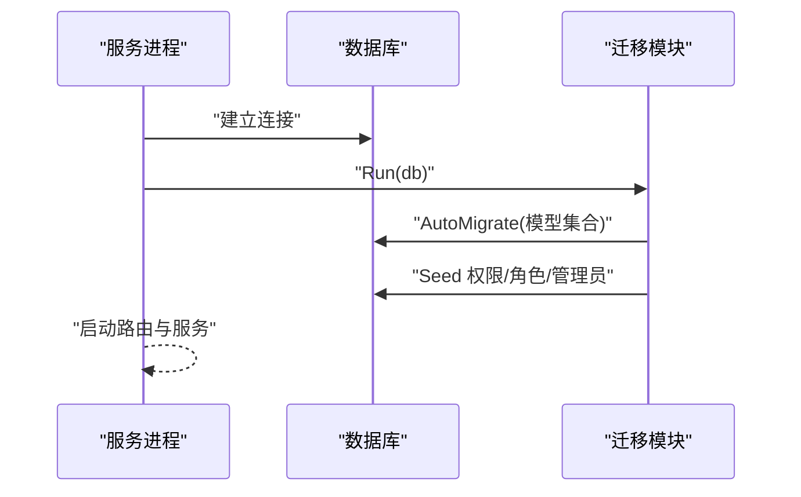
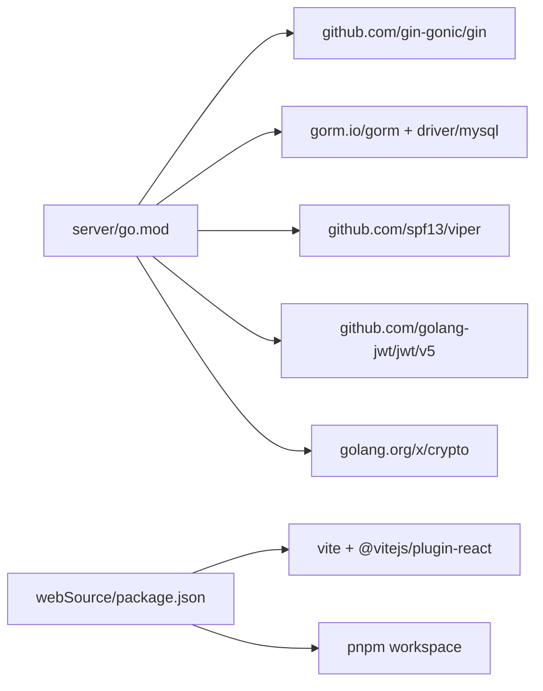

# 传统部署

<cite>
**本文引用的文件**
- [server/main.go](file://server/main.go)
- [server/config/config.go](file://server/config/config.go)
- [server/config/config.yaml](file://server/config/config.yaml)
- [server/router/router.go](file://server/router/router.go)
- [server/migration/migrate.go](file://server/migration/migrate.go)
- [server/internal/middleware/auth.go](file://server/internal/middleware/auth.go)
- [server/internal/pkg/jwt.go](file://server/internal/pkg/jwt.go)
- [server/internal/pkg/upload.go](file://server/internal/pkg/upload.go)
- [server/go.mod](file://server/go.mod)
- [webSource/package.json](file://webSource/package.json)
- [webSource/apps/admin/vite.config.ts](file://webSource/apps/admin/vite.config.ts)
- [webSource/apps/blog/vite.config.ts](file://webSource/apps/blog/vite.config.ts)
</cite>

## 目录
1. [简介](#简介)
2. [项目结构](#项目结构)
3. [核心组件](#核心组件)
4. [架构总览](#架构总览)
5. [详细组件分析](#详细组件分析)
6. [依赖关系分析](#依赖关系分析)
7. [性能与资源监控](#性能与资源监控)
8. [故障排查指南](#故障排查指南)
9. [结论](#结论)
10. [附录](#附录)

## 简介
本指南面向在传统服务器（Linux）上部署 Xiangmuzs 博客平台的运维与开发人员。内容覆盖：
- Go 后端服务的编译与部署（含交叉编译、二进制部署、进程管理）
- 前端应用的构建与部署（Vite 配置、静态资源生成、Nginx 配置）
- 应用配置文件设置（数据库、JWT 密钥、文件上传路径）
- 系统服务配置（systemd 服务文件与自动启动）
- 文件权限与目录结构
- 数据库初始化与迁移
- 日志与轮转
- SSL 证书安装与 HTTPS 配置
- 性能监控与资源使用检查
- 常见部署问题排查

## 项目结构
该仓库采用前后端分离的多包工作区结构：
- 后端：Go 模块位于 server/，使用 GORM 连接 MySQL，Gin 提供 REST API，Viper 管理配置。
- 前端：webSource/ 使用 Vite + React，包含两个应用：admin（管理后台）与 blog（站点前台），共享包 packages/shared。
- 构建脚本：通过 pnpm workspace 脚本统一执行构建，最终产物输出到 web/ 目录，供 Nginx 部署。

**图表来源**
- [server/main.go:19-76](file://server/main.go#L19-L76)
- [server/config/config.go:47-64](file://server/config/config.go#L47-L64)
- [server/config/config.yaml:1-29](file://server/config/config.yaml#L1-L29)
- [server/router/router.go:11-103](file://server/router/router.go#L11-L103)
- [server/migration/migrate.go:13-38](file://server/migration/migrate.go#L13-L38)
- [server/internal/middleware/auth.go:10-37](file://server/internal/middleware/auth.go#L10-L37)
- [server/internal/pkg/jwt.go:16-42](file://server/internal/pkg/jwt.go#L16-L42)
- [server/internal/pkg/upload.go:15-63](file://server/internal/pkg/upload.go#L15-L63)
- [server/go.mod:1-60](file://server/go.mod#L1-L60)
- [webSource/package.json:4-16](file://webSource/package.json#L4-L16)
- [webSource/apps/admin/vite.config.ts:4-23](file://webSource/apps/admin/vite.config.ts#L4-L23)
- [webSource/apps/blog/vite.config.ts:4-23](file://webSource/apps/blog/vite.config.ts#L4-L23)

**章节来源**
- [server/main.go:19-76](file://server/main.go#L19-L76)
- [server/config/config.go:47-64](file://server/config/config.go#L47-L64)
- [server/config/config.yaml:1-29](file://server/config/config.yaml#L1-L29)
- [server/router/router.go:11-103](file://server/router/router.go#L11-L103)
- [server/migration/migrate.go:13-38](file://server/migration/migrate.go#L13-L38)
- [server/internal/middleware/auth.go:10-37](file://server/internal/middleware/auth.go#L10-L37)
- [server/internal/pkg/jwt.go:16-42](file://server/internal/pkg/jwt.go#L16-L42)
- [server/internal/pkg/upload.go:15-63](file://server/internal/pkg/upload.go#L15-L63)
- [server/go.mod:1-60](file://server/go.mod#L1-L60)
- [webSource/package.json:4-16](file://webSource/package.json#L4-L16)
- [webSource/apps/admin/vite.config.ts:4-23](file://webSource/apps/admin/vite.config.ts#L4-L23)
- [webSource/apps/blog/vite.config.ts:4-23](file://webSource/apps/blog/vite.config.ts#L4-L23)

## 核心组件
- 配置加载：Viper 从 YAML 读取 server、database、jwt、upload、blog 等配置项。
- 数据库连接：基于 DSN 构造，支持 debug 模式下的 GORM 日志级别调整。
- 路由与鉴权：Gin 路由分组 /api/v1，公开接口无需认证；受保护接口通过中间件校验 Bearer Token。
- 文件上传：校验 MIME 类型与大小，生成唯一文件名并保存至配置的上传目录，对外提供 /uploads 访问。
- 初始化与迁移：启动时自动迁移模型并填充默认权限、角色与管理员用户。
- 前端构建：通过 pnpm workspace 统一构建 admin 与 blog，生成静态资源到 web/ 目录。

**章节来源**
- [server/config/config.go:7-43](file://server/config/config.go#L7-L43)
- [server/config/config.yaml:1-29](file://server/config/config.yaml#L1-L29)
- [server/main.go:26-47](file://server/main.go#L26-L47)
- [server/router/router.go:24-102](file://server/router/router.go#L24-L102)
- [server/internal/middleware/auth.go:10-37](file://server/internal/middleware/auth.go#L10-L37)
- [server/internal/pkg/upload.go:15-63](file://server/internal/pkg/upload.go#L15-L63)
- [server/migration/migrate.go:13-38](file://server/migration/migrate.go#L13-L38)
- [webSource/package.json:4-16](file://webSource/package.json#L4-L16)

## 架构总览
下图展示从浏览器到后端服务、数据库与文件系统的整体交互：

**图表来源**
- [server/main.go:64-69](file://server/main.go#L64-L69)
- [server/router/router.go:24-102](file://server/router/router.go#L24-L102)
- [server/internal/pkg/jwt.go:16-42](file://server/internal/pkg/jwt.go#L16-L42)
- [server/internal/pkg/upload.go:37-63](file://server/internal/pkg/upload.go#L37-L63)

## 详细组件分析

### 后端编译与部署
- 本地编译
  - 在 server/ 目录执行 go build，生成二进制文件到 web/server/ 目录，便于后续打包与部署。
  - 交叉编译：如需在不同架构服务器运行，可在构建前设置 GOOS/GOARCH 环境变量，再执行 go build。
- 部署步骤
  - 将二进制文件与配置文件复制到目标服务器指定目录（例如 /opt/xiangmuzs）。
  - 准备 uploads 目录并确保写入权限。
  - 执行数据库迁移与初始化（首次部署或升级时）。
  - 启动服务并验证端口监听状态。
- 进程管理
  - 推荐使用 systemd 管理服务生命周期，实现开机自启、崩溃重启与日志聚合。
  - 参考“附录：systemd 服务文件示例”进行配置。

**章节来源**
- [server/go.mod:1-60](file://server/go.mod#L1-L60)
- [webSource/package.json:11-12](file://webSource/package.json#L11-L12)
- [server/main.go:19-76](file://server/main.go#L19-L76)

### 前端构建与部署
- 构建流程
  - 使用 pnpm workspace 执行统一构建脚本，生成 admin 与 blog 的静态资源到 web/admin 与 web/blog。
  - 构建脚本会复制后端配置文件 config.yaml 到 web/server/config.yaml，确保部署后端可直接读取。
- 静态资源与反向代理
  - 将 web/ 目录作为 Nginx 的静态根目录。
  - 将 /api 前缀转发到后端 Gin 服务，/uploads 前缀用于访问上传文件。
- Vite 开发与生产差异
  - 开发模式下，Vite 代理 /api 与 /uploads 到本地后端端口。
  - 生产环境由 Nginx 处理静态资源与反向代理。

**图表来源**
- [webSource/package.json:4-16](file://webSource/package.json#L4-L16)
- [webSource/apps/admin/vite.config.ts:4-23](file://webSource/apps/admin/vite.config.ts#L4-L23)
- [webSource/apps/blog/vite.config.ts:4-23](file://webSource/apps/blog/vite.config.ts#L4-L23)

**章节来源**
- [webSource/package.json:4-16](file://webSource/package.json#L4-L16)
- [webSource/apps/admin/vite.config.ts:4-23](file://webSource/apps/admin/vite.config.ts#L4-L23)
- [webSource/apps/blog/vite.config.ts:4-23](file://webSource/apps/blog/vite.config.ts#L4-L23)

### 应用配置文件设置
- 数据库连接
  - 在 config.yaml 中设置 host、port、user、password、name、charset。
  - 后端根据 server.mode 决定 GORM 日志级别。
- JWT 密钥与过期时间
  - 在 jwt.secret、jwt.expire、jwt.refresh_expire 设置密钥与过期秒数。
  - 令牌签发与解析依赖该配置。
- 文件上传路径与限制
  - upload.path 指定上传目录；upload.max_size 控制最大文件大小；upload.allowed_types 限定允许的 MIME 类型。
- 博客基础地址
  - blog.base_url 用于前端展示与分享链接生成。

**章节来源**
- [server/config/config.go:7-43](file://server/config/config.go#L7-L43)
- [server/config/config.yaml:1-29](file://server/config/config.yaml#L1-L29)
- [server/main.go:36-39](file://server/main.go#L36-L39)
- [server/internal/pkg/jwt.go:16-42](file://server/internal/pkg/jwt.go#L16-L42)
- [server/internal/pkg/upload.go:15-63](file://server/internal/pkg/upload.go#L15-L63)

### 系统服务与自动启动
- systemd 服务文件建议
  - ExecStart 指向后端二进制文件。
  - WorkingDirectory 指向包含 config.yaml 的目录。
  - Restart=always，RestartSec=10。
  - Environment=GIN_MODE=release 或 debug，按需选择。
  - User=nginx 或非 root 用户运行，配合文件权限。
- 开机自启
  - systemctl enable xiangmuzs.service
- 验证
  - systemctl status xiangmuzs.service
  - journalctl -u xiangmuzs.service -f

[本节为通用系统服务配置说明，不直接分析具体文件，故不附加章节来源]

### 文件权限与目录结构
- 目录与权限
  - /opt/xiangmuzs（或自定义路径）：放置二进制与配置文件。
  - uploads 目录：确保服务运行用户具有读写权限。
  - config.yaml：仅服务用户可读。
- 目录结构建议
  - /opt/xiangmuzs/
    - bin/blog-server
    - config/config.yaml
    - uploads/

**章节来源**
- [server/internal/pkg/upload.go:37-39](file://server/internal/pkg/upload.go#L37-L39)
- [server/config/config.yaml:18-28](file://server/config/config.yaml#L18-L28)

### 数据库初始化与迁移
- 迁移流程
  - 启动时自动执行 db.AutoMigrate，创建/更新表结构。
  - 种子数据：插入权限、默认角色（超级管理员、编辑）、默认管理员用户。
- 运维操作
  - 首次部署：确保数据库存在且账号具备权限，启动后迁移自动完成。
  - 升级部署：保留 config.yaml 与 uploads，重新启动服务以执行迁移。

**图表来源**
- [server/main.go:46-47](file://server/main.go#L46-L47)
- [server/migration/migrate.go:13-38](file://server/migration/migrate.go#L13-L38)

**章节来源**
- [server/main.go:46-47](file://server/main.go#L46-L47)
- [server/migration/migrate.go:13-38](file://server/migration/migrate.go#L13-L38)

### 日志与轮转
- 服务日志
  - systemd-journald 默认收集标准输出与错误输出。
  - 可在 systemd 服务中重定向标准输出到文件，或使用 journald 自带轮转。
- Nginx 日志
  - access_log 与 error_log 分别记录请求与错误。
  - 建议开启压缩与按天切割。
- 数据库日志
  - MySQL 慢查询日志与错误日志按需开启。

[本节为通用日志与轮转建议，不直接分析具体文件，故不附加章节来源]

### SSL 证书与 HTTPS
- 证书获取与安装
  - 使用 acme.sh 或 certbot 获取免费证书，或购买商业证书。
  - 将证书与私钥放置安全目录（仅服务用户可读）。
- Nginx HTTPS 配置
  - listen 443 ssl，配置 ssl_certificate 与 ssl_certificate_key。
  - 强制 HTTP 重定向到 HTTPS。
  - 配置安全套件与 HSTS。
- 验证
  - 使用浏览器访问 https://your-domain，确认证书有效。
  - 使用 openssl s_client 验证链路与协议版本。

[本节为通用 HTTPS 配置说明，不直接分析具体文件，故不附加章节来源]

## 依赖关系分析
- 后端依赖
  - Gin：Web 框架与路由
  - GORM + mysql：ORM 与数据库驱动
  - viper：配置读取
  - golang-jwt：JWT 签发与解析
  - golang-crypto：加密工具
- 前端依赖
  - Vite + React：开发与构建
  - pnpm workspace：多包管理

**图表来源**
- [server/go.mod:5-13](file://server/go.mod#L5-L13)
- [webSource/package.json:17-21](file://webSource/package.json#L17-L21)

**章节来源**
- [server/go.mod:5-13](file://server/go.mod#L5-L13)
- [webSource/package.json:17-21](file://webSource/package.json#L17-L21)

## 性能与资源监控
- 进程与端口
  - netstat/ss 查看端口占用；systemctl status 查看进程状态。
- 资源使用
  - top/htop 观察 CPU、内存；iotop 查看磁盘 IO。
- 日志与指标
  - systemd-journald 收集服务日志；Nginx access_log 记录请求量与响应时间。
- 数据库性能
  - 检查慢查询日志；使用 EXPLAIN 分析热点 SQL。
- 前端静态资源
  - 检查缓存头与 gzip 压缩是否生效。

[本节为通用性能监控建议，不直接分析具体文件，故不附加章节来源]

## 故障排查指南
- 启动失败
  - 检查 config.yaml 是否存在且字段完整；确认数据库连接参数正确。
  - 查看 systemd 日志：journalctl -u xiangmuzs.service -n 100。
- 无法访问 API
  - 确认 /api 前缀被正确代理到后端端口；检查防火墙放行。
- 上传失败
  - 检查 uploads 目录权限与磁盘空间；确认 MIME 类型与大小限制。
- JWT 登录异常
  - 确认 jwt.secret 一致；核对过期时间；检查客户端是否携带正确的 Bearer Token。
- 首次登录失败
  - 确认迁移已执行；默认管理员用户名为 admin，初始密码为 admin123。

**章节来源**
- [server/config/config.yaml:1-29](file://server/config/config.yaml#L1-L29)
- [server/internal/pkg/upload.go:15-63](file://server/internal/pkg/upload.go#L15-L63)
- [server/internal/pkg/jwt.go:16-42](file://server/internal/pkg/jwt.go#L16-L42)
- [server/migration/migrate.go:104-125](file://server/migration/migrate.go#L104-L125)

## 结论
通过本指南，您可以在传统服务器上完成 Xiangmuzs 博客平台的全栈部署：后端 Go 服务的编译与 systemd 管理、前端静态资源的构建与 Nginx 反向代理、数据库迁移与初始化、配置文件的安全设置、文件权限与目录结构的规范、日志与轮转策略、以及 HTTPS 与性能监控的落地实践。建议在生产环境中进一步强化安全基线与自动化运维流程。

## 附录
- systemd 服务文件示例（请按实际路径与用户修改）
  - ExecStart=/opt/xiangmuzs/bin/blog-server
  - WorkingDirectory=/opt/xiangmuzs
  - Restart=always
  - RestartSec=10
  - Environment=GIN_MODE=release
  - User=nginx
  - StandardOutput=journal
  - StandardError=journal
- Nginx 示例（请按实际域名与路径修改）
  - listen 443 ssl
  - ssl_certificate /path/to/fullchain.pem
  - ssl_certificate_key /path/to/privkey.pem
  - location /api { proxy_pass http://127.0.0.1:8080; }
  - location /uploads { alias /opt/xiangmuzs/uploads; }
  - root /opt/xiangmuzs/web;

[本节为通用配置示例，不直接分析具体文件，故不附加章节来源]