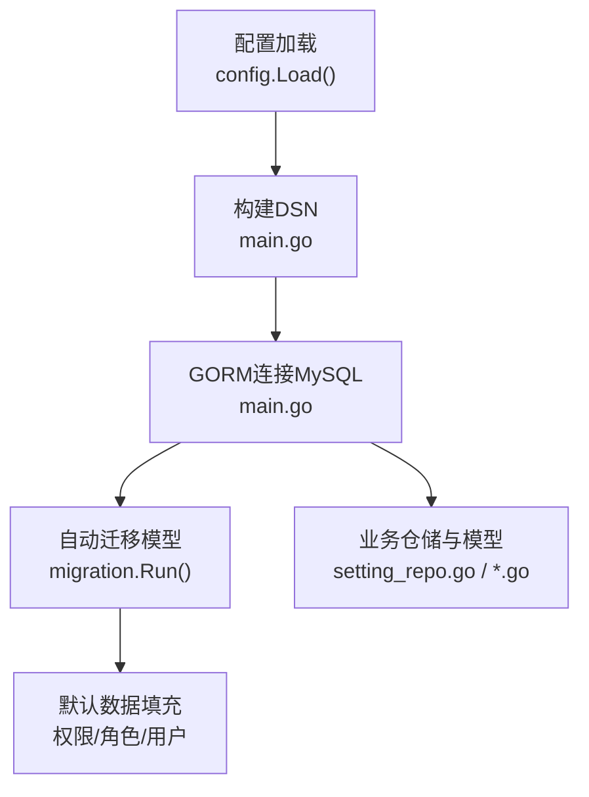
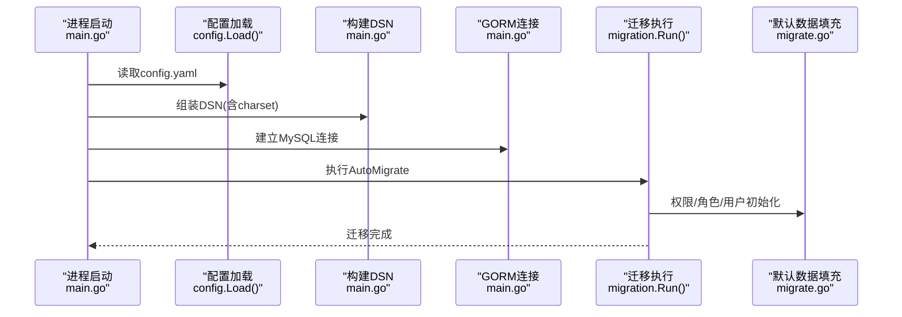
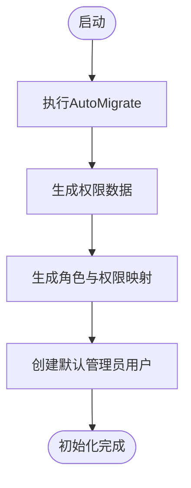
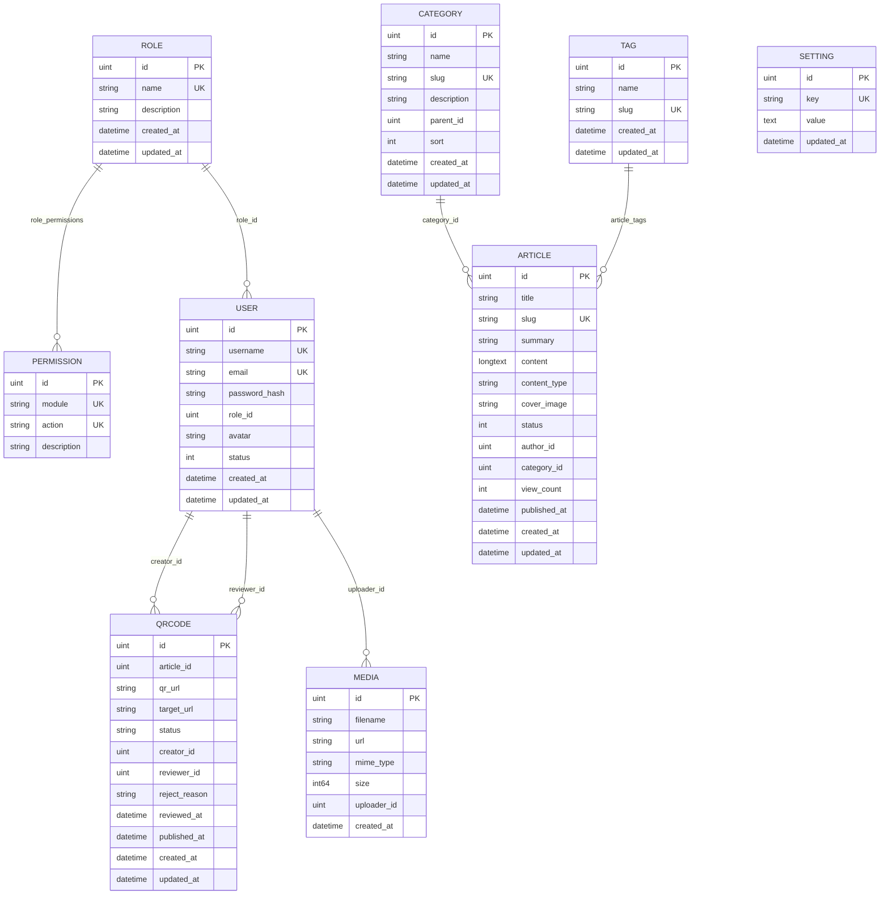
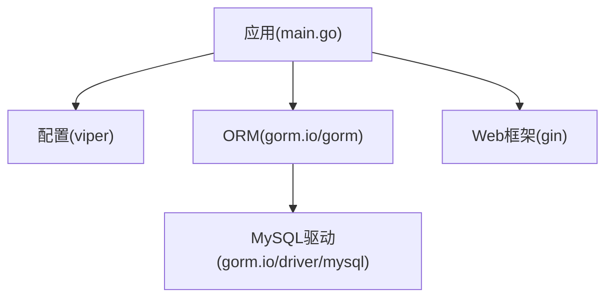

# 数据库部署

<cite>
**本文引用的文件**
- [config.go](file://server/config/config.go)
- [config.yaml](file://server/config/config.yaml)
- [main.go](file://server/main.go)
- [migrate.go](file://server/migration/migrate.go)
- [setting_repo.go](file://server/internal/repository/setting_repo.go)
- [setting.go](file://server/internal/model/setting.go)
- [role.go](file://server/internal/model/role.go)
- [user.go](file://server/internal/model/user.go)
- [article.go](file://server/internal/model/article.go)
- [category.go](file://server/internal/model/category.go)
- [tag.go](file://server/internal/model/tag.go)
- [media.go](file://server/internal/model/media.go)
- [qrcode.go](file://server/internal/model/qrcode.go)
- [hash.go](file://server/internal/pkg/hash.go)
- [go.mod](file://server/go.mod)
</cite>

## 目录
1. [简介](#简介)
2. [项目结构](#项目结构)
3. [核心组件](#核心组件)
4. [架构总览](#架构总览)
5. [详细组件分析](#详细组件分析)
6. [依赖分析](#依赖分析)
7. [性能考虑](#性能考虑)
8. [故障排查指南](#故障排查指南)
9. [结论](#结论)
10. [附录](#附录)

## 简介
本指南面向Xiangmuzs博客平台的数据库部署与运维，基于后端Go代码与GORM ORM实现，覆盖MySQL安装与配置、用户与权限、初始化与迁移、备份与监控、安全加固、集群与高可用、维护自动化以及灾备恢复等关键环节。文档内容严格依据仓库中的配置与实现进行说明，并提供可操作的步骤与图示。

## 项目结构
后端通过Viper加载YAML配置，使用GORM连接MySQL并自动迁移模型；启动时执行数据库迁移与默认数据填充；应用层通过GORM模型与仓储层交互。

**图表来源**
- [main.go:26-47](file://server/main.go#L26-L47)
- [config.go:47-64](file://server/config/config.go#L47-L64)
- [migrate.go:13-38](file://server/migration/migrate.go#L13-L38)

**章节来源**
- [config.go:1-65](file://server/config/config.go#L1-L65)
- [config.yaml:1-29](file://server/config/config.yaml#L1-L29)
- [main.go:19-76](file://server/main.go#L19-L76)
- [migrate.go:13-38](file://server/migration/migrate.go#L13-L38)

## 核心组件
- 配置系统：集中定义数据库连接参数（主机、端口、用户、密码、库名、字符集）与服务运行模式。
- 连接与日志：根据运行模式动态调整GORM日志级别，便于开发调试。
- 自动迁移：按模型清单执行数据库结构同步，并在首次部署时注入默认权限、角色与管理员账户。
- 默认数据：生成内置权限集合、超级管理员角色及其关联权限、默认管理员用户。

**章节来源**
- [config.go:20-27](file://server/config/config.go#L20-L27)
- [config.yaml:5-11](file://server/config/config.yaml#L5-L11)
- [main.go:36-41](file://server/main.go#L36-L41)
- [migrate.go:13-38](file://server/migration/migrate.go#L13-L38)
- [migrate.go:40-125](file://server/migration/migrate.go#L40-L125)

## 架构总览
下图展示应用启动到数据库初始化的关键流程。

**图表来源**
- [main.go:21-47](file://server/main.go#L21-L47)
- [migrate.go:13-38](file://server/migration/migrate.go#L13-L38)

## 详细组件分析

### 数据库配置与连接
- 配置项：主机、端口、用户名、密码、数据库名、字符集utf8mb4。
- 连接字符串：包含charset、parseTime、loc参数，确保时间类型正确解析。
- 日志级别：开发模式开启GORM日志，生产模式关闭或降低日志级别以减少开销。

**章节来源**
- [config.yaml:5-11](file://server/config/config.yaml#L5-L11)
- [config.go:20-27](file://server/config/config.go#L20-L27)
- [main.go:27-41](file://server/main.go#L27-L41)

### 数据库初始化与迁移
- 模型清单：权限、角色、用户、分类、标签、文章、媒体、二维码、系统设置。
- 迁移行为：首次启动自动创建缺失表结构与索引。
- 默认数据：
  - 权限：模块维度（文章、分类、标签、媒体、用户、角色、二维码、仪表盘），动作维度（创建、查看、更新、删除）。
  - 角色：超级管理员（拥有全部权限）、编辑（限定模块与动作范围）。
  - 管理员：默认用户名admin，密码哈希入库，绑定超级管理员角色。

**图表来源**
- [migrate.go:13-38](file://server/migration/migrate.go#L13-L38)
- [migrate.go:40-125](file://server/migration/migrate.go#L40-L125)

**章节来源**
- [migrate.go:13-38](file://server/migration/migrate.go#L13-L38)
- [migrate.go:40-125](file://server/migration/migrate.go#L40-L125)

### 数据模型与关系
- 用户与角色：多对多中间表role_permissions，支持权限继承。
- 文章与分类/标签：一对多与多对多关联，支持发布状态与发布时间索引。
- 媒体与上传者：记录文件名、URL、MIME类型与大小。
- 二维码：与文章与用户关联，支持审核状态流转。

**图表来源**
- [role.go:5-19](file://server/internal/model/role.go#L5-L19)
- [user.go:5-16](file://server/internal/model/user.go#L5-L16)
- [category.go:5-14](file://server/internal/model/category.go#L5-L14)
- [tag.go:5-11](file://server/internal/model/tag.go#L5-L11)
- [article.go:5-23](file://server/internal/model/article.go#L5-L23)
- [media.go:5-13](file://server/internal/model/media.go#L5-L13)
- [qrcode.go:6-22](file://server/internal/model/qrcode.go#L6-L22)
- [setting.go:5-10](file://server/internal/model/setting.go#L5-L10)

**章节来源**
- [role.go:5-19](file://server/internal/model/role.go#L5-L19)
- [user.go:5-16](file://server/internal/model/user.go#L5-L16)
- [category.go:5-14](file://server/internal/model/category.go#L5-L14)
- [tag.go:5-11](file://server/internal/model/tag.go#L5-L11)
- [article.go:5-23](file://server/internal/model/article.go#L5-L23)
- [media.go:5-13](file://server/internal/model/media.go#L5-L13)
- [qrcode.go:6-22](file://server/internal/model/qrcode.go#L6-L22)
- [setting.go:5-10](file://server/internal/model/setting.go#L5-L10)

### 设置与配置读取
- 设置模型：键值对存储，唯一键约束保证幂等更新。
- 仓储接口：提供Get/Set/GetAll/GetMap等常用操作，支持ON CONFLICT更新。

**章节来源**
- [setting.go:5-10](file://server/internal/model/setting.go#L5-L10)
- [setting_repo.go:17-29](file://server/internal/repository/setting_repo.go#L17-L29)

### 密码哈希与安全
- 使用bcrypt对密码进行哈希处理，避免明文存储。
- 登录校验通过比较哈希值完成。

**章节来源**
- [hash.go:5-13](file://server/internal/pkg/hash.go#L5-L13)

## 依赖分析
- 运行时依赖：Gin Web框架、GORM ORM、MySQL驱动、Viper配置。
- 数据库驱动：gorm.io/driver/mysql与github.com/go-sql-driver/mysql。

**图表来源**
- [go.mod:5-13](file://server/go.mod#L5-L13)
- [main.go:3-17](file://server/main.go#L3-L17)

**章节来源**
- [go.mod:1-42](file://server/go.mod#L1-L42)

## 性能考虑
- 字符集：使用utf8mb4，满足多语言与表情符号存储需求。
- 索引设计：文章状态与发布时间、分类父节点、标签唯一索引等，提升查询效率。
- 日志级别：生产环境建议降低GORM日志级别，避免频繁I/O影响吞吐。
- 连接池：建议结合应用实际并发与数据库资源，合理设置连接数与超时参数（需在应用侧配置，不在当前仓库中体现）。

**章节来源**
- [config.yaml:11](file://server/config/config.yaml#L11)
- [article.go:13-20](file://server/internal/model/article.go#L13-L20)
- [category.go:10](file://server/internal/model/category.go#L10)
- [tag.go:8](file://server/internal/model/tag.go#L8)
- [main.go:36-39](file://server/main.go#L36-L39)

## 故障排查指南
- 连接失败
  - 检查配置文件中的主机、端口、用户名、密码与数据库名是否正确。
  - 确认MySQL服务已启动且网络可达。
  - 核对字符集与时区参数是否匹配。
- 迁移失败
  - 查看迁移日志输出，确认模型字段与数据库兼容性。
  - 若存在历史数据冲突，先备份再清理或手动修正。
- 初始化异常
  - 确认迁移已成功执行，检查默认数据插入逻辑是否重复执行导致唯一键冲突。
- 密码问题
  - 确保登录时使用正确的哈希校验流程。

**章节来源**
- [config.yaml:5-11](file://server/config/config.yaml#L5-L11)
- [main.go:27-44](file://server/main.go#L27-L44)
- [migrate.go:26-28](file://server/migration/migrate.go#L26-L28)
- [hash.go:10-13](file://server/internal/pkg/hash.go#L10-L13)

## 结论
本指南基于仓库现有配置与迁移机制，给出了Xiangmuzs博客平台数据库部署与管理的完整路径：从安装与配置、用户与权限、初始化与迁移，到备份与监控、安全加固、集群与高可用、维护自动化与灾备恢复的建议。实际生产落地时，请结合业务规模与合规要求补充更细粒度的参数与流程。

## 附录

### MySQL安装与基础配置
- 版本要求：建议使用MySQL 8.0及以上，具备稳定JSON与全文检索能力。
- 字符集：统一使用utf8mb4，避免表情与多字节字符异常。
- 性能参数（示例方向）
  - innodb_buffer_pool_size：建议占物理内存40%-60%
  - innodb_log_file_size：兼顾刷盘频率与崩溃恢复速度
  - max_connections：按峰值QPS与会话数估算
  - slow_query_log：开启慢查询日志，阈值建议≥1秒
  - binlog_format：ROW或MIXED，配合GTID用于主从复制
- 安全基线
  - 关闭匿名用户、限制root远程登录
  - 启用SSL连接（需证书与客户端验证）
  - 使用强密码策略与定期轮换

### 用户与权限
- 应用连接用户：仅授予DDL/DML所需最小权限，避免super权限。
- 备份用户：授予RELOAD、BINLOG、SELECT、TRIGGER、LOCK TABLES等必要权限。
- 建议为不同环境（开发/测试/生产）分别创建独立账号与库。

### 初始化脚本与迁移
- 执行顺序
  - 先执行AutoMigrate同步表结构
  - 再执行默认数据填充（权限、角色、管理员）
- 版本管理
  - 当前实现为一次性迁移，后续可引入版本化迁移工具（如Golang迁移库）以支持回滚与灰度。
- 回滚策略
  - 在具备版本化迁移的前提下，回滚至上一版本；若无版本化，建议通过备份恢复。

### 备份策略
- 全量备份：使用mysqldump或Percona XtraBackup进行逻辑/物理备份，周期建议每日一次。
- 增量备份：基于binlog的增量备份，结合归档策略与保留期管理。
- 验证与演练：定期抽样恢复演练，验证备份可用性与恢复时间目标。

### 监控与性能分析
- 慢查询日志：启用slow_query_log，设置long_query_time，定期分析Top SQL。
- 关键指标：QPS、TPS、连接数、缓冲池命中率、锁等待、binlog写入延迟。
- 工具：可使用pt-query-digest分析慢查询，Prometheus+Grafana采集指标。

### 安全配置
- 防火墙：仅开放3306端口至应用服务器网段。
- SSL：启用强制SSL连接，使用CA签发证书，拒绝明文连接。
- 访问控制：IP白名单、账号锁定策略、审计日志。

### 集群与高可用
- 主从复制：基于binlog的异步/半同步复制，读写分离由应用或中间件实现。
- 分片与读写分离：根据业务分片键拆分，配合一致性哈希路由请求。
- 健康检查：心跳检测与自动切换，保障RTO/RPO达标。

### 维护自动化
- 日志清理：按天滚动压缩，保留策略（如30/90天）。
- 统计更新：定期analyze/update统计信息，优化执行计划。
- 清理脚本：批量删除过期二维码、冗余媒体文件等。

### 灾难恢复与应急
- RTO/RPO目标：明确恢复时限与数据丢失容忍度。
- 多地备份：跨机房/跨地域备份，定期异地演练。
- 应急预案：快速定位故障根因、隔离风险、回滚变更、重建从库。