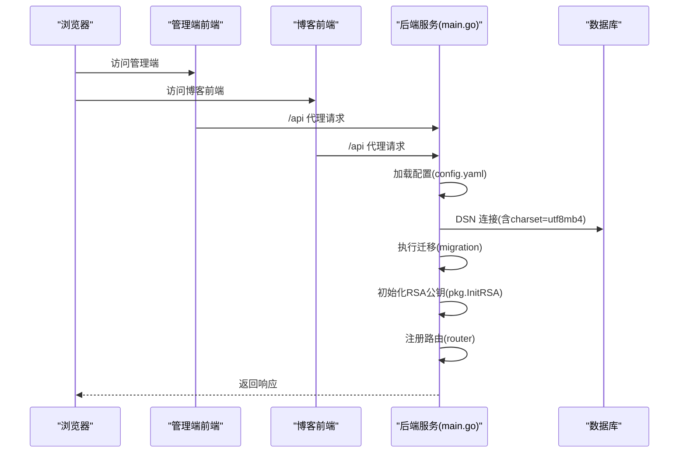
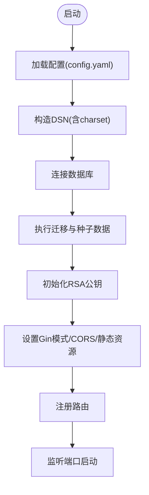
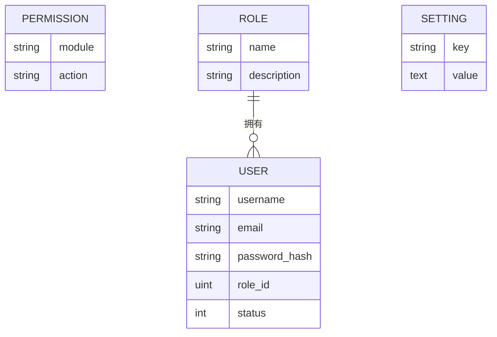
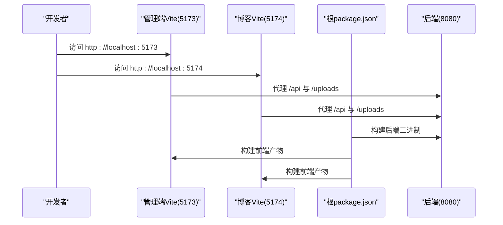
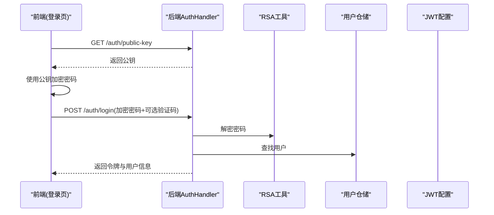
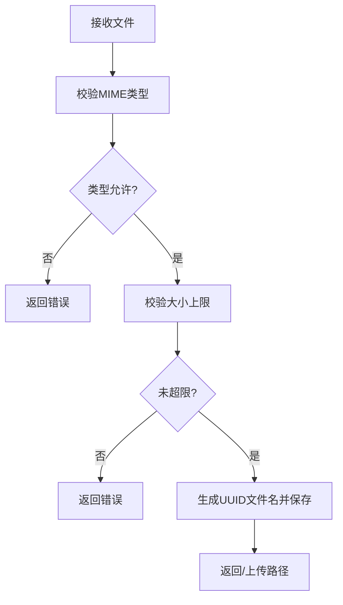
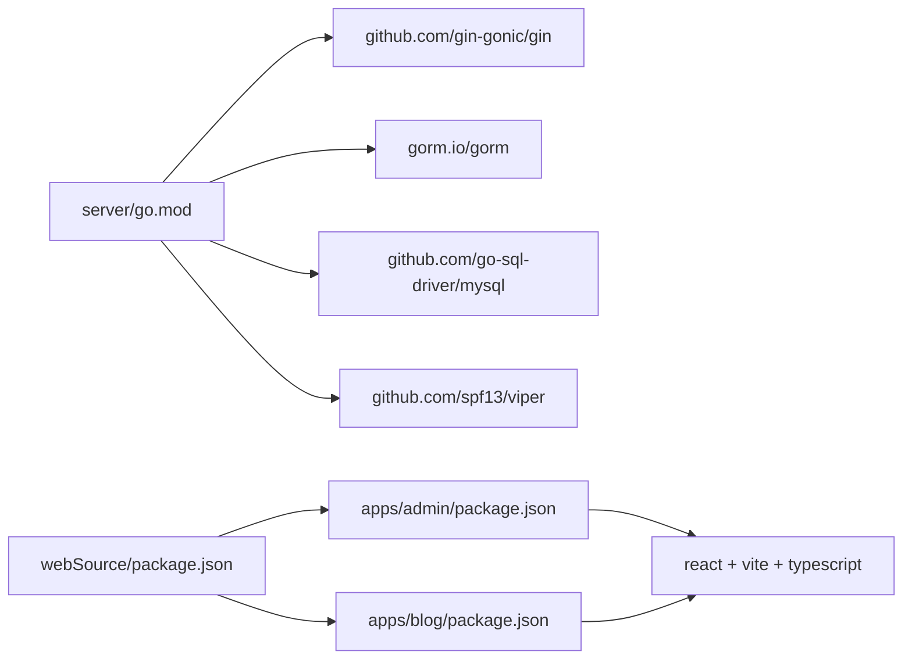

# 环境准备

<cite>
**本文引用的文件**
- [server/go.mod](file://server/go.mod)
- [server/main.go](file://server/main.go)
- [server/config/config.go](file://server/config/config.go)
- [server/config/config.yaml](file://server/config/config.yaml)
- [server/migration/migrate.go](file://server/migration/migrate.go)
- [server/internal/pkg/rsa.go](file://server/internal/pkg/rsa.go)
- [server/internal/pkg/upload.go](file://server/internal/pkg/upload.go)
- [server/internal/handler/auth.go](file://server/internal/handler/auth.go)
- [server/internal/handler/media.go](file://server/internal/handler/media.go)
- [webSource/package.json](file://webSource/package.json)
- [webSource/apps/admin/package.json](file://webSource/apps/admin/package.json)
- [webSource/apps/blog/package.json](file://webSource/apps/blog/package.json)
- [webSource/apps/admin/vite.config.ts](file://webSource/apps/admin/vite.config.ts)
- [webSource/apps/blog/vite.config.ts](file://webSource/apps/blog/vite.config.ts)
- [webSource/apps/admin/dist/index.html](file://webSource/apps/admin/dist/index.html)
- [webSource/apps/blog/dist/index.html](file://webSource/apps/blog/dist/index.html)
- [webSource/packages/shared/src/utils/crypto.ts](file://webSource/packages/shared/src/utils/crypto.ts)
- [webSource/apps/admin/src/store/authStore.ts](file://webSource/apps/admin/src/store/authStore.ts)
</cite>

## 目录
1. [简介](#简介)
2. [项目结构](#项目结构)
3. [核心组件](#核心组件)
4. [架构总览](#架构总览)
5. [详细组件分析](#详细组件分析)
6. [依赖关系分析](#依赖关系分析)
7. [性能考虑](#性能考虑)
8. [故障排查指南](#故障排查指南)
9. [结论](#结论)
10. [附录](#附录)

## 简介
本指南面向在生产环境中部署与运行 Xiangmuzs 博客平台的运维与开发人员，围绕服务器硬件与操作系统、Go 运行时、Node.js 前端构建链路、数据库与缓存、系统工具、防火墙与安全组、域名与 DNS、以及环境变量最佳实践与安全建议进行系统性说明。文档中的技术细节均以仓库中实际文件为依据，并通过图示与分层讲解帮助不同背景读者快速上手。

## 项目结构
该仓库采用前后端分离的多包工作区结构：
- 后端：基于 Go 的 Web 服务，使用 GORM 进行数据库访问，Viper 管理配置，Gin 作为 HTTP 框架。
- 前端：基于 Vite + React 的双应用（管理端与博客前端），共享库通过 pnpm workspace 管理。
- 构建流程：通过根目录脚本统一构建后端二进制与前端产物，并将后端配置复制到前端输出目录以便部署。

```mermaid
graph TB
subgraph "后端服务"
SMain["server/main.go"]
SConfGo["server/config/config.go"]
SConfYaml["server/config/config.yaml"]
SMig["server/migration/migrate.go"]
SRSA["server/internal/pkg/rsa.go"]
SUpload["server/internal/pkg/upload.go"]
SAuthHdl["server/internal/handler/auth.go"]
SMediaHdl["server/internal/handler/media.go"]
end
subgraph "前端"
WRootPkg["webSource/package.json"]
WAdminPkg["apps/admin/package.json"]
WBlogPkg["apps/blog/package.json"]
WAdminVite["apps/admin/vite.config.ts"]
WBlogVite["apps/blog/vite.config.ts"]
WAdminDist["apps/admin/dist/index.html"]
WBlogDist["apps/blog/dist/index.html"]
WSharedCrypto["packages/shared/src/utils/crypto.ts"]
WAdminStore["apps/admin/src/store/authStore.ts"]
end
WRootPkg --> SMain
WAdminVite --> SMain
WBlogVite --> SMain
SMain --> SConfGo
SMain --> SConfYaml
SMain --> SMig
SMain --> SRSA
SMain --> SUpload
SAuthHdl --> WSharedCrypto
WAdminStore --> WSharedCrypto
SMediaHdl --> SUpload
```

**图表来源**
- [server/main.go:19-76](file://server/main.go#L19-L76)
- [server/config/config.go:47-64](file://server/config/config.go#L47-L64)
- [server/config/config.yaml:1-29](file://server/config/config.yaml#L1-L29)
- [server/migration/migrate.go:13-38](file://server/migration/migrate.go#L13-L38)
- [server/internal/pkg/rsa.go:18-36](file://server/internal/pkg/rsa.go#L18-L36)
- [server/internal/pkg/upload.go:15-63](file://server/internal/pkg/upload.go#L15-L63)
- [server/internal/handler/auth.go:27-61](file://server/internal/handler/auth.go#L27-L61)
- [server/internal/handler/media.go:24-52](file://server/internal/handler/media.go#L24-L52)
- [webSource/package.json:11-12](file://webSource/package.json#L11-L12)
- [webSource/apps/admin/vite.config.ts:10-22](file://webSource/apps/admin/vite.config.ts#L10-L22)
- [webSource/apps/blog/vite.config.ts:10-22](file://webSource/apps/blog/vite.config.ts#L10-L22)
- [webSource/packages/shared/src/utils/crypto.ts:7-23](file://webSource/packages/shared/src/utils/crypto.ts#L7-L23)
- [webSource/apps/admin/src/store/authStore.ts:36-50](file://webSource/apps/admin/src/store/authStore.ts#L36-L50)

**章节来源**
- [server/go.mod:1-60](file://server/go.mod#L1-L60)
- [webSource/package.json:1-22](file://webSource/package.json#L1-L22)

## 核心组件
- 后端运行时与框架
  - Go 版本：1.22
  - Web 框架：Gin
  - ORM：GORM + MySQL 驱动
  - 配置：Viper YAML
  - 安全：RSA 密钥生成与 JWT 配置
- 前端构建与开发
  - 包管理：pnpm workspace
  - 构建工具：Vite + React
  - 开发代理：本地前端分别代理到后端 8080 端口
- 数据与文件
  - 数据库：MySQL（utf8mb4 字符集）
  - 文件上传：受控类型与大小限制，静态资源路径映射

**章节来源**
- [server/go.mod:3](file://server/go.mod#L3)
- [server/main.go:13-17](file://server/main.go#L13-L17)
- [server/config/config.go:7-43](file://server/config/config.go#L7-L43)
- [server/config/config.yaml:5-11](file://server/config/config.yaml#L5-L11)
- [webSource/package.json:11-12](file://webSource/package.json#L11-L12)
- [webSource/apps/admin/vite.config.ts:10-22](file://webSource/apps/admin/vite.config.ts#L10-L22)
- [webSource/apps/blog/vite.config.ts:10-22](file://webSource/apps/blog/vite.config.ts#L10-L22)

## 架构总览
下图展示从浏览器到后端服务与数据库的整体交互路径，包括前端开发代理、后端启动流程、数据库迁移与初始化、以及 RSA 加密与 JWT 登录流程。

**图表来源**
- [server/main.go:19-76](file://server/main.go#L19-L76)
- [server/config/config.yaml:1-29](file://server/config/config.yaml#L1-L29)
- [server/migration/migrate.go:13-38](file://server/migration/migrate.go#L13-L38)
- [server/internal/pkg/rsa.go:18-36](file://server/internal/pkg/rsa.go#L18-L36)

## 详细组件分析

### 后端运行时与配置
- Go 版本与依赖
  - 使用 Go 1.22；依赖 Gin、GORM、MySQL 驱动、Viper 等。
- 配置加载
  - 通过 Viper 读取 YAML 配置，支持 ./config 与项目根目录查找。
  - 关键项：server.port、server.mode、database.*、jwt.*、upload.*、blog.base_url。
- 启动流程
  - 解析 DSN（包含 charset 参数）连接数据库。
  - 根据模式设置 GORM 日志级别。
  - 执行迁移与默认数据填充。
  - 初始化 RSA 公钥用于加密传输。
  - 设置 CORS 中间件与静态文件服务。
  - 绑定端口启动服务。

**图表来源**
- [server/main.go:27-76](file://server/main.go#L27-L76)
- [server/config/config.go:47-64](file://server/config/config.go#L47-L64)
- [server/config/config.yaml:1-29](file://server/config/config.yaml#L1-L29)
- [server/migration/migrate.go:13-38](file://server/migration/migrate.go#L13-L38)
- [server/internal/pkg/rsa.go:18-36](file://server/internal/pkg/rsa.go#L18-L36)

**章节来源**
- [server/go.mod:3](file://server/go.mod#L3)
- [server/config/config.go:7-43](file://server/config/config.go#L7-L43)
- [server/config/config.yaml:1-29](file://server/config/config.yaml#L1-L29)
- [server/main.go:19-76](file://server/main.go#L19-L76)

### 数据库与迁移
- 连接参数
  - 默认主机、端口、用户、密码、库名、字符集（utf8mb4）。
- 迁移与种子
  - 自动迁移模型（权限、角色、用户、分类、标签、文章、媒体、二维码、设置）。
  - 种子数据：权限矩阵、超级管理员与编辑角色、默认管理员用户。

**图表来源**
- [server/migration/migrate.go:14-25](file://server/migration/migrate.go#L14-L25)
- [server/migration/migrate.go:40-102](file://server/migration/migrate.go#L40-L102)
- [server/internal/model/role.go:5-12](file://server/internal/model/role.go#L5-L12)
- [server/internal/model/user.go:5-16](file://server/internal/model/user.go#L5-L16)
- [server/internal/model/setting.go:5-10](file://server/internal/model/setting.go#L5-L10)

**章节来源**
- [server/config/config.yaml:5-11](file://server/config/config.yaml#L5-L11)
- [server/migration/migrate.go:13-126](file://server/migration/migrate.go#L13-L126)

### 前端开发与构建
- 开发代理
  - 管理端前端：本地 5173，代理 /api 与 /uploads 到后端 8080。
  - 博客前端：本地 5174，同上。
- 构建脚本
  - 根脚本统一构建共享库、管理端、博客端与后端二进制，并复制配置文件至前端输出目录。
- 生产入口
  - 前端 dist 页面通过 script 标签引入打包产物。

**图表来源**
- [webSource/apps/admin/vite.config.ts:10-22](file://webSource/apps/admin/vite.config.ts#L10-L22)
- [webSource/apps/blog/vite.config.ts:10-22](file://webSource/apps/blog/vite.config.ts#L10-L22)
- [webSource/package.json:11-12](file://webSource/package.json#L11-L12)
- [webSource/apps/admin/dist/index.html:6-8](file://webSource/apps/admin/dist/index.html#L6-L8)
- [webSource/apps/blog/dist/index.html:6-8](file://webSource/apps/blog/dist/index.html#L6-L8)

**章节来源**
- [webSource/apps/admin/vite.config.ts:1-24](file://webSource/apps/admin/vite.config.ts#L1-L24)
- [webSource/apps/blog/vite.config.ts:1-24](file://webSource/apps/blog/vite.config.ts#L1-L24)
- [webSource/package.json:1-22](file://webSource/package.json#L1-L22)
- [webSource/apps/admin/dist/index.html:1-14](file://webSource/apps/admin/dist/index.html#L1-L14)
- [webSource/apps/blog/dist/index.html:1-14](file://webSource/apps/blog/dist/index.html#L1-L14)

### 安全与认证流程
- RSA 公钥下发与加密
  - 后端初始化 RSA 并提供公钥接口。
  - 前端登录前拉取公钥并加密明文密码。
- 登录校验
  - 可选验证码校验。
  - 使用 RSA 解密密码后进行用户校验与令牌发放。

**图表来源**
- [server/internal/handler/auth.go:27-61](file://server/internal/handler/auth.go#L27-L61)
- [server/internal/pkg/rsa.go:39-53](file://server/internal/pkg/rsa.go#L39-L53)
- [webSource/packages/shared/src/utils/crypto.ts:7-23](file://webSource/packages/shared/src/utils/crypto.ts#L7-L23)
- [webSource/apps/admin/src/store/authStore.ts:36-50](file://webSource/apps/admin/src/store/authStore.ts#L36-L50)

**章节来源**
- [server/internal/handler/auth.go:27-61](file://server/internal/handler/auth.go#L27-L61)
- [server/internal/pkg/rsa.go:18-36](file://server/internal/pkg/rsa.go#L18-L36)
- [webSource/packages/shared/src/utils/crypto.ts:1-23](file://webSource/packages/shared/src/utils/crypto.ts#L1-L23)
- [webSource/apps/admin/src/store/authStore.ts:1-55](file://webSource/apps/admin/src/store/authStore.ts#L1-L55)

### 文件上传与存储
- 上传校验
  - 类型白名单与大小上限。
- 存储策略
  - 生成唯一文件名并写入指定目录，返回静态访问路径。
- 路由与中间件
  - 后端静态挂载上传目录，供客户端直接访问。

**图表来源**
- [server/internal/pkg/upload.go:15-63](file://server/internal/pkg/upload.go#L15-L63)
- [server/internal/handler/media.go:24-52](file://server/internal/handler/media.go#L24-L52)

**章节来源**
- [server/internal/pkg/upload.go:15-63](file://server/internal/pkg/upload.go#L15-L63)
- [server/internal/handler/media.go:24-52](file://server/internal/handler/media.go#L24-L52)
- [server/main.go:64-65](file://server/main.go#L64-L65)

## 依赖关系分析
- 后端依赖
  - Gin、GORM、MySQL 驱动、Viper、JWT、UUID 等。
- 前端依赖
  - React、React Router、Arco Design、Vite、TypeScript 等。
- 工作区
  - pnpm workspace 管理共享库与两个前端应用。

**图表来源**
- [server/go.mod:5-13](file://server/go.mod#L5-L13)
- [webSource/package.json:1-22](file://webSource/package.json#L1-L22)
- [webSource/apps/admin/package.json:12-27](file://webSource/apps/admin/package.json#L12-L27)
- [webSource/apps/blog/package.json:12-29](file://webSource/apps/blog/package.json#L12-L29)

**章节来源**
- [server/go.mod:1-60](file://server/go.mod#L1-L60)
- [webSource/package.json:1-22](file://webSource/package.json#L1-L22)

## 性能考虑
- 数据库连接与字符集
  - 使用 utf8mb4 字符集，确保表情符号与多字节字符正确存储。
  - 建议在生产环境为数据库与表设置合适的索引，避免全表扫描。
- ORM 日志
  - 在调试模式下开启较详细日志，生产模式关闭或降级，减少 IO 压力。
- 文件上传
  - 控制最大文件大小与允许类型，结合 CDN 或对象存储可进一步提升吞吐。
- 前端构建
  - 生产构建启用压缩与 Tree Shaking，合理拆分包体，减少首屏加载时间。

[本节为通用指导，不直接分析具体文件]

## 故障排查指南
- 后端无法连接数据库
  - 检查配置文件中的主机、端口、用户、密码、库名与字符集是否正确。
  - 确认数据库服务已启动且网络可达。
- 迁移失败
  - 查看迁移日志，确认权限、角色、用户等模型定义与数据库兼容。
- RSA 加密异常
  - 确认后端已成功初始化 RSA 公钥，前端能正常获取公钥并完成加密。
- 上传失败
  - 检查上传目录权限、磁盘空间、文件类型与大小限制。
- 前端代理无效
  - 确认前端 Vite 代理目标与后端端口一致，浏览器控制台无跨域错误。

**章节来源**
- [server/config/config.yaml:5-11](file://server/config/config.yaml#L5-L11)
- [server/migration/migrate.go:13-38](file://server/migration/migrate.go#L13-L38)
- [server/internal/pkg/rsa.go:18-36](file://server/internal/pkg/rsa.go#L18-L36)
- [server/internal/pkg/upload.go:15-63](file://server/internal/pkg/upload.go#L15-L63)
- [webSource/apps/admin/vite.config.ts:12-20](file://webSource/apps/admin/vite.config.ts#L12-L20)
- [webSource/apps/blog/vite.config.ts:12-20](file://webSource/apps/blog/vite.config.ts#L12-L20)

## 结论
本指南基于仓库实际配置与代码，给出了从 Go 与 Node.js 环境、数据库与文件存储、到前端构建与安全机制的完整落地建议。按照此指南准备生产环境，可显著降低部署与运维风险，并为后续扩展与监控打下基础。

[本节为总结性内容，不直接分析具体文件]

## 附录

### 系统要求与发行版支持
- 操作系统
  - Ubuntu、CentOS 等主流 Linux 发行版均可运行。建议使用长期支持（LTS）版本以获得更稳定的内核与包管理体验。
- 硬件建议
  - CPU：至少 2 核（推荐 4 核以上以应对并发与构建压力）。
  - 内存：至少 2GB（推荐 4GB+，用于编译与运行时缓冲）。
  - 磁盘：根据媒体与日志量预留空间，建议 SSD 提升 I/O 性能。
- 网络
  - 开放端口：8080（后端）、5173/5174（前端开发）、3306（数据库，如本地部署）。

[本节为通用指导，不直接分析具体文件]

### Go 运行时与环境变量
- 版本要求
  - 使用 Go 1.22。
- 环境变量
  - 建议通过 systemd 或 Docker 环境变量注入数据库凭据、JWT 密钥、上传路径等敏感配置，避免硬编码于配置文件。
  - 示例键名：DATABASE_HOST、DATABASE_PORT、DATABASE_USER、DATABASE_PASSWORD、DATABASE_NAME、JWT_SECRET、UPLOAD_PATH、BLOG_BASE_URL。

**章节来源**
- [server/go.mod:3](file://server/go.mod#L3)
- [server/config/config.go:7-43](file://server/config/config.go#L7-L43)
- [server/config/config.yaml:1-29](file://server/config/config.yaml#L1-L29)

### Node.js 与包管理器
- 版本与包管理
  - 使用 pnpm 作为包管理器，启用 workspace。
  - 前端应用使用 Vite + React + TypeScript。
- 构建命令
  - 通过根脚本统一构建后端与前端产物，并复制配置文件。

**章节来源**
- [webSource/package.json:1-22](file://webSource/package.json#L1-L22)
- [webSource/apps/admin/package.json:1-28](file://webSource/apps/admin/package.json#L1-L28)
- [webSource/apps/blog/package.json:1-30](file://webSource/apps/blog/package.json#L1-L30)

### MySQL 数据库安装与配置
- 版本与字符集
  - 推荐 MySQL 8.0 或兼容版本；使用 utf8mb4 字符集与合适排序规则。
- 连接参数
  - 依据配置文件中的 host、port、user、password、name、charset 设置。
- 性能参数
  - 建议开启慢查询日志、设置合理的 innodb_buffer_pool_size、线程与连接池参数。
  - 为高频查询字段建立索引，定期优化表结构。

**章节来源**
- [server/config/config.yaml:5-11](file://server/config/config.yaml#L5-L11)
- [server/main.go:27-44](file://server/main.go#L27-L44)

### Redis 缓存（可选）
- 场景
  - 可用于会话存储、验证码缓存、热点数据缓存等。
- 内存与持久化
  - 根据业务量设置内存上限；可选 RDB/AOF 持久化策略。
- 安全
  - 仅对可信网络开放端口，必要时启用密码认证与 TLS。

[本节为通用指导，不直接分析具体文件]

### 系统工具与防火墙
- 必备工具
  - Git、Build Essentials（gcc/g++）、unzip、curl 等。
- 防火墙与安全组
  - 仅开放 8080、22（SSH）等必要端口；生产环境建议仅允许特定 IP 访问管理端口。

[本节为通用指导，不直接分析具体文件]

### 域名与 DNS
- 域名解析
  - 将域名指向服务器公网 IP；可配置 CNAME 指向反向代理或负载均衡器。
- HTTPS
  - 建议通过 Nginx/TLS 或云厂商证书服务启用 HTTPS，保障传输安全。

[本节为通用指导，不直接分析具体文件]

### 环境变量配置最佳实践与安全建议
- 最佳实践
  - 使用环境变量覆盖敏感配置；区分 development、staging、production 三套配置。
  - 将配置文件纳入 .gitignore，仅保留模板文件。
- 安全建议
  - JWT 密钥与数据库密码必须复杂且定期轮换。
  - 限制上传目录权限，避免执行权限；对上传文件进行二次校验。
  - 启用 HTTPS、CORS 白名单、速率限制与输入校验，降低常见攻击面。

**章节来源**
- [server/config/config.go:47-64](file://server/config/config.go#L47-L64)
- [server/config/config.yaml:13-28](file://server/config/config.yaml#L13-L28)
- [server/internal/pkg/upload.go:37-39](file://server/internal/pkg/upload.go#L37-L39)