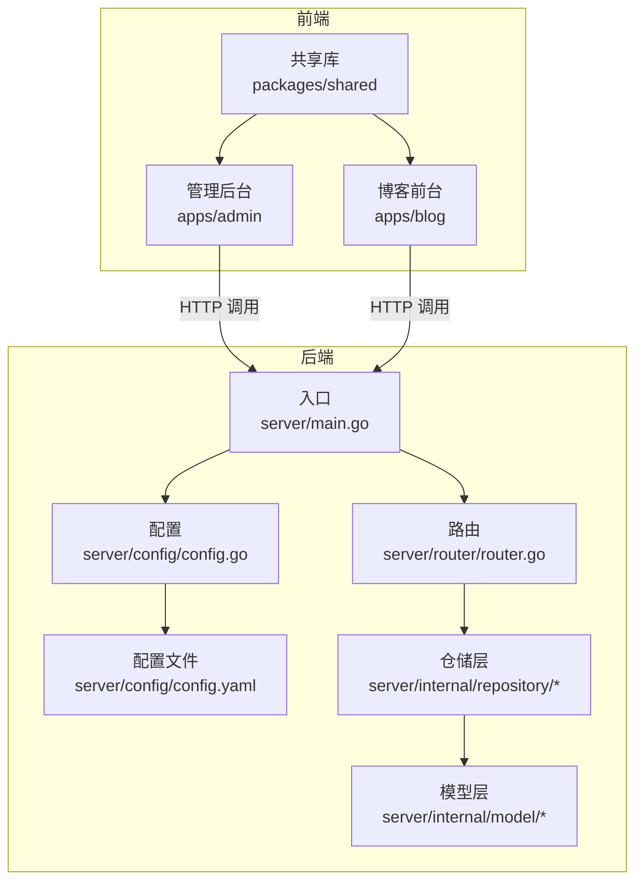
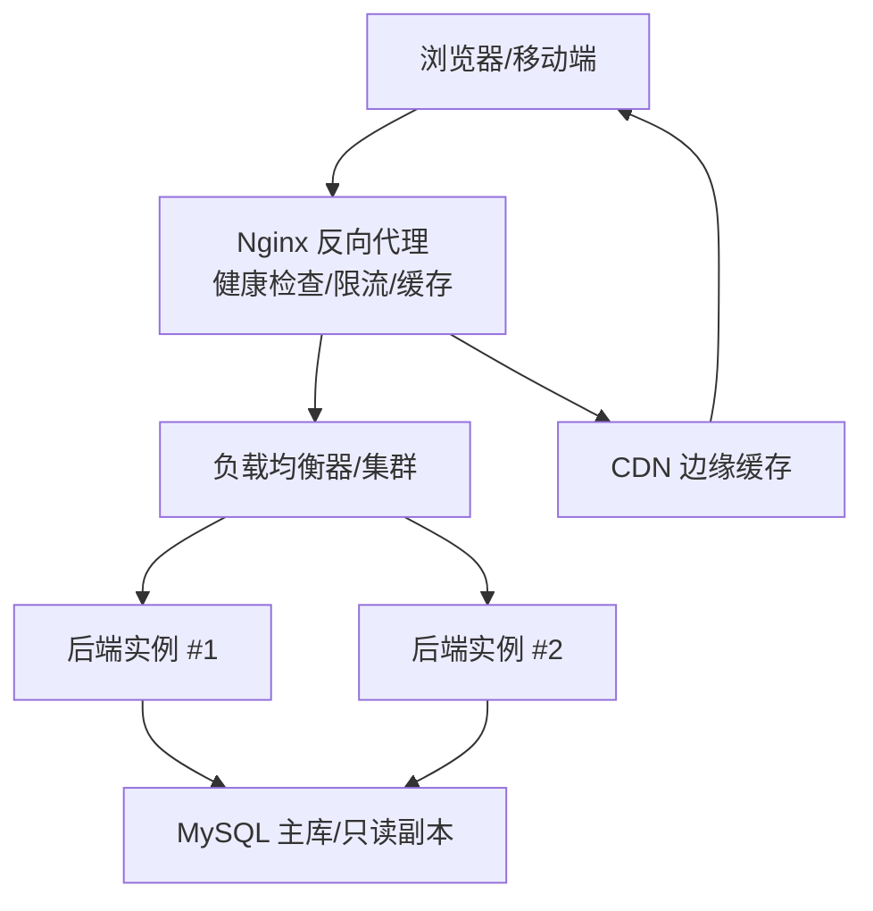
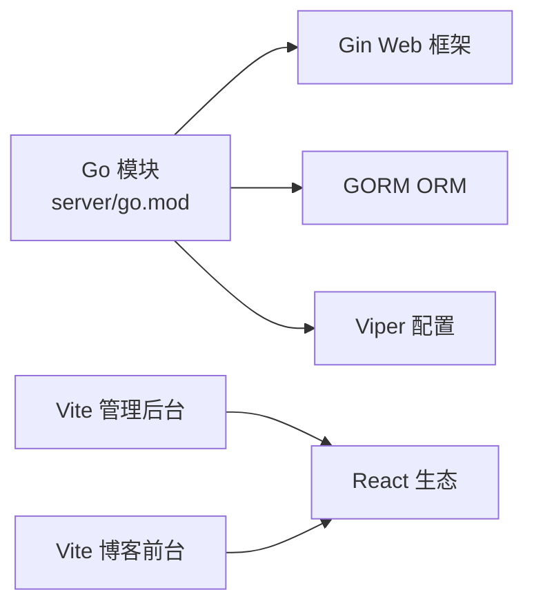

# 生产环境优化

<cite>
**本文引用的文件**
- [server/main.go](file://server/main.go)
- [server/go.mod](file://server/go.mod)
- [server/config/config.go](file://server/config/config.go)
- [server/config/config.yaml](file://server/config/config.yaml)
- [server/router/router.go](file://server/router/router.go)
- [server/internal/middleware/auth.go](file://server/internal/middleware/auth.go)
- [server/internal/middleware/cors.go](file://server/internal/middleware/cors.go)
- [server/internal/repository/article_repo.go](file://server/internal/repository/article_repo.go)
- [server/internal/model/article.go](file://server/internal/model/article.go)
- [webSource/package.json](file://webSource/package.json)
- [webSource/apps/admin/vite.config.ts](file://webSource/apps/admin/vite.config.ts)
- [webSource/apps/blog/vite.config.ts](file://webSource/apps/blog/vite.config.ts)
- [webSource/apps/admin/package.json](file://webSource/apps/admin/package.json)
- [webSource/apps/blog/package.json](file://webSource/apps/blog/package.json)
</cite>

## 目录
1. [简介](#简介)
2. [项目结构](#项目结构)
3. [核心组件](#核心组件)
4. [架构总览](#架构总览)
5. [详细组件分析](#详细组件分析)
6. [依赖分析](#依赖分析)
7. [性能考虑](#性能考虑)
8. [故障排查指南](#故障排查指南)
9. [结论](#结论)
10. [附录](#附录)

## 简介
本指南面向Xiangmuzs博客平台的生产环境，围绕后端Go服务、前端React应用、数据库与缓存、CDN与负载均衡、安全加固、容量规划与扩容、性能与基准测试以及变更管理与回滚等方面，提供可操作的优化建议与最佳实践。文档以仓库现有代码为基础，结合实际部署场景给出落地建议。

## 项目结构
项目采用前后端分离架构：后端使用Gin + GORM提供REST API；前端采用Vite + React的双应用（管理后台与博客前台），通过代理联调对接后端。构建脚本统一在根目录的包管理脚本中协调打包与产物复制。

**图表来源**
- [server/main.go:19-76](file://server/main.go#L19-L76)
- [server/router/router.go:11-103](file://server/router/router.go#L11-L103)
- [server/config/config.go:47-64](file://server/config/config.go#L47-L64)
- [server/config/config.yaml:1-29](file://server/config/config.yaml#L1-L29)
- [webSource/apps/admin/vite.config.ts:1-24](file://webSource/apps/admin/vite.config.ts#L1-L24)
- [webSource/apps/blog/vite.config.ts:1-24](file://webSource/apps/blog/vite.config.ts#L1-L24)

**章节来源**
- [server/main.go:19-76](file://server/main.go#L19-L76)
- [server/router/router.go:11-103](file://server/router/router.go#L11-L103)
- [server/config/config.go:47-64](file://server/config/config.go#L47-L64)
- [server/config/config.yaml:1-29](file://server/config/config.yaml#L1-L29)
- [webSource/package.json:11-12](file://webSource/package.json#L11-L12)
- [webSource/apps/admin/vite.config.ts:1-24](file://webSource/apps/admin/vite.config.ts#L1-L24)
- [webSource/apps/blog/vite.config.ts:1-24](file://webSource/apps/blog/vite.config.ts#L1-L24)

## 核心组件
- 后端入口与运行时
  - 入口负责读取配置、初始化数据库、执行迁移、准备RSA密钥、设置Gin模式、注册中间件与静态资源、挂载路由并启动服务。
  - 关键路径参考：[server/main.go:19-76](file://server/main.go#L19-L76)
- 配置体系
  - 使用Viper加载YAML配置，支持服务器端口与运行模式、数据库连接参数、JWT密钥与过期时间、上传目录与限制、博客基础URL等。
  - 关键路径参考：[server/config/config.go:47-64](file://server/config/config.go#L47-L64)、[server/config/config.yaml:1-29](file://server/config/config.yaml#L1-L29)
- 路由与权限
  - 路由按公开接口与鉴权接口分组，公开接口无需认证，鉴权接口通过中间件校验JWT并注入用户角色信息。
  - 关键路径参考：[server/router/router.go:11-103](file://server/router/router.go#L11-L103)、[server/internal/middleware/auth.go:10-37](file://server/internal/middleware/auth.go#L10-L37)
- 数据访问层
  - 文章仓储提供列表、搜索、详情、浏览量自增等操作，并对关联作者、分类、标签进行预加载。
  - 关键路径参考：[server/internal/repository/article_repo.go:41-70](file://server/internal/repository/article_repo.go#L41-L70)、[server/internal/model/article.go:5-23](file://server/internal/model/article.go#L5-L23)

**章节来源**
- [server/main.go:19-76](file://server/main.go#L19-L76)
- [server/config/config.go:47-64](file://server/config/config.go#L47-L64)
- [server/config/config.yaml:1-29](file://server/config/config.yaml#L1-L29)
- [server/router/router.go:11-103](file://server/router/router.go#L11-L103)
- [server/internal/middleware/auth.go:10-37](file://server/internal/middleware/auth.go#L10-L37)
- [server/internal/repository/article_repo.go:41-70](file://server/internal/repository/article_repo.go#L41-L70)
- [server/internal/model/article.go:5-23](file://server/internal/model/article.go#L5-L23)

## 架构总览
下图展示生产环境典型拓扑：客户端请求经Nginx反向代理到达多实例后端，后端通过GORM访问MySQL，静态资源由Nginx直接提供或经CDN分发。

[此图为概念性架构示意，不对应具体源码文件，故不提供图表来源]

## 详细组件分析

### 后端编译与运行优化
- 编译优化
  - 使用Go模块与现代版本，确保启用内联与优化标志。建议在CI中使用稳定的Go版本并开启适当的构建参数。
  - 参考依赖声明：[server/go.mod:1-60](file://server/go.mod#L1-L60)
- 运行模式与日志
  - 生产环境应设置为Release模式，减少调试输出；根据需要调整GORM日志级别。
  - 参考入口设置：[server/main.go:55-57](file://server/main.go#L55-L57)、[server/main.go:36-39](file://server/main.go#L36-L39)
- 中间件与静态资源
  - CORS中间件允许跨域；静态资源映射上传目录，便于CDN直连加速。
  - 参考CORS中间件：[server/internal/middleware/cors.go:7-21](file://server/internal/middleware/cors.go#L7-L21)、[server/main.go:64-65](file://server/main.go#L64-L65)

**章节来源**
- [server/go.mod:1-60](file://server/go.mod#L1-L60)
- [server/main.go:55-57](file://server/main.go#L55-L57)
- [server/main.go:36-39](file://server/main.go#L36-L39)
- [server/internal/middleware/cors.go:7-21](file://server/internal/middleware/cors.go#L7-L21)
- [server/main.go:64-65](file://server/main.go#L64-L65)

### 数据库查询优化
- 索引设计
  - 文章模型包含复合索引与单列索引，如状态+发布时间、分类ID、slug唯一索引等，有助于筛选与去重。
  - 参考模型字段索引定义：[server/internal/model/article.go:8-20](file://server/internal/model/article.go#L8-L20)
- 查询计划与SQL
  - 列表查询支持状态、分类、关键词、标签过滤，并进行总数统计与分页；建议在高并发场景下对常用过滤字段建立联合索引并定期分析慢查询。
  - 参考仓储查询逻辑：[server/internal/repository/article_repo.go:41-70](file://server/internal/repository/article_repo.go#L41-L70)
- 连接池配置
  - 建议在生产配置中显式设置连接池大小、空闲连接数、连接生命周期，避免连接争用与泄漏。
  - 参考配置加载位置：[server/config/config.go:47-64](file://server/config/config.go#L47-L64)

**章节来源**
- [server/internal/model/article.go:8-20](file://server/internal/model/article.go#L8-L20)
- [server/internal/repository/article_repo.go:41-70](file://server/internal/repository/article_repo.go#L41-L70)
- [server/config/config.go:47-64](file://server/config/config.go#L47-L64)

### 缓存策略
- Redis选型与配置
  - 推荐使用Redis作为热点数据缓存（如文章详情、热门标签、分类树、JWT白名单等）；设置合理的TTL与淘汰策略。
  - 建议对浏览量、热门文章列表做独立缓存，降低数据库压力。
- 失效策略
  - 写操作触发主动失效或延迟双删；读多写少场景可用“先读缓存，再回源更新”的异步刷新。
- 热点数据处理
  - 对高QPS接口（如文章详情）增加本地缓存与多级缓存（进程内缓存+Redis），并配合限流与熔断。

[本节为通用优化建议，不直接分析具体源码文件，故不提供章节来源]

### 前端性能优化
- 构建与打包
  - 使用Vite构建，开启压缩与分块策略；在CI中生成产物并复制到后端可发布的目录。
  - 参考构建脚本：[webSource/apps/admin/vite.config.ts:5-9](file://webSource/apps/admin/vite.config.ts#L5-L9)、[webSource/apps/blog/vite.config.ts:5-9](file://webSource/apps/blog/vite.config.ts#L5-L9)、[webSource/package.json:11-12](file://webSource/package.json#L11-L12)
- 代码分割与懒加载
  - 按路由拆分包，使用动态导入实现页面级懒加载；对第三方库进行外部化与CDN加速。
- 资源压缩与缓存
  - 启用Gzip/Brotli压缩；合理设置静态资源缓存头；利用CDN缓存与回源控制。
- 开发代理与联调
  - Vite开发代理指向后端服务，生产环境由Nginx统一转发。
  - 参考代理配置：[webSource/apps/admin/vite.config.ts:12-21](file://webSource/apps/admin/vite.config.ts#L12-L21)、[webSource/apps/blog/vite.config.ts:12-21](file://webSource/apps/blog/vite.config.ts#L12-L21)

**章节来源**
- [webSource/apps/admin/vite.config.ts:5-9](file://webSource/apps/admin/vite.config.ts#L5-L9)
- [webSource/apps/blog/vite.config.ts:5-9](file://webSource/apps/blog/vite.config.ts#L5-L9)
- [webSource/package.json:11-12](file://webSource/package.json#L11-L12)
- [webSource/apps/admin/vite.config.ts:12-21](file://webSource/apps/admin/vite.config.ts#L12-L21)
- [webSource/apps/blog/vite.config.ts:12-21](file://webSource/apps/blog/vite.config.ts#L12-L21)

### CDN与静态资源优化
- CDN接入
  - 将静态资源（JS/CSS/图片）托管至CDN，设置长缓存与版本化命名；上传目录由后端静态映射，可配合CDN直连。
  - 参考静态资源映射：[server/main.go:64-65](file://server/main.go#L64-L65)
- 边缘缓存
  - 针对不同资源类型设置TTL与缓存键；对动态接口避免被边缘缓存命中。

**章节来源**
- [server/main.go:64-65](file://server/main.go#L64-L65)

### 负载均衡与健康检查
- Nginx配置要点
  - 上游指向多个后端实例；配置健康检查探针；开启连接复用与超时控制；启用限流与防爬策略。
- 故障转移
  - 当实例不可用时自动切换至其他节点；建议配合外部负载均衡器（如云LB）实现更高级的容灾。

[本节为通用运维建议，不直接分析具体源码文件，故不提供章节来源]

### SSL/TLS与安全加固
- 证书与OCSP Stapling
  - 使用Let’s Encrypt等可信CA签发证书；开启OCSP Stapling提升握手性能与可靠性。
- HSTS与安全头
  - 设置Strict-Transport-Security、Content-Security-Policy、X-Frame-Options、X-Content-Type-Options等安全头。
- WAF与输入验证
  - 在网关或前置Nginx侧启用WAF规则；后端对所有输入进行严格校验与清洗。

[本节为通用安全建议，不直接分析具体源码文件，故不提供章节来源]

### 容量规划与扩容策略
- 垂直扩展
  - 提升CPU/内存与数据库实例规格，优先优化慢查询与热点表。
- 水平扩展
  - 后端多实例部署，配合会话外置（如Redis）与读写分离；前端静态资源全部CDN化。
- 监控与预警
  - 关键指标：P95/P99延迟、错误率、连接数、队列长度、GC暂停时间、数据库慢查询数。

[本节为通用容量规划建议，不直接分析具体源码文件，故不提供章节来源]

### 性能测试与基准测试
- 接口压测
  - 使用wrk/JMeter对关键接口（文章列表、详情、登录）施压，观察吞吐与延迟曲线。
- 前端性能
  - Lighthouse/Chrome DevTools分析首屏时间、交互延迟、资源体积；关注CLS与INP。
- 数据库压测
  - 使用sysbench或自研脚本模拟高并发写入与复杂查询，评估索引与连接池上限。

[本节为通用测试建议，不直接分析具体源码文件，故不提供章节来源]

### 变更管理与回滚策略
- 发布流程
  - CI构建产物 → 静态资源发布CDN → 后端二进制替换 → 健康检查通过 → 流量切流。
- 回滚策略
  - 快速回滚至上一稳定版本；若涉及数据库变更，准备逆向迁移脚本。
- 灰度发布
  - 逐步扩大流量比例，结合监控指标与日志审计，确保平滑过渡。

[本节为通用运维建议，不直接分析具体源码文件，故不提供章节来源]

## 依赖分析
后端依赖集中在Web框架、ORM与配置解析上；前端依赖React、Vite与相关生态。整体依赖清晰，耦合度低，便于独立演进与优化。

**图表来源**
- [server/go.mod:5-13](file://server/go.mod#L5-L13)
- [webSource/apps/admin/package.json:12-27](file://webSource/apps/admin/package.json#L12-L27)
- [webSource/apps/blog/package.json:12-29](file://webSource/apps/blog/package.json#L12-L29)

**章节来源**
- [server/go.mod:5-13](file://server/go.mod#L5-L13)
- [webSource/apps/admin/package.json:12-27](file://webSource/apps/admin/package.json#L12-L27)
- [webSource/apps/blog/package.json:12-29](file://webSource/apps/blog/package.json#L12-L29)

## 性能考虑
- 并发与协程
  - Gin默认并发友好；建议在高并发场景下限制并发连接数与请求体大小，防止资源耗尽。
- 内存管理
  - 控制响应体大小与分页参数；避免大对象重复拷贝；对热点字符串使用常量池或共享结构。
- 数据库
  - 为高频查询字段建立合适索引；避免SELECT *；使用预加载减少N+1查询；合理设置连接池。
- 缓存
  - 对热点接口与静态资源进行多级缓存；设置合理TTL与失效策略；对写操作采用主动失效。
- 前端
  - 分包与懒加载；资源压缩与CDN缓存；骨架屏与渐进增强提升感知性能。

[本节提供通用指导，不直接分析具体源码文件，故不提供章节来源]

## 故障排查指南
- 认证失败
  - 检查Authorization头格式与JWT签名；确认密钥与过期时间配置正确。
  - 参考路径：[server/internal/middleware/auth.go:10-37](file://server/internal/middleware/auth.go#L10-L37)
- 跨域问题
  - 确认CORS中间件返回的头部是否匹配前端请求；生产环境建议限定来源而非通配符。
  - 参考路径：[server/internal/middleware/cors.go:7-21](file://server/internal/middleware/cors.go#L7-L21)
- 静态资源无法访问
  - 检查上传目录映射与Nginx静态资源路径；确认构建产物已复制到目标目录。
  - 参考路径：[server/main.go:64-65](file://server/main.go#L64-L65)、[webSource/package.json:11-12](file://webSource/package.json#L11-L12)
- 数据库连接异常
  - 校验配置文件中的主机、端口、用户名、密码与字符集；查看慢查询与连接池状态。
  - 参考路径：[server/config/config.yaml:5-11](file://server/config/config.yaml#L5-L11)、[server/config/config.go:47-64](file://server/config/config.go#L47-L64)

**章节来源**
- [server/internal/middleware/auth.go:10-37](file://server/internal/middleware/auth.go#L10-L37)
- [server/internal/middleware/cors.go:7-21](file://server/internal/middleware/cors.go#L7-L21)
- [server/main.go:64-65](file://server/main.go#L64-L65)
- [webSource/package.json:11-12](file://webSource/package.json#L11-L12)
- [server/config/config.yaml:5-11](file://server/config/config.yaml#L5-L11)
- [server/config/config.go:47-64](file://server/config/config.go#L47-L64)

## 结论
本指南基于现有代码结构与配置，给出了从后端编译优化、数据库与缓存、前端性能、CDN与负载均衡、安全加固到容量规划与变更管理的完整优化路线。建议在生产环境中逐步落地各项措施，并持续通过监控与压测验证效果，确保系统在高并发与高可用场景下的稳定性与性能表现。

## 附录
- 配置项清单（来自配置文件）
  - 服务器：端口、运行模式
  - 数据库：主机、端口、用户、密码、库名、字符集
  - JWT：密钥、访问令牌过期秒数、刷新令牌过期秒数
  - 上传：路径、最大大小、允许类型
  - 博客：基础URL
  - 参考路径：[server/config/config.yaml:1-29](file://server/config/config.yaml#L1-L29)

**章节来源**
- [server/config/config.yaml:1-29](file://server/config/config.yaml#L1-L29)