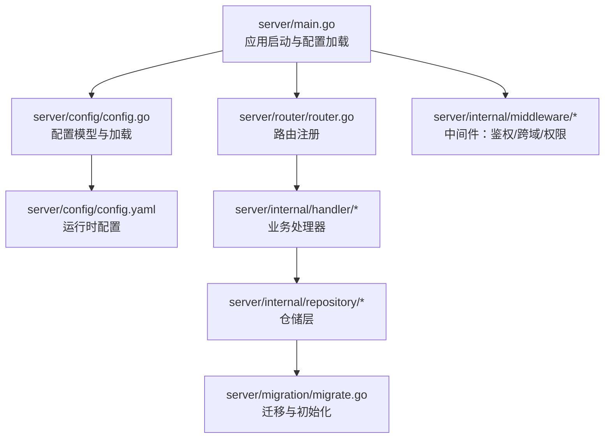
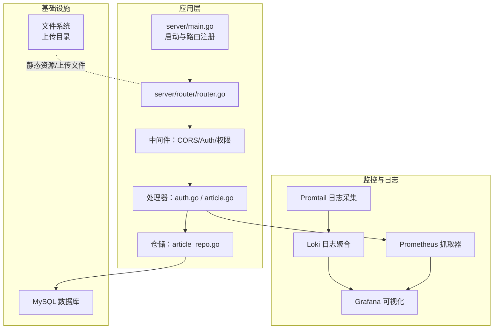
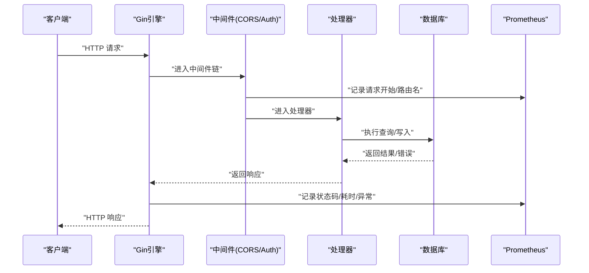
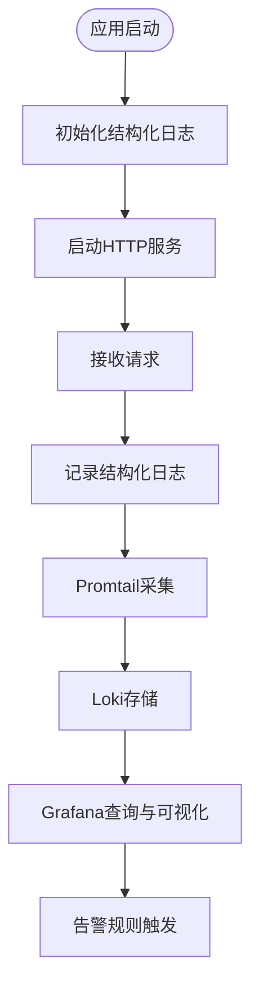
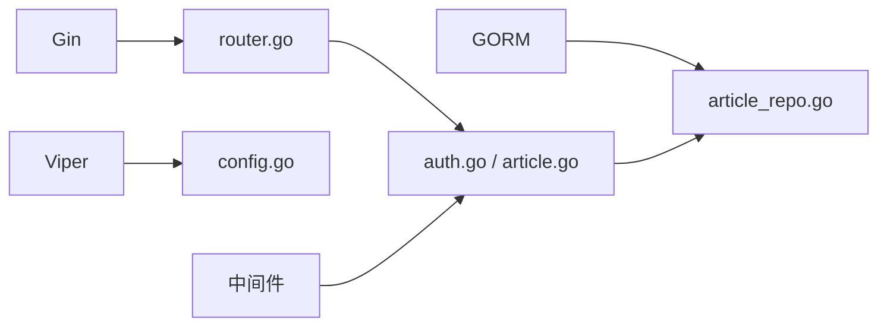

# 监控与日志

<cite>
**本文引用的文件**   
- [server/main.go](file://server/main.go)
- [server/config/config.go](file://server/config/config.go)
- [server/config/config.yaml](file://server/config/config.yaml)
- [server/router/router.go](file://server/router/router.go)
- [server/internal/middleware/auth.go](file://server/internal/middleware/auth.go)
- [server/internal/middleware/cors.go](file://server/internal/middleware/cors.go)
- [server/internal/middleware/role.go](file://server/internal/middleware/role.go)
- [server/internal/handler/auth.go](file://server/internal/handler/auth.go)
- [server/internal/handler/article.go](file://server/internal/handler/article.go)
- [server/internal/pkg/response.go](file://server/internal/pkg/response.go)
- [server/internal/repository/article_repo.go](file://server/internal/repository/article_repo.go)
- [server/migration/migrate.go](file://server/migration/migrate.go)
- [server/go.mod](file://server/go.mod)
</cite>

## 目录
1. [简介](#简介)
2. [项目结构](#项目结构)
3. [核心组件](#核心组件)
4. [架构总览](#架构总览)
5. [详细组件分析](#详细组件分析)
6. [依赖分析](#依赖分析)
7. [性能考虑](#性能考虑)
8. [故障排查指南](#故障排查指南)
9. [结论](#结论)
10. [附录](#附录)

## 简介
本指南面向Xiangmuzs博客平台的运维与开发团队，提供一套完整的监控与日志管理方案。内容覆盖应用监控（Prometheus指标与Grafana可视化）、关键性能指标（响应时间、吞吐量、错误率）、日志采集与分析（ELK或Loki+Promtail+Grafana）、系统资源与数据库性能监控、第三方服务可用性检查、监控数据长期存储与归档、告警阈值与通知渠道配置，以及监控系统的备份与恢复建议。由于当前代码库未内置监控与日志组件，本指南以“概念性+落地实践”的方式给出可直接落地的实施步骤与最佳实践。

## 项目结构
后端采用Go语言与Gin框架，通过Viper加载配置，GORM连接MySQL，路由在router中集中注册，业务逻辑分布在handler层，中间件负责鉴权与跨域等横切关注点。整体结构清晰，便于在现有入口处扩展监控埋点与日志采集。

**图示来源**
- [server/main.go:19-76](file://server/main.go#L19-L76)
- [server/router/router.go:11-103](file://server/router/router.go#L11-L103)
- [server/config/config.go:47-64](file://server/config/config.go#L47-L64)
- [server/config/config.yaml:1-29](file://server/config/config.yaml#L1-L29)
- [server/migration/migrate.go:13-38](file://server/migration/migrate.go#L13-L38)

**章节来源**
- [server/main.go:19-76](file://server/main.go#L19-L76)
- [server/router/router.go:11-103](file://server/router/router.go#L11-L103)
- [server/config/config.go:47-64](file://server/config/config.go#L47-L64)
- [server/config/config.yaml:1-29](file://server/config/config.yaml#L1-L29)
- [server/migration/migrate.go:13-38](file://server/migration/migrate.go#L13-L38)

## 核心组件
- 应用启动与配置
  - 启动流程：加载配置 → 连接数据库 → 执行迁移 → 初始化RSA → 设置Gin模式与中间件 → 注册路由 → 启动HTTP服务。
  - 配置来源：YAML文件，包含server、database、jwt、upload、blog等键。
- 路由与控制器
  - 路由分组与权限控制：公开接口、认证接口、带权限的管理接口；权限中间件基于数据库中的角色-权限映射。
- 中间件
  - CORS：统一跨域头与预检处理。
  - Auth：解析Authorization头，校验JWT并注入用户上下文。
  - 权限校验：按模块+动作进行细粒度权限判断。
- 数据访问
  - 文章仓储：提供分页、筛选、视图计数自增、标签替换等操作。
- 日志与响应
  - 统一响应体封装，便于后续接入结构化日志与指标埋点。

**章节来源**
- [server/main.go:19-76](file://server/main.go#L19-L76)
- [server/config/config.go:7-43](file://server/config/config.go#L7-L43)
- [server/config/config.yaml:1-29](file://server/config/config.yaml#L1-L29)
- [server/router/router.go:11-103](file://server/router/router.go#L11-L103)
- [server/internal/middleware/cors.go:7-21](file://server/internal/middleware/cors.go#L7-L21)
- [server/internal/middleware/auth.go:10-37](file://server/internal/middleware/auth.go#L10-L37)
- [server/internal/middleware/role.go:11-35](file://server/internal/middleware/role.go#L11-L35)
- [server/internal/repository/article_repo.go:16-91](file://server/internal/repository/article_repo.go#L16-L91)
- [server/internal/pkg/response.go:22-70](file://server/internal/pkg/response.go#L22-L70)

## 架构总览
下图展示监控与日志在系统中的位置与交互关系：应用在启动与请求处理路径上预留埋点，日志与指标分别进入日志栈与监控栈，最终由Grafana统一呈现。

**图示来源**
- [server/main.go:59-76](file://server/main.go#L59-L76)
- [server/router/router.go:11-103](file://server/router/router.go#L11-L103)
- [server/internal/handler/auth.go:31-93](file://server/internal/handler/auth.go#L31-L93)
- [server/internal/handler/article.go:206-291](file://server/internal/handler/article.go#L206-L291)
- [server/internal/repository/article_repo.go:41-74](file://server/internal/repository/article_repo.go#L41-L74)

## 详细组件分析

### 应用监控与指标采集（Prometheus）
- 指标类型建议
  - HTTP请求数与速率：按路径、方法、状态码分组。
  - 响应时间（P50/P90/P95）：区分公开接口与受保护接口。
  - 错误率：4xx/5xx占比，按路由细分。
  - 数据库查询耗时：慢查询统计与错误计数。
  - 系统资源：CPU使用率、内存占用、文件描述符、GC统计。
- 埋点位置
  - 在Gin中间件链中插入拦截器，记录请求开始时间、结束时长、状态码、路由名等。
  - 在处理器调用前后记录业务耗时与异常。
  - 在数据库操作处记录SQL耗时与错误。
- 暴露端点
  - 使用Prometheus Go客户端在独立端口暴露/metrics，避免与业务端口冲突。
- 可视化
  - Grafana仪表板：请求速率、错误率、P95响应时间、慢查询TopN、资源趋势。

**图示来源**
- [server/router/router.go:11-103](file://server/router/router.go#L11-L103)
- [server/internal/middleware/cors.go:7-21](file://server/internal/middleware/cors.go#L7-L21)
- [server/internal/middleware/auth.go:10-37](file://server/internal/middleware/auth.go#L10-L37)
- [server/internal/handler/article.go:206-291](file://server/internal/handler/article.go#L206-L291)
- [server/internal/repository/article_repo.go:41-74](file://server/internal/repository/article_repo.go#L41-L74)

**章节来源**
- [server/router/router.go:11-103](file://server/router/router.go#L11-L103)
- [server/internal/middleware/cors.go:7-21](file://server/internal/middleware/cors.go#L7-L21)
- [server/internal/middleware/auth.go:10-37](file://server/internal/middleware/auth.go#L10-L37)
- [server/internal/handler/article.go:206-291](file://server/internal/handler/article.go#L206-L291)
- [server/internal/repository/article_repo.go:41-74](file://server/internal/repository/article_repo.go#L41-L74)

### 关键性能指标（KPI）监控
- 响应时间
  - 公开接口：文章列表、详情、搜索。
  - 认证接口：登录、获取公钥、修改密码。
  - 管理接口：文章/分类/标签/媒体/角色/用户的增删改查。
- 吞吐量
  - 按每分钟请求数（QPS）与不同路由维度统计。
- 错误率
  - 统计4xx/5xx占比，定位鉴权失败、权限不足、参数错误、内部错误等。
- 建议阈值（示例）
  - 公开接口P95响应时间 < 200ms；管理接口P95 < 500ms。
  - 错误率 > 1% 触发告警；P95 > 阈值触发预警。
  - QPS下降超过30% 或 错误率突增触发告警。

**章节来源**
- [server/internal/handler/auth.go:31-93](file://server/internal/handler/auth.go#L31-L93)
- [server/internal/handler/article.go:206-313](file://server/internal/handler/article.go#L206-L313)

### 日志收集与分析（Loki+Promtail+Grafana）
- 结构化日志
  - 字段建议：timestamp、level、service、instance、trace_id、span_id、method、path、status、latency_ms、error、stack。
  - 输出目标：标准输出 + 文件（按天滚动），Promtail采集到Loki。
- 采集与存储
  - Promtail：按日志文件与正则匹配，注入job/instance等标签，发送至Loki。
  - Loki：按标签索引，支持高效查询与聚合。
  - Grafana：通过Loki数据源查询日志，结合Prometheus指标做关联分析。
- 建议
  - 将Gin默认日志改为结构化输出，统一字段与时间格式。
  - 对敏感字段脱敏（如密码、Token）。

**图示来源**
- [server/main.go:59-76](file://server/main.go#L59-L76)
- [server/internal/pkg/response.go:22-70](file://server/internal/pkg/response.go#L22-L70)

**章节来源**
- [server/main.go:59-76](file://server/main.go#L59-L76)
- [server/internal/pkg/response.go:22-70](file://server/internal/pkg/response.go#L22-L70)

### 错误日志与告警
- 错误分类
  - 认证失败：缺失或格式不正确的Authorization头、Token解析失败。
  - 权限不足：角色缺少模块+动作权限。
  - 业务异常：参数校验失败、资源不存在、内部错误。
- 告警策略
  - 错误率阈值：例如1分钟内错误率 > 1%，触发预警；> 5% 触发严重告警。
  - 响应时间阈值：P95超阈值持续5分钟触发告警。
  - 通知渠道：邮件、IM群机器人、Pager/Duty集成。
- 异常检测
  - 使用Prometheus规则或Grafana告警，结合日志异常关键字（如panic、error、stack trace）进行联动。

**章节来源**
- [server/internal/middleware/auth.go:10-37](file://server/internal/middleware/auth.go#L10-L37)
- [server/internal/middleware/role.go:11-35](file://server/internal/middleware/role.go#L11-L35)
- [server/internal/pkg/response.go:51-69](file://server/internal/pkg/response.go#L51-L69)

### 系统资源监控
- 指标
  - CPU：利用率、负载、上下文切换。
  - 内存：RSS、堆分配、GC统计。
  - 磁盘：IO等待、读写速率、inode使用。
  - 网络：连接数、收发字节、TIME_WAIT数量。
- 采集
  - Node Exporter（Linux）或对应平台exporter。
  - Grafana仪表板：资源趋势、峰值、容量预测。
- 建议阈值
  - CPU使用率 > 80% 持续10分钟；内存使用率 > 85%；磁盘剩余空间 < 10%。

**章节来源**
- [server/main.go:59-76](file://server/main.go#L59-L76)

### 数据库性能监控（MySQL）
- 指标
  - 查询延迟分布、慢查询数、连接数、连接池状态、锁等待、QPS/TPS。
- 采集
  - mysqld_exporter：抓取MySQL状态变量与性能指标。
  - Grafana：慢查询TopN、连接池健康、热点表扫描。
- 建议
  - 对高频查询建立索引；限制单次查询返回行数；对复杂查询加缓存。
  - 监控连接池饱和与超时。

**章节来源**
- [server/main.go:26-44](file://server/main.go#L26-L44)
- [server/internal/repository/article_repo.go:41-74](file://server/internal/repository/article_repo.go#L41-L74)

### 第三方服务监控
- CDN
  - HTTP探测：HEAD/GET 200 OK；回源命中率、边缘节点可用性。
- 邮件服务
  - SMTP连通性、发送成功率、退信率。
- 支付网关
  - 回调签名验证、支付成功率、延迟与超时。
- 建议
  - 使用云监控或自建探针定时探测，失败即告警。

**章节来源**
- [server/config/config.yaml:27-29](file://server/config/config.yaml#L27-L29)

### 监控数据长期存储与归档
- 存储
  - Prometheus：本地保留期配置，远期数据导入远端存储（如Mimir/Thanos）。
  - Loki：分层存储（热/温/冷），压缩与归档。
- 归档
  - 历史指标与日志按月/季度归档，保留周期根据合规要求设定。
- 备份
  - 定期备份Prometheus WAL与快照，Loki索引与块备份。

**章节来源**
- [server/go.mod:5-13](file://server/go.mod#L5-L13)

## 依赖分析
- 外部依赖
  - Gin：Web框架。
  - Viper：配置管理。
  - GORM + MySQL驱动：ORM与数据库访问。
- 内部耦合
  - 路由依赖处理器，处理器依赖仓储，仓储依赖GORM。
  - 中间件与处理器之间松耦合，便于扩展监控与日志。

**图示来源**
- [server/go.mod:5-13](file://server/go.mod#L5-L13)
- [server/router/router.go:11-103](file://server/router/router.go#L11-L103)
- [server/internal/handler/auth.go:19-25](file://server/internal/handler/auth.go#L19-L25)
- [server/internal/handler/article.go:24-29](file://server/internal/handler/article.go#L24-L29)
- [server/internal/repository/article_repo.go:12-14](file://server/internal/repository/article_repo.go#L12-L14)

**章节来源**
- [server/go.mod:5-13](file://server/go.mod#L5-L13)
- [server/router/router.go:11-103](file://server/router/router.go#L11-L103)
- [server/internal/handler/auth.go:19-25](file://server/internal/handler/auth.go#L19-L25)
- [server/internal/handler/article.go:24-29](file://server/internal/handler/article.go#L24-L29)
- [server/internal/repository/article_repo.go:12-14](file://server/internal/repository/article_repo.go#L12-L14)

## 性能考虑
- 启动阶段
  - 配置加载与数据库连接应在启动早期完成，失败快速退出。
- 运行阶段
  - 控制日志量级，避免高频写入阻塞；使用异步日志或批量刷盘。
  - 对热点接口增加缓存（如文章详情、分类/标签列表）。
  - 数据库查询尽量走索引，避免SELECT *；分页查询注意LIMIT与OFFSET。
- 监控开销
  - 指标采样与告警规则需合理，避免过多规则导致Prometheus压力。

**章节来源**
- [server/main.go:19-76](file://server/main.go#L19-L76)
- [server/internal/repository/article_repo.go:41-74](file://server/internal/repository/article_repo.go#L41-L74)

## 故障排查指南
- 常见问题
  - 登录失败：检查JWT密钥、Token是否过期、验证码开关。
  - 权限不足：确认角色是否具备模块+动作权限。
  - 数据库连接失败：核对主机、端口、用户名、密码、字符集。
- 排查步骤
  - 查看应用日志（Loki）与指标（Prometheus）。
  - 核对配置文件与环境变量。
  - 使用curl或Postman复现请求，观察响应与状态码。
- 建议
  - 为关键路径增加trace_id，便于跨服务串联定位。

**章节来源**
- [server/internal/middleware/auth.go:10-37](file://server/internal/middleware/auth.go#L10-L37)
- [server/internal/middleware/role.go:11-35](file://server/internal/middleware/role.go#L11-L35)
- [server/config/config.yaml:1-29](file://server/config/config.yaml#L1-29)

## 结论
通过在现有启动与路由路径上嵌入监控与日志埋点，并结合Prometheus与Loki生态，Xiangmuzs博客平台可以实现全链路可观测性。建议优先落地以下事项：统一结构化日志、暴露HTTP指标、配置基础告警、完善数据库与系统资源监控，再逐步引入更细粒度的追踪与APM能力。

## 附录
- 配置清单（建议）
  - server.port、server.mode
  - database.host/port/user/password/name/charset
  - jwt.secret、jwt.expire、jwt.refresh_expire
  - upload.path/max_size/allowed_types
  - blog.base_url
- 告警阈值参考（示例）
  - 公开接口P95 < 200ms；管理接口P95 < 500ms；错误率 > 1%
  - CPU/内存 > 80%/85%；磁盘剩余 < 10%

**章节来源**
- [server/config/config.go:7-43](file://server/config/config.go#L7-L43)
- [server/config/config.yaml:1-29](file://server/config/config.yaml#L1-L29)