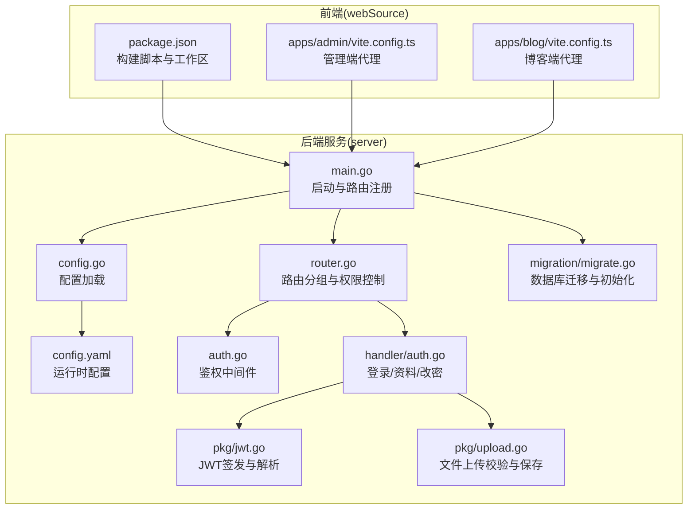
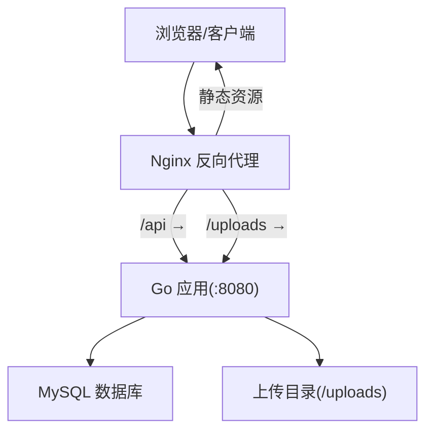
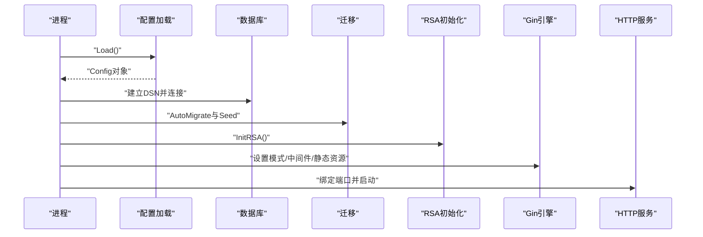
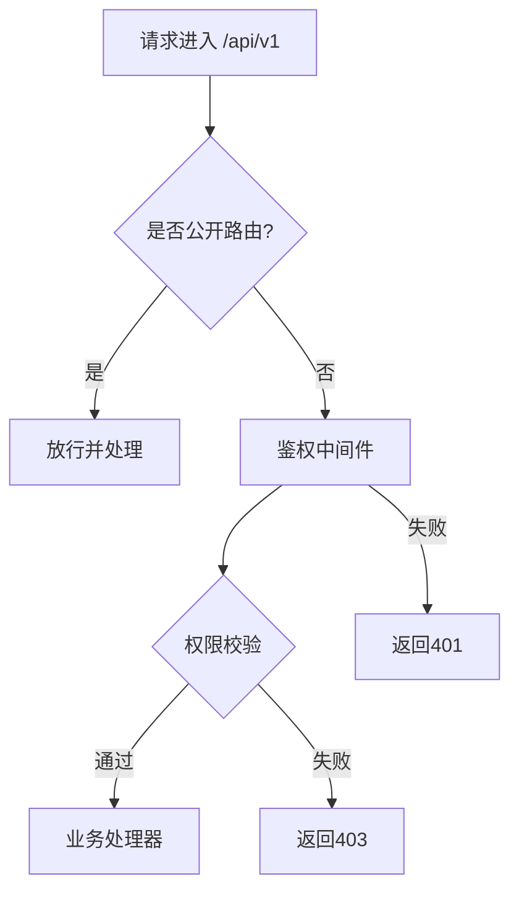
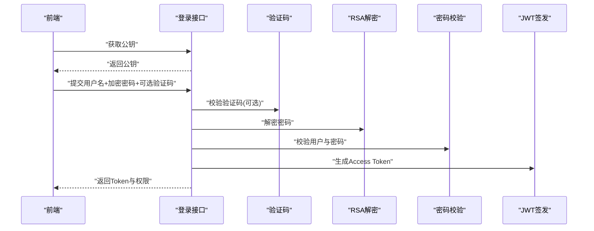
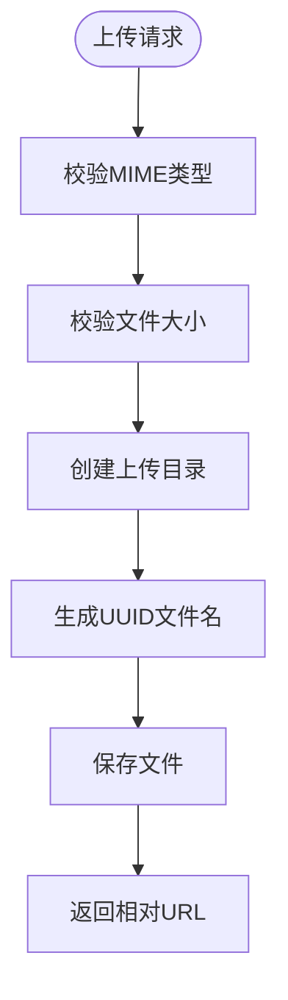
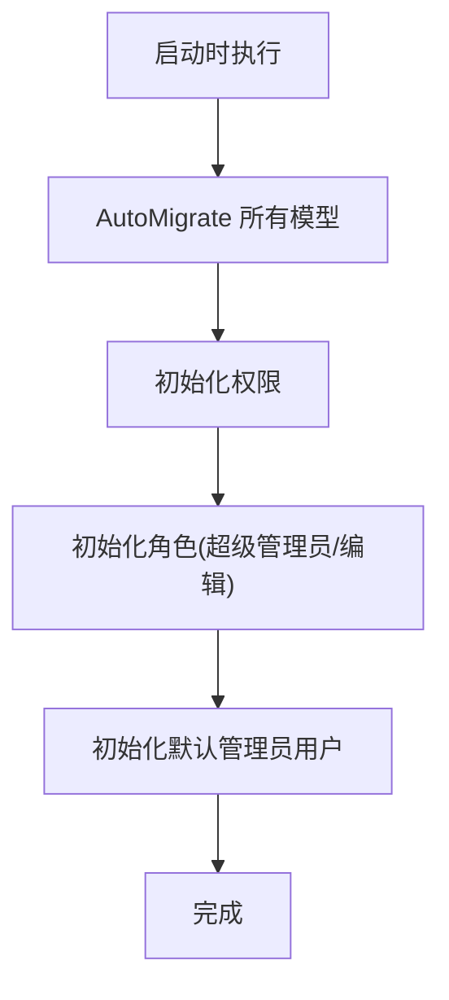
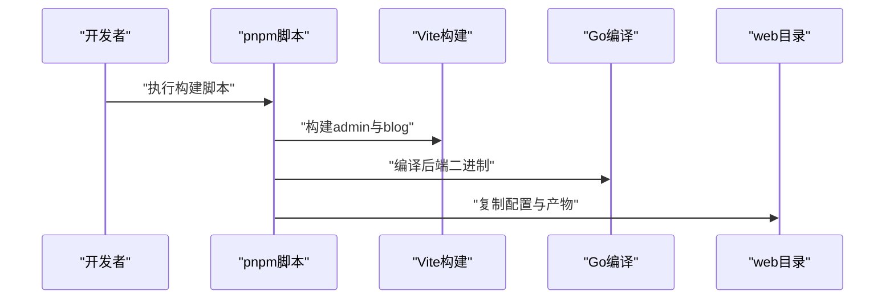
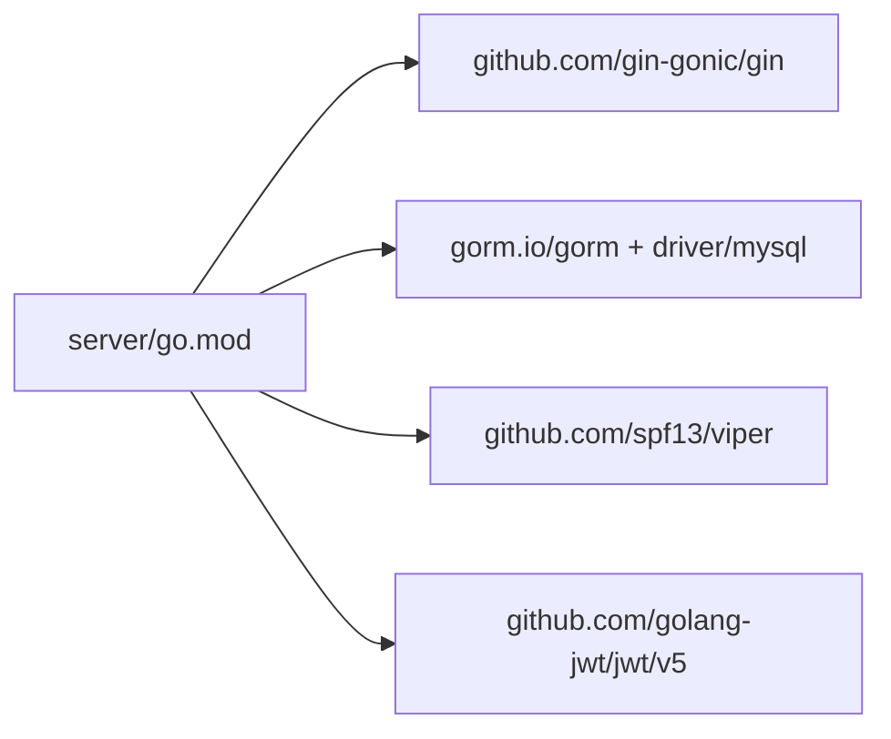

# 部署指南

<cite>
**本文引用的文件**
- [server/main.go](file://server/main.go)
- [server/config/config.go](file://server/config/config.go)
- [server/config/config.yaml](file://server/config/config.yaml)
- [server/go.mod](file://server/go.mod)
- [server/router/router.go](file://server/router/router.go)
- [server/migration/migrate.go](file://server/migration/migrate.go)
- [server/internal/middleware/auth.go](file://server/internal/middleware/auth.go)
- [server/internal/handler/auth.go](file://server/internal/handler/auth.go)
- [server/internal/pkg/jwt.go](file://server/internal/pkg/jwt.go)
- [server/internal/pkg/upload.go](file://server/internal/pkg/upload.go)
- [server/internal/model/user.go](file://server/internal/model/user.go)
- [server/internal/model/article.go](file://server/internal/model/article.go)
- [webSource/package.json](file://webSource/package.json)
- [webSource/apps/admin/vite.config.ts](file://webSource/apps/admin/vite.config.ts)
- [webSource/apps/blog/vite.config.ts](file://webSource/apps/blog/vite.config.ts)
</cite>

## 目录
1. [简介](#简介)
2. [项目结构](#项目结构)
3. [核心组件](#核心组件)
4. [架构总览](#架构总览)
5. [详细组件分析](#详细组件分析)
6. [依赖分析](#依赖分析)
7. [性能考虑](#性能考虑)
8. [故障排除指南](#故障排除指南)
9. [结论](#结论)
10. [附录](#附录)

## 简介
本指南面向Xiangmuzs博客平台的生产环境部署，覆盖服务器环境准备、依赖安装、配置文件设置、Docker容器化部署、Nginx反向代理、数据库部署与备份、域名与HTTPS、监控与日志、高可用与负载均衡、CI/CD流水线以及部署后验证与故障排除。文档以仓库现有代码为基础，结合实际可执行的部署流程，帮助读者快速、安全地完成上线。

## 项目结构
Xiangmuzs采用前后端分离架构：Go语言编写的后端服务位于server目录，前端应用位于webSource目录（包含博客前端与管理后台两个子应用）。后端通过Gin框架提供REST API，并使用Viper读取YAML配置；前端使用Vite进行开发与构建，支持代理到后端API与上传接口。

**图表来源**
- [server/main.go:19-76](file://server/main.go#L19-L76)
- [server/config/config.go:47-64](file://server/config/config.go#L47-L64)
- [server/config/config.yaml:1-29](file://server/config/config.yaml#L1-L29)
- [server/router/router.go:11-103](file://server/router/router.go#L11-L103)
- [server/internal/middleware/auth.go:10-37](file://server/internal/middleware/auth.go#L10-L37)
- [server/internal/handler/auth.go:19-93](file://server/internal/handler/auth.go#L19-L93)
- [server/internal/pkg/jwt.go:16-28](file://server/internal/pkg/jwt.go#L16-L28)
- [server/internal/pkg/upload.go:15-63](file://server/internal/pkg/upload.go#L15-L63)
- [server/migration/migrate.go:13-38](file://server/migration/migrate.go#L13-L38)
- [webSource/package.json:4-16](file://webSource/package.json#L4-L16)
- [webSource/apps/admin/vite.config.ts:10-22](file://webSource/apps/admin/vite.config.ts#L10-L22)
- [webSource/apps/blog/vite.config.ts:10-22](file://webSource/apps/blog/vite.config.ts#L10-L22)

**章节来源**
- [server/main.go:19-76](file://server/main.go#L19-L76)
- [server/config/config.go:47-64](file://server/config/config.go#L47-L64)
- [server/config/config.yaml:1-29](file://server/config/config.yaml#L1-L29)
- [server/router/router.go:11-103](file://server/router/router.go#L11-L103)
- [webSource/package.json:4-16](file://webSource/package.json#L4-L16)

## 核心组件
- 启动与路由
  - 应用入口负责加载配置、连接数据库、执行迁移、初始化RSA密钥、设置Gin模式、注册静态资源与路由，并在指定端口启动HTTP服务。
  - 参考路径：[server/main.go:19-76](file://server/main.go#L19-L76)
- 配置系统
  - 使用Viper从YAML文件读取配置，支持server、database、jwt、upload、blog等模块。
  - 参考路径：[server/config/config.go:47-64](file://server/config/config.go#L47-L64)、[server/config/config.yaml:1-29](file://server/config/config.yaml#L1-L29)
- 路由与权限
  - API统一前缀/api/v1，公开路由无需认证，认证路由通过中间件鉴权并按模块/动作授权。
  - 参考路径：[server/router/router.go:24-102](file://server/router/router.go#L24-L102)
- 鉴权与令牌
  - 登录接口支持RSA公钥获取与密码解密，JWT签发与解析，用户资料查询与修改密码。
  - 参考路径：[server/internal/handler/auth.go:31-93](file://server/internal/handler/auth.go#L31-L93)、[server/internal/pkg/jwt.go:16-28](file://server/internal/pkg/jwt.go#L16-L28)
- 文件上传
  - 基于配置的类型白名单与大小限制，UUID重命名存储至指定目录，并返回相对URL。
  - 参考路径：[server/internal/pkg/upload.go:15-63](file://server/internal/pkg/upload.go#L15-L63)
- 数据库迁移与种子
  - 自动迁移所有模型，初始化权限、角色与默认管理员用户。
  - 参考路径：[server/migration/migrate.go:13-38](file://server/migration/migrate.go#L13-L38)

**章节来源**
- [server/main.go:19-76](file://server/main.go#L19-L76)
- [server/config/config.go:47-64](file://server/config/config.go#L47-L64)
- [server/config/config.yaml:1-29](file://server/config/config.yaml#L1-L29)
- [server/router/router.go:24-102](file://server/router/router.go#L24-L102)
- [server/internal/handler/auth.go:31-93](file://server/internal/handler/auth.go#L31-L93)
- [server/internal/pkg/jwt.go:16-28](file://server/internal/pkg/jwt.go#L16-L28)
- [server/internal/pkg/upload.go:15-63](file://server/internal/pkg/upload.go#L15-L63)
- [server/migration/migrate.go:13-38](file://server/migration/migrate.go#L13-L38)

## 架构总览
下图展示生产环境典型拓扑：Nginx作为反向代理与静态资源服务，后端Go服务监听本地端口，数据库独立部署，前端静态资源由Nginx提供，API请求转发至后端。

[此图为概念性架构示意，不直接映射具体源码文件，故无“图表来源”标注]

## 详细组件分析

### 组件A：后端启动与配置加载
- 启动流程
  - 加载配置、连接MySQL、执行迁移、初始化RSA密钥、设置Gin模式、注册静态资源与路由、启动HTTP服务。
- 关键点
  - 通过配置决定GORM日志级别与Gin运行模式。
  - 静态资源映射上传目录，便于Nginx直接服务静态文件。
- 部署建议
  - 生产环境将server.mode设为release，确保日志与性能优化。
  - 将上传目录挂载为持久卷，避免容器重启丢失文件。

**图表来源**
- [server/main.go:21-76](file://server/main.go#L21-L76)
- [server/config/config.go:47-64](file://server/config/config.go#L47-L64)
- [server/migration/migrate.go:13-38](file://server/migration/migrate.go#L13-L38)

**章节来源**
- [server/main.go:21-76](file://server/main.go#L21-L76)
- [server/config/config.go:47-64](file://server/config/config.go#L47-L64)
- [server/migration/migrate.go:13-38](file://server/migration/migrate.go#L13-L38)

### 组件B：API路由与权限控制
- 路由分组
  - /api/v1为统一前缀；公开路由如登录、验证码、公开文章列表等无需认证。
  - 认证路由通过中间件鉴权，并按模块与动作进行细粒度授权。
- 权限模型
  - 用户角色关联权限集合，权限由模块与动作组成，支持动态加载与校验。
- 部署建议
  - 在Nginx中对敏感路径启用HTTPS与访问控制。
  - 对需要上传的接口开启文件类型与大小限制。

**图表来源**
- [server/router/router.go:24-102](file://server/router/router.go#L24-L102)
- [server/internal/middleware/auth.go:10-37](file://server/internal/middleware/auth.go#L10-L37)

**章节来源**
- [server/router/router.go:24-102](file://server/router/router.go#L24-L102)
- [server/internal/middleware/auth.go:10-37](file://server/internal/middleware/auth.go#L10-L37)

### 组件C：登录与JWT令牌
- 流程
  - 获取RSA公钥用于前端加密传输密码；登录时校验验证码（若启用）、解密密码、校验用户状态、生成JWT并返回权限清单。
- 安全要点
  - 生产环境必须更换JWT密钥并设置合理过期时间；启用HTTPS与安全响应头。
  - 密码采用哈希存储，变更密码时同样进行哈希校验与更新。

**图表来源**
- [server/internal/handler/auth.go:27-93](file://server/internal/handler/auth.go#L27-L93)
- [server/internal/pkg/jwt.go:16-28](file://server/internal/pkg/jwt.go#L16-L28)

**章节来源**
- [server/internal/handler/auth.go:27-93](file://server/internal/handler/auth.go#L27-L93)
- [server/internal/pkg/jwt.go:16-28](file://server/internal/pkg/jwt.go#L16-L28)

### 组件D：文件上传与静态资源
- 上传策略
  - 基于配置的类型白名单与大小限制；UUID重命名并保存至上传目录；返回相对URL供前端使用。
- 部署建议
  - Nginx应将/uploads映射到后端静态资源，实现高性能直出；同时限制上传目录写入权限。
  - 挂载持久卷保证文件持久化。

**图表来源**
- [server/internal/pkg/upload.go:15-63](file://server/internal/pkg/upload.go#L15-L63)

**章节来源**
- [server/internal/pkg/upload.go:15-63](file://server/internal/pkg/upload.go#L15-L63)

### 组件E：数据库迁移与种子数据
- 迁移与初始化
  - 自动迁移所有模型；初始化权限（模块×动作组合）、默认角色（超级管理员与编辑）与默认管理员用户。
- 部署建议
  - 生产环境禁止自动迁移，改为受控的数据库版本管理；迁移前做好备份。
  - 种子数据仅用于初始环境，避免重复执行。

**图表来源**
- [server/migration/migrate.go:13-38](file://server/migration/migrate.go#L13-L38)

**章节来源**
- [server/migration/migrate.go:13-38](file://server/migration/migrate.go#L13-L38)

### 组件F：前端构建与开发代理
- 构建流程
  - 工作区脚本统一构建共享包、管理端、博客端与后端二进制，并复制配置文件到输出目录。
- 开发代理
  - 管理端与博客端分别代理/api与/uploads到后端地址，便于联调。
- 部署建议
  - 生产构建后将静态产物交由Nginx托管；后端仅暴露API与上传接口。

**图表来源**
- [webSource/package.json:4-16](file://webSource/package.json#L4-L16)
- [webSource/apps/admin/vite.config.ts:10-22](file://webSource/apps/admin/vite.config.ts#L10-L22)
- [webSource/apps/blog/vite.config.ts:10-22](file://webSource/apps/blog/vite.config.ts#L10-L22)

**章节来源**
- [webSource/package.json:4-16](file://webSource/package.json#L4-L16)
- [webSource/apps/admin/vite.config.ts:10-22](file://webSource/apps/admin/vite.config.ts#L10-L22)
- [webSource/apps/blog/vite.config.ts:10-22](file://webSource/apps/blog/vite.config.ts#L10-L22)

## 依赖分析
- 后端依赖
  - Web框架：Gin
  - ORM：GORM + MySQL驱动
  - 配置：Viper
  - JWT：golang-jwt
  - 其他：UUID、加解密工具等
- 前端依赖
  - React生态、Vite、pnpm工作区

**图表来源**
- [server/go.mod:5-13](file://server/go.mod#L5-L13)

**章节来源**
- [server/go.mod:5-13](file://server/go.mod#L5-L13)

## 性能考虑
- 日志与模式
  - 生产环境设置server.mode为release，减少日志开销。
- 数据库
  - 合理索引（如文章状态与发布时间），避免N+1查询；连接池参数按并发调整。
- 静态资源
  - Nginx启用gzip与缓存；上传目录直出，降低后端压力。
- 缓存
  - 对热点接口（如公开文章列表、分类/标签）引入Redis缓存。
- 并发与超时
  - 合理设置Gin超时与数据库连接超时，避免雪崩。

[本节为通用指导，不直接分析具体文件，故无“章节来源”标注]

## 故障排除指南
- 启动失败
  - 检查配置文件是否存在且格式正确；确认数据库连通性与凭据。
  - 参考路径：[server/main.go:21-24](file://server/main.go#L21-L24)、[server/config/config.go:47-64](file://server/config/config.go#L47-L64)
- 登录异常
  - 确认RSA公钥获取成功；检查验证码开关与输入；核对用户状态与密码哈希。
  - 参考路径：[server/internal/handler/auth.go:27-93](file://server/internal/handler/auth.go#L27-L93)
- 上传失败
  - 检查文件类型是否在白名单内、大小是否超过限制、上传目录权限与磁盘空间。
  - 参考路径：[server/internal/pkg/upload.go:15-63](file://server/internal/pkg/upload.go#L15-L63)
- 权限拒绝
  - 确认用户角色与权限分配；检查中间件是否正确注入。
  - 参考路径：[server/router/router.go:46-102](file://server/router/router.go#L46-L102)、[server/internal/middleware/auth.go:10-37](file://server/internal/middleware/auth.go#L10-L37)
- 数据库问题
  - 检查迁移是否成功、种子数据是否插入；必要时回滚或重建。
  - 参考路径：[server/migration/migrate.go:13-38](file://server/migration/migrate.go#L13-L38)

**章节来源**
- [server/main.go:21-24](file://server/main.go#L21-L24)
- [server/config/config.go:47-64](file://server/config/config.go#L47-L64)
- [server/internal/handler/auth.go:27-93](file://server/internal/handler/auth.go#L27-L93)
- [server/internal/pkg/upload.go:15-63](file://server/internal/pkg/upload.go#L15-L63)
- [server/router/router.go:46-102](file://server/router/router.go#L46-L102)
- [server/internal/middleware/auth.go:10-37](file://server/internal/middleware/auth.go#L10-L37)
- [server/migration/migrate.go:13-38](file://server/migration/migrate.go#L13-L38)

## 结论
本指南基于仓库现有代码，给出了从服务器准备、依赖安装、配置设置、容器化与反向代理、数据库部署与备份、域名与HTTPS、监控日志、高可用与负载均衡、CI/CD到部署后验证与故障排除的完整流程。建议在生产环境中严格区分配置项、启用HTTPS与安全响应头、完善备份与灾备策略，并通过CI/CD自动化发布以提升稳定性与效率。

[本节为总结性内容，不直接分析具体文件，故无“章节来源”标注]

## 附录

### A. 生产环境部署清单
- 服务器
  - 操作系统：Linux（推荐Ubuntu/CentOS）
  - 软件：Go、MySQL、Nginx、Docker（可选）
- 配置
  - 修改server/config.yaml中的server.port、server.mode、database.*、jwt.secret、upload.*、blog.base_url
  - 参考路径：[server/config/config.yaml:1-29](file://server/config/config.yaml#L1-L29)
- 数据库
  - 创建数据库与用户，授予必要权限；生产环境关闭自动迁移，使用受控迁移脚本。
  - 参考路径：[server/main.go:27-44](file://server/main.go#L27-L44)、[server/migration/migrate.go:13-38](file://server/migration/migrate.go#L13-L38)
- Nginx
  - 反代/api与/uploads；静态资源托管；启用HTTPS与安全头。
  - 参考路径：[server/main.go:64-65](file://server/main.go#L64-L65)
- Docker（可选）
  - 编写Dockerfile与docker-compose，将后端二进制、配置与上传目录映射为卷。
  - 参考路径：[webSource/package.json:11-12](file://webSource/package.json#L11-L12)
- CI/CD
  - 在流水线中执行前端构建、后端编译、打包与部署；集成自动化测试与安全扫描。
  - 参考路径：[webSource/package.json:4-16](file://webSource/package.json#L4-L16)

**章节来源**
- [server/config/config.yaml:1-29](file://server/config/config.yaml#L1-L29)
- [server/main.go:27-44](file://server/main.go#L27-L44)
- [server/main.go:64-65](file://server/main.go#L64-L65)
- [webSource/package.json:11-12](file://webSource/package.json#L11-L12)
- [webSource/package.json:4-16](file://webSource/package.json#L4-L16)

### B. Nginx反向代理配置要点
- 代理/api与/uploads至后端地址
- 提供静态资源服务（前端产物）
- 启用HTTPS与安全头（HSTS、CSP等）
- 参考路径：[webSource/apps/admin/vite.config.ts:12-21](file://webSource/apps/admin/vite.config.ts#L12-L21)、[webSource/apps/blog/vite.config.ts:12-21](file://webSource/apps/blog/vite.config.ts#L12-L21)

**章节来源**
- [webSource/apps/admin/vite.config.ts:12-21](file://webSource/apps/admin/vite.config.ts#L12-L21)
- [webSource/apps/blog/vite.config.ts:12-21](file://webSource/apps/blog/vite.config.ts#L12-L21)

### C. 数据库部署与备份策略
- 部署
  - 单机或主从复制；启用binlog与慢查询日志；设置只读副本。
- 备份
  - 全量+增量备份；定期校验恢复；异地容灾。
- 灾难恢复
  - 制定RPO/RTO目标；演练恢复流程；监控与告警。

[本节为通用指导，不直接分析具体文件，故无“章节来源”标注]

### D. 域名与HTTPS证书
- 申请与续期
  - 使用ACME协议（如certbot）或云厂商免费证书；配置自动续期。
- 配置
  - Nginx启用SSL；强制HTTPS；配置安全头。
  
[本节为通用指导，不直接分析具体文件，故无“章节来源”标注]

### E. 监控与日志管理
- 应用监控
  - 指标采集（CPU、内存、QPS、错误率、响应时间）；链路追踪。
- 日志管理
  - 分离访问日志与错误日志；集中收集与检索；设置保留周期。
  
[本节为通用指导，不直接分析具体文件，故无“章节来源”标注]

### F. 高可用与负载均衡
- 架构
  - 多实例后端；Nginx/LVS/Traefik负载均衡；数据库高可用（主从/集群）。
- 灰度与滚动更新
  - 通过蓝绿/金丝雀发布降低风险。
  
[本节为通用指导，不直接分析具体文件，故无“章节来源”标注]

### G. CI/CD流水线配置
- 触发条件
  - push到特定分支或打标签。
- 步骤
  - 安装依赖、前端构建、后端编译、单元测试、打包镜像、推送仓库、部署到目标环境。
- 安全
  - 代码扫描、依赖漏洞检测、密钥与凭据管理。
  
**章节来源**
- [webSource/package.json:4-16](file://webSource/package.json#L4-L16)

### H. 部署后验证与故障排除
- 验证
  - 健康检查、API连通性、静态资源访问、登录与上传功能。
- 故障排除
  - 查看日志、核对配置、检查网络连通与权限。
  
[本节为通用指导，不直接分析具体文件，故无“章节来源”标注]