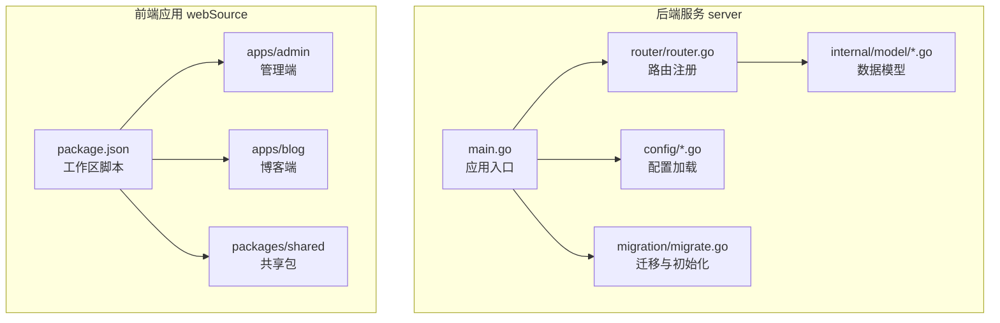
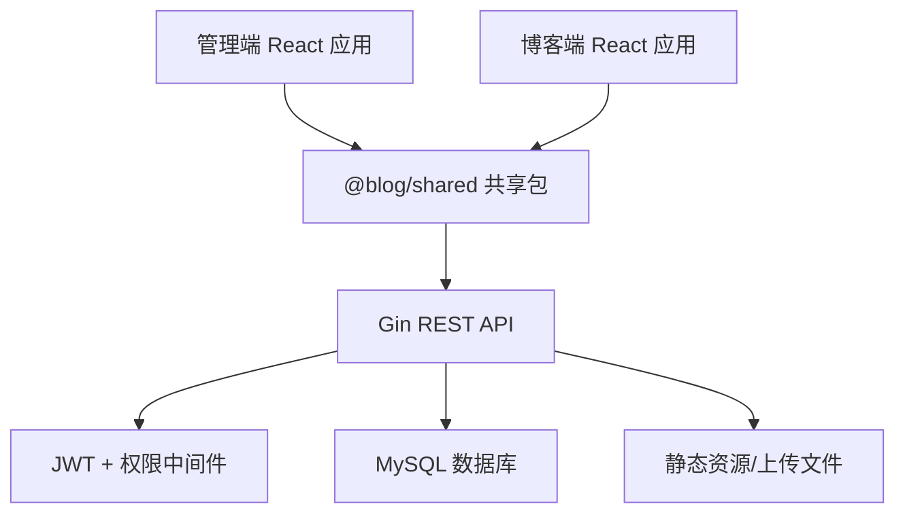
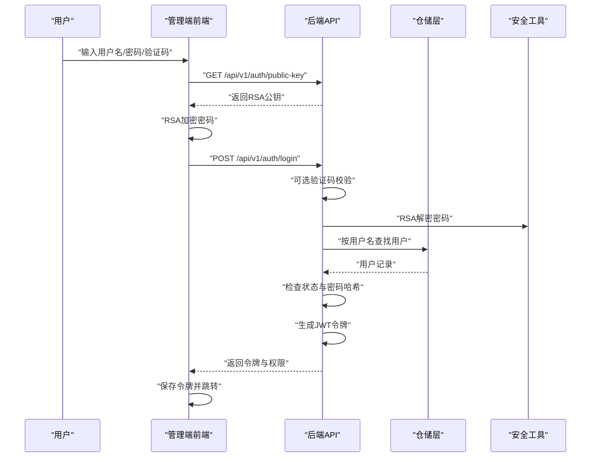
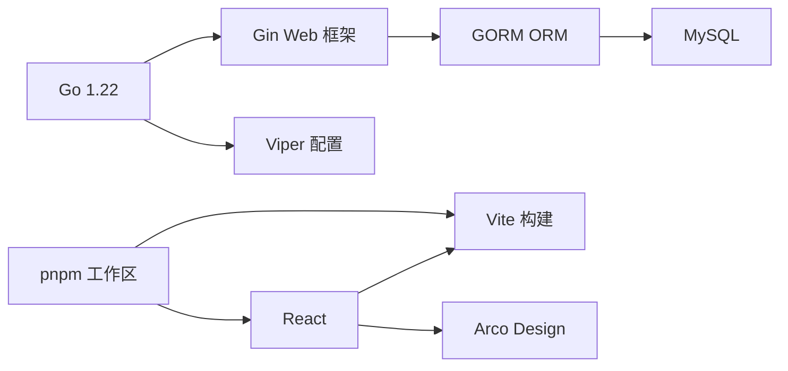

# 项目概述

<cite>
**本文引用的文件**
- [server/main.go](file://server/main.go)
- [server/go.mod](file://server/go.mod)
- [server/config/config.go](file://server/config/config.go)
- [server/config/config.yaml](file://server/config/config.yaml)
- [server/router/router.go](file://server/router/router.go)
- [server/migration/migrate.go](file://server/migration/migrate.go)
- [server/internal/model/article.go](file://server/internal/model/article.go)
- [server/internal/model/user.go](file://server/internal/model/user.go)
- [server/internal/handler/auth.go](file://server/internal/handler/auth.go)
- [webSource/package.json](file://webSource/package.json)
- [webSource/apps/admin/package.json](file://webSource/apps/admin/package.json)
- [webSource/apps/blog/package.json](file://webSource/apps/blog/package.json)
- [webSource/apps/admin/src/App.tsx](file://webSource/apps/admin/src/App.tsx)
- [webSource/apps/blog/src/App.tsx](file://webSource/apps/blog/src/App.tsx)
- [webSource/apps/admin/src/pages/Login.tsx](file://webSource/apps/admin/src/pages/Login.tsx)
- [webSource/apps/blog/src/pages/Home.tsx](file://webSource/apps/blog/src/pages/Home.tsx)
- [webSource/packages/shared/src/index.ts](file://webSource/packages/shared/src/index.ts)
</cite>

## 目录
1. [引言](#引言)
2. [项目结构](#项目结构)
3. [核心组件](#核心组件)
4. [架构总览](#架构总览)
5. [详细组件分析](#详细组件分析)
6. [依赖分析](#依赖分析)
7. [性能考虑](#性能考虑)
8. [故障排查指南](#故障排查指南)
9. [结论](#结论)
10. [附录](#附录)

## 引言
Xiangmuzs博客平台是一个现代化、可扩展的全栈博客系统，面向内容创作者与团队协作场景，提供后台管理与前端展示双端能力。项目通过前后端分离架构实现清晰的职责划分：后端采用Go语言+Gin框架提供高性能REST API，数据库使用MySQL；前端采用React+Vite构建双应用（管理端与博客端），并通过共享包统一类型与工具。系统内置完善的权限体系、文章/分类/标签/媒体/二维码等核心模块，并支持验证码、RSA加密登录、JWT鉴权等安全机制。

本项目旨在为初学者提供一个从零到一的完整实践案例，帮助理解现代Web项目的工程化组织方式、分层设计思想与关键技术选型的权衡。

## 项目结构
项目采用“根目录聚合 + 多工作区”的组织方式：
- 后端服务位于 server 目录，包含配置、路由、中间件、数据模型、仓储、服务、迁移脚本等。
- 前端位于 webSource 目录，采用 pnpm workspaces 管理多应用（admin、blog）与 shared 共享包。
- 根目录提供统一的构建脚本，一键打包前端与后端产物，并复制配置文件。

图表来源
- [server/main.go:19-76](file://server/main.go#L19-L76)
- [server/router/router.go:11-103](file://server/router/router.go#L11-L103)
- [server/migration/migrate.go:13-38](file://server/migration/migrate.go#L13-L38)
- [webSource/package.json:4-16](file://webSource/package.json#L4-L16)

章节来源
- [server/main.go:19-76](file://server/main.go#L19-L76)
- [webSource/package.json:4-16](file://webSource/package.json#L4-L16)

## 核心组件
- 应用入口与启动流程：负责加载配置、连接数据库、执行迁移、初始化RSA密钥、注册中间件与静态资源、挂载路由并启动HTTP服务。
- 配置系统：基于Viper读取YAML配置，支持服务器端口与模式、数据库连接、JWT密钥与有效期、上传路径与限制、博客基础URL等。
- 路由与权限：按公开接口、认证接口、带权限控制的CRUD接口进行分组，统一接入JWT鉴权与细粒度权限校验。
- 数据模型与迁移：自动迁移核心实体（用户、角色、权限、文章、分类、标签、媒体、二维码、设置），并预置默认权限、角色与管理员账户。
- 安全与鉴权：RSA公钥下发、私钥解密、密码哈希校验、JWT访问令牌与刷新令牌、验证码开关与校验。
- 前后端协作：共享包统一API请求封装与类型定义，管理端与博客端分别消费后端接口，实现内容管理与展示。

章节来源
- [server/main.go:19-76](file://server/main.go#L19-L76)
- [server/config/config.go:47-64](file://server/config/config.go#L47-L64)
- [server/config/config.yaml:1-29](file://server/config/config.yaml#L1-29)
- [server/router/router.go:11-103](file://server/router/router.go#L11-L103)
- [server/migration/migrate.go:13-125](file://server/migration/migrate.go#L13-L125)
- [server/internal/handler/auth.go:31-93](file://server/internal/handler/auth.go#L31-L93)

## 架构总览
系统采用典型的前后端分离架构：
- 前端：React单页应用，管理端使用 Arco Design 组件库，博客端强调Markdown渲染与主题样式。
- 后端：Gin Web框架提供REST API，GORM负责数据库建模与迁移，Viper管理配置，JWT保障会话安全。
- 数据层：MySQL存储所有业务数据，迁移脚本确保表结构与初始数据一致性。
- 开发体验：Vite构建、pnpm工作区、统一脚本编排，便于本地联调与部署。

图表来源
- [server/router/router.go:24-102](file://server/router/router.go#L24-L102)
- [webSource/apps/admin/src/App.tsx:1-22](file://webSource/apps/admin/src/App.tsx#L1-L22)
- [webSource/apps/blog/src/App.tsx:1-7](file://webSource/apps/blog/src/App.tsx#L1-L7)
- [webSource/packages/shared/src/index.ts:1-6](file://webSource/packages/shared/src/index.ts#L1-L6)

## 详细组件分析

### 后端启动与配置
- 启动流程：加载配置 → 连接数据库（支持调试模式日志）→ 执行迁移与种子数据 → 初始化RSA密钥 → 设置Gin运行模式 → 注册CORS与静态资源 → 挂载路由 → 启动服务。
- 配置项：服务器端口与模式、数据库连接参数、JWT密钥与有效期、上传路径与大小限制、博客基础URL等。
- 关键点：调试模式下开启GORM详细日志；静态资源映射上传目录供前端访问。

章节来源
- [server/main.go:19-76](file://server/main.go#L19-L76)
- [server/config/config.go:47-64](file://server/config/config.go#L47-L64)
- [server/config/config.yaml:1-29](file://server/config/config.yaml#L1-L29)

### 路由与权限体系
- 分组策略：公开接口（无需鉴权）、公开文章查询、认证接口（个人资料、修改密码）、受权限控制的CRUD接口（文章、分类、标签、媒体、二维码、角色、用户、设置）。
- 中间件：CORS跨域、JWT鉴权、细粒度权限校验（按模块与动作维度）。
- 设计优势：清晰的权限边界与最小授权原则，便于扩展新模块与动作。

章节来源
- [server/router/router.go:11-103](file://server/router/router.go#L11-L103)

### 数据模型与迁移
- 核心实体：用户、角色、权限、文章、分类、标签、媒体、二维码、设置。
- 迁移策略：AutoMigrate自动建表；预置权限（模块×动作组合）、默认角色（超级管理员、编辑）与管理员用户。
- 可维护性：集中迁移脚本，避免手动维护表结构差异。

章节来源
- [server/migration/migrate.go:13-125](file://server/migration/migrate.go#L13-L125)
- [server/internal/model/article.go:5-23](file://server/internal/model/article.go#L5-L23)
- [server/internal/model/user.go:5-16](file://server/internal/model/user.go#L5-L16)

### 登录与鉴权流程
- 客户端流程：获取RSA公钥 → 输入密码经RSA加密 → 可选验证码 → 提交登录请求 → 成功后保存令牌与权限 → 跳转管理台。
- 服务端流程：可选验证码校验 → RSA解密密码 → 用户存在性与状态校验 → 密码哈希比对 → 生成JWT → 加载用户权限返回。
- 安全要点：密码不落明文、传输加密、JWT有效期与刷新策略、禁用状态拦截。

图表来源
- [server/internal/handler/auth.go:27-93](file://server/internal/handler/auth.go#L27-L93)
- [webSource/apps/admin/src/pages/Login.tsx:43-57](file://webSource/apps/admin/src/pages/Login.tsx#L43-L57)

章节来源
- [server/internal/handler/auth.go:27-93](file://server/internal/handler/auth.go#L27-L93)
- [webSource/apps/admin/src/pages/Login.tsx:20-57](file://webSource/apps/admin/src/pages/Login.tsx#L20-L57)

### 前端应用与共享包
- 管理端：基于 Arco Design 的后台界面，集成国际化、路由、状态管理与二维码组件，提供内容管理与系统设置入口。
- 博客端：简洁的文章列表、分页与侧边栏，支持Markdown渲染与高亮。
- 共享包：统一导出类型、API请求封装、常量、日期与加解密工具，减少重复代码。

章节来源
- [webSource/apps/admin/src/App.tsx:1-22](file://webSource/apps/admin/src/App.tsx#L1-L22)
- [webSource/apps/blog/src/App.tsx:1-7](file://webSource/apps/blog/src/App.tsx#L1-L7)
- [webSource/packages/shared/src/index.ts:1-6](file://webSource/packages/shared/src/index.ts#L1-L6)
- [webSource/apps/blog/src/pages/Home.tsx:11-47](file://webSource/apps/blog/src/pages/Home.tsx#L11-L47)

## 依赖分析
- 技术栈选择依据
  - Go + Gin：轻量、高性能、生态成熟，适合构建REST API与微服务风格的服务端。
  - GORM + MySQL：成熟的ORM与关系型数据库，AutoMigrate简化开发与部署。
  - React + Vite：现代前端开发体验，快速热更新与构建优化。
  - Arco Design：企业级UI组件库，配套完善的设计规范与国际化支持。
  - Viper：YAML配置读取与结构化解析，便于环境隔离与动态配置。
  - pnpm workspaces：多包管理与脚本编排，提升开发效率与一致性。
- 依赖耦合与内聚
  - 后端按领域模型与职责分层，Handler-Repository-Model边界清晰，降低耦合。
  - 前端通过共享包与统一API约定，避免重复实现与跨应用割裂。
  - 路由与中间件集中管理，权限与鉴权策略统一落地。

图表来源
- [server/go.mod:5-12](file://server/go.mod#L5-L12)
- [webSource/apps/admin/package.json:12-20](file://webSource/apps/admin/package.json#L12-L20)
- [webSource/apps/blog/package.json:12-21](file://webSource/apps/blog/package.json#L12-L21)
- [webSource/package.json:4-16](file://webSource/package.json#L4-L16)

章节来源
- [server/go.mod:5-12](file://server/go.mod#L5-L12)
- [webSource/apps/admin/package.json:12-20](file://webSource/apps/admin/package.json#L12-L20)
- [webSource/apps/blog/package.json:12-21](file://webSource/apps/blog/package.json#L12-L21)
- [webSource/package.json:4-16](file://webSource/package.json#L4-L16)

## 性能考虑
- 后端
  - Gin Release模式运行，减少日志开销；GORM在调试模式开启详细日志，生产关闭。
  - 路由与中间件尽量前置处理（如CORS、鉴权），避免冗余计算。
  - 数据库索引：文章状态与发布时间建立复合索引，提升查询性能。
- 前端
  - Vite按需打包与懒加载，减少首屏体积；Arco组件按需引入，避免全局样式污染。
  - 共享包统一请求封装，减少重复网络请求与重复渲染。
- 存储与缓存
  - 上传文件通过静态资源直接暴露，结合CDN可进一步优化访问速度。
  - 可在网关层增加缓存策略（如Redis）以减轻数据库压力（扩展建议）。

## 故障排查指南
- 启动失败
  - 检查配置文件是否正确加载与YAML格式是否合法。
  - 确认数据库连接参数与网络连通性。
- 登录异常
  - 确认RSA公钥获取成功且前端已正确加密密码。
  - 核对验证码开关与校验逻辑，必要时临时关闭验证码定位问题。
- 权限不足
  - 确认用户角色与权限关联是否正确，检查路由上的权限注解。
- 文件上传失败
  - 检查上传目录权限与大小限制，确认静态资源映射是否生效。

章节来源
- [server/config/config.go:47-64](file://server/config/config.go#L47-L64)
- [server/config/config.yaml:18-25](file://server/config/config.yaml#L18-L25)
- [server/router/router.go:46-102](file://server/router/router.go#L46-L102)
- [server/internal/handler/auth.go:31-93](file://server/internal/handler/auth.go#L31-L93)

## 结论
Xiangmuzs博客平台以“清晰分层、前后端分离、安全可控”为核心理念，结合Go+Gin的高效与React+Arco的易用，形成一套可扩展、可维护、可落地的现代化博客解决方案。通过完善的权限体系、标准化的开发流程与统一的共享包，项目既适合个人学习，也可作为团队协作的基座工程。

## 附录
- 版本与演进
  - 当前版本：1.0.0（管理端、博客端、共享包）
  - 技术栈：Go 1.22、Gin、GORM、React 18、Arco Design、Vite、pnpm
- 发展规划（建议）
  - 引入缓存与CDN优化静态资源访问。
  - 增加全文检索（如Elasticsearch）提升搜索体验。
  - 扩展评论系统、SEO优化与多语言站点支持。
  - 引入测试框架与CI/CD流水线，提升交付质量与效率。